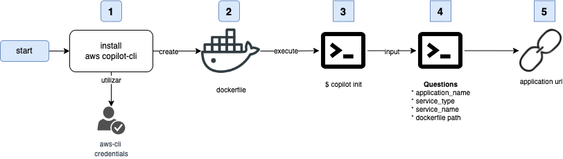

```{r setup, include=FALSE}
knitr::opts_chunk$set(echo = FALSE)
```

[{width="40%"}](https://www.buymeacoffee.com/r0mymendez)

En el presente articulo te explico el uso del servicio **AWS Copilot**, pero para poder realizarlo es necesario que comencemos analizando que es y como funciona el servicio de **ECS** (AWS Elastic Container Service) y sus formas de implementación.
Esto es necesario debido a que AWS copilot realiza la implementación y despliegue de una aplicación utilizando ECS.

------------------------------------------------------------------------

# 💡AWS ECS (Elastic Container Services)

Elastic Container Service (**ECS**) es una plataforma de orquestación de contenedores escalable propietaria de AWS y la misma fue diseñada para ejecutar, detener y administrar contenedores en un clúster.

Por lo cual podemos definir que ECS es el servicio de contenedores de AWS Docker que maneja la orquestación y el aprovisionamiento de contenedores de Docker.

Este servicio contiene los siguientes conceptos:

-   **☁️ Definición de tarea**: Describe cómo se debe iniciar un contenedor docker.
-   **☁️ Tarea**: este es un contenedor en ejecución con la configuración definida en la definición de tarea.
-   **☁️ Servicio**: define tareas de ejecución prolongada de la misma definición de tarea.
-   **☁️ Clúster**: un grupo lógico de instancias EC2.
-   **☁️ Instancia de contenedor**: está es solo una instancia de EC2 que forma parte de un clúster de ECS y tiene docker.

## ⚒️ ECS con instancias EC2

En este modelo, los contenedores se implementan en instancias EC2 (VM) creadas para el clúster.
ECS los administra junto con las tareas que forman parte de la definición de la tarea.

+----------------------------------------------------------------------------------------------------------+---------------------------------------------------------------------------------------------------------------------------------------------------------------------------------------+
| ✅ Ventajas                                                                                               | ❌ Desventajas                                                                                                                                                                         |
+==========================================================================================================+=======================================================================================================================================================================================+
| -   Tiene control total sobre el tipo de instancia EC2 utilizada.                                        | -   Al trabajar con EC2 es necesario que todas las actualizaciones de seguridad de las instancias, como su escalamiento debe ser realizado por el administrador de esta arquitectura. |
+----------------------------------------------------------------------------------------------------------+---------------------------------------------------------------------------------------------------------------------------------------------------------------------------------------+
| -   Permite poder utilizar instancias que pueden estar optimizadas dependiendo lo que se desee ejecutar. | -   Costo es en base al tipo de instancia EC2 que se ejecuta dentro del clúster y redes de VPC.                                                                                       |
+----------------------------------------------------------------------------------------------------------+---------------------------------------------------------------------------------------------------------------------------------------------------------------------------------------+

## ⚒️ ECS con AWS Fargate (Serverless)

En esta variante ya no se utilizan instancias o servidores EC2.
Simplemente es necesario seleccionar la combinación de CPU y memoria que necesita.

+-------------------------------------------------------------------------------------------------------------------------------------------------------------------+----------------------------------------------------------------------------------------------------------------------------------------------+
| ✅ Ventajas                                                                                                                                                        | ❌ Desventajas                                                                                                                                |
+===================================================================================================================================================================+==============================================================================================================================================+
| -   No hay servidores para administrar.                                                                                                                           | -   ECS + Fargate admite solo un modo de red y esto  limita su control sobre la capa de red                                                  |
+-------------------------------------------------------------------------------------------------------------------------------------------------------------------+----------------------------------------------------------------------------------------------------------------------------------------------+
| -   AWS está a cargo de la disponibilidad y escalabilidad de los contenedores.                                                                                    | -   Costo es en función de la CPU y la memoria que seleccione. La cantidad de núcleos de CPU y GB determina el costo de ejecutar el clúster. |
+-------------------------------------------------------------------------------------------------------------------------------------------------------------------+----------------------------------------------------------------------------------------------------------------------------------------------+
| -   Fargate Spot, es  una nueva capacidad que puede ejecutar tareas de ECS tolerantes a interrupciones con hasta un 70 % de descuento sobre el precio de Fargate. |                                                                                                                                              |
+-------------------------------------------------------------------------------------------------------------------------------------------------------------------+----------------------------------------------------------------------------------------------------------------------------------------------+

# 💡**AWS Copilot**

**AWS Copilot** es una herramienta que se utiliza por la línea de comando de AWS y permite la simplificación de la creación, despliegue, control y operación de contenedores en **ECS** utilizando un entorno de desarrollo local. 

Esta herramienta administra los componentes que son necesarios para el despliegue y el funcionamiento de una aplicación tales como VPC, balanceadores de carga, flujos de implementación y almacenamiento.
Por lo cual solo es necesario proporcionar un contenedor de la aplicación y mínimas configuraciones necesarias, dando como resultado una implementación más rápida y haciendo foco en el desarrollo de aplicación.

## 🔎 Comparativa de tareas a realizar 

Ver como los servicios se van a comunicar entre sí, por lo cual hay que tener en cuenta los siguientes escenarios:

+--------------------------------------------------------------------------------------------------------------+---------------------------------------------------------------------+---------------------------------------------------------------------+
| Actividades                                                                                                  | SIN AWS-copilot                                                     | CON AWS-copilot                                                     |
+==============================================================================================================+=====================================================================+=====================================================================+
| <strong><font style="background-color:#FAFAFA;">Desarrollo de la aplicación</font></strong>                  | <font style="background-color:#CDFECF;">Equipo de desarrollo</font> | <font style="background-color:#CDFECF;">Equipo de desarrollo</font> |
+--------------------------------------------------------------------------------------------------------------+---------------------------------------------------------------------+---------------------------------------------------------------------+
| <strong><font style="background-color:#FAFAFA;">Generación del contenedor</font></strong>                    | <font style="background-color:#CDFECF;">Equipo de desarrollo</font> | <font style="background-color:#CDFECF;">Equipo de desarrollo</font> |
+--------------------------------------------------------------------------------------------------------------+---------------------------------------------------------------------+---------------------------------------------------------------------+
| <strong><font style="background-color:#FAFAFA;">Subredes de Virtual Private Cloud (VPC)</font></strong>      | <font style="background-color:#CDFECF;">Equipo de desarrollo</font> | <font style="background-color:#FFEDC4;">AWS-Copilot</font>          |
+--------------------------------------------------------------------------------------------------------------+---------------------------------------------------------------------+---------------------------------------------------------------------+
| <strong><font style="background-color:#FAFAFA;">Balanceadores de carga</font></strong>                       | <font style="background-color:#CDFECF;">Equipo de desarrollo</font> | <font style="background-color:#FFEDC4;">AWS-Copilot</font>          |
+--------------------------------------------------------------------------------------------------------------+---------------------------------------------------------------------+---------------------------------------------------------------------+
| <strong><font style="background-color:#FAFAFA;">Flujos de implementación (ci/cd)</font></strong>             | <font style="background-color:#CDFECF;">Equipo de desarrollo</font> | <font style="background-color:#FFEDC4;">AWS-Copilot</font>          |
+--------------------------------------------------------------------------------------------------------------+---------------------------------------------------------------------+---------------------------------------------------------------------+
| <strong><font style="background-color:#FAFAFA;">Almacenamiento persistente de su aplicación.</font></strong> | <font style="background-color:#CDFECF;">Equipo de desarrollo</font> | <font style="background-color:#FFEDC4;">AWS-Copilot</font>          |
+--------------------------------------------------------------------------------------------------------------+---------------------------------------------------------------------+---------------------------------------------------------------------+
| <strong><font style="background-color:#FAFAFA;">Sincronizar el despliegue en ambientes</font></strong>       | <font style="background-color:#CDFECF;">Equipo de desarrollo</font> | <font style="background-color:#FFEDC4;">AWS-Copilot</font>          |
+--------------------------------------------------------------------------------------------------------------+---------------------------------------------------------------------+---------------------------------------------------------------------+

## 🧩 Componentes

La siguiente tabla contiene los componentes que se configuran al utilizar el servicio de aws copilot.

+----------------------------------------------------------------------------+-----------------------------------------------------------------------------------------+
| **Componente**                                                             | **Descripción**                                                                         |
+============================================================================+=========================================================================================+
| <strong><font style="background-color:#CDFECF;">Aplicación</font></strong> | \| Una aplicación es un mecanismo de agrupación de las piezas de su sistema.            |
+----------------------------------------------------------------------------+-----------------------------------------------------------------------------------------+
| <strong><font style="background-color:#FFFFBC;">Ambiente</font></strong>   | Un ambiente es una etapa del despliegue de una aplicación.                              |
+----------------------------------------------------------------------------+-----------------------------------------------------------------------------------------+
| <strong><font style="background-color:#D7EFFF;">Servicio</font></strong>   | Un servicio es un proceso único de código de larga ejecución dentro de un contenedor.   |
+----------------------------------------------------------------------------+-----------------------------------------------------------------------------------------+

## ⚒️ Instalación y utilización 

En solo 5 pasos podemos implementar una aplicación utilizando aws-copilot, como lo muestra la imagen siguiente.
Esto permite que el equipo de desarrollo solo haga foco en el desarrollo y no tanto en el despliegue de la infraestructura.

La primera aplicación que se implemente en copilot realizará una configuración predeterminada y la misma será con un  contenedor serverless en fargate.

Como se observa en la siguiente imagen con solo 5 pasos ya podemos hacer un despliegue de una aplicación.



Los pasos como se ven en el flujo son los siguientes:

1.  Instalamos <font style="background-color:#CDFECF;">AWS copilot</font> que va necesitar las credenciales del cliente de aws
2.  Creamos el <font style="background-color:#CDFECF;">Dockerfile</font> de nuesta aplicación
3.  Ejecutamos en una terminal <font style="background-color:#CDFECF;">`copilot init`</font> para inicializar.
4.  Al ejecutar el init posteriormente van aparecer algunas preguntas para responder tales como: el <font style="background-color:#CDFECF;">`nombre de la aplicación`</font> , <font style="background-color:#CDFECF;">`tipo de servicio`</font> , <font style="background-color:#CDFECF;">`nombre del servicio`</font> y <font style="background-color:#CDFECF;">`la ubicación del dockerfile`</font>
5.  En este ultimo paso se va a retorna una <font style="background-color:#CDFECF;">URL</font> para poder acceder a la aplicación.

## 🔎 Logs

Para obtener los logs de los contenedores desplegados, es necesario ejecutar el siguiente comando:

| \$ copilot svc logs- follow |
|-----------------------------|

## 📉 Tráfico a producción

Para hacer el despliegue en producción es necesario poder generar diferentes ambientes, por lo cual para generarlos es necesario ejecutar el siguiente comando**.**

| \$ copilot env init |
|---------------------|

Posteriormente es importante poder modificar el archivo de manifiesto que contiene todas las configuraciones de la aplicación y el mismo se encuentra en  nombredeaplicacion/**manifest.yml**

Una vez finalizada la configuración del ambiente es necesario hacer el despliegue en producción (u otro ambiente, pero el siguiente ejemplo es en producción).

| \$ copilot svc deploy ---env production |
|-----------------------------------------|

## 🧪Testing

Para poder hacer pruebas de la aplicación desplegada, se puede utilizar apachebench el cual permite generar tráfico a la aplicación web.

Para esto es necesario poder ejecutar el siguiente comando en el cual se desea generar un número de 5000 transacciones a mi servicio con una concurrencia de 25 solicitudes a la vez.

| ab -n 5000 -c 25[\<http://app12345.us-east-1.elb.amazonaws.com\>](http://nyan-publi-wi97060djp1b-2041999651.us-east-1.elb.amazonaws.com/) |
|-------------------------------------------------------------------------------------------------------------------------------------------|

En el caso de no tener la respuesta esperada puedo modificar mi archivo de manifiesto y escalar horizontalmente la aplicación en base a los diferentes ambientes. 

## 💰Costos del servicio

Esta es una herramienta distribuida por Amazon bajo una licencia apache 2.0, por lo cual esto significa que es una aplicación open source.

Al ser una aplicación open source no tiene costos adicionales, el precio está dado por el uso de los servicios configurados.

# 🎯Conclusiones Finales

\
Realizando un breve resumen de AWS copilot podemos destacar las siguientes características:

-   **AWS Copilot** es una herramienta open source de AWS que permite implementar un contenedor listo para producción en solo <font style="background-color:#FFFFBC;">`5 pasos`</font>, permitiendo que el foco esté en el desarrollo de la aplicación y no tanto en la infraestructura.

-   Es <font style="background-color:#FFFFBC;">`simple de configurar`</font> , ya que solo es necesario la ejecución de algunos comandos y modificar el archivo de manifiesto en base a los recursos que nuestra aplicación necesita .

-   En el caso que se requiera un <font style="background-color:#FFFFBC;">`crecimiento horizontal`</font> solo se debe modificar el archivo de manifiesto y posteriormente se debe realizar el despliegue de la aplicación.

-   AWS copilot permite configurar un <font style="background-color:#FFFFBC;">`pipeline de CI/CD`</font> para poder hacer despliegues entre ambientes de forma automática.

-   La generación de <font style="background-color:#FFFFBC;">`KPI`</font> , <font style="background-color:#FFFFBC;">`alarmas`</font> y <font style="background-color:#FFFFBC;">`métricas`</font> de la aplicación se pueden obtener con pocos comandos utilizando el servicio de AWS-Copilot.

# 📚Bibliografía

1.  📚**Título**: Presentamos AWS Copilot, Sitio: Blog de Amazon Web Services (AWS), **Autor**: Nathan Peck,Gabriel Gasca Torres y José Lorenzo Cuéncar, **url**: <https://aws.amazon.com/es/blogs/aws-spanish/presentamos-aws-copilot/>, **Fecha de consulta**:2022-09-17

2.  📚**Titulo**: Introducción a Amazon ECS mediante AWS Copilot, **Sitio**: Documentación oficical de AWS, **Autor**: AWS, **url**: <https://docs.aws.amazon.com/es_es/AmazonECS/latest/userguide/getting-started-aws-copilot-cli.html>, **Fecha de consulta**: 2022-09-17

3.  📚**Titulo:** AWS Copilot**, Sitio:** AWS**, Autor:** AWS, **url**: <https://aws.amazon.com/es/containers/copilot/>, **Fecha de consulta**: 2022-09-17

4.  📚**Titulo**: Gentle Introduction to How AWS ECS Works with Example Tutorial, **Sitio:** Medium**, Autor:** [Tung Nguyen](https://medium.com/@tongueroo?source=post_page-----cea3d27ce63d--------------------------------) **, Url:** <https://medium.com/boltops/gentle-introduction-to-how-aws-ecs-works-with-example-tutorial-cea3d27ce63d>, **Fecha de consulta**: 2022-09-17

------------------------------------------------------------------------

-   Image preview reference: [Image by vectorjuice on Freepik](https://www.freepik.com/free-vector/engineer-developer-with-laptop-tablet-code-cross-platform-development-cross-platform-operating-systems-software-environments-concept-pinkish-coral-bluevector-isolated-illustration_11669400.htm#query=develop%20illustration&position=28&from_view=search&track=ais&uuid=60430892-2126-4b0b-8e3c-8cd2b277ecab)
