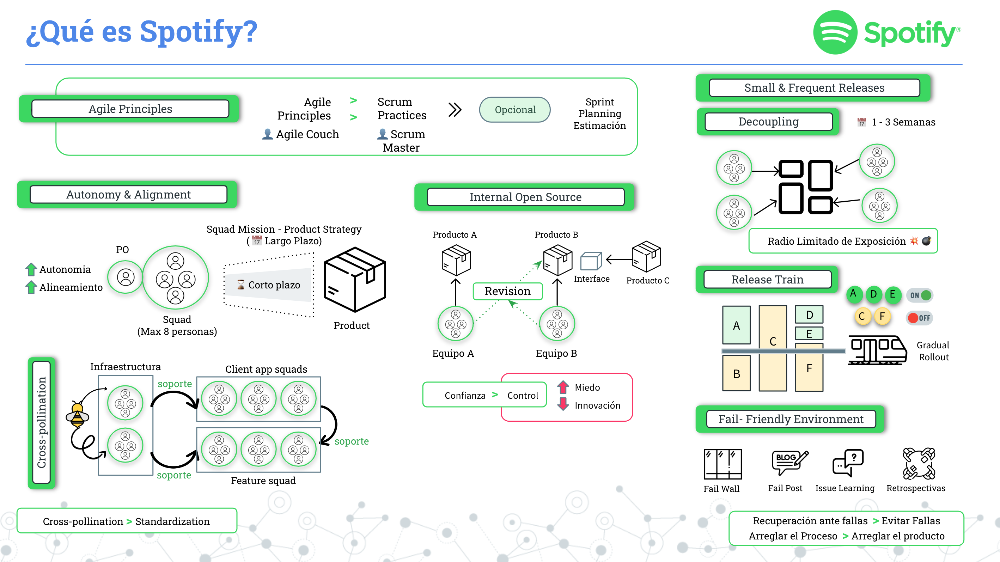
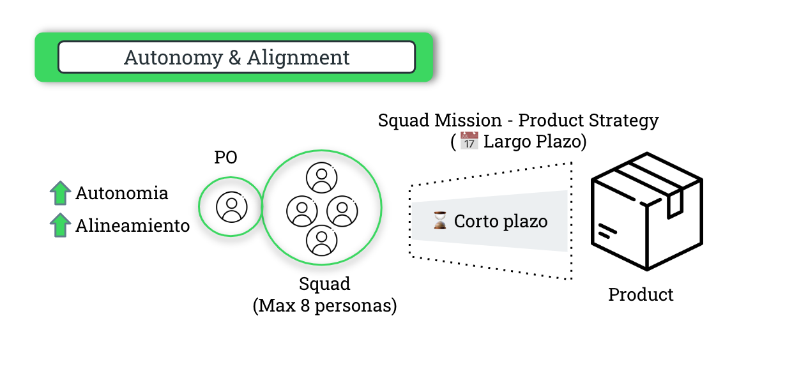
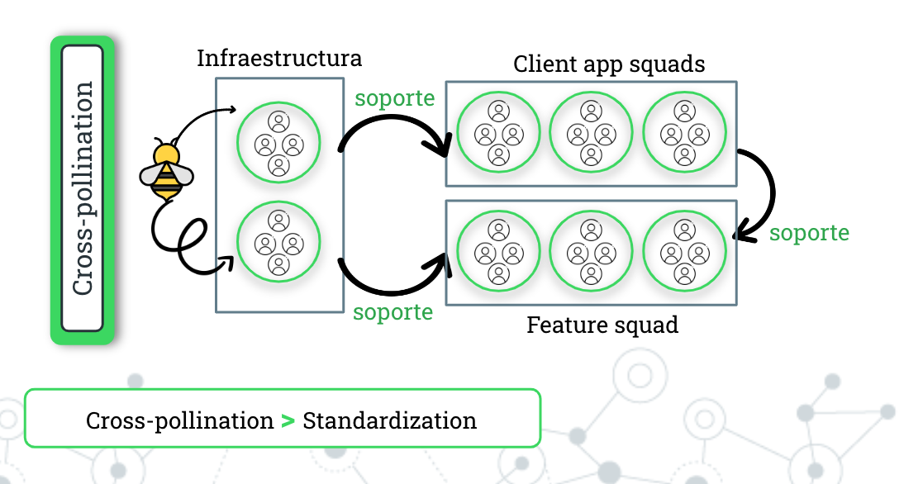
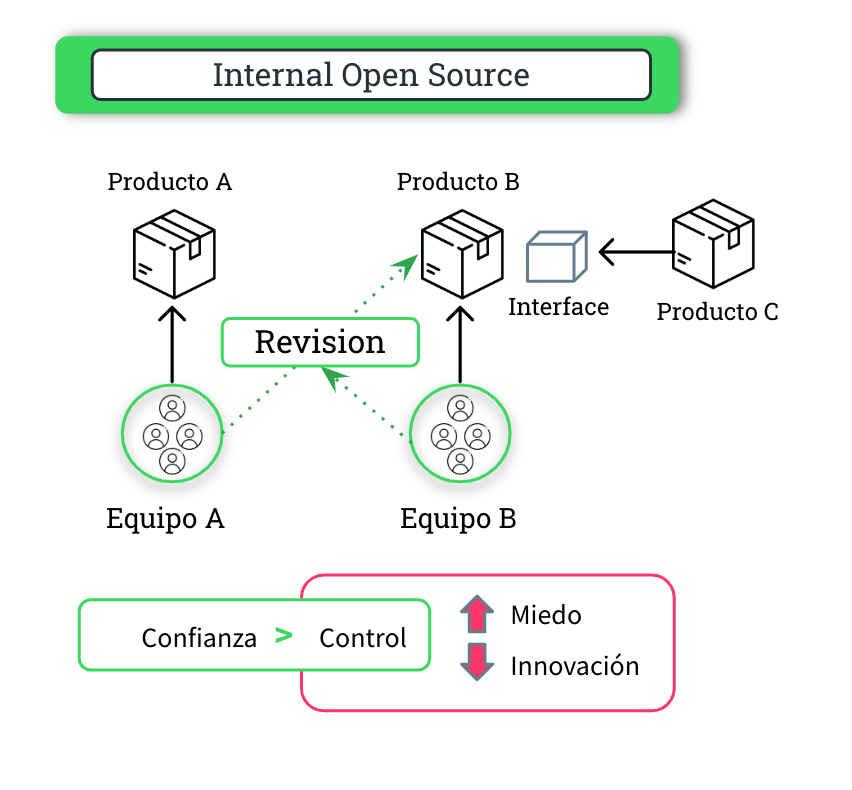
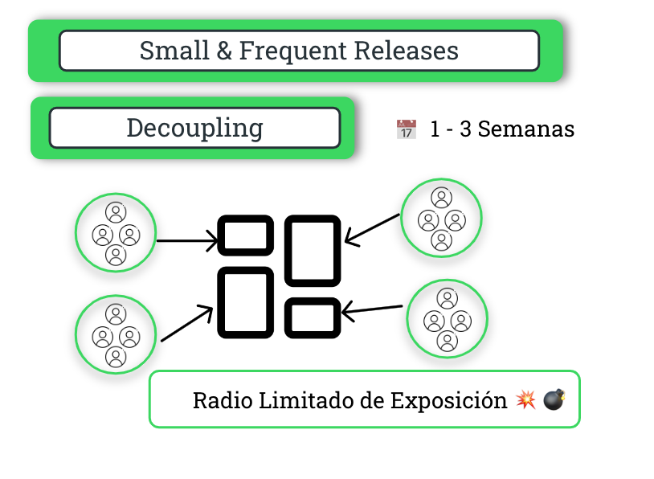
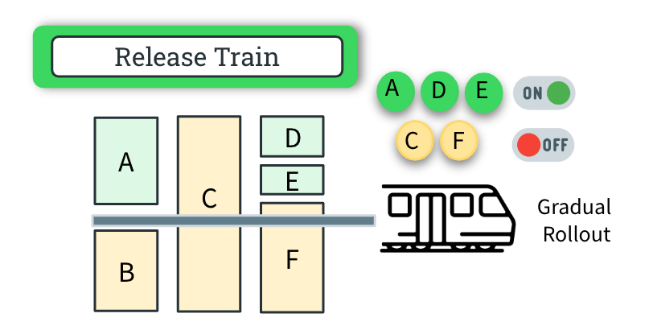
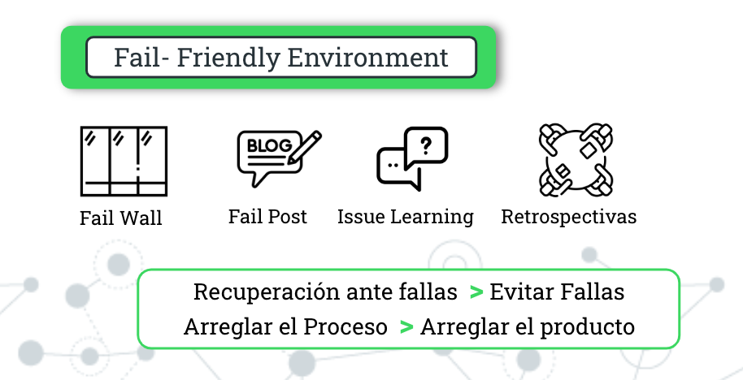

```{r setup, include=FALSE}
knitr::opts_chunk$set(echo = FALSE)
```

# Introducción a la Cultura de Spotify - Parte I

En el contexto actual del desarrollo de software, emergen nuevos paradigmas en torno a la agilidad y la colaboración en equipos de desarrollo como elementos cruciales para alcanzar el éxito en los proyectos. En este contexto, la metodología de Spotify se ha destacado como un enfoque innovador y altamente efectivo para la gestión de proyectos y el desarrollo de software.

Esta metodologia esta inspirada en la **cultura** de **colaboración** y **creatividad** que caracteriza a la compañía de streaming de música líder en el mundo, donde este modelo ofrece una visión fresca y transformadora de cómo los equipos pueden trabajar juntos armoniosamente para lograr objetivos propuestos.

En esta introducción, exploraremos los conceptos fundamentales detrás de la cultura de Spotify, sus principios clave y cómo ha revolucionado la forma en que se abordan los proyectos ágiles.



------------------------------------------------------------------------

## 🟢 Introducción a los Principios Ágiles y su Relación con Scrum

Los principios ágiles son una guía a los equipos hacia la eficiencia, la adaptabilidad y la entrega exitosa de proyectos.

Entre las metodologías ágiles más conocidas se encuentra **Scrum**, que ha ganado una gran popularidad debido a su enfoque estructurado para la gestión de proyectos. Sin embargo, es importante comprender que los principios ágiles trascienden cualquier metodología específica, incluyendo Scrum.

En este contexto, es relevante hablar de la figura del **"Agile Coach"** o **"Entrenador Ágil"** y cómo influye en la dinámica del equipo.


------------------------------------------------------------------------

## 🟢 Squad: Autonomia y Alineamiento

### 📗 Squad

**`Un squad es un equipo pequeño, autoorganizado y multi-funcional, generalmente compuesto por menos de ocho personas`**. Estos equipos tienen la responsabilidad total de llevar a cabo sus tareas, que incluyen diseño, compromisos, despliegue, mantenimiento, operaciones y más.

Cada squad tiene una misión pero que se desarrolla dentro de limites que se definen a largo plazo y cuales son los limites más especificos.

### 📗 Autonomía

En el contexto de Spotify, **`la autonomía significa que los equipos, o escuadrones, tienen la libertad y la capacidad de tomar decisiones sobre qué hacer, cómo hacerlo y cómo colaborar en la ejecución de sus tareas`**. Esta libertad se extiende a diversos aspectos, como el **diseño**, los **compromisos**, el **despliegue**, el **mantenimiento** y las **operaciones**. Sin embargo, `esta autonomía no es ilimitada`, ya que está sujeta a ciertos límites y restricciones definidos por la misión del escuadrón, la estrategia general del producto y las metas a corto plazo que se renegocian trimestralmente.

Estos límites están determinados por factores como`la misión del escuadrón`, **`la estrategia general del producto`** según el área en que están trabajando y l**`as metas de corto plazo que deben alcanzarse`** y que son objeto de negociación cada trimestre. Estos límites aseguran que los equipos trabajen de manera alineada con los objetivos globales de la empresa mientras mantienen su capacidad de tomar decisiones localizadas y ágiles para abordar desafíos específicos.

### 📗 Alineamiento

En Spotify, **`el alineamiento implica que los equipos estén coordinados y comprometidos con la estrategia general del producto, las prioridades del negocio y otros equipos en la organización`**. A pesar de que cada escuadrón tiene su propia misión y autonomía, el alineamiento asegura que trabajen en armonía para contribuir al éxito de la empresa en su conjunto.



------------------------------------------------------------------------

## 🟢 Cross-pollination

**`La "cross-pollination" en Spotify es una estrategia que fomenta la colaboración entre equipos`**, permitiéndoles compartir y utilizar las herramientas creadas por otros. A partir de este enfoque se busca evitar la duplicación de desarrollo y esfuerzo al tiempo que promueve un entorno ágil y colaborativo. Esto es debido a que cada equipo puede desarrollar o seleccionar sus propias herramientas, pero es necesario poder lograr una eficiencia interna por medio de compartir el conocimiento y crear un ecosistema interno que impulsa la innovación en toda la organización de Spotify.

Esta táctica no solo acelera el desarrollo al evitar la repetición de esfuerzos, sino que también enriquece la diversidad de ideas al permitir que soluciones exitosas se adapten y evolucionen en diferentes contextos. La "cross-pollination" en Spotify no solo mejora la eficiencia operativa, sino que también contribuye a la formación de un entorno dinámico y colaborativo que impulsa la mejora continua de prácticas y herramientas internas.

> En resumen, se prefiere utilizar una estrategia la "cross-pollination" sobre la estandarización, esto significa el desarrollo de enfoque más flexible y colaborativo en lugar de uno rígido y uniforme.



------------------------------------------------------------------------

## 🟢 Internal Open Source

En spotify se desarrollo un proceso denominado "intenal open source" donde si bien los equipos son responsables del desarrollo de sus productos y la definición de sus roadmap, se fomenta un enfoque similar al de un proyecto de código abierto dentro de la organización.

Por lo cual, los desarrolladores de diferentes squads pueden realizar adaptaciones en productos a través de solicitudes de extracción (pull requests), y los desarrolladores del equipo original pueden revisar y aceptar esos cambios.

Debido a este enfoque se promueve la colaboración y la contribución cruzada entre equipos, permitiendo que el conocimiento y las soluciones fluyan más libremente.

> En esta práctica se busca agilidad y confianza entre equipos, en lugar de generar controles rígidos que podrían frenar la innovación



------------------------------------------------------------------------

## 🟢 Small & Frequent Releases -Decoupling

La metodología de Spotify enfatiza las "Small & Frequent Releases" (Liberaciones Pequeñas y Frecuentes) mediante la técnica de "Decoupling" (Desacoplamiento). En este enfoque, se prioriza el desarrollo de lanzamientos frecuentes, permitiendo el desacoplamiento de los desarrollos y posibilitando una frecuencia de despliegue de cambios dentro de un periodo de 1 a 3 semanas.

Este enfoque conlleva el beneficio de reducir el impacto de posibles errores, ya que los cambios implementados son pequeños en comparación con grandes lanzamientos.

> La estrategia de "Small & Frequent Releases" facilita una mayor agilidad en el desarrollo y despliegue, contribuyendo a una gestión más efectiva de posibles incidencias y promoviendo una evolución constante y controlada del sistema.



------------------------------------------------------------------------

## 🟢 Release Train

El concepto de "Release Train" está vinculado con la idea previamente descripta de realizar implementaciones en un corto periodo de tiempo. Sin embargo, en ocasiones, ejecutar estas implementaciones de manera inmediata puede ser desafiante, ya que algunas funcionalidades pueden no estar completamente finalizadas. Para abordar esta situación, se recurre a la estrategia de desplegar funcionalidades que pueden permanecer desactivadas hasta que estén completamente desarrolladas, permitiendo así un despliegue gradual y controlado.

Asimismo se enfatiza en el uso de "gradual rollout" o "implementación gradual" que es una estrategia de despliegue de software en la que una nueva funcionalidad o versión se introduce de manera progresiva y controlada en un entorno de producción. En lugar de lanzar la nueva funcionalidad de forma global e inmediata, se implementa de manera gradual, permitiendo que un subconjunto de usuarios o dispositivos tenga acceso inicialmente.

Esta técnica tiene varios propósitos, entre ellos:

1.  **Minimizar riesgos:** Al introducir cambios gradualmente, se reduce el impacto en caso de posibles problemas o errores. Si surgen inconvenientes, afectarán a un grupo más pequeño de usuarios.

2.  **Recopilar feedback:** La implementación gradual permite recopilar comentarios y observaciones de los usuarios de manera incremental, lo que puede ayudar a identificar y abordar problemas antes de la implementación completa.

3.  **Ajustes en tiempo real:** La capacidad de realizar ajustes o mejoras en tiempo real según los comentarios y el rendimiento observado durante la fase inicial.



------------------------------------------------------------------------

## 🟢 Fail - Friendly Enviroment

En esta metodología, se fomenta un ambiente donde aprender de los errores es esencial. Este concepto se manifiesta a través de prácticas específicas, como:

-   📗**Fail Wall:** Un espacio visual que destaca los errores o fallos ocurridos, proporcionando transparencia y la oportunidad de aprender de ellos.

-   📗**Fail Post:** Una práctica que involucra documentar y compartir experiencias relacionadas con fallos o errores, promoviendo el conocimiento colectivo y la mejora continua.

-   📗**Issue Learning:** La consideración de que un problema no se cierra simplemente al ser resuelto, sino cuando se transfiere el conocimiento sobre cómo se solucionó. Esto impulsa un enfoque de aprendizaje continuo a partir de incidentes.

-   📗**Retrospectivas:** Sesiones periódicas para reflexionar sobre el rendimiento, identificar áreas de mejora y ajustar procesos, contribuyendo así a la evolución constante del equipo y la organización.

> \
> Se impulsa la recuperación ante fallos y desear eliminar el temor asociado a ellos, ya que el miedo puede inhibir la innovación. .
>
> Además, se destaca la importancia de mejorar continuamente los procesos en lugar de simplemente corregir errores puntuales en un producto.



# 📚 Referencias

Este articulo esta basado en los videos y la publicaciones realizadas en los siguientes articulos.

1.  **Spotify engineering culture (part 1)**, publicado: March 27, 2014, autor: Henrik Kniberg , Consultado: 2023-11-10 Link: <https://engineering.atspotify.com/2014/03/spotify-engineering-culture-part-1/>
2.  **Spotify engineering culture (part 2)** , publicado: March 27, 2014, autor: Henrik Kniberg , Consultado: 2023-11-10 Link: <https://engineering.atspotify.com/2014/09/spotify-engineering-culture-part-2/>


---

* Image preview reference: [Image by storyset on Freepik](https://www.freepik.com/free-vector/voice-chat-concept-illustration_20173782.htm#query=spotify%20illustration&position=9&from_view=search&track=ais&uuid=381e3533-158a-448b-959a-1100d4288ec1)
