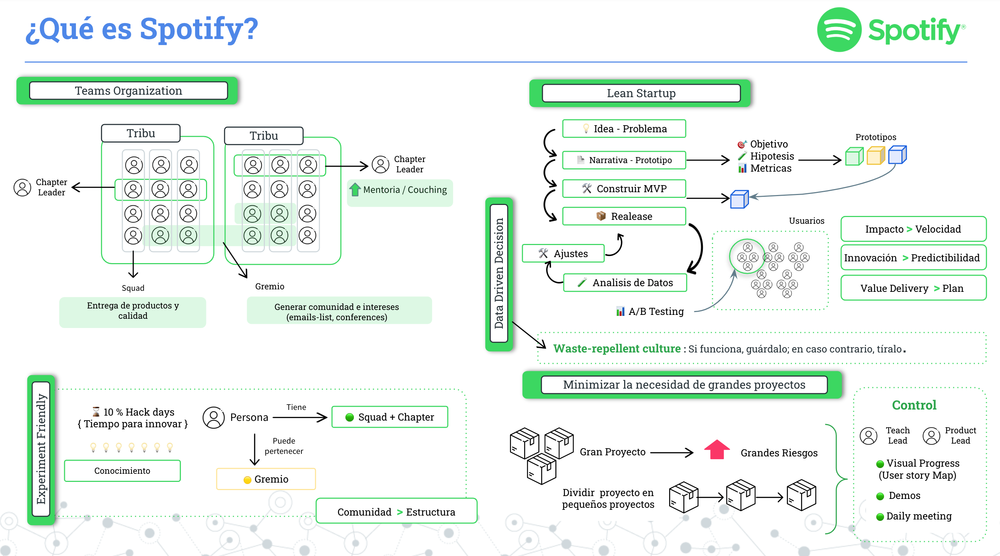
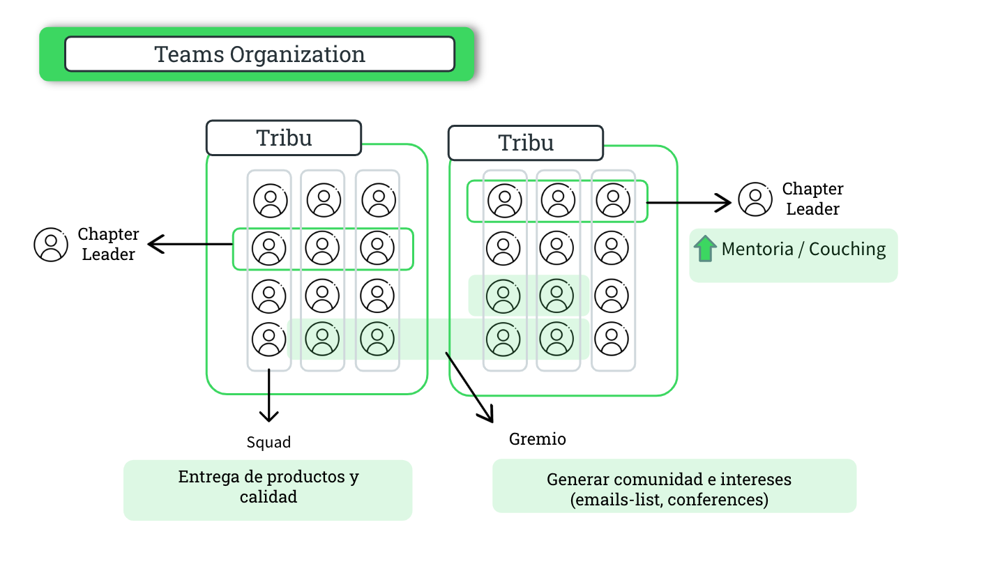
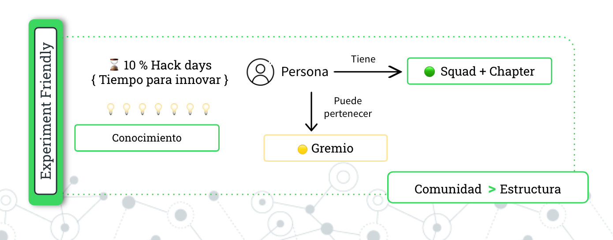
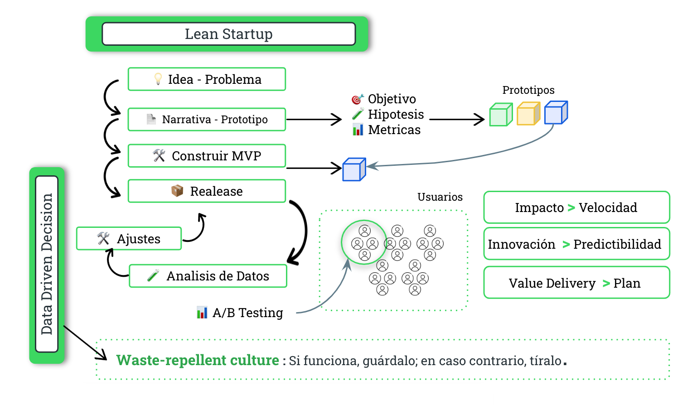
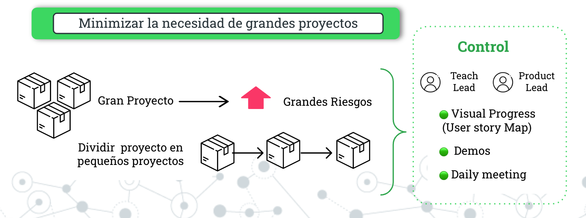

```{r setup, include=FALSE}
knitr::opts_chunk$set(echo = FALSE)
```

[{width="40%"}](https://www.buymeacoffee.com/r0mymendez)

En el contexto actual del desarrollo de software, emergen nuevos paradigmas en torno a la agilidad y la colaboración en equipos de desarrollo como elementos cruciales para alcanzar el éxito en los proyectos. En este contexto, la metodología de Spotify se ha destacado como un enfoque innovador y altamente efectivo para la gestión de proyectos y el desarrollo de software.

Esta metodologia esta inspirada en la **cultura** de **colaboración** y **creatividad** que caracteriza a la compañía de streaming de música líder en el mundo, donde este modelo ofrece una visión fresca y transformadora de cómo los equipos pueden trabajar juntos armoniosamente para lograr objetivos propuestos.

En esta introducción, exploraremos los conceptos fundamentales detrás de la cultura de Spotify, sus principios clave y cómo ha revolucionado la forma en que se abordan los proyectos ágiles.

⚠️ `Parte 1`: [Introducción a la Cultura de Spotify - Parte I](https://r0mymendez.github.io/romymendezblog/posts/2023-11-13-spotify-methodology/)



------------------------------------------------------------------------

## 🟢 Team Organization

Dentro de la metodología adoptada para la organización de equipos, se introducen conceptos clave que definen la estructura y dinámica colaborativa. A continuación, se detallan algunas de estas definiciones:

-   📗**Squad:** Un squad representa un grupo de individuos, enfocados en objetivos comunes y especificos.

<!-- -->

-   📗**Chapter:** Es una agrupación de personas con habilidades y roles similares, pero que trabajan en diferentes equipos o "Squads". Los Chapters están diseñados para fomentar el desarrollo profesional, el intercambio de conocimientos y la colaboración entre personas que comparten áreas de experiencia específicas.

<!-- -->

-   📗**Tribu:** La tribu abarca múltiples squads y chapters que comparten objetivos y propósitos similares.

<!-- -->

-   📗**Gremio:** Un gremio se configura como una comunidad temática donde miembros de diferentes squads y chapters se reúnen para discutir y promover intereses comunes. Esta iniciativa ayuda a generar un sentido de comunidad y facilita la sinergia entre individuos con afinidades específicas.



------------------------------------------------------------------------

## 🟢 Experiment Friendly

En Spotify, se impulsa la creatividad no solo como un medio para generar nuevos productos, sino como un proceso de aprendizaje continuo. Se asigna aproximadamente el 10% del tiempo para que cada persona pueda dedicarse a proyectos creativos, fomentando así la innovación y el desarrollo individual.

Además, se alienta a las personas a unirse a gremios para compartir conocimientos, mientras siguen siendo parte de squads y chapters asignados. Esta cultura promueve la formación de comunidades y la expresión creativa dentro de una estructura menos rígida en comparación con organizaciones más jerárquicas.

> Este enfoque flexible fomenta la colaboración, la comunidad y el desarrollo personal en un entorno que valora la experimentación y la creatividad.



------------------------------------------------------------------------

## 🟢 Lean Startup

En la búsqueda constante de la innovación, Spotify adopta la metodología "Lean Startup", y por lo cual existen las siguientes fases:

1.  **Planteamiento de una Idea o Problema:** Se inicia identificando una idea o un problema que sirva como punto de partida.

2.  **Diseño de un Prototipo:** La metodología impulsa la creación de un prototipo que ayuda a definir hipótesis, métricas y estrategias.

3.  **Construcción del MVP (Producto Mínimo Viable):** A través de la selección del prototipo final, se procede a la construcción del MVP, una versión inicial del producto.

4.  **Release y Ajustes Iterativos:** Una vez construido el MVP, se lanza para su implementación en grupos de usuarios, permitiendo la recopilación de datos y ajustes iterativos basados en el feedback. Este proceso se repite hasta alcanzar un producto deseado con una creciente base de usuarios.

> En este enfoque, se da prioridad al impacto sobre la velocidad de implementación, destacando la innovación y valorizando la entrega continua en lugar de seguir un plan predefinido.
>
> Esta metodología fomenta la adaptabilidad y la mejora continua en la búsqueda de productos que resuelvan necesidades con la mayor eficacia.



------------------------------------------------------------------------

## 🟢 **Minimizando la Necesidad de Grandes Proyectos**

En línea con la metodología adoptada por Spotify, se implementa la estrategia de "divide y vencerás", que implica descomponer proyectos extensos en tareas más manejables para mitigar riesgos.

En el cual un gran proyecto implica grandes riesgos, por lo cual esta estrategia permite reducir estos riesgos realizando proyectos más pequeños.

Aunque es necesario mantener una visión integral de la empresa, por lo cual se establecen controles a través de demos, donde se presenta la funcionalidad desarrollada a otros equipos. Además, se emplean metodologías como el "user story map" para visualizar el camino que los usuarios siguen al interactuar con la aplicación y comprender cómo se entrelazan diferentes productos. Estos controles a menudo involucran a líderes técnicos y líderes de producto que colaboran para asegurar una visión unificada del producto y evitar pérdidas de perspectiva.



# 📚 Referencias

Este articulo esta basado en los videos y la publicaciones realizadas en los siguientes articulos.

1.  **Spotify engineering culture (part 1)**, publicado: March 27, 2014, autor: Henrik Kniberg , Consultado: 2023-11-10 Link: [\<https://engineering.atspotify.com/2014/03/spotify-engineering-culture-part-1/\>](https://engineering.atspotify.com/2014/03/spotify-engineering-culture-part-1/){.uri}
2.  **Spotify engineering culture (part 2)** , publicado: March 27, 2014, autor: Henrik Kniberg , Consultado: 2023-11-10 Link: [\<https://engineering.atspotify.com/2014/09/spotify-engineering-culture-part-2/\>](https://engineering.atspotify.com/2014/09/spotify-engineering-culture-part-2/){.uri}

------------------------------------------------------------------------

\* Image preview reference: [Image by storyset on Freepik](%5Bhttps://www.freepik.com/free-vector/voice-chat-concept-illustration_20173782.htm#query=spotify%20illustration&position=9&from_view=search&track=ais&uuid=381e3533-158a-448b-959a-1100d4288ec1)](<https://www.freepik.com/free-vector/voice-chat-concept-illustration_20173782.htm#query=spotify%20illustration&position=9&from_view=search&track=ais&uuid=381e3533-158a-448b-959a-1100d4288ec1>))
