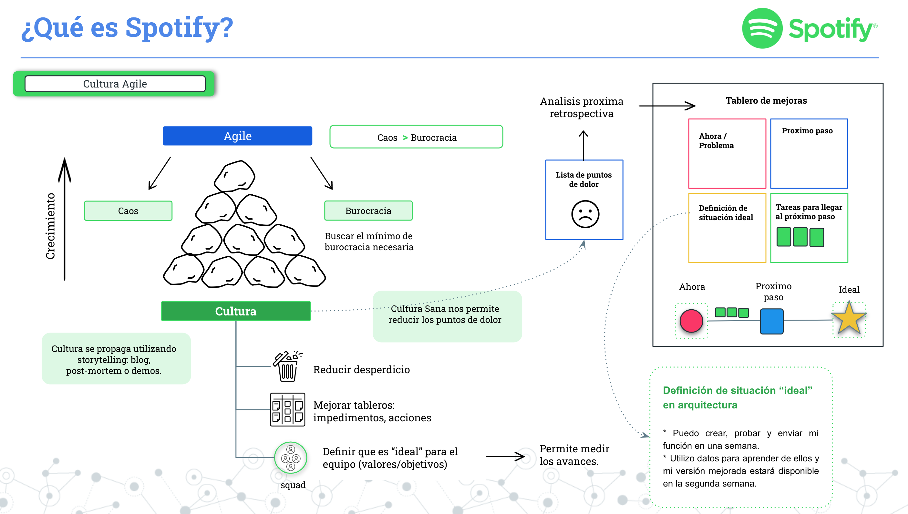
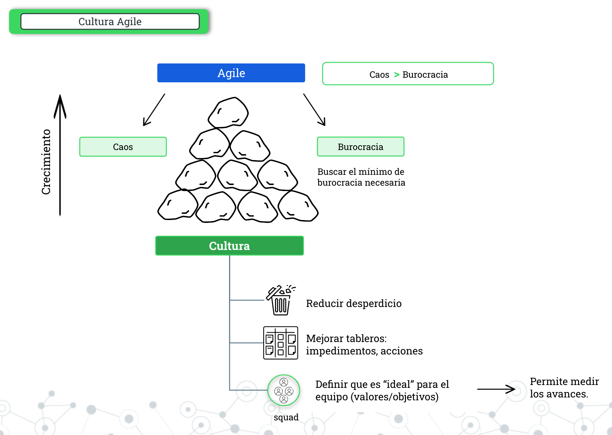
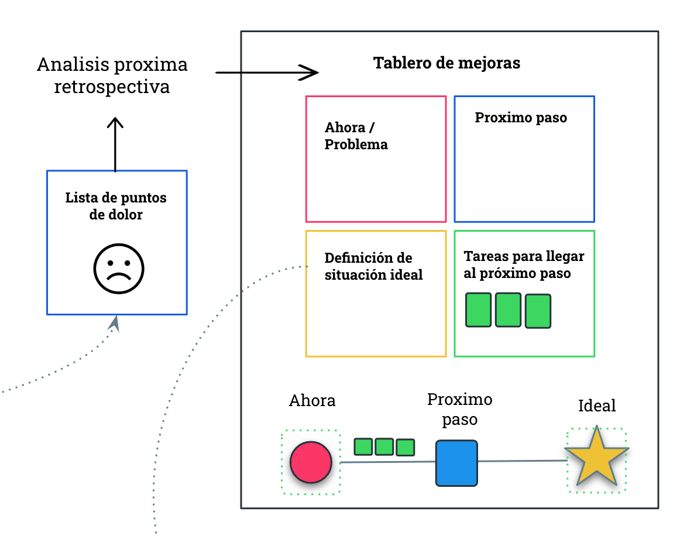

```{r setup, include=FALSE}
knitr::opts_chunk$set(echo = FALSE)
```

# Introducción a la Cultura de Spotify - Parte III

En el contexto actual del desarrollo de software, emergen nuevos paradigmas en torno a la agilidad y la colaboración en equipos de desarrollo como elementos cruciales para alcanzar el éxito en los proyectos. En este contexto, la metodología de Spotify se ha destacado como un enfoque innovador y altamente efectivo para la gestión de proyectos y el desarrollo de software.

Esta metodologia esta inspirada en la cultura de colaboración y creatividad que caracteriza a la compañía de streaming de música líder en el mundo, donde este modelo ofrece una visión fresca y transformadora de cómo los equipos pueden trabajar juntos armoniosamente para lograr objetivos propuestos.

En esta introducción, exploraremos los conceptos fundamentales detrás de la cultura de Spotify, sus principios clave y cómo ha revolucionado la forma en que se abordan los proyectos ágiles.

⚠️ `Parte 2`: [Introducción a la Cultura de Spotify - Parte II](https://r0mymendez.github.io/romymendezblog/posts/2023-11-14-spotify-methodology-2/)



------------------------------------------------------------------------

## 🟢 Cultura Agile

La cultura ágil en Spotify ha sido abordada en publicaciones previas, destacando que a medida que la organización crece, existe la posibilidad de caer en el caos. Sin embargo, una reacción excesiva al agregar demasiada estructura y procesos puede llevar a la burocracia, siendo este último escenario más problemático en esta cultura que caer en el caos. Por esta razón, es fundamental determinar la cantidad mínima de estructura y procesos necesarios para evitar caer en la burocracia total.

Aunque el crecimiento eficiente requiere ciertos procesos, es crucial subrayar que la burocracia debe mantenerse al mínimo para preservar la agilidad y prevenir la pérdida de innovación.

Con el crecimiento de la organización, surgen conceptos importantes de tratar, como:

-   **Reducir los desperdicios:** Identificar y eliminar rápidamente procesos que no añaden valor, conservando aquellos que funcionan. Ejemplos de prácticas útiles incluyen retrospectivas, Google Docs o GIT, mientras que cambios manuales, reportes de horas, equipos separados o estimaciones de tareas se consideraron no exitosos.

-   **Tableros de mejoras:** En reuniones de retrospectivas o post-mortem, se analizan y crean tableros con el objetivo de identificar impedimentos y proponer acciones para abordarlos.

-   **Definir el ideal para cada equipo:** Este proceso implica la definición de tareas que proporcionen una guía de mejora, las cuales no necesariamente deben ser realistas. Sin embargo, este enfoque permite trazar un camino ideal y concentrar los esfuerzos en comprender cómo se realiza, así como medir el progreso alcanzado.



## 🟢 Tablero de mejoras

Considerando que hemos definido el ideal para el equipo, el siguiente paso implica determinar en qué punto nos encontramos actualmente y cuál será el próximo paso para alcanzar la situación ideal que aspiramos lograr. Este próximo paso establecerá una serie de tareas a desarrollar, permitiendo así completar el tablero con los cuatro cuadrantes:

1.  **Ahora:** La situación actual o el problema que necesitamos resolver.

2.  **Situación Ideal:** Descripción de cómo visualizamos que todo funciona según lo esperado.

3.  **Próximo Paso:** Definición del siguiente paso a realizar para estar más cerca de la situación ideal.

4.  **Tareas:** Con base en la definición anterior, se detallan las tareas específicas a desarrollar.

Aunque este tablero pueda parecer simple, en ocasiones, al intentar realizar modificaciones para avanzar hacia la situación ideal, nos encontramos con que, a veces, se alteran otras tareas o incluso retrocedemos en algunos aspectos. Por tanto, es crucial analizar esto en la próxima retrospectiva, identificar los nuevos desafíos, los nuevos puntos de dolor y mejorar la definición de la situación ideal.



Este es la ultima parte de mis post relacionados a la cultura spotify, si quieres leer los anteriores a continuación te dejo los links:

-   `Parte 1`: [Introducción a la Cultura de Spotify - Parte I](https://r0mymendez.github.io/romymendezblog/posts/2023-11-13-spotify-methodology/)

-   `Parte 2`: [Introducción a la Cultura de Spotify - Parte II](https://r0mymendez.github.io/romymendezblog/posts/2023-11-14-spotify-methodology-2/)

# 📚 Referencias

Este articulo esta basado en los videos y la publicaciones realizadas en los siguientes articulos.

1.  **Spotify engineering culture (part 1)**, publicado: March 27, 2014, autor: Henrik Kniberg , Consultado: 2023-11-10 Link: <https://engineering.atspotify.com/2014/03/spotify-engineering-culture-part-1/>
2.  **Spotify engineering culture (part 2)** , publicado: March 27, 2014, autor: Henrik Kniberg , Consultado: 2023-11-10 Link: <https://engineering.atspotify.com/2014/09/spotify-engineering-culture-part-2/>


---

* Image preview reference: [Image by storyset on Freepik](https://www.freepik.com/free-vector/voice-chat-concept-illustration_20173782.htm#query=spotify%20illustration&position=9&from_view=search&track=ais&uuid=381e3533-158a-448b-959a-1100d4288ec1)

