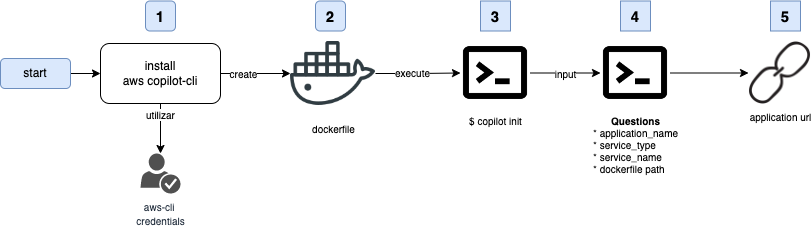

```{r setup, include=FALSE}
knitr::opts_chunk$set(echo = FALSE)
```

# Introduction

In this article, I explain the use of the **AWS Copilot** service.
However, to carry it out, it's necessary to start by analyzing what the AWS Elastic Container Service (ECS) is and how it works, along with its deployment methods.
This is necessary because AWS Copilot performs the implementation and deployment of an application using ECS

------------------------------------------------------------------------

# 💡AWS ECS (Elastic Container Services)

Elastic Container Service (**ECS**) is a scalable container orchestration platform proprietary to AWS.
It is designed to run, stop, and manage containers in a cluster.

Therefore, **ECS** is AWS's Docker container service that handles the orchestration and provisioning of Docker containers.

This service includes the following concepts:

-   ☁️ **Task Definition:** Describes how to start a Docker container.

-   ☁️ **Task:** This is a running container with the configuration defined in the task definition.

-   ☁️ **Service:** Defines long-running tasks from the same task definition.

-   ☁️ **Cluster:** A logical group of EC2 instances.

-   ☁️ **Container Instance:** This is just an EC2 instance that is part of an ECS cluster and has Docker installed.

    ## ⚒️ ECS with EC2 instances

In this model, containers are deployed on **EC2** instances (VMs) created for the cluster.
**ECS** manages them along with the tasks that are part of the task definition

+-------------------------------------------------------------------------------------------------+-----------------------------------------------------------------------------------------------------------------------------------------------+
| ✅ Ventajas                                                                                      | ❌ Desventajas                                                                                                                                 |
+=================================================================================================+===============================================================================================================================================+
| -   Complete control over the type of EC2 instance used is provided.                            | -   When working with EC2, it's necessary for the administrator of this architecture to handle all security updates and scaling of instances. |
+-------------------------------------------------------------------------------------------------+-----------------------------------------------------------------------------------------------------------------------------------------------+
| -   It allows the use of instances that can be optimized depending on what you want to execute. | -   The cost is based on the type of EC2 instance running within the cluster and the VPC networks.                                            |
+-------------------------------------------------------------------------------------------------+-----------------------------------------------------------------------------------------------------------------------------------------------+

## ⚒️ ECS with AWS Fargate (Serverless)

In this variant, EC2 instances or servers are no longer used.
It's simply necessary to select the CPU and memory combination needed.

+---------------------------------------------------------------------------------------------------------------------------------------------------+----------------------------------------------------------------------------------------------------------------------------------------------+
| ✅ Ventajas                                                                                                                                        | ❌ Desventajas                                                                                                                                |
+===================================================================================================================================================+==============================================================================================================================================+
| -   There are no servers to manage.                                                                                                               | -   ECS + Fargate supports only one network mode, and this limits control over the network layer.                                            |
+---------------------------------------------------------------------------------------------------------------------------------------------------+----------------------------------------------------------------------------------------------------------------------------------------------+
| -   AWS is in charge of the availability and scalability of the containers.                                                                       | -   Costo es en función de la CPU y la memoria que seleccione. La cantidad de núcleos de CPU y GB determina el costo de ejecutar el clúster. |
+---------------------------------------------------------------------------------------------------------------------------------------------------+----------------------------------------------------------------------------------------------------------------------------------------------+
| -   Fargate Spot is a new capability that can run ECS tasks that are interruption-tolerant at up to a 70% discount compared to the Fargate price. |                                                                                                                                              |
+---------------------------------------------------------------------------------------------------------------------------------------------------+----------------------------------------------------------------------------------------------------------------------------------------------+

# 💡**AWS Copilot**

**AWS Copilot** is a tool used through the AWS command line that simplifies the creation, deployment, monitoring, and operation of containers in ECS using a local development environment

This tool manages the components required for the deployment and operation of an application, such as VPC, load balancers, deployment pipelines, and storage.
Therefore, it's only necessary to provide an application container and minimal configurations, resulting in a faster deployment and focusing on application development.

## 🔎 Comparison of tasks to be performed 

The services will communicate with each other, so it is necessary to consider the following scenarios:

+------------------------------------------------------------------------------------------------------------+-----------------------------------------------------------------+-----------------------------------------------------------------+
| Activities                                                                                                 | Without AWS-copilot                                             | With AWS-copilot                                                |
+============================================================================================================+=================================================================+=================================================================+
| <strong><font style="background-color:#FAFAFA;">Application development</font></strong>                    | <font style="background-color:#CDFECF;">Development team</font> | <font style="background-color:#CDFECF;">Development team</font> |
+------------------------------------------------------------------------------------------------------------+-----------------------------------------------------------------+-----------------------------------------------------------------+
| <strong><font style="background-color:#FAFAFA;">Container generation</font></strong>                       | <font style="background-color:#CDFECF;">Development team</font> | <font style="background-color:#CDFECF;">Development team</font> |
+------------------------------------------------------------------------------------------------------------+-----------------------------------------------------------------+-----------------------------------------------------------------+
| <strong><font style="background-color:#FAFAFA;">Virtual Private Cloud (VPC) Subnets</font></strong>        | <font style="background-color:#CDFECF;">Development team</font> | <font style="background-color:#FFEDC4;">AWS-Copilot</font>      |
+------------------------------------------------------------------------------------------------------------+-----------------------------------------------------------------+-----------------------------------------------------------------+
| <strong><font style="background-color:#FAFAFA;">Load balancers</font></strong>                             | <font style="background-color:#CDFECF;">Development team</font> | <font style="background-color:#FFEDC4;">AWS-Copilot</font>      |
+------------------------------------------------------------------------------------------------------------+-----------------------------------------------------------------+-----------------------------------------------------------------+
| <strong><font style="background-color:#FAFAFA;">Deployment flows (ci/cd)</font></strong>                   | <font style="background-color:#CDFECF;">Development team</font> | <font style="background-color:#FFEDC4;">AWS-Copilot</font>      |
+------------------------------------------------------------------------------------------------------------+-----------------------------------------------------------------+-----------------------------------------------------------------+
| <strong><font style="background-color:#FAFAFA;">Persistent storage of your application.</font></strong>    | <font style="background-color:#CDFECF;">Development team</font> | <font style="background-color:#FFEDC4;">AWS-Copilot</font>      |
+------------------------------------------------------------------------------------------------------------+-----------------------------------------------------------------+-----------------------------------------------------------------+
| <strong><font style="background-color:#FAFAFA;">Synchronize deployment across environments</font></strong> | <font style="background-color:#CDFECF;">Development team</font> | <font style="background-color:#FFEDC4;">AWS-Copilot</font>      |
+------------------------------------------------------------------------------------------------------------+-----------------------------------------------------------------+-----------------------------------------------------------------+

## 🧩 Components

The following table contains the components that are configured when using the AWS Copilot service.

+-----------------------------------------------------------------------------+------------------------------------------------------------------------+
| **Component**                                                               | **Description**                                                        |
+=============================================================================+========================================================================+
| <strong><font style="background-color:#CDFECF;">Application</font></strong> | An application is a grouping mechanism for the pieces of your system.  |
+-----------------------------------------------------------------------------+------------------------------------------------------------------------+
| <strong><font style="background-color:#FFFFBC;">Enviroment</font></strong>  | An environment is a stage in the deployment of an application.         |
+-----------------------------------------------------------------------------+------------------------------------------------------------------------+
| <strong><font style="background-color:#D7EFFF;">Service</font></strong>     | A service is a single process of long-running code within a container. |
+-----------------------------------------------------------------------------+------------------------------------------------------------------------+

## ⚒️ Installation and use

EIn just 5 steps we can deploy an application using aws-copilot, as shown in the following image.
This allows the development team to only focus on development and not so much on the deployment of the infrastructure.

The first application that is deployed in copilot will make a default configuration and the same will be with a serverless container in fargate.

As seen in the following image, with only 5 steps we can deploy an application.



The steps in the flow are as follows:

1.  Install AWS Copilot, which will require AWS client credentials.

2.  Create the Dockerfile for our application.

3.  Execute **`copilot init`** in a terminal to initialize.

4.  When running **`init`**, some questions will appear to answer, such as the application name, service type, service name, and Dockerfile location.

5.  In this final step, a URL will be provided to access the application

## 🔎 Logs

To obtain the logs of the deployed containers, it is necessary to execute the following command:

| \$ copilot svc logs- follow |
|-----------------------------|

## 📉 Traffic to production

To deploy in production it is necessary to be able to generate different environments, so to generate them it is necessary to execute the following command.

| \$ copilot env init |
|---------------------|

Subsequently, it is important to be able to modify the manifest file that contains all the application configurations and is located in  nombredeaplicacion/**manifest.yml**

Once the environment configuration is complete, it is necessary to deploy it to production (or another environment, but the following example is in production).

| \$ copilot svc deploy ---env production |
|-----------------------------------------|

## 🧪Testing

In order to test the deployed application, you can use Apachebench which allows you to generate traffic to the web application.

For this it is necessary to be able to execute the following command in which you want to generate a number of 5000 transactions to my service with a concurrency of 25 requests at a time.

| ab -n 5000 -c 25[\<http://app12345.us-east-1.elb.amazonaws.com\>](http://nyan-publi-wi97060djp1b-2041999651.us-east-1.elb.amazonaws.com/) |
|-------------------------------------------------------------------------------------------------------------------------------------------|

En el caso de no tener la respuesta esperada puedo modificar mi archivo de manifiesto y escalar horizontalmente la aplicación en base a los diferentes ambientes. 

## 💰 Service Cost

This is a tool distributed by Amazon under an Apache 2.0 license, so this means that it is an open source application.

Being an open source application, it has no additional costs, the price is given by the use of the configured services.

# 🎯 Last conclusions

\
Summarizing AWS Copilot, we can highlight the following features:

-   **AWS Copilot** is an open-source **AWS** tool that allows deploying a production-ready container in just <font style="background-color:#FFFFBC;">5 steps</font>, allowing the focus to be on application development rather than infrastructure.

-   It's <font style="background-color:#FFFFBC;">easy to configure</font>, requiring only the execution of a few commands and modification of the manifest file based on the resources our application needs.

-   In case of <font style="background-color:#FFFFBC;">horizontal scaling</font> needs, one only needs to modify the manifest file and then deploy the application.

-   AWS Copilot enables configuring a <font style="background-color:#FFFFBC;">CI/CD pipeline</font> for automatic deployments across environments.

-   Generating \<font style="background-color:#FFFFBC;">KPIs</font>, <font style="background-color:#FFFFBC;">alarms</font>, and <font style="background-color:#FFFFBC;">metrics</font> for the application can be done with just a few commands using the AWS Copilot service.

# 📚 References

1.  📚**Title**: Presentamos AWS Copilot, **Site**: Blog de Amazon Web Services (AWS), **Author**: Nathan Peck,Gabriel Gasca Torres y José Lorenzo Cuéncar, **url**: [\<https://aws.amazon.com/es/blogs/aws-spanish/presentamos-aws-copilot/\>](https://aws.amazon.com/es/blogs/aws-spanish/presentamos-aws-copilot/){.uri},

2.  📚**Title**: Introducción a Amazon ECS mediante AWS Copilot, **Site**: Documentación oficical de AWS, **Author**: AWS, **url**: [\<https://docs.aws.amazon.com/es_es/AmazonECS/latest/userguide/getting-started-aws-copilot-cli.html\>](https://docs.aws.amazon.com/es_es/AmazonECS/latest/userguide/getting-started-aws-copilot-cli.html){.uri}

3.  📚**Title:** AWS Copilot**, Site:** AWS**, Author:** AWS, **url**: [\<https://aws.amazon.com/es/containers/copilot/\>](https://aws.amazon.com/es/containers/copilot/){.uri}

4.  📚**Title**: Gentle Introduction to How AWS ECS Works with Example Tutorial, **Site:** Medium**, Author:** [Tung Nguyen](https://medium.com/@tongueroo?source=post_page-----cea3d27ce63d--------------------------------) **, Url:** [\<https://medium.com/boltops/gentle-introduction-to-how-aws-ecs-works-with-example-tutorial-cea3d27ce63d\>](https://medium.com/boltops/gentle-introduction-to-how-aws-ecs-works-with-example-tutorial-cea3d27ce63d){.uri},
