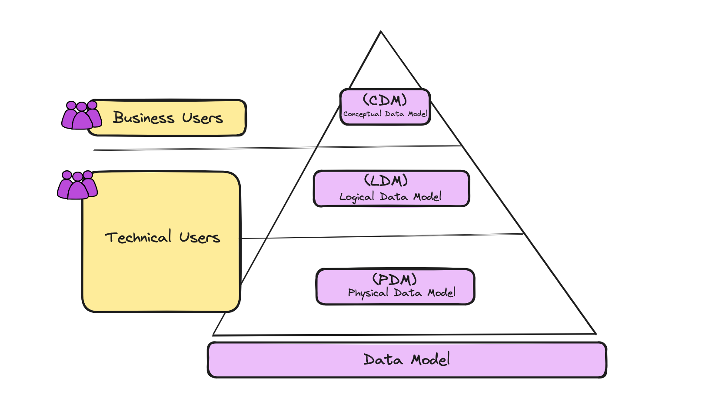
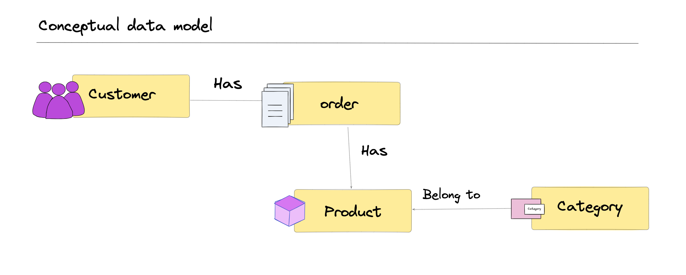
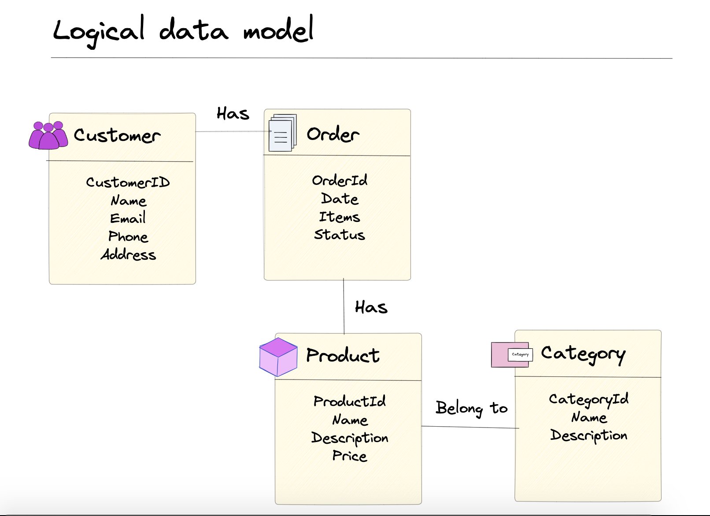
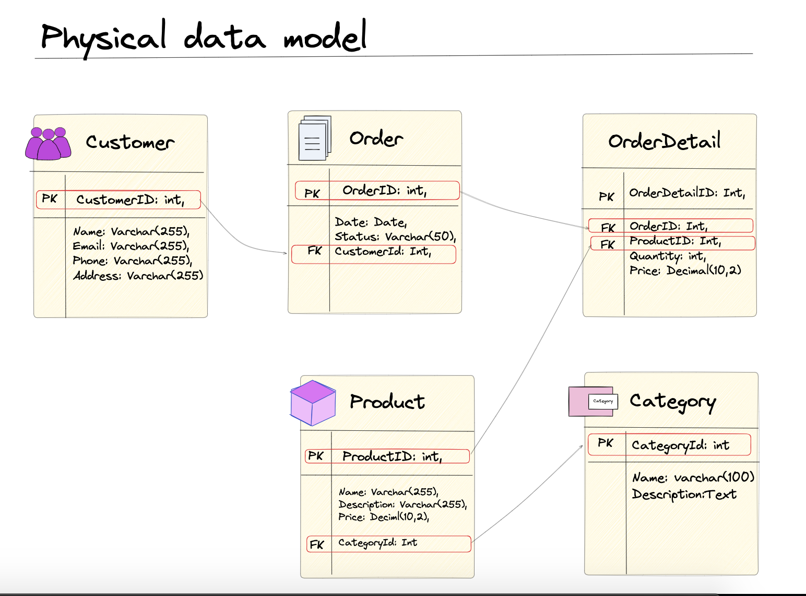
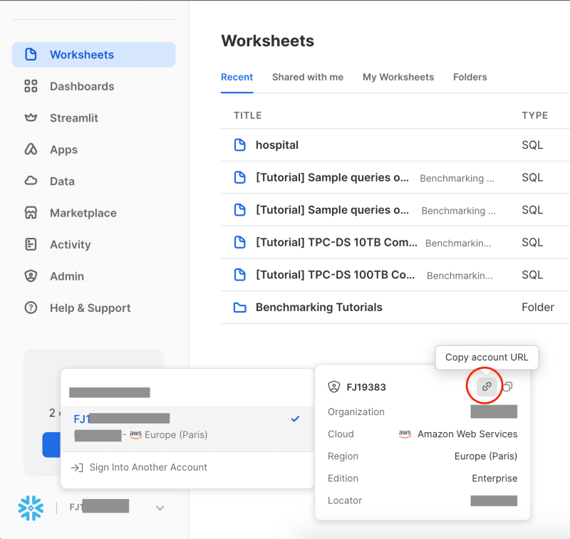
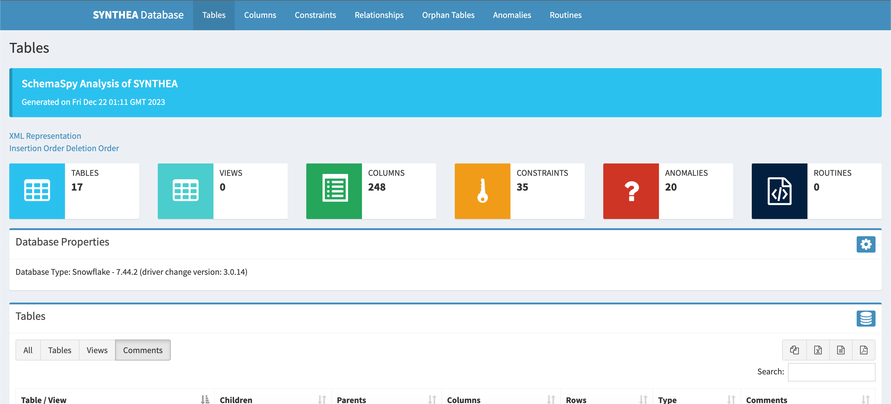
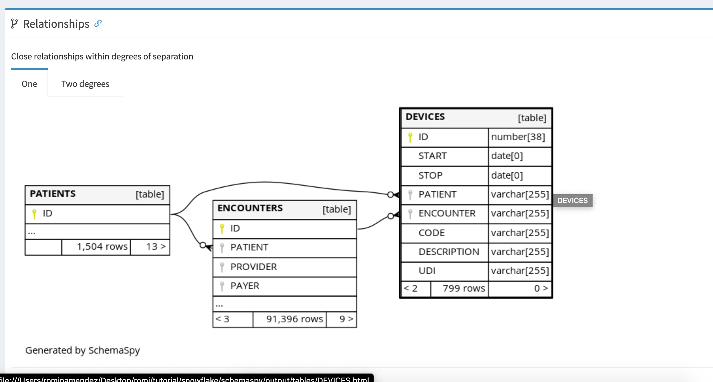

```{r setup, include=FALSE}
knitr::opts_chunk$set(echo = FALSE)
```

In this article, we will delve into a comprehensive exploration of the intricacies of data modeling, spanning from its conceptual inception to its logical definition and eventual physical implementation.
Understanding the life cycle of a data model is crucial for efficiently designing and managing databases.

Furthermore, in real-world scenarios, existing databases often necessitate reverse engineering to unveil and comprehend their underlying structures.

In following sections, we will do on the implementation journey of **SchemaPy**, leveraging Docker for deployment, and employing a **Snowflake** database.

```{r  echo=FALSE}
library("vembedr")
embed_url("https://www.youtube.com/watch?v=LVI1C1pQVjE")
```

------------------------------------------------------------------------

# Data Model

Data modeling is a fundamental task that provides us with a clear understanding of data and the most efficient way to store it.
This approach involves representing entities and relationships based on business processes, facilitating documentation and the efficient exploration of data.
The ability to generate these documents and understand how data is stored is essential knowledge for any data team.
In this context, we will delve into the significance and process of data modeling, emphasizing how this practice becomes a valuable tool for the effective management and exploitation of information.



------------------------------------------------------------------------

## Conceptual Data Model (CDM)

A **conceptual data model (CDM)** operates at a high level and offers an organization's data needs.
It defines a broad and simplified view of the data and the purpose of conceptual data modeling is to establish a shared understanding of the business by capturing the essential concepts of a business process.
The focus is on abstracting and representing key entities, relationships, and their interdependencies, fostering a common understanding among stakeholders about the fundamental aspects of the business and its data requirements.

Below is an example of a CDM



------------------------------------------------------------------------

## Logical Data Model (LDM)

A **logical data model (LDM)** extends the conceptual data model by providing a complete definition of relationships, incorporating details and the structure of essential entities.
In summary the LDM encompasses specific attributes for each entity and the relationships between entities.
Below is an example of a LDM



------------------------------------------------------------------------

## Physical data model

A **Physical Data Model (PDM)** outlines how the model will be translated into an actual database.
The PDM incorporates all necessary physical specifications essential for constructing a database, providing a comprehensive guide for database construction, including tables, columns, data types, indexes, constraints, and other implementation details tailored to the chosen database management system.



------------------------------------------------------------------------

# ❄️Snowflake SchemaSpy 🐳 Docker Compose

In this following example, we will implement of [SchemaSpy](https://schemaspy.org/) through a Docker image in a [Snowflake](https://www.snowflake.com/es/) database.
It's important to note that the implementation can be extended to other databases such as: mysql, PostgreSQL, Oracle, SQL Server, DB2, H2, HSQLDB, SQLite, Firebird, Redshift and Informix.

-   [SchemaSpy](https://schemaspy.org/) is a tool that generates an HTML representation of a database schema's relationships, providing insights into the database structure.

-   [Snowflake](https://www.snowflake.com/es/) is a cloud-based data storage and processing service that provides a highly scalable and fully managed data storage environment.
    Its architecture is built on the separation of storage and computing, allowing elastic scalability and optimal performance.

## 🚀 Benefits of SchemaSpy

-   Visual representation of the database schema.
-   Relationship insights between tables.
-   HTML report for easy sharing and documentation.

------------------------------------------------------------------------

## Prerequisites

Before you begin, ensure that you have the following installed:

-    🐳 **Docker**

-    🐙 **Docker Compose**

-    ❄️ **Snowflake account** (You can create an account with a 30-day free trial which includes \$400 worth of free usage.)

------------------------------------------------------------------------

## Usage

### 📁 Clone this repository

](repo.png)

``` {.bash}
git clone https://github.com/r0mymendez/schemaspy-snowflake.git
cd schemaspy-snowflake
```

------------------------------------------------------------------------

### ❄️ Snowflake Configuration

At this stage, you need to configure the configuration file located at the following path: config/snowflake.properties.
This configuration will be used to establish the connection to Snowflake, so it is necessary to modify the **account**, **role**, **warehouse**, **schema**, and **database** settings.

``` {.bash}
schemaspy.t=snowflake
schemaspy.u=<user>
schemaspy.p=<password>
schemaspy.account=<account>
schemaspy.role=<role
schemaspy.warehouse=<warehouse>
schemaspy.db=<database>
schemaspy.s=<schema>
```

------------------------------------------------------------------------

### ❄️ Snowflake Account

Below is an example of an account URL.
However, you only need to use a portion of it in the configuration:

-   **Full account URL:** <https://%60nl1111.eu-west-3.aws>\`.snowflakecomputing.com
-   **Account to use in the configuration:** `nl1111.eu-west-3.aws`



------------------------------------------------------------------------

## 🐙 Build and run the Docker Compose environment

This command will build the Docker image and start the container.

``` {.bash}
docker-compose -f docker-compose-snowflake.yaml up
```

------------------------------------------------------------------------

# 🔍 Schemapy

After executing Docker Compose, you'll find a web site in the output folder.
This page features multiple tabs, each offering distinct functionalities, and below, we will explain them.

------------------------------------------------------------------------

## Functionality Tabs

-   **Tables:** Provides an overview of all tables in the database schema.
-   **Columns:** Displays detailed information about columns within each table.
-   **Constraints:** Offers insights into constraints applied to the database.
-   **Relationships:** Visualizes the relationships between different tables.
-   **Orphan Tables:** Identifies tables without established relationships.
-   **Anomalies:** Highlights any irregularities or anomalies in the schema.
-   **Routines:** Presents information about stored routines or procedures.

------------------------------------------------------------------------

## SchemaSpy UI

In the provided example, we showcase a demo utilizing a synthetic database called Synthea.
Synthea is a state-of-the-art synthetic data generation tool designed for creating realistic, yet entirely fictitious, patient records and healthcare data.
It enables the simulation of diverse medical scenarios, making it a valuable resource for testing and development purposes in the healthcare domain.
Visit the following 👉[link to access a demo](https://r0mymendez.github.io/schemaspy-snowflake)👈.





------------------------------------------------------------------------

# 📚 References

If you want to learn...

-   [Snowflake](https://signup.snowflake.com/)
-   [Snowflake Free courses](https://quickstarts.snowflake.com/)
-   [SchemaSpy](https://schemaspy.org/)
-   [SchemaSpy: Docker Image](https://hub.docker.com/r/mnuessler/schemaspy/)
-   [Synthea Project](https://synthea.mitre.org/)

Other references:

\- Image preview reference: [[Imagen de vectorjuice en Freepik](https://www.freepik.com/free-vector/business-analyst-with-laptop-idea-lightbulb-waymark-decision-management-enterprise-analysis-decision-it-tool-decision-system-concept-illustration_11668547.htm#page=2&query=data%20model%20illustration&position=22&from_view=search&track=ais&uuid=e9448c6b-9693-4018-80bf-b7bcaa42732f)]
