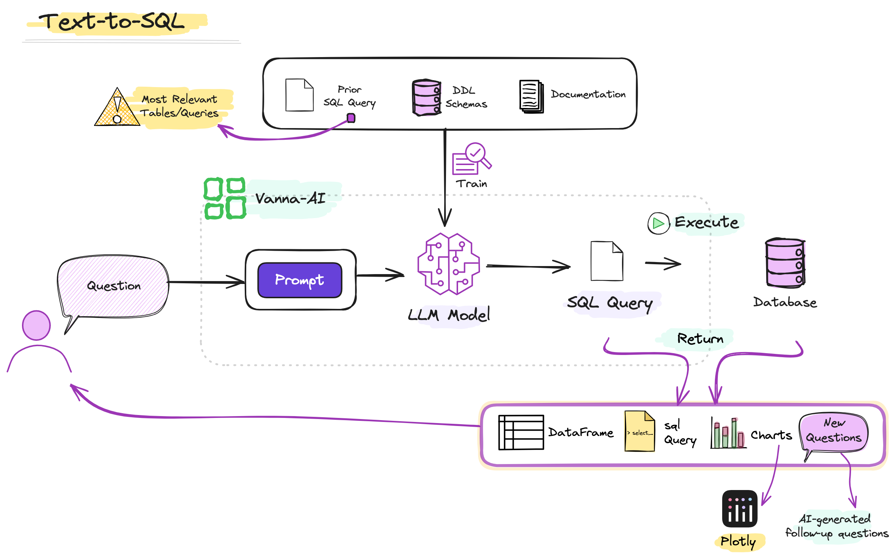
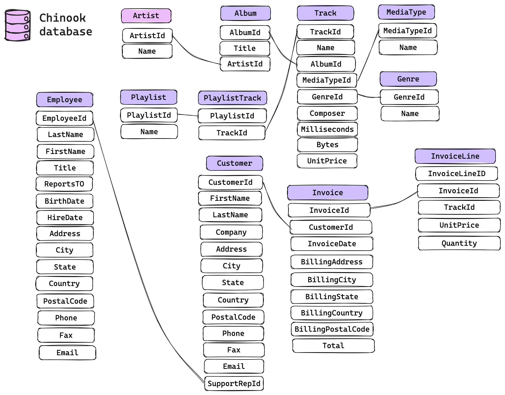
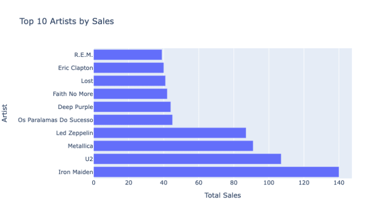
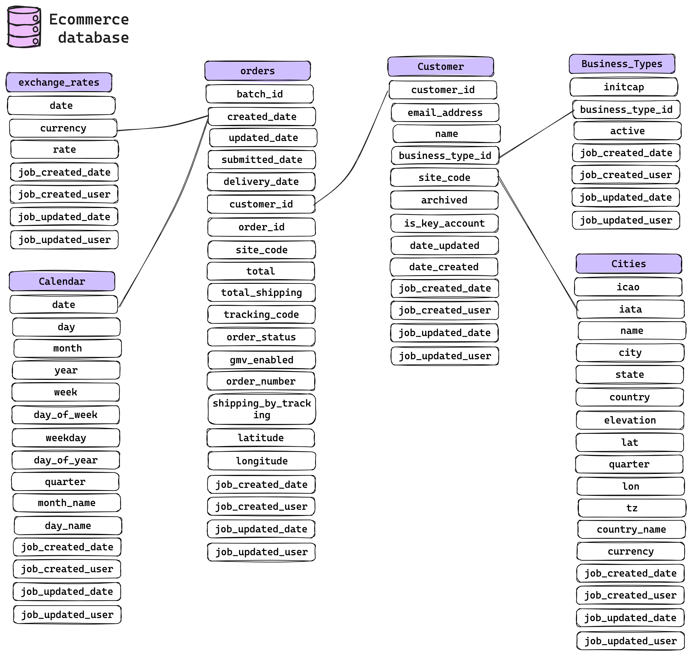
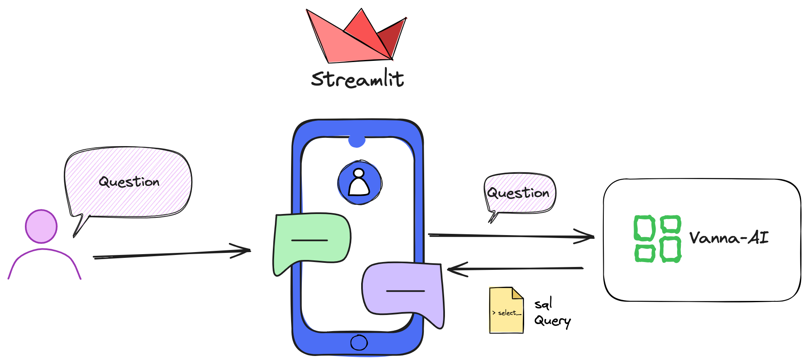
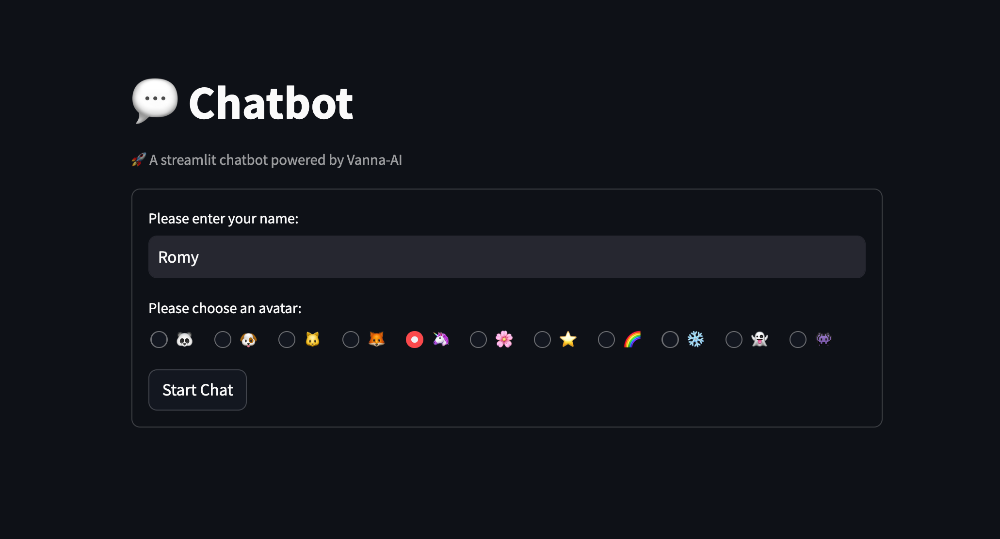
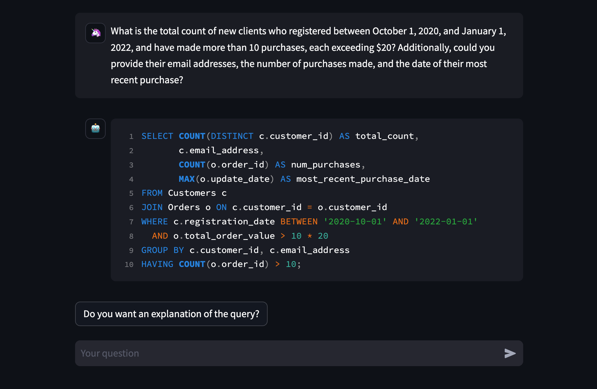
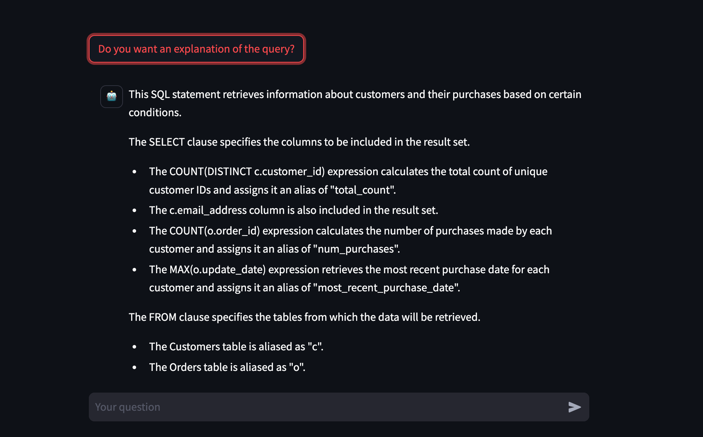

```{r setup, include=FALSE}
knitr::opts_chunk$set(echo = FALSE)
```

[{width="40%"}](https://www.buymeacoffee.com/r0mymendez)

In this article, we will explore the application of **Vanna.ai**, a 🐍 Python library specifically designed for training a model capable of processing natural language questions and **generating SQL queries as responses**.
This implementation will be integrated into a ✨Streamlit application, creating a 🤖chatbot that facilitates posing questions and provides explanations for the returned queries.

```{r  echo=FALSE}
library("vembedr")
embed_url("https://www.youtube.com/watch?v=V08FCQMr8NE")
```

# 🤖 Text-to-SQL & Vanna.ai

**`Text-to-SQL`** is a tool that utilizes models to translate natural language queries into SQL queries, aiming to make it easy for users to generate SQL queries and interact with databases seamlessly.

The implementation of **`Text-to-SQL`** can be achieved through the use of [Vanna.AI](https://vanna.ai/), an open-source 🐍Python library that allows the training of an RAG model with queries, DDL, and documentation from a database.



------------------------------------------------------------------------

## Vanna.AI: Output Possibilities

The following are the possible outputs that can be generated with Vanna methods, facilitating diverse ways of interacting with the database using natural language.

| Output                     | Description                                                                                                                                                                         |
|----------------------------|-------------------------------------------------------------------------------------------------------------------------------------------------------------------------------------|
| **📄 SQL**                  | Vanna.AI can generate SQL queries from natural language questions. These SQL queries can be used to interact with a database.                                                       |
| **📁 DataFrame**            | After generating an SQL query, Vanna.AI can execute it in the database and return the results as a pandas DataFrame.                                                                |
| **📊 Charts**               | Vanna.AI can generate plots using Plotly from the results of the SQL query.                                                                                                         |
| **❓ Follow-up questions**  | Vanna.AI can generate follow-up questions based on the generated SQL query. These follow-up questions can help users refine their queries or explore the data in more detail.       |
| **🔍 Explanations queries** | Vanna.AI can provide explanations for the generated SQL queries. These explanations can help users understand how their natural language question is interpreted into an SQL query. |

------------------------------------------------------------------------

## Vanna.AI: Features

The following table contains the key features available with Vanna.AI, enriching data interaction capabilities:

| Feature                                     | Description                                                                                                                                                                        |
|---------------------------------------------|------------------------------------------------------------------------------------------------------------------------------------------------------------------------------------|
| **🚀 Model Training**                        | Train the RAG model on data sources, including Data Definition Language (DDL) statements, documentation, and SQL queries during the training process.                              |
| **🤖 User Query Handling**                   | Users can pose questions in natural language, and Vanna.AI responds by generating SQL queries.                                                                                     |
| **📚 Documentation**                         | Extensive documentation, a dedicated website, and a support community on Discord are available to offer comprehensive assistance.                                                  |
| **🔌 Database Connections**                  | Vanna allows connecting to multiple databases, enabling users not only to retrieve SQL queries but also to execute them by establishing connections to their respective databases. |
| **🤔 AI-Generated Recommendation Questions** | This framework includes a feature of generating AI-driven questions, offering suggestions for additional queries that the user could explore.                                      |

------------------------------------------------------------------------

# 🛠️ Simple Implementation

For this initial implementation, we will leverage an example provided by **vanna.ai**, using the Chinook database.
This database includes tables and data relevant to a music store, encompassing information about artists, albums, tracks, customers, orders, and various aspects associated with the management of an online music store.



------------------------------------------------------------------------

## Install vanna-ai

`!pip install vanna`

------------------------------------------------------------------------

## Implementation Steps

Follow these steps to implement a straightforward example of text-to-SQL:

1.  **API Key Retrieval:** To initiate this example, acquire an API key by registering at <https://vanna.ai/>.
    Utilize your registered email to obtain the key.

2.  **Setting API Key and Model:** Configure the API key obtained and specify the model to be used, in this instance, the pre-existing "chinook" model

3.  **Connecting to the Database:** Establish a connection with the database, utilizing an SQLite file available at <https://vanna.ai/Chinook.sqlite>.

4.  **Asking a Question:** Finally, pose a natural language question to extract specific information from the database.
    In this step, the result includes the SQL query, the DataFrame from the query execution, and a representative chart.
    The system also generates follow-up questions based on the dataset.

``` {.python}
import vanna as vn

# STEP 01: This is a simple example of how to use the Vanna API
api_key = vn.get_api_key('your_email')

# Set the API key and the model
vn.set_api_key(api_key)

# STEP 02:  Set the model
vn.set_model('chinook')

# STEP 03:  Connect with the database
vn.connect_to_sqlite('https://vanna.ai/Chinook.sqlite')

# STEP 04:  Ask a question
vn.ask('What are the top 10 artists by sales?')
```

📃`sql query`

``` {.sql}
SELECT a.name,
       sum(il.quantity) as totalsales
FROM   artist a
    INNER JOIN album al
        ON a.artistid = al.artistid
    INNER JOIN track t
        ON al.albumid = t.albumid
    INNER JOIN invoiceline il
        ON t.trackid = il.trackid
GROUP BY a.name
ORDER BY totalsales desc limit 10;
```

📊`plotly chart`



❓`New Questions`

    AI-generated follow-up questions:

    * Who is the artist with the highest sales?
    * What are the total sales for each artist?
    * Which genre has the highest sales?
    * Can you provide a breakdown of sales by album?
    * Which artist has the lowest sales?
    * What is the average sales per artist?
    * Can you provide a list of the top-selling albums?
    * Which genre has the least sales?
    * Can you provide a breakdown of sales by country?
    * What is the total sales for each genre?

------------------------------------------------------------------------

# 🧪 Model Training

To train your own model follow the following steps: 1.
Log in to your account <https://vanna.ai/> and create a new model.
2.
Next we will define how to train the model.
In our next example we will use ddl (data definition language), documentation and queries.



``` {.python}
# Check the models available in the account
vn.get_models()
```

``` {.bash}
['ecommerce-test', 'demo-tpc-h', 'tpc', 'chinook', 'thelook']
```

``` {.python}
# Set the model
vn.set_model("ecommerce-test")
```

``` {.python}
# Get the ddl for training the model
# Train the model with the ddl
ddl = """
CREATE TABLE if not exists stage.customers(
    customer_id           INT NOT NULL PRIMARY KEY,
    email_address         VARCHAR(50) NOT NULL,
    name                  VARCHAR(50) NOT NULL,
    business_type_id      INT NOT NULL,
    site_code             VARCHAR(10) NOT NULL,
    archived              BOOLEAN NOT NULL,
    is_key_account        BOOLEAN NOT NULL,
    date_updated          TIMESTAMP NOT NULL,
    date_created          TIMESTAMP NOT NULL,
    job_created_date  TIMESTAMP WITH TIME ZONE DEFAULT 
        CURRENT_TIMESTAMP,
    job_created_user  varchar(50) default null,
    job_updated_date  TIMESTAMP default null,
    job_updated_user  varchar(50) default null,
    CONSTRAINT fk_business_type_id FOREIGN KEY(business_type_id) REFERENCES stage.business_types (business_type_id)
);
"""
vn.train(ddl=ddl)
```

> In [my repository](https://github.com/r0mymendez/text-to-sql/tree/main/src/db), you can find all the scripts, documentation, and queries to train the model and answer questions such as the following

``` {.python}
# Ask a question for generating the SQL
question  =  """What is the total count of new clients who registered between October 1, 2020, and 
January 1, 2022, and have made more than 10 purchases, each exceeding $20? Additionally,
 could you provide their email addresses, the number of purchases made, and the date of their
  most recent purchase?"""

print(vn.generate_sql(question=question))
```

``` {.bash}
SELECT COUNT(*) AS total_count,
       c.email_address,
       COUNT(o.order_id) AS num_purchases,
       MAX(o.order_date) AS most_recent_purchase_date
FROM Customers c
JOIN Orders o ON c.customer_id = o.customer_id
WHERE c.registration_date >= '2020-10-01' AND c.registration_date <= '2022-01-01'
  AND o.order_value > 20
GROUP BY c.email_address
HAVING COUNT(o.order_id) > 10;
```

------------------------------------------------------------------------

# 💬 Streamlit Chatbot



## Description

In this section, we will implement a 🤖chatbot application using text-to-SQL capabilities with ✨Streamlit.
This app will be developed through the integration of Vanna.AI and ✨Streamlit, providing a user-friendly interface for entering your username, selecting an avatar, and initiating a 💬chat.

------------------------------------------------------------------------

## Quick Start

1.  Clone the Repository 
2.  Add your ddl scripts, documentation and sql queries in `src\db\`
3.  Add your credentials in `src\.streamlit\secrets.toml`
4.  Execute the Application

> Detailed instructions on how to run the application and add credentials can be found in the repository's `README.md`.

------------------------------------------------------------------------

## 🤖 Chatbot Preview

The application, crafted with Vanna.AI and ✨Streamlit, and you can see below a video of how it works, remember that all the explanations are in the `readme.md` file of the [repository](https://github.com/r0mymendez/text-to-sql/tree/main).
Feel free to check it out and give it a star if you find it helpful!
⭐️

```{r  echo=FALSE}
library("vembedr")
embed_url("https://www.youtube.com/watch?v=V08FCQMr8NE")
```

 



------------------------------------------------------------------------

# 📚 References

If you want to learn...

-   [vanna-ai](https://github.com/vanna-ai/vanna)

-   [✨streamlit](https://www.streamlit.io/)

Other references:

-   Image preview reference: [[Imagen de vectorjuice en Freepik]](https://www.freepik.es/vector-gratis/programadores-chatbot-que-procesan-lenguaje-natural-procesamiento-lenguaje-natural-lenguaje-natural-chatbot-concepto-ciencia-lenguaje-natural_11667683.htm#query=chatbot%20illustration&position=6&from_view=search&track=ais&uuid=ad9cfc95-8994-4854-ab1c-b2e9573d86ee)

------------------------------------------------------------------------

> ***⚠️ Disclaimer**: Before proceeding with the use of your own data in the Vanna.AI application, it is recommended to review and validate the data protection policies established by Vanna.AI. Ensure a thorough understanding of how your personal data is handled and protected within the application framework. It is crucial to comply with privacy and security regulations before providing any sensitive information.*
