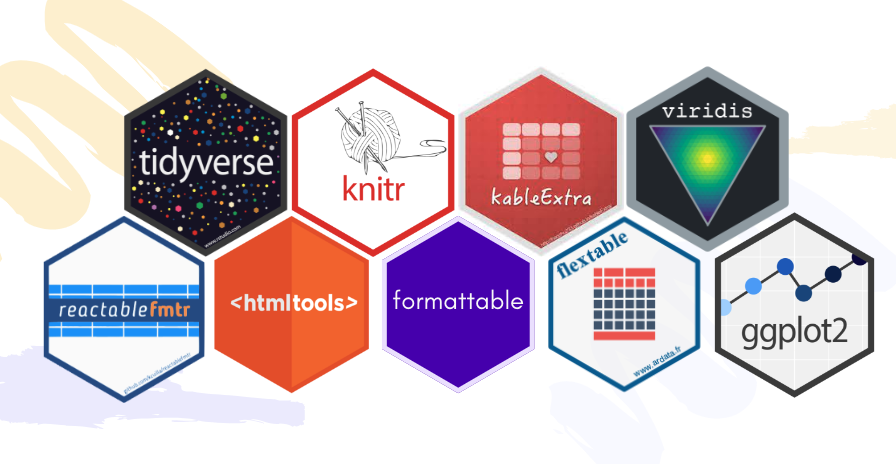
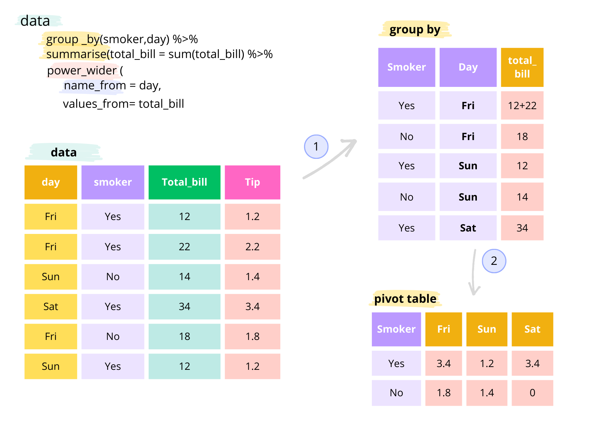
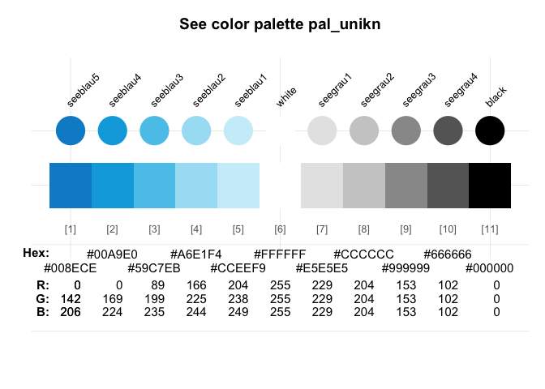
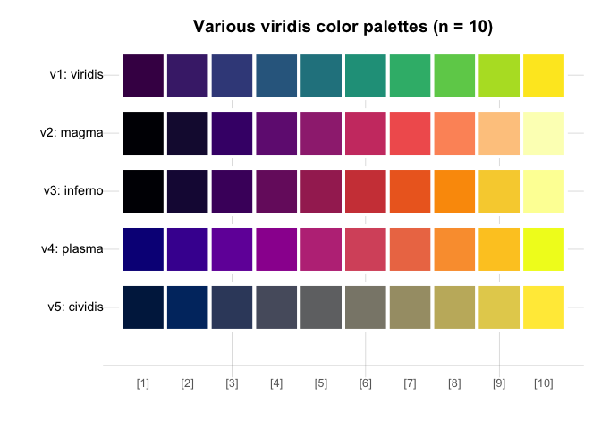
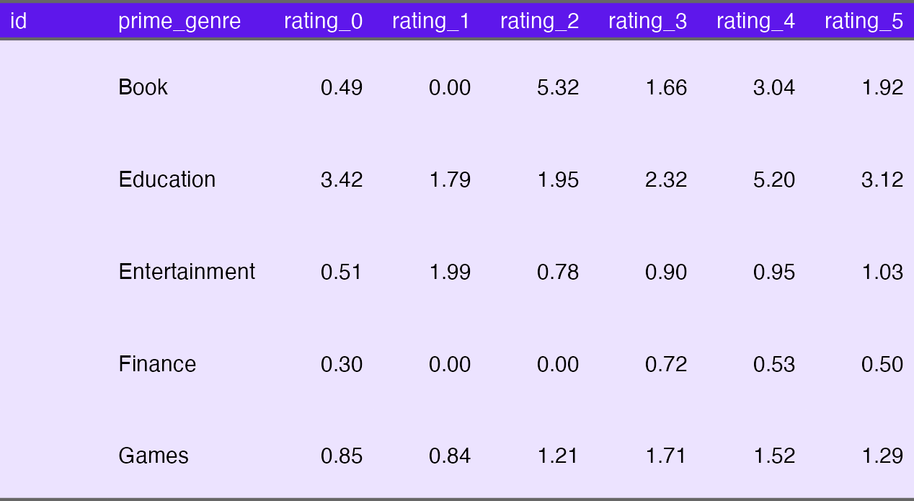

Transform your R Dataframes: Styles, 🎨 Colors, and 😎 Emojis
================
Romina Mendez
2024-01-21


A few weeks ago I wrote an article about
[`pandas dataframes`](https://dev.to/r0mymendez/transform-your-pandas-dataframes-styles-colors-and-emojis-2cnh)
and how to assign styles, but I received messages about how to do it in
R (my first love ❤️ in languages with data) and so I decided to rewrite
the article using R libraries.

So in the next section of this article, we will explore a method to add
🎨colors and 🖌️styles in R DataFrames. We will focus on the application
of colors and emojis, using approaches similar to the popular
conditional formatting commonly used in pivot tables within
spreadsheets. Through this strategy, we aim to improve the presentation
of our data, making the exploration and understanding of the information
not only informative but also visually attractive.

------------------------------------------------------------------------

# What libraries can I use to style my R dataframes?

The R libraries used to create this article are as follows:



1.  **🔍 tidyverse**: Among the best, it integrates various R libraries
    for data manipulation, graphics, and analysis, promoting clear and
    efficient code.

2.  **📝** **knitr**: Automates the generation of dynamic reports.

3.  **📝 kableExtra**: An additional extension that enhances table
    presentation in R Markdown documents with extra formatting options.

4.  📄 **reactablefrmtr**: Incorporates functions to craft interactive
    and flexible tables in R, featuring filtering, sorting, and search
    functionalities.

5.  **✏️** **htmltools**: Offers functions to build and manipulate HTML
    objects in R.

6.  📄 **formattable**: Equipped with functions for formatting and
    customizing tables in R.

7.  📄 **flextable**: Another library enabling the creation of flexible
    and customizable tables in R, with advanced formatting options for
    documents and presentations.

8.  **📊 ggplot2**: Among the most popular R visualization libraries, it
    produces appealing and comprehensible graphs.

9.  🎨 **viridis:** A R library for creating visually appealing color
    maps

These libraries empowered me to employ functions for generating
HTML-style representations of DataFrames. This capability enables
customization of DataFrame visual appearance during viewing.

The functions employed in this article facilitate the highlighting,
coloring, and formatting of cells based on specific conditions. This
makes it effortless to visually identify patterns and trends within
datasets.


Next we have the code with we are going to create a pivot table using a
set of data and from this you will begin to give it different styles and
conditional formats such as can be seen in the previous image.

------------------------------------------------------------------------

## 🟣 Pivot Tables

> The **pivot table** is a tabular data structure that provides a
> summarized overview of information from another table, organizing the
> data based on one variable and displaying values associated with
> another variable. In this specific scenario, the pivot table organizes
> the data according to the ‘smoker’ column and presents the total sum
> of tips, categorized by the days on which clients consume in the
> restaurant

------------------------------------------------------------------------



### Example

The following example shows the `pivot_table` method with the ‘tips’
DataFrame

``` r
library(reshape2)
library(tidyverse)
```

    ## ── Attaching packages ─────────────────────────────────────── tidyverse 1.3.1 ──

    ## ✔ ggplot2 3.4.2     ✔ purrr   1.0.1
    ## ✔ tibble  3.2.1     ✔ dplyr   1.1.1
    ## ✔ tidyr   1.3.0     ✔ stringr 1.5.0
    ## ✔ readr   2.1.4     ✔ forcats 0.5.1

    ## Warning: package 'ggplot2' was built under R version 4.1.2

    ## Warning: package 'tibble' was built under R version 4.1.2

    ## Warning: package 'tidyr' was built under R version 4.1.2

    ## Warning: package 'readr' was built under R version 4.1.2

    ## Warning: package 'purrr' was built under R version 4.1.2

    ## Warning: package 'dplyr' was built under R version 4.1.2

    ## Warning: package 'stringr' was built under R version 4.1.2

    ## ── Conflicts ────────────────────────────────────────── tidyverse_conflicts() ──
    ## ✖ dplyr::filter() masks stats::filter()
    ## ✖ dplyr::lag()    masks stats::lag()

``` r
data = tips
data_pivot <- data %>%
  group_by(smoker, day) %>%
  summarise(total_bill = sum(total_bill), .groups = 'drop') %>%
  pivot_wider(names_from = day, values_from = total_bill)

data_pivot
```

    ## # A tibble: 2 × 5
    ##   smoker   Fri   Sat   Sun  Thur
    ##   <fct>  <dbl> <dbl> <dbl> <dbl>
    ## 1 No      73.7  885. 1169.  770.
    ## 2 Yes    252.   894.  458.  326.

# 🟣 Dataframe: Apple Store apps

In this analysis, we will use the **‘🍎 Apple Store apps’** DataFrame to
explore the creation of pivot tables and customization of table styles.
This dataset provides detailed insights into Apple App Store
applications, covering aspects from app names to specifics like size,
price, and ratings. Our objective is to efficiently break down the
information while applying styles that enhance the presentation and
comprehension of data effectively.

The dataset was downloaded from
[Kaggle](https://www.kaggle.com/ramamet4/app-store-apple-data-set-10k-apps)
and it contains more than 7000 Apple iOS mobile application details. It
is important to note that the data was collected in July 2017.

### Data Schema overview

| column\_name       | column description                                                              |
|--------------------|---------------------------------------------------------------------------------|
| track\_name        | the column contains the name of the app.                                        |
| size\_bytes        | the column contains the size of the app in bytes.                               |
| currency           | the column contains the currency type.                                          |
| price              | the column contains the price of the app.                                       |
| rating\_count\_tot | the column contains the total number of ratings.                                |
| rating\_count\_ver | the column contains the number of ratings for the current version of the app.   |
| user\_rating       | the column contains the average user rating for the app.                        |
| user\_rating\_ver  | the column contains the average user rating for the current version of the app. |
| ver                | the column contains the current version of the app.                             |
| cont\_rating       | the column contains the content rating.                                         |
| prime\_genre       | the column contains the primary genre.                                          |
| sup\_devices.num   | the column contains the number of supported devices.                            |
| ipadSc\_urls.num   | the column contains the number of screenshots showed for display.               |
| lang.num           | the column contains the number of supported languages.                          |
| vpp\_lic           | the column contains the Vpp Device Based Licensing Enabled.                     |

------------------------------------------------------------------------

## 🟣 Create Dataframe

In the following code chunk, we will create a DataFrame by reading the
CSV file.

``` r
print(paste0("tidyverse version: ",packageVersion("tidyverse")[1]))
```

    ## [1] "tidyverse version: 1.3.1"

``` r
# Create a dataframe from a csv file
# You can download the file from the following link https://github.com/r0mymendez/pandas-styles
path = 'https://raw.githubusercontent.com/r0mymendez/pandas-styles/main/data/AppleStore.csv'
data = read_delim(path , delim = ";")
```

    ## Rows: 7197 Columns: 16
    ## ── Column specification ────────────────────────────────────────────────────────
    ## Delimiter: ";"
    ## chr  (5): track_name, currency, ver, cont_rating, prime_genre
    ## dbl (11): id, size_bytes, price, rating_count_tot, rating_count_ver, user_ra...
    ## 
    ## ℹ Use `spec()` to retrieve the full column specification for this data.
    ## ℹ Specify the column types or set `show_col_types = FALSE` to quiet this message.

## 🟣 Pivot Table

In the next step, our goal is to generate a dynamic table from a
**Dataframe**, in which the top 15 genres with the largest number of
applications are filtered.

``` r
# Pivot table

# filter the data to keep only the top 15 genres
top_genre = data %>%
  group_by(prime_genre) %>%
  summarise(count = n(), .groups = 'drop') %>%
  arrange(desc(count)) %>%
  head(n = 15) %>%
  pull(prime_genre)


tmp = data %>%
  filter(prime_genre %in% top_genre) %>%
  select(prime_genre, user_rating, price)


# create a new column with the rating rounded to the nearest integer
tmp$user_rating = paste0("rating_", as.character(trunc(tmp$user_rating)))


# create a pivot table
tmp_pivot <- tmp %>%
  group_by(prime_genre, user_rating) %>%
  summarise(price = mean(price, na.rm = TRUE), .groups = 'drop') %>%
  pivot_wider(names_from = user_rating, values_from = price, values_fill = 0) %>%
  mutate(across(where(is.numeric), ~round(., 2)))


# print the pivot table
tmp_pivot
```

    ## # A tibble: 15 × 7
    ##    prime_genre       rating_0 rating_1 rating_2 rating_3 rating_4 rating_5
    ##    <chr>                <dbl>    <dbl>    <dbl>    <dbl>    <dbl>    <dbl>
    ##  1 Book                  0.49     0        5.32     1.66     3.04     1.92
    ##  2 Education             3.42     1.79     1.95     2.32     5.2      3.12
    ##  3 Entertainment         0.51     1.99     0.78     0.9      0.95     1.03
    ##  4 Finance               0.3      0        0        0.72     0.53     0.5 
    ##  5 Games                 0.85     0.84     1.21     1.71     1.52     1.29
    ##  6 Health & Fitness      1.33     3.24     1.5      1.21     2.15     1.83
    ##  7 Lifestyle             0.29     1.27     0.81     0.9      1.08     1.37
    ##  8 Music                 2.74     0        0        2.08     5.27    13.2 
    ##  9 Photo & Video         0.75     0.74     1.36     2.16     1.47     1.33
    ## 10 Productivity          0.66     2.49     0.99     4.9      4.73     2.61
    ## 11 Shopping              0        0        0        0        0.03     0   
    ## 12 Social Networking     0.12     0.4      0.66     0.33     0.41     0.2 
    ## 13 Sports                0.92     2        0.68     0.61     1.25     1.66
    ## 14 Travel                1.1      0        1.28     0.28     1.53     0.2 
    ## 15 Utilities             2.03     2.49     1.25     1.67     1.65     0.66

------------------------------------------------------------------------

## 🟣 Styles with R libraries

Now we will explore the functions of the aforementioned libraries that
will allow us to improve the visual presentation of DataFrames. This
functionality provides us with different options to modify the
appearance of the data, allowing us to customize aspects such as:

-   **Highlighting:** Emphasize specific rows, columns, or values.
-   **Formatting:** Adjust the format of the displayed values, including
    precision and alignment.
-   **Bar Charts:** Represent data with horizontal or vertical bar
    charts within cells.

------------------------------------------------------------------------

### 🎨 Styling: Setting Background Color for Headers

In this section, we will apply styles to both the titles and the table.
Therefore we use background colors to highlight the headers and the rest
of the table.

``` r
library(knitr)
```

    ## Warning: package 'knitr' was built under R version 4.1.2

``` r
library(kableExtra)
```

    ## Warning: package 'kableExtra' was built under R version 4.1.2

    ## 
    ## Attaching package: 'kableExtra'

    ## The following object is masked from 'package:dplyr':
    ## 
    ##     group_rows

``` r
kable(tmp_pivot, "html") %>%
  kable_styling("striped", full_width = F) %>%
  row_spec(0, background = "#5E17EB", color = "white")
```

<table class="table table-striped" style="width: auto !important; margin-left: auto; margin-right: auto;">
<thead>
<tr>
<th style="text-align:left;color: white !important;background-color: #5E17EB !important;">
prime\_genre
</th>
<th style="text-align:right;color: white !important;background-color: #5E17EB !important;">
rating\_0
</th>
<th style="text-align:right;color: white !important;background-color: #5E17EB !important;">
rating\_1
</th>
<th style="text-align:right;color: white !important;background-color: #5E17EB !important;">
rating\_2
</th>
<th style="text-align:right;color: white !important;background-color: #5E17EB !important;">
rating\_3
</th>
<th style="text-align:right;color: white !important;background-color: #5E17EB !important;">
rating\_4
</th>
<th style="text-align:right;color: white !important;background-color: #5E17EB !important;">
rating\_5
</th>
</tr>
</thead>
<tbody>
<tr>
<td style="text-align:left;">
Book
</td>
<td style="text-align:right;">
0.49
</td>
<td style="text-align:right;">
0.00
</td>
<td style="text-align:right;">
5.32
</td>
<td style="text-align:right;">
1.66
</td>
<td style="text-align:right;">
3.04
</td>
<td style="text-align:right;">
1.92
</td>
</tr>
<tr>
<td style="text-align:left;">
Education
</td>
<td style="text-align:right;">
3.42
</td>
<td style="text-align:right;">
1.79
</td>
<td style="text-align:right;">
1.95
</td>
<td style="text-align:right;">
2.32
</td>
<td style="text-align:right;">
5.20
</td>
<td style="text-align:right;">
3.12
</td>
</tr>
<tr>
<td style="text-align:left;">
Entertainment
</td>
<td style="text-align:right;">
0.51
</td>
<td style="text-align:right;">
1.99
</td>
<td style="text-align:right;">
0.78
</td>
<td style="text-align:right;">
0.90
</td>
<td style="text-align:right;">
0.95
</td>
<td style="text-align:right;">
1.03
</td>
</tr>
<tr>
<td style="text-align:left;">
Finance
</td>
<td style="text-align:right;">
0.30
</td>
<td style="text-align:right;">
0.00
</td>
<td style="text-align:right;">
0.00
</td>
<td style="text-align:right;">
0.72
</td>
<td style="text-align:right;">
0.53
</td>
<td style="text-align:right;">
0.50
</td>
</tr>
<tr>
<td style="text-align:left;">
Games
</td>
<td style="text-align:right;">
0.85
</td>
<td style="text-align:right;">
0.84
</td>
<td style="text-align:right;">
1.21
</td>
<td style="text-align:right;">
1.71
</td>
<td style="text-align:right;">
1.52
</td>
<td style="text-align:right;">
1.29
</td>
</tr>
<tr>
<td style="text-align:left;">
Health & Fitness
</td>
<td style="text-align:right;">
1.33
</td>
<td style="text-align:right;">
3.24
</td>
<td style="text-align:right;">
1.50
</td>
<td style="text-align:right;">
1.21
</td>
<td style="text-align:right;">
2.15
</td>
<td style="text-align:right;">
1.83
</td>
</tr>
<tr>
<td style="text-align:left;">
Lifestyle
</td>
<td style="text-align:right;">
0.29
</td>
<td style="text-align:right;">
1.27
</td>
<td style="text-align:right;">
0.81
</td>
<td style="text-align:right;">
0.90
</td>
<td style="text-align:right;">
1.08
</td>
<td style="text-align:right;">
1.37
</td>
</tr>
<tr>
<td style="text-align:left;">
Music
</td>
<td style="text-align:right;">
2.74
</td>
<td style="text-align:right;">
0.00
</td>
<td style="text-align:right;">
0.00
</td>
<td style="text-align:right;">
2.08
</td>
<td style="text-align:right;">
5.27
</td>
<td style="text-align:right;">
13.16
</td>
</tr>
<tr>
<td style="text-align:left;">
Photo & Video
</td>
<td style="text-align:right;">
0.75
</td>
<td style="text-align:right;">
0.74
</td>
<td style="text-align:right;">
1.36
</td>
<td style="text-align:right;">
2.16
</td>
<td style="text-align:right;">
1.47
</td>
<td style="text-align:right;">
1.33
</td>
</tr>
<tr>
<td style="text-align:left;">
Productivity
</td>
<td style="text-align:right;">
0.66
</td>
<td style="text-align:right;">
2.49
</td>
<td style="text-align:right;">
0.99
</td>
<td style="text-align:right;">
4.90
</td>
<td style="text-align:right;">
4.73
</td>
<td style="text-align:right;">
2.61
</td>
</tr>
<tr>
<td style="text-align:left;">
Shopping
</td>
<td style="text-align:right;">
0.00
</td>
<td style="text-align:right;">
0.00
</td>
<td style="text-align:right;">
0.00
</td>
<td style="text-align:right;">
0.00
</td>
<td style="text-align:right;">
0.03
</td>
<td style="text-align:right;">
0.00
</td>
</tr>
<tr>
<td style="text-align:left;">
Social Networking
</td>
<td style="text-align:right;">
0.12
</td>
<td style="text-align:right;">
0.40
</td>
<td style="text-align:right;">
0.66
</td>
<td style="text-align:right;">
0.33
</td>
<td style="text-align:right;">
0.41
</td>
<td style="text-align:right;">
0.20
</td>
</tr>
<tr>
<td style="text-align:left;">
Sports
</td>
<td style="text-align:right;">
0.92
</td>
<td style="text-align:right;">
2.00
</td>
<td style="text-align:right;">
0.68
</td>
<td style="text-align:right;">
0.61
</td>
<td style="text-align:right;">
1.25
</td>
<td style="text-align:right;">
1.66
</td>
</tr>
<tr>
<td style="text-align:left;">
Travel
</td>
<td style="text-align:right;">
1.10
</td>
<td style="text-align:right;">
0.00
</td>
<td style="text-align:right;">
1.28
</td>
<td style="text-align:right;">
0.28
</td>
<td style="text-align:right;">
1.53
</td>
<td style="text-align:right;">
0.20
</td>
</tr>
<tr>
<td style="text-align:left;">
Utilities
</td>
<td style="text-align:right;">
2.03
</td>
<td style="text-align:right;">
2.49
</td>
<td style="text-align:right;">
1.25
</td>
<td style="text-align:right;">
1.67
</td>
<td style="text-align:right;">
1.65
</td>
<td style="text-align:right;">
0.66
</td>
</tr>
</tbody>
</table>

### 🎨 Style: Setting the background color for all the rows

In following code snippet illustrates how to set a custom background
color for all the rows in our DataFrame.

``` r
kable(tmp_pivot, "html") %>%
  kable_styling("striped", full_width = F)  %>%
  row_spec(0, background = "#5E17EB", color = "white") %>%
  column_spec(1, column=1:ncol(tmp_pivot) ,background = "#ECE3FF", color = "black")
```

<table class="table table-striped" style="width: auto !important; margin-left: auto; margin-right: auto;">
<thead>
<tr>
<th style="text-align:left;color: white !important;background-color: #5E17EB !important;">
prime\_genre
</th>
<th style="text-align:right;color: white !important;background-color: #5E17EB !important;">
rating\_0
</th>
<th style="text-align:right;color: white !important;background-color: #5E17EB !important;">
rating\_1
</th>
<th style="text-align:right;color: white !important;background-color: #5E17EB !important;">
rating\_2
</th>
<th style="text-align:right;color: white !important;background-color: #5E17EB !important;">
rating\_3
</th>
<th style="text-align:right;color: white !important;background-color: #5E17EB !important;">
rating\_4
</th>
<th style="text-align:right;color: white !important;background-color: #5E17EB !important;">
rating\_5
</th>
</tr>
</thead>
<tbody>
<tr>
<td style="text-align:left;width: 1; color: black !important;background-color: #ECE3FF !important;">
Book
</td>
<td style="text-align:right;width: 1; color: black !important;background-color: #ECE3FF !important;">
0.49
</td>
<td style="text-align:right;width: 1; color: black !important;background-color: #ECE3FF !important;">
0.00
</td>
<td style="text-align:right;width: 1; color: black !important;background-color: #ECE3FF !important;">
5.32
</td>
<td style="text-align:right;width: 1; color: black !important;background-color: #ECE3FF !important;">
1.66
</td>
<td style="text-align:right;width: 1; color: black !important;background-color: #ECE3FF !important;">
3.04
</td>
<td style="text-align:right;width: 1; color: black !important;background-color: #ECE3FF !important;">
1.92
</td>
</tr>
<tr>
<td style="text-align:left;width: 1; color: black !important;background-color: #ECE3FF !important;">
Education
</td>
<td style="text-align:right;width: 1; color: black !important;background-color: #ECE3FF !important;">
3.42
</td>
<td style="text-align:right;width: 1; color: black !important;background-color: #ECE3FF !important;">
1.79
</td>
<td style="text-align:right;width: 1; color: black !important;background-color: #ECE3FF !important;">
1.95
</td>
<td style="text-align:right;width: 1; color: black !important;background-color: #ECE3FF !important;">
2.32
</td>
<td style="text-align:right;width: 1; color: black !important;background-color: #ECE3FF !important;">
5.20
</td>
<td style="text-align:right;width: 1; color: black !important;background-color: #ECE3FF !important;">
3.12
</td>
</tr>
<tr>
<td style="text-align:left;width: 1; color: black !important;background-color: #ECE3FF !important;">
Entertainment
</td>
<td style="text-align:right;width: 1; color: black !important;background-color: #ECE3FF !important;">
0.51
</td>
<td style="text-align:right;width: 1; color: black !important;background-color: #ECE3FF !important;">
1.99
</td>
<td style="text-align:right;width: 1; color: black !important;background-color: #ECE3FF !important;">
0.78
</td>
<td style="text-align:right;width: 1; color: black !important;background-color: #ECE3FF !important;">
0.90
</td>
<td style="text-align:right;width: 1; color: black !important;background-color: #ECE3FF !important;">
0.95
</td>
<td style="text-align:right;width: 1; color: black !important;background-color: #ECE3FF !important;">
1.03
</td>
</tr>
<tr>
<td style="text-align:left;width: 1; color: black !important;background-color: #ECE3FF !important;">
Finance
</td>
<td style="text-align:right;width: 1; color: black !important;background-color: #ECE3FF !important;">
0.30
</td>
<td style="text-align:right;width: 1; color: black !important;background-color: #ECE3FF !important;">
0.00
</td>
<td style="text-align:right;width: 1; color: black !important;background-color: #ECE3FF !important;">
0.00
</td>
<td style="text-align:right;width: 1; color: black !important;background-color: #ECE3FF !important;">
0.72
</td>
<td style="text-align:right;width: 1; color: black !important;background-color: #ECE3FF !important;">
0.53
</td>
<td style="text-align:right;width: 1; color: black !important;background-color: #ECE3FF !important;">
0.50
</td>
</tr>
<tr>
<td style="text-align:left;width: 1; color: black !important;background-color: #ECE3FF !important;">
Games
</td>
<td style="text-align:right;width: 1; color: black !important;background-color: #ECE3FF !important;">
0.85
</td>
<td style="text-align:right;width: 1; color: black !important;background-color: #ECE3FF !important;">
0.84
</td>
<td style="text-align:right;width: 1; color: black !important;background-color: #ECE3FF !important;">
1.21
</td>
<td style="text-align:right;width: 1; color: black !important;background-color: #ECE3FF !important;">
1.71
</td>
<td style="text-align:right;width: 1; color: black !important;background-color: #ECE3FF !important;">
1.52
</td>
<td style="text-align:right;width: 1; color: black !important;background-color: #ECE3FF !important;">
1.29
</td>
</tr>
<tr>
<td style="text-align:left;width: 1; color: black !important;background-color: #ECE3FF !important;">
Health & Fitness
</td>
<td style="text-align:right;width: 1; color: black !important;background-color: #ECE3FF !important;">
1.33
</td>
<td style="text-align:right;width: 1; color: black !important;background-color: #ECE3FF !important;">
3.24
</td>
<td style="text-align:right;width: 1; color: black !important;background-color: #ECE3FF !important;">
1.50
</td>
<td style="text-align:right;width: 1; color: black !important;background-color: #ECE3FF !important;">
1.21
</td>
<td style="text-align:right;width: 1; color: black !important;background-color: #ECE3FF !important;">
2.15
</td>
<td style="text-align:right;width: 1; color: black !important;background-color: #ECE3FF !important;">
1.83
</td>
</tr>
<tr>
<td style="text-align:left;width: 1; color: black !important;background-color: #ECE3FF !important;">
Lifestyle
</td>
<td style="text-align:right;width: 1; color: black !important;background-color: #ECE3FF !important;">
0.29
</td>
<td style="text-align:right;width: 1; color: black !important;background-color: #ECE3FF !important;">
1.27
</td>
<td style="text-align:right;width: 1; color: black !important;background-color: #ECE3FF !important;">
0.81
</td>
<td style="text-align:right;width: 1; color: black !important;background-color: #ECE3FF !important;">
0.90
</td>
<td style="text-align:right;width: 1; color: black !important;background-color: #ECE3FF !important;">
1.08
</td>
<td style="text-align:right;width: 1; color: black !important;background-color: #ECE3FF !important;">
1.37
</td>
</tr>
<tr>
<td style="text-align:left;width: 1; color: black !important;background-color: #ECE3FF !important;">
Music
</td>
<td style="text-align:right;width: 1; color: black !important;background-color: #ECE3FF !important;">
2.74
</td>
<td style="text-align:right;width: 1; color: black !important;background-color: #ECE3FF !important;">
0.00
</td>
<td style="text-align:right;width: 1; color: black !important;background-color: #ECE3FF !important;">
0.00
</td>
<td style="text-align:right;width: 1; color: black !important;background-color: #ECE3FF !important;">
2.08
</td>
<td style="text-align:right;width: 1; color: black !important;background-color: #ECE3FF !important;">
5.27
</td>
<td style="text-align:right;width: 1; color: black !important;background-color: #ECE3FF !important;">
13.16
</td>
</tr>
<tr>
<td style="text-align:left;width: 1; color: black !important;background-color: #ECE3FF !important;">
Photo & Video
</td>
<td style="text-align:right;width: 1; color: black !important;background-color: #ECE3FF !important;">
0.75
</td>
<td style="text-align:right;width: 1; color: black !important;background-color: #ECE3FF !important;">
0.74
</td>
<td style="text-align:right;width: 1; color: black !important;background-color: #ECE3FF !important;">
1.36
</td>
<td style="text-align:right;width: 1; color: black !important;background-color: #ECE3FF !important;">
2.16
</td>
<td style="text-align:right;width: 1; color: black !important;background-color: #ECE3FF !important;">
1.47
</td>
<td style="text-align:right;width: 1; color: black !important;background-color: #ECE3FF !important;">
1.33
</td>
</tr>
<tr>
<td style="text-align:left;width: 1; color: black !important;background-color: #ECE3FF !important;">
Productivity
</td>
<td style="text-align:right;width: 1; color: black !important;background-color: #ECE3FF !important;">
0.66
</td>
<td style="text-align:right;width: 1; color: black !important;background-color: #ECE3FF !important;">
2.49
</td>
<td style="text-align:right;width: 1; color: black !important;background-color: #ECE3FF !important;">
0.99
</td>
<td style="text-align:right;width: 1; color: black !important;background-color: #ECE3FF !important;">
4.90
</td>
<td style="text-align:right;width: 1; color: black !important;background-color: #ECE3FF !important;">
4.73
</td>
<td style="text-align:right;width: 1; color: black !important;background-color: #ECE3FF !important;">
2.61
</td>
</tr>
<tr>
<td style="text-align:left;width: 1; color: black !important;background-color: #ECE3FF !important;">
Shopping
</td>
<td style="text-align:right;width: 1; color: black !important;background-color: #ECE3FF !important;">
0.00
</td>
<td style="text-align:right;width: 1; color: black !important;background-color: #ECE3FF !important;">
0.00
</td>
<td style="text-align:right;width: 1; color: black !important;background-color: #ECE3FF !important;">
0.00
</td>
<td style="text-align:right;width: 1; color: black !important;background-color: #ECE3FF !important;">
0.00
</td>
<td style="text-align:right;width: 1; color: black !important;background-color: #ECE3FF !important;">
0.03
</td>
<td style="text-align:right;width: 1; color: black !important;background-color: #ECE3FF !important;">
0.00
</td>
</tr>
<tr>
<td style="text-align:left;width: 1; color: black !important;background-color: #ECE3FF !important;">
Social Networking
</td>
<td style="text-align:right;width: 1; color: black !important;background-color: #ECE3FF !important;">
0.12
</td>
<td style="text-align:right;width: 1; color: black !important;background-color: #ECE3FF !important;">
0.40
</td>
<td style="text-align:right;width: 1; color: black !important;background-color: #ECE3FF !important;">
0.66
</td>
<td style="text-align:right;width: 1; color: black !important;background-color: #ECE3FF !important;">
0.33
</td>
<td style="text-align:right;width: 1; color: black !important;background-color: #ECE3FF !important;">
0.41
</td>
<td style="text-align:right;width: 1; color: black !important;background-color: #ECE3FF !important;">
0.20
</td>
</tr>
<tr>
<td style="text-align:left;width: 1; color: black !important;background-color: #ECE3FF !important;">
Sports
</td>
<td style="text-align:right;width: 1; color: black !important;background-color: #ECE3FF !important;">
0.92
</td>
<td style="text-align:right;width: 1; color: black !important;background-color: #ECE3FF !important;">
2.00
</td>
<td style="text-align:right;width: 1; color: black !important;background-color: #ECE3FF !important;">
0.68
</td>
<td style="text-align:right;width: 1; color: black !important;background-color: #ECE3FF !important;">
0.61
</td>
<td style="text-align:right;width: 1; color: black !important;background-color: #ECE3FF !important;">
1.25
</td>
<td style="text-align:right;width: 1; color: black !important;background-color: #ECE3FF !important;">
1.66
</td>
</tr>
<tr>
<td style="text-align:left;width: 1; color: black !important;background-color: #ECE3FF !important;">
Travel
</td>
<td style="text-align:right;width: 1; color: black !important;background-color: #ECE3FF !important;">
1.10
</td>
<td style="text-align:right;width: 1; color: black !important;background-color: #ECE3FF !important;">
0.00
</td>
<td style="text-align:right;width: 1; color: black !important;background-color: #ECE3FF !important;">
1.28
</td>
<td style="text-align:right;width: 1; color: black !important;background-color: #ECE3FF !important;">
0.28
</td>
<td style="text-align:right;width: 1; color: black !important;background-color: #ECE3FF !important;">
1.53
</td>
<td style="text-align:right;width: 1; color: black !important;background-color: #ECE3FF !important;">
0.20
</td>
</tr>
<tr>
<td style="text-align:left;width: 1; color: black !important;background-color: #ECE3FF !important;">
Utilities
</td>
<td style="text-align:right;width: 1; color: black !important;background-color: #ECE3FF !important;">
2.03
</td>
<td style="text-align:right;width: 1; color: black !important;background-color: #ECE3FF !important;">
2.49
</td>
<td style="text-align:right;width: 1; color: black !important;background-color: #ECE3FF !important;">
1.25
</td>
<td style="text-align:right;width: 1; color: black !important;background-color: #ECE3FF !important;">
1.67
</td>
<td style="text-align:right;width: 1; color: black !important;background-color: #ECE3FF !important;">
1.65
</td>
<td style="text-align:right;width: 1; color: black !important;background-color: #ECE3FF !important;">
0.66
</td>
</tr>
</tbody>
</table>

------------------------------------------------------------------------

### 🎨 Style: Setting the background color for a particular cell

In following code snippet illustrates how to set a custom background
color for a particular cell in our DataFrame using pandas styling.

``` r
value = 4

tmp_pivot %>%
  mutate(
    rating_4 = cell_spec(rating_4, "html", 
                    background = if_else(tmp_pivot$rating_4>value, "#FD636B", "#ECE3FF"),
                    color = if_else(tmp_pivot$rating_4>value, "white", "black")
    )
  ) %>%
  kable(format = "html", escape = F) %>%
  kable_styling("striped", full_width = FALSE) %>%
  row_spec(0, background = "#5E17EB", color = "white") %>%
  column_spec(1:ncol(tmp_pivot), background = "#ECE3FF", color = "black")
```

<table class="table table-striped" style="width: auto !important; margin-left: auto; margin-right: auto;">
<thead>
<tr>
<th style="text-align:left;color: white !important;background-color: #5E17EB !important;">
prime\_genre
</th>
<th style="text-align:right;color: white !important;background-color: #5E17EB !important;">
rating\_0
</th>
<th style="text-align:right;color: white !important;background-color: #5E17EB !important;">
rating\_1
</th>
<th style="text-align:right;color: white !important;background-color: #5E17EB !important;">
rating\_2
</th>
<th style="text-align:right;color: white !important;background-color: #5E17EB !important;">
rating\_3
</th>
<th style="text-align:left;color: white !important;background-color: #5E17EB !important;">
rating\_4
</th>
<th style="text-align:right;color: white !important;background-color: #5E17EB !important;">
rating\_5
</th>
</tr>
</thead>
<tbody>
<tr>
<td style="text-align:left;color: black !important;background-color: #ECE3FF !important;">
Book
</td>
<td style="text-align:right;color: black !important;background-color: #ECE3FF !important;">
0.49
</td>
<td style="text-align:right;color: black !important;background-color: #ECE3FF !important;">
0.00
</td>
<td style="text-align:right;color: black !important;background-color: #ECE3FF !important;">
5.32
</td>
<td style="text-align:right;color: black !important;background-color: #ECE3FF !important;">
1.66
</td>
<td style="text-align:left;color: black !important;background-color: #ECE3FF !important;">
<span
style="     color: black !important;border-radius: 4px; padding-right: 4px; padding-left: 4px; background-color: #ECE3FF !important;">3.04</span>
</td>
<td style="text-align:right;color: black !important;background-color: #ECE3FF !important;">
1.92
</td>
</tr>
<tr>
<td style="text-align:left;color: black !important;background-color: #ECE3FF !important;">
Education
</td>
<td style="text-align:right;color: black !important;background-color: #ECE3FF !important;">
3.42
</td>
<td style="text-align:right;color: black !important;background-color: #ECE3FF !important;">
1.79
</td>
<td style="text-align:right;color: black !important;background-color: #ECE3FF !important;">
1.95
</td>
<td style="text-align:right;color: black !important;background-color: #ECE3FF !important;">
2.32
</td>
<td style="text-align:left;color: black !important;background-color: #ECE3FF !important;">
<span
style="     color: white !important;border-radius: 4px; padding-right: 4px; padding-left: 4px; background-color: #FD636B !important;">5.2</span>
</td>
<td style="text-align:right;color: black !important;background-color: #ECE3FF !important;">
3.12
</td>
</tr>
<tr>
<td style="text-align:left;color: black !important;background-color: #ECE3FF !important;">
Entertainment
</td>
<td style="text-align:right;color: black !important;background-color: #ECE3FF !important;">
0.51
</td>
<td style="text-align:right;color: black !important;background-color: #ECE3FF !important;">
1.99
</td>
<td style="text-align:right;color: black !important;background-color: #ECE3FF !important;">
0.78
</td>
<td style="text-align:right;color: black !important;background-color: #ECE3FF !important;">
0.90
</td>
<td style="text-align:left;color: black !important;background-color: #ECE3FF !important;">
<span
style="     color: black !important;border-radius: 4px; padding-right: 4px; padding-left: 4px; background-color: #ECE3FF !important;">0.95</span>
</td>
<td style="text-align:right;color: black !important;background-color: #ECE3FF !important;">
1.03
</td>
</tr>
<tr>
<td style="text-align:left;color: black !important;background-color: #ECE3FF !important;">
Finance
</td>
<td style="text-align:right;color: black !important;background-color: #ECE3FF !important;">
0.30
</td>
<td style="text-align:right;color: black !important;background-color: #ECE3FF !important;">
0.00
</td>
<td style="text-align:right;color: black !important;background-color: #ECE3FF !important;">
0.00
</td>
<td style="text-align:right;color: black !important;background-color: #ECE3FF !important;">
0.72
</td>
<td style="text-align:left;color: black !important;background-color: #ECE3FF !important;">
<span
style="     color: black !important;border-radius: 4px; padding-right: 4px; padding-left: 4px; background-color: #ECE3FF !important;">0.53</span>
</td>
<td style="text-align:right;color: black !important;background-color: #ECE3FF !important;">
0.50
</td>
</tr>
<tr>
<td style="text-align:left;color: black !important;background-color: #ECE3FF !important;">
Games
</td>
<td style="text-align:right;color: black !important;background-color: #ECE3FF !important;">
0.85
</td>
<td style="text-align:right;color: black !important;background-color: #ECE3FF !important;">
0.84
</td>
<td style="text-align:right;color: black !important;background-color: #ECE3FF !important;">
1.21
</td>
<td style="text-align:right;color: black !important;background-color: #ECE3FF !important;">
1.71
</td>
<td style="text-align:left;color: black !important;background-color: #ECE3FF !important;">
<span
style="     color: black !important;border-radius: 4px; padding-right: 4px; padding-left: 4px; background-color: #ECE3FF !important;">1.52</span>
</td>
<td style="text-align:right;color: black !important;background-color: #ECE3FF !important;">
1.29
</td>
</tr>
<tr>
<td style="text-align:left;color: black !important;background-color: #ECE3FF !important;">
Health & Fitness
</td>
<td style="text-align:right;color: black !important;background-color: #ECE3FF !important;">
1.33
</td>
<td style="text-align:right;color: black !important;background-color: #ECE3FF !important;">
3.24
</td>
<td style="text-align:right;color: black !important;background-color: #ECE3FF !important;">
1.50
</td>
<td style="text-align:right;color: black !important;background-color: #ECE3FF !important;">
1.21
</td>
<td style="text-align:left;color: black !important;background-color: #ECE3FF !important;">
<span
style="     color: black !important;border-radius: 4px; padding-right: 4px; padding-left: 4px; background-color: #ECE3FF !important;">2.15</span>
</td>
<td style="text-align:right;color: black !important;background-color: #ECE3FF !important;">
1.83
</td>
</tr>
<tr>
<td style="text-align:left;color: black !important;background-color: #ECE3FF !important;">
Lifestyle
</td>
<td style="text-align:right;color: black !important;background-color: #ECE3FF !important;">
0.29
</td>
<td style="text-align:right;color: black !important;background-color: #ECE3FF !important;">
1.27
</td>
<td style="text-align:right;color: black !important;background-color: #ECE3FF !important;">
0.81
</td>
<td style="text-align:right;color: black !important;background-color: #ECE3FF !important;">
0.90
</td>
<td style="text-align:left;color: black !important;background-color: #ECE3FF !important;">
<span
style="     color: black !important;border-radius: 4px; padding-right: 4px; padding-left: 4px; background-color: #ECE3FF !important;">1.08</span>
</td>
<td style="text-align:right;color: black !important;background-color: #ECE3FF !important;">
1.37
</td>
</tr>
<tr>
<td style="text-align:left;color: black !important;background-color: #ECE3FF !important;">
Music
</td>
<td style="text-align:right;color: black !important;background-color: #ECE3FF !important;">
2.74
</td>
<td style="text-align:right;color: black !important;background-color: #ECE3FF !important;">
0.00
</td>
<td style="text-align:right;color: black !important;background-color: #ECE3FF !important;">
0.00
</td>
<td style="text-align:right;color: black !important;background-color: #ECE3FF !important;">
2.08
</td>
<td style="text-align:left;color: black !important;background-color: #ECE3FF !important;">
<span
style="     color: white !important;border-radius: 4px; padding-right: 4px; padding-left: 4px; background-color: #FD636B !important;">5.27</span>
</td>
<td style="text-align:right;color: black !important;background-color: #ECE3FF !important;">
13.16
</td>
</tr>
<tr>
<td style="text-align:left;color: black !important;background-color: #ECE3FF !important;">
Photo & Video
</td>
<td style="text-align:right;color: black !important;background-color: #ECE3FF !important;">
0.75
</td>
<td style="text-align:right;color: black !important;background-color: #ECE3FF !important;">
0.74
</td>
<td style="text-align:right;color: black !important;background-color: #ECE3FF !important;">
1.36
</td>
<td style="text-align:right;color: black !important;background-color: #ECE3FF !important;">
2.16
</td>
<td style="text-align:left;color: black !important;background-color: #ECE3FF !important;">
<span
style="     color: black !important;border-radius: 4px; padding-right: 4px; padding-left: 4px; background-color: #ECE3FF !important;">1.47</span>
</td>
<td style="text-align:right;color: black !important;background-color: #ECE3FF !important;">
1.33
</td>
</tr>
<tr>
<td style="text-align:left;color: black !important;background-color: #ECE3FF !important;">
Productivity
</td>
<td style="text-align:right;color: black !important;background-color: #ECE3FF !important;">
0.66
</td>
<td style="text-align:right;color: black !important;background-color: #ECE3FF !important;">
2.49
</td>
<td style="text-align:right;color: black !important;background-color: #ECE3FF !important;">
0.99
</td>
<td style="text-align:right;color: black !important;background-color: #ECE3FF !important;">
4.90
</td>
<td style="text-align:left;color: black !important;background-color: #ECE3FF !important;">
<span
style="     color: white !important;border-radius: 4px; padding-right: 4px; padding-left: 4px; background-color: #FD636B !important;">4.73</span>
</td>
<td style="text-align:right;color: black !important;background-color: #ECE3FF !important;">
2.61
</td>
</tr>
<tr>
<td style="text-align:left;color: black !important;background-color: #ECE3FF !important;">
Shopping
</td>
<td style="text-align:right;color: black !important;background-color: #ECE3FF !important;">
0.00
</td>
<td style="text-align:right;color: black !important;background-color: #ECE3FF !important;">
0.00
</td>
<td style="text-align:right;color: black !important;background-color: #ECE3FF !important;">
0.00
</td>
<td style="text-align:right;color: black !important;background-color: #ECE3FF !important;">
0.00
</td>
<td style="text-align:left;color: black !important;background-color: #ECE3FF !important;">
<span
style="     color: black !important;border-radius: 4px; padding-right: 4px; padding-left: 4px; background-color: #ECE3FF !important;">0.03</span>
</td>
<td style="text-align:right;color: black !important;background-color: #ECE3FF !important;">
0.00
</td>
</tr>
<tr>
<td style="text-align:left;color: black !important;background-color: #ECE3FF !important;">
Social Networking
</td>
<td style="text-align:right;color: black !important;background-color: #ECE3FF !important;">
0.12
</td>
<td style="text-align:right;color: black !important;background-color: #ECE3FF !important;">
0.40
</td>
<td style="text-align:right;color: black !important;background-color: #ECE3FF !important;">
0.66
</td>
<td style="text-align:right;color: black !important;background-color: #ECE3FF !important;">
0.33
</td>
<td style="text-align:left;color: black !important;background-color: #ECE3FF !important;">
<span
style="     color: black !important;border-radius: 4px; padding-right: 4px; padding-left: 4px; background-color: #ECE3FF !important;">0.41</span>
</td>
<td style="text-align:right;color: black !important;background-color: #ECE3FF !important;">
0.20
</td>
</tr>
<tr>
<td style="text-align:left;color: black !important;background-color: #ECE3FF !important;">
Sports
</td>
<td style="text-align:right;color: black !important;background-color: #ECE3FF !important;">
0.92
</td>
<td style="text-align:right;color: black !important;background-color: #ECE3FF !important;">
2.00
</td>
<td style="text-align:right;color: black !important;background-color: #ECE3FF !important;">
0.68
</td>
<td style="text-align:right;color: black !important;background-color: #ECE3FF !important;">
0.61
</td>
<td style="text-align:left;color: black !important;background-color: #ECE3FF !important;">
<span
style="     color: black !important;border-radius: 4px; padding-right: 4px; padding-left: 4px; background-color: #ECE3FF !important;">1.25</span>
</td>
<td style="text-align:right;color: black !important;background-color: #ECE3FF !important;">
1.66
</td>
</tr>
<tr>
<td style="text-align:left;color: black !important;background-color: #ECE3FF !important;">
Travel
</td>
<td style="text-align:right;color: black !important;background-color: #ECE3FF !important;">
1.10
</td>
<td style="text-align:right;color: black !important;background-color: #ECE3FF !important;">
0.00
</td>
<td style="text-align:right;color: black !important;background-color: #ECE3FF !important;">
1.28
</td>
<td style="text-align:right;color: black !important;background-color: #ECE3FF !important;">
0.28
</td>
<td style="text-align:left;color: black !important;background-color: #ECE3FF !important;">
<span
style="     color: black !important;border-radius: 4px; padding-right: 4px; padding-left: 4px; background-color: #ECE3FF !important;">1.53</span>
</td>
<td style="text-align:right;color: black !important;background-color: #ECE3FF !important;">
0.20
</td>
</tr>
<tr>
<td style="text-align:left;color: black !important;background-color: #ECE3FF !important;">
Utilities
</td>
<td style="text-align:right;color: black !important;background-color: #ECE3FF !important;">
2.03
</td>
<td style="text-align:right;color: black !important;background-color: #ECE3FF !important;">
2.49
</td>
<td style="text-align:right;color: black !important;background-color: #ECE3FF !important;">
1.25
</td>
<td style="text-align:right;color: black !important;background-color: #ECE3FF !important;">
1.67
</td>
<td style="text-align:left;color: black !important;background-color: #ECE3FF !important;">
<span
style="     color: black !important;border-radius: 4px; padding-right: 4px; padding-left: 4px; background-color: #ECE3FF !important;">1.65</span>
</td>
<td style="text-align:right;color: black !important;background-color: #ECE3FF !important;">
0.66
</td>
</tr>
</tbody>
</table>

### 🎨 Style: Setting the background color for max/min values in the dataframe

Now, we will focus on highlighting the maximum and minimum values in our
DataFrame. For this reason, we will assign distinctive background colors
to these extreme values, facilitating a quicker and more intuitive
understanding of the dataset. The code snippet below demonstrates how to
implement this stylistic enhancement.

``` r
rating_columns <- grep("^rating", names(tmp_pivot), value = TRUE)
max_value <- max(unlist(tmp_pivot %>% select(rating_columns), use.names = FALSE))
```

    ## Warning: Using an external vector in selections was deprecated in tidyselect 1.1.0.
    ## ℹ Please use `all_of()` or `any_of()` instead.
    ##   # Was:
    ##   data %>% select(rating_columns)
    ## 
    ##   # Now:
    ##   data %>% select(all_of(rating_columns))
    ## 
    ## See <https://tidyselect.r-lib.org/reference/faq-external-vector.html>.
    ## This warning is displayed once every 8 hours.
    ## Call `lifecycle::last_lifecycle_warnings()` to see where this warning was
    ## generated.

``` r
min_value <- min(unlist(tmp_pivot %>% select(rating_columns), use.names = FALSE))

# The next function to apply specific formatting and preserve the original
format_spec <- function(x) {
  if_else(x == max_value, sprintf("%.2f", x),
          if_else(x == min_value, sprintf("%.2f", x),
                  sprintf("%.2f", x)))
}

tmp_pivot %>%
  mutate(
    across(rating_columns, 
           ~ cell_spec(format_spec(.x),
          "html", 
           background = if_else(. == max_value, "#3BE8B0",
                                if_else(. == min_value, "#FF66C4", "#ECE3FF")),
           bold = if_else(. == max_value, TRUE,if_else(. == min_value, TRUE, FALSE))
                )
         )
  ) %>%
  kable(format = "html", escape = F) %>%
  kable_styling("striped", full_width = FALSE) %>%
  row_spec(0, background = "#5E17EB", color = "white") %>%
  column_spec(1:ncol(tmp_pivot), background = "#ECE3FF", color = "black")
```

<table class="table table-striped" style="width: auto !important; margin-left: auto; margin-right: auto;">
<thead>
<tr>
<th style="text-align:left;color: white !important;background-color: #5E17EB !important;">
prime\_genre
</th>
<th style="text-align:left;color: white !important;background-color: #5E17EB !important;">
rating\_0
</th>
<th style="text-align:left;color: white !important;background-color: #5E17EB !important;">
rating\_1
</th>
<th style="text-align:left;color: white !important;background-color: #5E17EB !important;">
rating\_2
</th>
<th style="text-align:left;color: white !important;background-color: #5E17EB !important;">
rating\_3
</th>
<th style="text-align:left;color: white !important;background-color: #5E17EB !important;">
rating\_4
</th>
<th style="text-align:left;color: white !important;background-color: #5E17EB !important;">
rating\_5
</th>
</tr>
</thead>
<tbody>
<tr>
<td style="text-align:left;color: black !important;background-color: #ECE3FF !important;">
Book
</td>
<td style="text-align:left;color: black !important;background-color: #ECE3FF !important;">
<span
style="     border-radius: 4px; padding-right: 4px; padding-left: 4px; background-color: #ECE3FF !important;">0.49</span>
</td>
<td style="text-align:left;color: black !important;background-color: #ECE3FF !important;">
<span
style=" font-weight: bold;    border-radius: 4px; padding-right: 4px; padding-left: 4px; background-color: #FF66C4 !important;">0.00</span>
</td>
<td style="text-align:left;color: black !important;background-color: #ECE3FF !important;">
<span
style="     border-radius: 4px; padding-right: 4px; padding-left: 4px; background-color: #ECE3FF !important;">5.32</span>
</td>
<td style="text-align:left;color: black !important;background-color: #ECE3FF !important;">
<span
style="     border-radius: 4px; padding-right: 4px; padding-left: 4px; background-color: #ECE3FF !important;">1.66</span>
</td>
<td style="text-align:left;color: black !important;background-color: #ECE3FF !important;">
<span
style="     border-radius: 4px; padding-right: 4px; padding-left: 4px; background-color: #ECE3FF !important;">3.04</span>
</td>
<td style="text-align:left;color: black !important;background-color: #ECE3FF !important;">
<span
style="     border-radius: 4px; padding-right: 4px; padding-left: 4px; background-color: #ECE3FF !important;">1.92</span>
</td>
</tr>
<tr>
<td style="text-align:left;color: black !important;background-color: #ECE3FF !important;">
Education
</td>
<td style="text-align:left;color: black !important;background-color: #ECE3FF !important;">
<span
style="     border-radius: 4px; padding-right: 4px; padding-left: 4px; background-color: #ECE3FF !important;">3.42</span>
</td>
<td style="text-align:left;color: black !important;background-color: #ECE3FF !important;">
<span
style="     border-radius: 4px; padding-right: 4px; padding-left: 4px; background-color: #ECE3FF !important;">1.79</span>
</td>
<td style="text-align:left;color: black !important;background-color: #ECE3FF !important;">
<span
style="     border-radius: 4px; padding-right: 4px; padding-left: 4px; background-color: #ECE3FF !important;">1.95</span>
</td>
<td style="text-align:left;color: black !important;background-color: #ECE3FF !important;">
<span
style="     border-radius: 4px; padding-right: 4px; padding-left: 4px; background-color: #ECE3FF !important;">2.32</span>
</td>
<td style="text-align:left;color: black !important;background-color: #ECE3FF !important;">
<span
style="     border-radius: 4px; padding-right: 4px; padding-left: 4px; background-color: #ECE3FF !important;">5.20</span>
</td>
<td style="text-align:left;color: black !important;background-color: #ECE3FF !important;">
<span
style="     border-radius: 4px; padding-right: 4px; padding-left: 4px; background-color: #ECE3FF !important;">3.12</span>
</td>
</tr>
<tr>
<td style="text-align:left;color: black !important;background-color: #ECE3FF !important;">
Entertainment
</td>
<td style="text-align:left;color: black !important;background-color: #ECE3FF !important;">
<span
style="     border-radius: 4px; padding-right: 4px; padding-left: 4px; background-color: #ECE3FF !important;">0.51</span>
</td>
<td style="text-align:left;color: black !important;background-color: #ECE3FF !important;">
<span
style="     border-radius: 4px; padding-right: 4px; padding-left: 4px; background-color: #ECE3FF !important;">1.99</span>
</td>
<td style="text-align:left;color: black !important;background-color: #ECE3FF !important;">
<span
style="     border-radius: 4px; padding-right: 4px; padding-left: 4px; background-color: #ECE3FF !important;">0.78</span>
</td>
<td style="text-align:left;color: black !important;background-color: #ECE3FF !important;">
<span
style="     border-radius: 4px; padding-right: 4px; padding-left: 4px; background-color: #ECE3FF !important;">0.90</span>
</td>
<td style="text-align:left;color: black !important;background-color: #ECE3FF !important;">
<span
style="     border-radius: 4px; padding-right: 4px; padding-left: 4px; background-color: #ECE3FF !important;">0.95</span>
</td>
<td style="text-align:left;color: black !important;background-color: #ECE3FF !important;">
<span
style="     border-radius: 4px; padding-right: 4px; padding-left: 4px; background-color: #ECE3FF !important;">1.03</span>
</td>
</tr>
<tr>
<td style="text-align:left;color: black !important;background-color: #ECE3FF !important;">
Finance
</td>
<td style="text-align:left;color: black !important;background-color: #ECE3FF !important;">
<span
style="     border-radius: 4px; padding-right: 4px; padding-left: 4px; background-color: #ECE3FF !important;">0.30</span>
</td>
<td style="text-align:left;color: black !important;background-color: #ECE3FF !important;">
<span
style=" font-weight: bold;    border-radius: 4px; padding-right: 4px; padding-left: 4px; background-color: #FF66C4 !important;">0.00</span>
</td>
<td style="text-align:left;color: black !important;background-color: #ECE3FF !important;">
<span
style=" font-weight: bold;    border-radius: 4px; padding-right: 4px; padding-left: 4px; background-color: #FF66C4 !important;">0.00</span>
</td>
<td style="text-align:left;color: black !important;background-color: #ECE3FF !important;">
<span
style="     border-radius: 4px; padding-right: 4px; padding-left: 4px; background-color: #ECE3FF !important;">0.72</span>
</td>
<td style="text-align:left;color: black !important;background-color: #ECE3FF !important;">
<span
style="     border-radius: 4px; padding-right: 4px; padding-left: 4px; background-color: #ECE3FF !important;">0.53</span>
</td>
<td style="text-align:left;color: black !important;background-color: #ECE3FF !important;">
<span
style="     border-radius: 4px; padding-right: 4px; padding-left: 4px; background-color: #ECE3FF !important;">0.50</span>
</td>
</tr>
<tr>
<td style="text-align:left;color: black !important;background-color: #ECE3FF !important;">
Games
</td>
<td style="text-align:left;color: black !important;background-color: #ECE3FF !important;">
<span
style="     border-radius: 4px; padding-right: 4px; padding-left: 4px; background-color: #ECE3FF !important;">0.85</span>
</td>
<td style="text-align:left;color: black !important;background-color: #ECE3FF !important;">
<span
style="     border-radius: 4px; padding-right: 4px; padding-left: 4px; background-color: #ECE3FF !important;">0.84</span>
</td>
<td style="text-align:left;color: black !important;background-color: #ECE3FF !important;">
<span
style="     border-radius: 4px; padding-right: 4px; padding-left: 4px; background-color: #ECE3FF !important;">1.21</span>
</td>
<td style="text-align:left;color: black !important;background-color: #ECE3FF !important;">
<span
style="     border-radius: 4px; padding-right: 4px; padding-left: 4px; background-color: #ECE3FF !important;">1.71</span>
</td>
<td style="text-align:left;color: black !important;background-color: #ECE3FF !important;">
<span
style="     border-radius: 4px; padding-right: 4px; padding-left: 4px; background-color: #ECE3FF !important;">1.52</span>
</td>
<td style="text-align:left;color: black !important;background-color: #ECE3FF !important;">
<span
style="     border-radius: 4px; padding-right: 4px; padding-left: 4px; background-color: #ECE3FF !important;">1.29</span>
</td>
</tr>
<tr>
<td style="text-align:left;color: black !important;background-color: #ECE3FF !important;">
Health & Fitness
</td>
<td style="text-align:left;color: black !important;background-color: #ECE3FF !important;">
<span
style="     border-radius: 4px; padding-right: 4px; padding-left: 4px; background-color: #ECE3FF !important;">1.33</span>
</td>
<td style="text-align:left;color: black !important;background-color: #ECE3FF !important;">
<span
style="     border-radius: 4px; padding-right: 4px; padding-left: 4px; background-color: #ECE3FF !important;">3.24</span>
</td>
<td style="text-align:left;color: black !important;background-color: #ECE3FF !important;">
<span
style="     border-radius: 4px; padding-right: 4px; padding-left: 4px; background-color: #ECE3FF !important;">1.50</span>
</td>
<td style="text-align:left;color: black !important;background-color: #ECE3FF !important;">
<span
style="     border-radius: 4px; padding-right: 4px; padding-left: 4px; background-color: #ECE3FF !important;">1.21</span>
</td>
<td style="text-align:left;color: black !important;background-color: #ECE3FF !important;">
<span
style="     border-radius: 4px; padding-right: 4px; padding-left: 4px; background-color: #ECE3FF !important;">2.15</span>
</td>
<td style="text-align:left;color: black !important;background-color: #ECE3FF !important;">
<span
style="     border-radius: 4px; padding-right: 4px; padding-left: 4px; background-color: #ECE3FF !important;">1.83</span>
</td>
</tr>
<tr>
<td style="text-align:left;color: black !important;background-color: #ECE3FF !important;">
Lifestyle
</td>
<td style="text-align:left;color: black !important;background-color: #ECE3FF !important;">
<span
style="     border-radius: 4px; padding-right: 4px; padding-left: 4px; background-color: #ECE3FF !important;">0.29</span>
</td>
<td style="text-align:left;color: black !important;background-color: #ECE3FF !important;">
<span
style="     border-radius: 4px; padding-right: 4px; padding-left: 4px; background-color: #ECE3FF !important;">1.27</span>
</td>
<td style="text-align:left;color: black !important;background-color: #ECE3FF !important;">
<span
style="     border-radius: 4px; padding-right: 4px; padding-left: 4px; background-color: #ECE3FF !important;">0.81</span>
</td>
<td style="text-align:left;color: black !important;background-color: #ECE3FF !important;">
<span
style="     border-radius: 4px; padding-right: 4px; padding-left: 4px; background-color: #ECE3FF !important;">0.90</span>
</td>
<td style="text-align:left;color: black !important;background-color: #ECE3FF !important;">
<span
style="     border-radius: 4px; padding-right: 4px; padding-left: 4px; background-color: #ECE3FF !important;">1.08</span>
</td>
<td style="text-align:left;color: black !important;background-color: #ECE3FF !important;">
<span
style="     border-radius: 4px; padding-right: 4px; padding-left: 4px; background-color: #ECE3FF !important;">1.37</span>
</td>
</tr>
<tr>
<td style="text-align:left;color: black !important;background-color: #ECE3FF !important;">
Music
</td>
<td style="text-align:left;color: black !important;background-color: #ECE3FF !important;">
<span
style="     border-radius: 4px; padding-right: 4px; padding-left: 4px; background-color: #ECE3FF !important;">2.74</span>
</td>
<td style="text-align:left;color: black !important;background-color: #ECE3FF !important;">
<span
style=" font-weight: bold;    border-radius: 4px; padding-right: 4px; padding-left: 4px; background-color: #FF66C4 !important;">0.00</span>
</td>
<td style="text-align:left;color: black !important;background-color: #ECE3FF !important;">
<span
style=" font-weight: bold;    border-radius: 4px; padding-right: 4px; padding-left: 4px; background-color: #FF66C4 !important;">0.00</span>
</td>
<td style="text-align:left;color: black !important;background-color: #ECE3FF !important;">
<span
style="     border-radius: 4px; padding-right: 4px; padding-left: 4px; background-color: #ECE3FF !important;">2.08</span>
</td>
<td style="text-align:left;color: black !important;background-color: #ECE3FF !important;">
<span
style="     border-radius: 4px; padding-right: 4px; padding-left: 4px; background-color: #ECE3FF !important;">5.27</span>
</td>
<td style="text-align:left;color: black !important;background-color: #ECE3FF !important;">
<span
style=" font-weight: bold;    border-radius: 4px; padding-right: 4px; padding-left: 4px; background-color: #3BE8B0 !important;">13.16</span>
</td>
</tr>
<tr>
<td style="text-align:left;color: black !important;background-color: #ECE3FF !important;">
Photo & Video
</td>
<td style="text-align:left;color: black !important;background-color: #ECE3FF !important;">
<span
style="     border-radius: 4px; padding-right: 4px; padding-left: 4px; background-color: #ECE3FF !important;">0.75</span>
</td>
<td style="text-align:left;color: black !important;background-color: #ECE3FF !important;">
<span
style="     border-radius: 4px; padding-right: 4px; padding-left: 4px; background-color: #ECE3FF !important;">0.74</span>
</td>
<td style="text-align:left;color: black !important;background-color: #ECE3FF !important;">
<span
style="     border-radius: 4px; padding-right: 4px; padding-left: 4px; background-color: #ECE3FF !important;">1.36</span>
</td>
<td style="text-align:left;color: black !important;background-color: #ECE3FF !important;">
<span
style="     border-radius: 4px; padding-right: 4px; padding-left: 4px; background-color: #ECE3FF !important;">2.16</span>
</td>
<td style="text-align:left;color: black !important;background-color: #ECE3FF !important;">
<span
style="     border-radius: 4px; padding-right: 4px; padding-left: 4px; background-color: #ECE3FF !important;">1.47</span>
</td>
<td style="text-align:left;color: black !important;background-color: #ECE3FF !important;">
<span
style="     border-radius: 4px; padding-right: 4px; padding-left: 4px; background-color: #ECE3FF !important;">1.33</span>
</td>
</tr>
<tr>
<td style="text-align:left;color: black !important;background-color: #ECE3FF !important;">
Productivity
</td>
<td style="text-align:left;color: black !important;background-color: #ECE3FF !important;">
<span
style="     border-radius: 4px; padding-right: 4px; padding-left: 4px; background-color: #ECE3FF !important;">0.66</span>
</td>
<td style="text-align:left;color: black !important;background-color: #ECE3FF !important;">
<span
style="     border-radius: 4px; padding-right: 4px; padding-left: 4px; background-color: #ECE3FF !important;">2.49</span>
</td>
<td style="text-align:left;color: black !important;background-color: #ECE3FF !important;">
<span
style="     border-radius: 4px; padding-right: 4px; padding-left: 4px; background-color: #ECE3FF !important;">0.99</span>
</td>
<td style="text-align:left;color: black !important;background-color: #ECE3FF !important;">
<span
style="     border-radius: 4px; padding-right: 4px; padding-left: 4px; background-color: #ECE3FF !important;">4.90</span>
</td>
<td style="text-align:left;color: black !important;background-color: #ECE3FF !important;">
<span
style="     border-radius: 4px; padding-right: 4px; padding-left: 4px; background-color: #ECE3FF !important;">4.73</span>
</td>
<td style="text-align:left;color: black !important;background-color: #ECE3FF !important;">
<span
style="     border-radius: 4px; padding-right: 4px; padding-left: 4px; background-color: #ECE3FF !important;">2.61</span>
</td>
</tr>
<tr>
<td style="text-align:left;color: black !important;background-color: #ECE3FF !important;">
Shopping
</td>
<td style="text-align:left;color: black !important;background-color: #ECE3FF !important;">
<span
style=" font-weight: bold;    border-radius: 4px; padding-right: 4px; padding-left: 4px; background-color: #FF66C4 !important;">0.00</span>
</td>
<td style="text-align:left;color: black !important;background-color: #ECE3FF !important;">
<span
style=" font-weight: bold;    border-radius: 4px; padding-right: 4px; padding-left: 4px; background-color: #FF66C4 !important;">0.00</span>
</td>
<td style="text-align:left;color: black !important;background-color: #ECE3FF !important;">
<span
style=" font-weight: bold;    border-radius: 4px; padding-right: 4px; padding-left: 4px; background-color: #FF66C4 !important;">0.00</span>
</td>
<td style="text-align:left;color: black !important;background-color: #ECE3FF !important;">
<span
style=" font-weight: bold;    border-radius: 4px; padding-right: 4px; padding-left: 4px; background-color: #FF66C4 !important;">0.00</span>
</td>
<td style="text-align:left;color: black !important;background-color: #ECE3FF !important;">
<span
style="     border-radius: 4px; padding-right: 4px; padding-left: 4px; background-color: #ECE3FF !important;">0.03</span>
</td>
<td style="text-align:left;color: black !important;background-color: #ECE3FF !important;">
<span
style=" font-weight: bold;    border-radius: 4px; padding-right: 4px; padding-left: 4px; background-color: #FF66C4 !important;">0.00</span>
</td>
</tr>
<tr>
<td style="text-align:left;color: black !important;background-color: #ECE3FF !important;">
Social Networking
</td>
<td style="text-align:left;color: black !important;background-color: #ECE3FF !important;">
<span
style="     border-radius: 4px; padding-right: 4px; padding-left: 4px; background-color: #ECE3FF !important;">0.12</span>
</td>
<td style="text-align:left;color: black !important;background-color: #ECE3FF !important;">
<span
style="     border-radius: 4px; padding-right: 4px; padding-left: 4px; background-color: #ECE3FF !important;">0.40</span>
</td>
<td style="text-align:left;color: black !important;background-color: #ECE3FF !important;">
<span
style="     border-radius: 4px; padding-right: 4px; padding-left: 4px; background-color: #ECE3FF !important;">0.66</span>
</td>
<td style="text-align:left;color: black !important;background-color: #ECE3FF !important;">
<span
style="     border-radius: 4px; padding-right: 4px; padding-left: 4px; background-color: #ECE3FF !important;">0.33</span>
</td>
<td style="text-align:left;color: black !important;background-color: #ECE3FF !important;">
<span
style="     border-radius: 4px; padding-right: 4px; padding-left: 4px; background-color: #ECE3FF !important;">0.41</span>
</td>
<td style="text-align:left;color: black !important;background-color: #ECE3FF !important;">
<span
style="     border-radius: 4px; padding-right: 4px; padding-left: 4px; background-color: #ECE3FF !important;">0.20</span>
</td>
</tr>
<tr>
<td style="text-align:left;color: black !important;background-color: #ECE3FF !important;">
Sports
</td>
<td style="text-align:left;color: black !important;background-color: #ECE3FF !important;">
<span
style="     border-radius: 4px; padding-right: 4px; padding-left: 4px; background-color: #ECE3FF !important;">0.92</span>
</td>
<td style="text-align:left;color: black !important;background-color: #ECE3FF !important;">
<span
style="     border-radius: 4px; padding-right: 4px; padding-left: 4px; background-color: #ECE3FF !important;">2.00</span>
</td>
<td style="text-align:left;color: black !important;background-color: #ECE3FF !important;">
<span
style="     border-radius: 4px; padding-right: 4px; padding-left: 4px; background-color: #ECE3FF !important;">0.68</span>
</td>
<td style="text-align:left;color: black !important;background-color: #ECE3FF !important;">
<span
style="     border-radius: 4px; padding-right: 4px; padding-left: 4px; background-color: #ECE3FF !important;">0.61</span>
</td>
<td style="text-align:left;color: black !important;background-color: #ECE3FF !important;">
<span
style="     border-radius: 4px; padding-right: 4px; padding-left: 4px; background-color: #ECE3FF !important;">1.25</span>
</td>
<td style="text-align:left;color: black !important;background-color: #ECE3FF !important;">
<span
style="     border-radius: 4px; padding-right: 4px; padding-left: 4px; background-color: #ECE3FF !important;">1.66</span>
</td>
</tr>
<tr>
<td style="text-align:left;color: black !important;background-color: #ECE3FF !important;">
Travel
</td>
<td style="text-align:left;color: black !important;background-color: #ECE3FF !important;">
<span
style="     border-radius: 4px; padding-right: 4px; padding-left: 4px; background-color: #ECE3FF !important;">1.10</span>
</td>
<td style="text-align:left;color: black !important;background-color: #ECE3FF !important;">
<span
style=" font-weight: bold;    border-radius: 4px; padding-right: 4px; padding-left: 4px; background-color: #FF66C4 !important;">0.00</span>
</td>
<td style="text-align:left;color: black !important;background-color: #ECE3FF !important;">
<span
style="     border-radius: 4px; padding-right: 4px; padding-left: 4px; background-color: #ECE3FF !important;">1.28</span>
</td>
<td style="text-align:left;color: black !important;background-color: #ECE3FF !important;">
<span
style="     border-radius: 4px; padding-right: 4px; padding-left: 4px; background-color: #ECE3FF !important;">0.28</span>
</td>
<td style="text-align:left;color: black !important;background-color: #ECE3FF !important;">
<span
style="     border-radius: 4px; padding-right: 4px; padding-left: 4px; background-color: #ECE3FF !important;">1.53</span>
</td>
<td style="text-align:left;color: black !important;background-color: #ECE3FF !important;">
<span
style="     border-radius: 4px; padding-right: 4px; padding-left: 4px; background-color: #ECE3FF !important;">0.20</span>
</td>
</tr>
<tr>
<td style="text-align:left;color: black !important;background-color: #ECE3FF !important;">
Utilities
</td>
<td style="text-align:left;color: black !important;background-color: #ECE3FF !important;">
<span
style="     border-radius: 4px; padding-right: 4px; padding-left: 4px; background-color: #ECE3FF !important;">2.03</span>
</td>
<td style="text-align:left;color: black !important;background-color: #ECE3FF !important;">
<span
style="     border-radius: 4px; padding-right: 4px; padding-left: 4px; background-color: #ECE3FF !important;">2.49</span>
</td>
<td style="text-align:left;color: black !important;background-color: #ECE3FF !important;">
<span
style="     border-radius: 4px; padding-right: 4px; padding-left: 4px; background-color: #ECE3FF !important;">1.25</span>
</td>
<td style="text-align:left;color: black !important;background-color: #ECE3FF !important;">
<span
style="     border-radius: 4px; padding-right: 4px; padding-left: 4px; background-color: #ECE3FF !important;">1.67</span>
</td>
<td style="text-align:left;color: black !important;background-color: #ECE3FF !important;">
<span
style="     border-radius: 4px; padding-right: 4px; padding-left: 4px; background-color: #ECE3FF !important;">1.65</span>
</td>
<td style="text-align:left;color: black !important;background-color: #ECE3FF !important;">
<span
style="     border-radius: 4px; padding-right: 4px; padding-left: 4px; background-color: #ECE3FF !important;">0.66</span>
</td>
</tr>
</tbody>
</table>

### 🎨 Style: Color Background Gradients

In the upcoming section, we will delve into the concept of color maps,
representing a spectrum of colors arranged in a gradient. A colormap,
essentially a palette of colors, consists of distinctive denominations,
with the most popular ones being **\[‘viridis,’ ‘magma,’ ‘inferno,’
‘plasma’, ‘cividis’\]**.

The primary objective behind creating these color spectrums is to
enhance the visual representation of data. Each color in the gradient
carries specific nuances, contributing to a more nuanced data
visualization experience.

``` r
library(viridisLite)  
```

    ## Warning: package 'viridisLite' was built under R version 4.1.2

``` r
library(viridis)
library(unikn)  # load package
```

    ## Welcome to unikn (v0.9.0)!

    ## citation('unikn') provides citation information.

``` r
seecol(pal = pal_unikn)
```

<!-- -->

``` r
# Reference of the following code: https://bookdown.org/hneth/ds4psy/D-4-apx-colors-pkgs.html
n <- 10  # number of colors

# define 5 different color scales (n colors each):
v1 <- viridis(n)
v2 <- magma(n)
v3 <- inferno(n)
v4 <- plasma(n)
v5 <- cividis(n)

# See and compare color scales:
seecol(list(v1, v2, v3, v4, v5), 
       col_brd = "white", lwd_brd = 4, 
       title = "Various viridis color palettes (n = 10)",
       pal_names = c("v1: viridis", "v2: magma", "v3: inferno", "v4: plasma",  "v5: cividis"))
```

<!-- -->

#### Viridis palette

> Now, we will apply a color gradient to our pivot table, allowing you
> to observe how it is colored using the Viridis palette. In this
> context, lighter colors signify larger values within the distribution,
> while darker shades correspond to smaller values in the distribution.
> This approach provides a visual representation that intuitively
> conveys the magnitude of the data, making it easier to discern
> patterns and variations across the dataset.

``` r
library(ggplot2)
# Número de tonos (lut)
lut <- 10

# Crear un data frame con una variable continua
data <- data.frame(x = seq(1, lut))

options(repr.plot.width = 5, repr.plot.height =2) 

# Crear un gráfico de barras con colores de la paleta "viridis"
ggplot(data, aes(x = x, y = 0.2, fill = as.factor(x))) +
  geom_tile() +
  scale_fill_manual(values = viridis(lut, option = "D")) +
  labs(x = "Índice", y = "") +
  theme_void() +
  theme(legend.position = "none") 
```


``` r
# Calculate maximum and minimum values
max_value <- max(unlist(tmp_pivot %>% select(rating_columns), use.names = FALSE))
min_value <- min(unlist(tmp_pivot %>% select(rating_columns), use.names = FALSE))

# Define the number of cuts for the "viridis" palette
num_cuts <-nrow(tmp_pivot)

xc <- seq(min_value, max_value, length.out = num_cuts)
pal <- viridis(num_cuts)

# Apply color gradients to each cell with viridis 
styled_table <- map(tmp_pivot, function(col) {
  if (is.numeric(col)) {
    cell_spec( format_spec(col),
               "html", 
               background = pal[cut(col, breaks = xc, include.lowest = TRUE)])
  } else {
    cell_spec(col, "html")
  }
}) %>%
  as.data.frame() %>%
  kable(format = "html", escape = F)  %>%
  kable_styling("striped", full_width = FALSE)  %>%
  row_spec(0, background = "#440154FF", color = "white") %>%
  column_spec(2:ncol(tmp_pivot), color = "white") %>%
  column_spec(1:1, background = "#ECE3FF") 

styled_table
```

<table class="table table-striped" style="width: auto !important; margin-left: auto; margin-right: auto;">
<thead>
<tr>
<th style="text-align:left;color: white !important;background-color: rgba(68, 1, 84, 1) !important;">
prime\_genre
</th>
<th style="text-align:left;color: white !important;background-color: rgba(68, 1, 84, 1) !important;">
rating\_0
</th>
<th style="text-align:left;color: white !important;background-color: rgba(68, 1, 84, 1) !important;">
rating\_1
</th>
<th style="text-align:left;color: white !important;background-color: rgba(68, 1, 84, 1) !important;">
rating\_2
</th>
<th style="text-align:left;color: white !important;background-color: rgba(68, 1, 84, 1) !important;">
rating\_3
</th>
<th style="text-align:left;color: white !important;background-color: rgba(68, 1, 84, 1) !important;">
rating\_4
</th>
<th style="text-align:left;color: white !important;background-color: rgba(68, 1, 84, 1) !important;">
rating\_5
</th>
</tr>
</thead>
<tbody>
<tr>
<td style="text-align:left;background-color: #ECE3FF !important;">
<span style="     ">Book</span>
</td>
<td style="text-align:left;color: white !important;">
<span
style="     border-radius: 4px; padding-right: 4px; padding-left: 4px; background-color: rgba(68, 1, 84, 1) !important;">0.49</span>
</td>
<td style="text-align:left;color: white !important;">
<span
style="     border-radius: 4px; padding-right: 4px; padding-left: 4px; background-color: rgba(68, 1, 84, 1) !important;">0.00</span>
</td>
<td style="text-align:left;color: white !important;">
<span
style="     border-radius: 4px; padding-right: 4px; padding-left: 4px; background-color: rgba(46, 110, 142, 1) !important;">5.32</span>
</td>
<td style="text-align:left;color: white !important;">
<span
style="     border-radius: 4px; padding-right: 4px; padding-left: 4px; background-color: rgba(72, 27, 109, 1) !important;">1.66</span>
</td>
<td style="text-align:left;color: white !important;">
<span
style="     border-radius: 4px; padding-right: 4px; padding-left: 4px; background-color: rgba(63, 72, 137, 1) !important;">3.04</span>
</td>
<td style="text-align:left;color: white !important;">
<span
style="     border-radius: 4px; padding-right: 4px; padding-left: 4px; background-color: rgba(70, 51, 126, 1) !important;">1.92</span>
</td>
</tr>
<tr>
<td style="text-align:left;background-color: #ECE3FF !important;">
<span style="     ">Education</span>
</td>
<td style="text-align:left;color: white !important;">
<span
style="     border-radius: 4px; padding-right: 4px; padding-left: 4px; background-color: rgba(63, 72, 137, 1) !important;">3.42</span>
</td>
<td style="text-align:left;color: white !important;">
<span
style="     border-radius: 4px; padding-right: 4px; padding-left: 4px; background-color: rgba(72, 27, 109, 1) !important;">1.79</span>
</td>
<td style="text-align:left;color: white !important;">
<span
style="     border-radius: 4px; padding-right: 4px; padding-left: 4px; background-color: rgba(70, 51, 126, 1) !important;">1.95</span>
</td>
<td style="text-align:left;color: white !important;">
<span
style="     border-radius: 4px; padding-right: 4px; padding-left: 4px; background-color: rgba(70, 51, 126, 1) !important;">2.32</span>
</td>
<td style="text-align:left;color: white !important;">
<span
style="     border-radius: 4px; padding-right: 4px; padding-left: 4px; background-color: rgba(46, 110, 142, 1) !important;">5.20</span>
</td>
<td style="text-align:left;color: white !important;">
<span
style="     border-radius: 4px; padding-right: 4px; padding-left: 4px; background-color: rgba(63, 72, 137, 1) !important;">3.12</span>
</td>
</tr>
<tr>
<td style="text-align:left;background-color: #ECE3FF !important;">
<span style="     ">Entertainment</span>
</td>
<td style="text-align:left;color: white !important;">
<span
style="     border-radius: 4px; padding-right: 4px; padding-left: 4px; background-color: rgba(68, 1, 84, 1) !important;">0.51</span>
</td>
<td style="text-align:left;color: white !important;">
<span
style="     border-radius: 4px; padding-right: 4px; padding-left: 4px; background-color: rgba(70, 51, 126, 1) !important;">1.99</span>
</td>
<td style="text-align:left;color: white !important;">
<span
style="     border-radius: 4px; padding-right: 4px; padding-left: 4px; background-color: rgba(68, 1, 84, 1) !important;">0.78</span>
</td>
<td style="text-align:left;color: white !important;">
<span
style="     border-radius: 4px; padding-right: 4px; padding-left: 4px; background-color: rgba(68, 1, 84, 1) !important;">0.90</span>
</td>
<td style="text-align:left;color: white !important;">
<span
style="     border-radius: 4px; padding-right: 4px; padding-left: 4px; background-color: rgba(72, 27, 109, 1) !important;">0.95</span>
</td>
<td style="text-align:left;color: white !important;">
<span
style="     border-radius: 4px; padding-right: 4px; padding-left: 4px; background-color: rgba(72, 27, 109, 1) !important;">1.03</span>
</td>
</tr>
<tr>
<td style="text-align:left;background-color: #ECE3FF !important;">
<span style="     ">Finance</span>
</td>
<td style="text-align:left;color: white !important;">
<span
style="     border-radius: 4px; padding-right: 4px; padding-left: 4px; background-color: rgba(68, 1, 84, 1) !important;">0.30</span>
</td>
<td style="text-align:left;color: white !important;">
<span
style="     border-radius: 4px; padding-right: 4px; padding-left: 4px; background-color: rgba(68, 1, 84, 1) !important;">0.00</span>
</td>
<td style="text-align:left;color: white !important;">
<span
style="     border-radius: 4px; padding-right: 4px; padding-left: 4px; background-color: rgba(68, 1, 84, 1) !important;">0.00</span>
</td>
<td style="text-align:left;color: white !important;">
<span
style="     border-radius: 4px; padding-right: 4px; padding-left: 4px; background-color: rgba(68, 1, 84, 1) !important;">0.72</span>
</td>
<td style="text-align:left;color: white !important;">
<span
style="     border-radius: 4px; padding-right: 4px; padding-left: 4px; background-color: rgba(68, 1, 84, 1) !important;">0.53</span>
</td>
<td style="text-align:left;color: white !important;">
<span
style="     border-radius: 4px; padding-right: 4px; padding-left: 4px; background-color: rgba(68, 1, 84, 1) !important;">0.50</span>
</td>
</tr>
<tr>
<td style="text-align:left;background-color: #ECE3FF !important;">
<span style="     ">Games</span>
</td>
<td style="text-align:left;color: white !important;">
<span
style="     border-radius: 4px; padding-right: 4px; padding-left: 4px; background-color: rgba(68, 1, 84, 1) !important;">0.85</span>
</td>
<td style="text-align:left;color: white !important;">
<span
style="     border-radius: 4px; padding-right: 4px; padding-left: 4px; background-color: rgba(68, 1, 84, 1) !important;">0.84</span>
</td>
<td style="text-align:left;color: white !important;">
<span
style="     border-radius: 4px; padding-right: 4px; padding-left: 4px; background-color: rgba(72, 27, 109, 1) !important;">1.21</span>
</td>
<td style="text-align:left;color: white !important;">
<span
style="     border-radius: 4px; padding-right: 4px; padding-left: 4px; background-color: rgba(72, 27, 109, 1) !important;">1.71</span>
</td>
<td style="text-align:left;color: white !important;">
<span
style="     border-radius: 4px; padding-right: 4px; padding-left: 4px; background-color: rgba(72, 27, 109, 1) !important;">1.52</span>
</td>
<td style="text-align:left;color: white !important;">
<span
style="     border-radius: 4px; padding-right: 4px; padding-left: 4px; background-color: rgba(72, 27, 109, 1) !important;">1.29</span>
</td>
</tr>
<tr>
<td style="text-align:left;background-color: #ECE3FF !important;">
<span style="     ">Health & Fitness</span>
</td>
<td style="text-align:left;color: white !important;">
<span
style="     border-radius: 4px; padding-right: 4px; padding-left: 4px; background-color: rgba(72, 27, 109, 1) !important;">1.33</span>
</td>
<td style="text-align:left;color: white !important;">
<span
style="     border-radius: 4px; padding-right: 4px; padding-left: 4px; background-color: rgba(63, 72, 137, 1) !important;">3.24</span>
</td>
<td style="text-align:left;color: white !important;">
<span
style="     border-radius: 4px; padding-right: 4px; padding-left: 4px; background-color: rgba(72, 27, 109, 1) !important;">1.50</span>
</td>
<td style="text-align:left;color: white !important;">
<span
style="     border-radius: 4px; padding-right: 4px; padding-left: 4px; background-color: rgba(72, 27, 109, 1) !important;">1.21</span>
</td>
<td style="text-align:left;color: white !important;">
<span
style="     border-radius: 4px; padding-right: 4px; padding-left: 4px; background-color: rgba(70, 51, 126, 1) !important;">2.15</span>
</td>
<td style="text-align:left;color: white !important;">
<span
style="     border-radius: 4px; padding-right: 4px; padding-left: 4px; background-color: rgba(72, 27, 109, 1) !important;">1.83</span>
</td>
</tr>
<tr>
<td style="text-align:left;background-color: #ECE3FF !important;">
<span style="     ">Lifestyle</span>
</td>
<td style="text-align:left;color: white !important;">
<span
style="     border-radius: 4px; padding-right: 4px; padding-left: 4px; background-color: rgba(68, 1, 84, 1) !important;">0.29</span>
</td>
<td style="text-align:left;color: white !important;">
<span
style="     border-radius: 4px; padding-right: 4px; padding-left: 4px; background-color: rgba(72, 27, 109, 1) !important;">1.27</span>
</td>
<td style="text-align:left;color: white !important;">
<span
style="     border-radius: 4px; padding-right: 4px; padding-left: 4px; background-color: rgba(68, 1, 84, 1) !important;">0.81</span>
</td>
<td style="text-align:left;color: white !important;">
<span
style="     border-radius: 4px; padding-right: 4px; padding-left: 4px; background-color: rgba(68, 1, 84, 1) !important;">0.90</span>
</td>
<td style="text-align:left;color: white !important;">
<span
style="     border-radius: 4px; padding-right: 4px; padding-left: 4px; background-color: rgba(72, 27, 109, 1) !important;">1.08</span>
</td>
<td style="text-align:left;color: white !important;">
<span
style="     border-radius: 4px; padding-right: 4px; padding-left: 4px; background-color: rgba(72, 27, 109, 1) !important;">1.37</span>
</td>
</tr>
<tr>
<td style="text-align:left;background-color: #ECE3FF !important;">
<span style="     ">Music</span>
</td>
<td style="text-align:left;color: white !important;">
<span
style="     border-radius: 4px; padding-right: 4px; padding-left: 4px; background-color: rgba(70, 51, 126, 1) !important;">2.74</span>
</td>
<td style="text-align:left;color: white !important;">
<span
style="     border-radius: 4px; padding-right: 4px; padding-left: 4px; background-color: rgba(68, 1, 84, 1) !important;">0.00</span>
</td>
<td style="text-align:left;color: white !important;">
<span
style="     border-radius: 4px; padding-right: 4px; padding-left: 4px; background-color: rgba(68, 1, 84, 1) !important;">0.00</span>
</td>
<td style="text-align:left;color: white !important;">
<span
style="     border-radius: 4px; padding-right: 4px; padding-left: 4px; background-color: rgba(70, 51, 126, 1) !important;">2.08</span>
</td>
<td style="text-align:left;color: white !important;">
<span
style="     border-radius: 4px; padding-right: 4px; padding-left: 4px; background-color: rgba(46, 110, 142, 1) !important;">5.27</span>
</td>
<td style="text-align:left;color: white !important;">
<span
style="     border-radius: 4px; padding-right: 4px; padding-left: 4px; background-color: rgba(207, 225, 28, 1) !important;">13.16</span>
</td>
</tr>
<tr>
<td style="text-align:left;background-color: #ECE3FF !important;">
<span style="     ">Photo & Video</span>
</td>
<td style="text-align:left;color: white !important;">
<span
style="     border-radius: 4px; padding-right: 4px; padding-left: 4px; background-color: rgba(68, 1, 84, 1) !important;">0.75</span>
</td>
<td style="text-align:left;color: white !important;">
<span
style="     border-radius: 4px; padding-right: 4px; padding-left: 4px; background-color: rgba(68, 1, 84, 1) !important;">0.74</span>
</td>
<td style="text-align:left;color: white !important;">
<span
style="     border-radius: 4px; padding-right: 4px; padding-left: 4px; background-color: rgba(72, 27, 109, 1) !important;">1.36</span>
</td>
<td style="text-align:left;color: white !important;">
<span
style="     border-radius: 4px; padding-right: 4px; padding-left: 4px; background-color: rgba(70, 51, 126, 1) !important;">2.16</span>
</td>
<td style="text-align:left;color: white !important;">
<span
style="     border-radius: 4px; padding-right: 4px; padding-left: 4px; background-color: rgba(72, 27, 109, 1) !important;">1.47</span>
</td>
<td style="text-align:left;color: white !important;">
<span
style="     border-radius: 4px; padding-right: 4px; padding-left: 4px; background-color: rgba(72, 27, 109, 1) !important;">1.33</span>
</td>
</tr>
<tr>
<td style="text-align:left;background-color: #ECE3FF !important;">
<span style="     ">Productivity</span>
</td>
<td style="text-align:left;color: white !important;">
<span
style="     border-radius: 4px; padding-right: 4px; padding-left: 4px; background-color: rgba(68, 1, 84, 1) !important;">0.66</span>
</td>
<td style="text-align:left;color: white !important;">
<span
style="     border-radius: 4px; padding-right: 4px; padding-left: 4px; background-color: rgba(70, 51, 126, 1) !important;">2.49</span>
</td>
<td style="text-align:left;color: white !important;">
<span
style="     border-radius: 4px; padding-right: 4px; padding-left: 4px; background-color: rgba(72, 27, 109, 1) !important;">0.99</span>
</td>
<td style="text-align:left;color: white !important;">
<span
style="     border-radius: 4px; padding-right: 4px; padding-left: 4px; background-color: rgba(46, 110, 142, 1) !important;">4.90</span>
</td>
<td style="text-align:left;color: white !important;">
<span
style="     border-radius: 4px; padding-right: 4px; padding-left: 4px; background-color: rgba(46, 110, 142, 1) !important;">4.73</span>
</td>
<td style="text-align:left;color: white !important;">
<span
style="     border-radius: 4px; padding-right: 4px; padding-left: 4px; background-color: rgba(70, 51, 126, 1) !important;">2.61</span>
</td>
</tr>
<tr>
<td style="text-align:left;background-color: #ECE3FF !important;">
<span style="     ">Shopping</span>
</td>
<td style="text-align:left;color: white !important;">
<span
style="     border-radius: 4px; padding-right: 4px; padding-left: 4px; background-color: rgba(68, 1, 84, 1) !important;">0.00</span>
</td>
<td style="text-align:left;color: white !important;">
<span
style="     border-radius: 4px; padding-right: 4px; padding-left: 4px; background-color: rgba(68, 1, 84, 1) !important;">0.00</span>
</td>
<td style="text-align:left;color: white !important;">
<span
style="     border-radius: 4px; padding-right: 4px; padding-left: 4px; background-color: rgba(68, 1, 84, 1) !important;">0.00</span>
</td>
<td style="text-align:left;color: white !important;">
<span
style="     border-radius: 4px; padding-right: 4px; padding-left: 4px; background-color: rgba(68, 1, 84, 1) !important;">0.00</span>
</td>
<td style="text-align:left;color: white !important;">
<span
style="     border-radius: 4px; padding-right: 4px; padding-left: 4px; background-color: rgba(68, 1, 84, 1) !important;">0.03</span>
</td>
<td style="text-align:left;color: white !important;">
<span
style="     border-radius: 4px; padding-right: 4px; padding-left: 4px; background-color: rgba(68, 1, 84, 1) !important;">0.00</span>
</td>
</tr>
<tr>
<td style="text-align:left;background-color: #ECE3FF !important;">
<span style="     ">Social Networking</span>
</td>
<td style="text-align:left;color: white !important;">
<span
style="     border-radius: 4px; padding-right: 4px; padding-left: 4px; background-color: rgba(68, 1, 84, 1) !important;">0.12</span>
</td>
<td style="text-align:left;color: white !important;">
<span
style="     border-radius: 4px; padding-right: 4px; padding-left: 4px; background-color: rgba(68, 1, 84, 1) !important;">0.40</span>
</td>
<td style="text-align:left;color: white !important;">
<span
style="     border-radius: 4px; padding-right: 4px; padding-left: 4px; background-color: rgba(68, 1, 84, 1) !important;">0.66</span>
</td>
<td style="text-align:left;color: white !important;">
<span
style="     border-radius: 4px; padding-right: 4px; padding-left: 4px; background-color: rgba(68, 1, 84, 1) !important;">0.33</span>
</td>
<td style="text-align:left;color: white !important;">
<span
style="     border-radius: 4px; padding-right: 4px; padding-left: 4px; background-color: rgba(68, 1, 84, 1) !important;">0.41</span>
</td>
<td style="text-align:left;color: white !important;">
<span
style="     border-radius: 4px; padding-right: 4px; padding-left: 4px; background-color: rgba(68, 1, 84, 1) !important;">0.20</span>
</td>
</tr>
<tr>
<td style="text-align:left;background-color: #ECE3FF !important;">
<span style="     ">Sports</span>
</td>
<td style="text-align:left;color: white !important;">
<span
style="     border-radius: 4px; padding-right: 4px; padding-left: 4px; background-color: rgba(68, 1, 84, 1) !important;">0.92</span>
</td>
<td style="text-align:left;color: white !important;">
<span
style="     border-radius: 4px; padding-right: 4px; padding-left: 4px; background-color: rgba(70, 51, 126, 1) !important;">2.00</span>
</td>
<td style="text-align:left;color: white !important;">
<span
style="     border-radius: 4px; padding-right: 4px; padding-left: 4px; background-color: rgba(68, 1, 84, 1) !important;">0.68</span>
</td>
<td style="text-align:left;color: white !important;">
<span
style="     border-radius: 4px; padding-right: 4px; padding-left: 4px; background-color: rgba(68, 1, 84, 1) !important;">0.61</span>
</td>
<td style="text-align:left;color: white !important;">
<span
style="     border-radius: 4px; padding-right: 4px; padding-left: 4px; background-color: rgba(72, 27, 109, 1) !important;">1.25</span>
</td>
<td style="text-align:left;color: white !important;">
<span
style="     border-radius: 4px; padding-right: 4px; padding-left: 4px; background-color: rgba(72, 27, 109, 1) !important;">1.66</span>
</td>
</tr>
<tr>
<td style="text-align:left;background-color: #ECE3FF !important;">
<span style="     ">Travel</span>
</td>
<td style="text-align:left;color: white !important;">
<span
style="     border-radius: 4px; padding-right: 4px; padding-left: 4px; background-color: rgba(72, 27, 109, 1) !important;">1.10</span>
</td>
<td style="text-align:left;color: white !important;">
<span
style="     border-radius: 4px; padding-right: 4px; padding-left: 4px; background-color: rgba(68, 1, 84, 1) !important;">0.00</span>
</td>
<td style="text-align:left;color: white !important;">
<span
style="     border-radius: 4px; padding-right: 4px; padding-left: 4px; background-color: rgba(72, 27, 109, 1) !important;">1.28</span>
</td>
<td style="text-align:left;color: white !important;">
<span
style="     border-radius: 4px; padding-right: 4px; padding-left: 4px; background-color: rgba(68, 1, 84, 1) !important;">0.28</span>
</td>
<td style="text-align:left;color: white !important;">
<span
style="     border-radius: 4px; padding-right: 4px; padding-left: 4px; background-color: rgba(72, 27, 109, 1) !important;">1.53</span>
</td>
<td style="text-align:left;color: white !important;">
<span
style="     border-radius: 4px; padding-right: 4px; padding-left: 4px; background-color: rgba(68, 1, 84, 1) !important;">0.20</span>
</td>
</tr>
<tr>
<td style="text-align:left;background-color: #ECE3FF !important;">
<span style="     ">Utilities</span>
</td>
<td style="text-align:left;color: white !important;">
<span
style="     border-radius: 4px; padding-right: 4px; padding-left: 4px; background-color: rgba(70, 51, 126, 1) !important;">2.03</span>
</td>
<td style="text-align:left;color: white !important;">
<span
style="     border-radius: 4px; padding-right: 4px; padding-left: 4px; background-color: rgba(70, 51, 126, 1) !important;">2.49</span>
</td>
<td style="text-align:left;color: white !important;">
<span
style="     border-radius: 4px; padding-right: 4px; padding-left: 4px; background-color: rgba(72, 27, 109, 1) !important;">1.25</span>
</td>
<td style="text-align:left;color: white !important;">
<span
style="     border-radius: 4px; padding-right: 4px; padding-left: 4px; background-color: rgba(72, 27, 109, 1) !important;">1.67</span>
</td>
<td style="text-align:left;color: white !important;">
<span
style="     border-radius: 4px; padding-right: 4px; padding-left: 4px; background-color: rgba(72, 27, 109, 1) !important;">1.65</span>
</td>
<td style="text-align:left;color: white !important;">
<span
style="     border-radius: 4px; padding-right: 4px; padding-left: 4px; background-color: rgba(68, 1, 84, 1) !important;">0.66</span>
</td>
</tr>
</tbody>
</table>

### 🎨 Style: Color Background by columns

In the next code chunk, we will enhance the visual representation of our
pivot table by introducing distinct color backgrounds to specific
columns. This technique aids in better highlighting and categorizing
data, making it easier to draw insights from the table.

``` r
tmp_pivot%>%
  kable(format = "html", escape = F)  %>%
  kable_styling("striped", full_width = FALSE)  %>%
  column_spec(2:3, background = "#FFCFC9", color = "black") %>%
  column_spec(4:5, background = "#FFF1B0", color = "black") %>%
  column_spec(6:7, background = "#BEEAE5", color = "black")%>%
  row_spec(0, background = "#440154FF", color = "white") %>%
  column_spec(1:1, background = "#ECE3FF") 
```

<table class="table table-striped" style="width: auto !important; margin-left: auto; margin-right: auto;">
<thead>
<tr>
<th style="text-align:left;color: white !important;background-color: rgba(68, 1, 84, 1) !important;">
prime\_genre
</th>
<th style="text-align:right;color: white !important;background-color: rgba(68, 1, 84, 1) !important;">
rating\_0
</th>
<th style="text-align:right;color: white !important;background-color: rgba(68, 1, 84, 1) !important;">
rating\_1
</th>
<th style="text-align:right;color: white !important;background-color: rgba(68, 1, 84, 1) !important;">
rating\_2
</th>
<th style="text-align:right;color: white !important;background-color: rgba(68, 1, 84, 1) !important;">
rating\_3
</th>
<th style="text-align:right;color: white !important;background-color: rgba(68, 1, 84, 1) !important;">
rating\_4
</th>
<th style="text-align:right;color: white !important;background-color: rgba(68, 1, 84, 1) !important;">
rating\_5
</th>
</tr>
</thead>
<tbody>
<tr>
<td style="text-align:left;background-color: #ECE3FF !important;">
Book
</td>
<td style="text-align:right;color: black !important;background-color: #FFCFC9 !important;">
0.49
</td>
<td style="text-align:right;color: black !important;background-color: #FFCFC9 !important;">
0.00
</td>
<td style="text-align:right;color: black !important;background-color: #FFF1B0 !important;">
5.32
</td>
<td style="text-align:right;color: black !important;background-color: #FFF1B0 !important;">
1.66
</td>
<td style="text-align:right;color: black !important;background-color: #BEEAE5 !important;">
3.04
</td>
<td style="text-align:right;color: black !important;background-color: #BEEAE5 !important;">
1.92
</td>
</tr>
<tr>
<td style="text-align:left;background-color: #ECE3FF !important;">
Education
</td>
<td style="text-align:right;color: black !important;background-color: #FFCFC9 !important;">
3.42
</td>
<td style="text-align:right;color: black !important;background-color: #FFCFC9 !important;">
1.79
</td>
<td style="text-align:right;color: black !important;background-color: #FFF1B0 !important;">
1.95
</td>
<td style="text-align:right;color: black !important;background-color: #FFF1B0 !important;">
2.32
</td>
<td style="text-align:right;color: black !important;background-color: #BEEAE5 !important;">
5.20
</td>
<td style="text-align:right;color: black !important;background-color: #BEEAE5 !important;">
3.12
</td>
</tr>
<tr>
<td style="text-align:left;background-color: #ECE3FF !important;">
Entertainment
</td>
<td style="text-align:right;color: black !important;background-color: #FFCFC9 !important;">
0.51
</td>
<td style="text-align:right;color: black !important;background-color: #FFCFC9 !important;">
1.99
</td>
<td style="text-align:right;color: black !important;background-color: #FFF1B0 !important;">
0.78
</td>
<td style="text-align:right;color: black !important;background-color: #FFF1B0 !important;">
0.90
</td>
<td style="text-align:right;color: black !important;background-color: #BEEAE5 !important;">
0.95
</td>
<td style="text-align:right;color: black !important;background-color: #BEEAE5 !important;">
1.03
</td>
</tr>
<tr>
<td style="text-align:left;background-color: #ECE3FF !important;">
Finance
</td>
<td style="text-align:right;color: black !important;background-color: #FFCFC9 !important;">
0.30
</td>
<td style="text-align:right;color: black !important;background-color: #FFCFC9 !important;">
0.00
</td>
<td style="text-align:right;color: black !important;background-color: #FFF1B0 !important;">
0.00
</td>
<td style="text-align:right;color: black !important;background-color: #FFF1B0 !important;">
0.72
</td>
<td style="text-align:right;color: black !important;background-color: #BEEAE5 !important;">
0.53
</td>
<td style="text-align:right;color: black !important;background-color: #BEEAE5 !important;">
0.50
</td>
</tr>
<tr>
<td style="text-align:left;background-color: #ECE3FF !important;">
Games
</td>
<td style="text-align:right;color: black !important;background-color: #FFCFC9 !important;">
0.85
</td>
<td style="text-align:right;color: black !important;background-color: #FFCFC9 !important;">
0.84
</td>
<td style="text-align:right;color: black !important;background-color: #FFF1B0 !important;">
1.21
</td>
<td style="text-align:right;color: black !important;background-color: #FFF1B0 !important;">
1.71
</td>
<td style="text-align:right;color: black !important;background-color: #BEEAE5 !important;">
1.52
</td>
<td style="text-align:right;color: black !important;background-color: #BEEAE5 !important;">
1.29
</td>
</tr>
<tr>
<td style="text-align:left;background-color: #ECE3FF !important;">
Health & Fitness
</td>
<td style="text-align:right;color: black !important;background-color: #FFCFC9 !important;">
1.33
</td>
<td style="text-align:right;color: black !important;background-color: #FFCFC9 !important;">
3.24
</td>
<td style="text-align:right;color: black !important;background-color: #FFF1B0 !important;">
1.50
</td>
<td style="text-align:right;color: black !important;background-color: #FFF1B0 !important;">
1.21
</td>
<td style="text-align:right;color: black !important;background-color: #BEEAE5 !important;">
2.15
</td>
<td style="text-align:right;color: black !important;background-color: #BEEAE5 !important;">
1.83
</td>
</tr>
<tr>
<td style="text-align:left;background-color: #ECE3FF !important;">
Lifestyle
</td>
<td style="text-align:right;color: black !important;background-color: #FFCFC9 !important;">
0.29
</td>
<td style="text-align:right;color: black !important;background-color: #FFCFC9 !important;">
1.27
</td>
<td style="text-align:right;color: black !important;background-color: #FFF1B0 !important;">
0.81
</td>
<td style="text-align:right;color: black !important;background-color: #FFF1B0 !important;">
0.90
</td>
<td style="text-align:right;color: black !important;background-color: #BEEAE5 !important;">
1.08
</td>
<td style="text-align:right;color: black !important;background-color: #BEEAE5 !important;">
1.37
</td>
</tr>
<tr>
<td style="text-align:left;background-color: #ECE3FF !important;">
Music
</td>
<td style="text-align:right;color: black !important;background-color: #FFCFC9 !important;">
2.74
</td>
<td style="text-align:right;color: black !important;background-color: #FFCFC9 !important;">
0.00
</td>
<td style="text-align:right;color: black !important;background-color: #FFF1B0 !important;">
0.00
</td>
<td style="text-align:right;color: black !important;background-color: #FFF1B0 !important;">
2.08
</td>
<td style="text-align:right;color: black !important;background-color: #BEEAE5 !important;">
5.27
</td>
<td style="text-align:right;color: black !important;background-color: #BEEAE5 !important;">
13.16
</td>
</tr>
<tr>
<td style="text-align:left;background-color: #ECE3FF !important;">
Photo & Video
</td>
<td style="text-align:right;color: black !important;background-color: #FFCFC9 !important;">
0.75
</td>
<td style="text-align:right;color: black !important;background-color: #FFCFC9 !important;">
0.74
</td>
<td style="text-align:right;color: black !important;background-color: #FFF1B0 !important;">
1.36
</td>
<td style="text-align:right;color: black !important;background-color: #FFF1B0 !important;">
2.16
</td>
<td style="text-align:right;color: black !important;background-color: #BEEAE5 !important;">
1.47
</td>
<td style="text-align:right;color: black !important;background-color: #BEEAE5 !important;">
1.33
</td>
</tr>
<tr>
<td style="text-align:left;background-color: #ECE3FF !important;">
Productivity
</td>
<td style="text-align:right;color: black !important;background-color: #FFCFC9 !important;">
0.66
</td>
<td style="text-align:right;color: black !important;background-color: #FFCFC9 !important;">
2.49
</td>
<td style="text-align:right;color: black !important;background-color: #FFF1B0 !important;">
0.99
</td>
<td style="text-align:right;color: black !important;background-color: #FFF1B0 !important;">
4.90
</td>
<td style="text-align:right;color: black !important;background-color: #BEEAE5 !important;">
4.73
</td>
<td style="text-align:right;color: black !important;background-color: #BEEAE5 !important;">
2.61
</td>
</tr>
<tr>
<td style="text-align:left;background-color: #ECE3FF !important;">
Shopping
</td>
<td style="text-align:right;color: black !important;background-color: #FFCFC9 !important;">
0.00
</td>
<td style="text-align:right;color: black !important;background-color: #FFCFC9 !important;">
0.00
</td>
<td style="text-align:right;color: black !important;background-color: #FFF1B0 !important;">
0.00
</td>
<td style="text-align:right;color: black !important;background-color: #FFF1B0 !important;">
0.00
</td>
<td style="text-align:right;color: black !important;background-color: #BEEAE5 !important;">
0.03
</td>
<td style="text-align:right;color: black !important;background-color: #BEEAE5 !important;">
0.00
</td>
</tr>
<tr>
<td style="text-align:left;background-color: #ECE3FF !important;">
Social Networking
</td>
<td style="text-align:right;color: black !important;background-color: #FFCFC9 !important;">
0.12
</td>
<td style="text-align:right;color: black !important;background-color: #FFCFC9 !important;">
0.40
</td>
<td style="text-align:right;color: black !important;background-color: #FFF1B0 !important;">
0.66
</td>
<td style="text-align:right;color: black !important;background-color: #FFF1B0 !important;">
0.33
</td>
<td style="text-align:right;color: black !important;background-color: #BEEAE5 !important;">
0.41
</td>
<td style="text-align:right;color: black !important;background-color: #BEEAE5 !important;">
0.20
</td>
</tr>
<tr>
<td style="text-align:left;background-color: #ECE3FF !important;">
Sports
</td>
<td style="text-align:right;color: black !important;background-color: #FFCFC9 !important;">
0.92
</td>
<td style="text-align:right;color: black !important;background-color: #FFCFC9 !important;">
2.00
</td>
<td style="text-align:right;color: black !important;background-color: #FFF1B0 !important;">
0.68
</td>
<td style="text-align:right;color: black !important;background-color: #FFF1B0 !important;">
0.61
</td>
<td style="text-align:right;color: black !important;background-color: #BEEAE5 !important;">
1.25
</td>
<td style="text-align:right;color: black !important;background-color: #BEEAE5 !important;">
1.66
</td>
</tr>
<tr>
<td style="text-align:left;background-color: #ECE3FF !important;">
Travel
</td>
<td style="text-align:right;color: black !important;background-color: #FFCFC9 !important;">
1.10
</td>
<td style="text-align:right;color: black !important;background-color: #FFCFC9 !important;">
0.00
</td>
<td style="text-align:right;color: black !important;background-color: #FFF1B0 !important;">
1.28
</td>
<td style="text-align:right;color: black !important;background-color: #FFF1B0 !important;">
0.28
</td>
<td style="text-align:right;color: black !important;background-color: #BEEAE5 !important;">
1.53
</td>
<td style="text-align:right;color: black !important;background-color: #BEEAE5 !important;">
0.20
</td>
</tr>
<tr>
<td style="text-align:left;background-color: #ECE3FF !important;">
Utilities
</td>
<td style="text-align:right;color: black !important;background-color: #FFCFC9 !important;">
2.03
</td>
<td style="text-align:right;color: black !important;background-color: #FFCFC9 !important;">
2.49
</td>
<td style="text-align:right;color: black !important;background-color: #FFF1B0 !important;">
1.25
</td>
<td style="text-align:right;color: black !important;background-color: #FFF1B0 !important;">
1.67
</td>
<td style="text-align:right;color: black !important;background-color: #BEEAE5 !important;">
1.65
</td>
<td style="text-align:right;color: black !important;background-color: #BEEAE5 !important;">
0.66
</td>
</tr>
</tbody>
</table>

### 🎨 Style: Color Background by rows

In the next code chunk, we will enhance the visual representation of our
pivot table by introducing distinct color backgrounds by rows.

``` r
n <- nrow(tmp_pivot)
row_0 <-c()
row_1 <-c()


for (item in seq(1, n)) {
  if (item %% 2 == 0) {
    row_0 <- c(row_0,item)
  } else {
    row_1 <- c(row_1,item)
  }
}

 tmp_pivot %>%
  kable(format = "html", escape = F) %>%
  kable_styling("striped", full_width = FALSE) %>%
  row_spec(row_0, background = "#ECE3FF", color = "black") %>%
  row_spec(row_1, background = "#ffdefa", color = "black")%>%
  row_spec(0, background = "#440154FF", color = "white") 
```

<table class="table table-striped" style="width: auto !important; margin-left: auto; margin-right: auto;">
<thead>
<tr>
<th style="text-align:left;color: white !important;background-color: rgba(68, 1, 84, 1) !important;">
prime\_genre
</th>
<th style="text-align:right;color: white !important;background-color: rgba(68, 1, 84, 1) !important;">
rating\_0
</th>
<th style="text-align:right;color: white !important;background-color: rgba(68, 1, 84, 1) !important;">
rating\_1
</th>
<th style="text-align:right;color: white !important;background-color: rgba(68, 1, 84, 1) !important;">
rating\_2
</th>
<th style="text-align:right;color: white !important;background-color: rgba(68, 1, 84, 1) !important;">
rating\_3
</th>
<th style="text-align:right;color: white !important;background-color: rgba(68, 1, 84, 1) !important;">
rating\_4
</th>
<th style="text-align:right;color: white !important;background-color: rgba(68, 1, 84, 1) !important;">
rating\_5
</th>
</tr>
</thead>
<tbody>
<tr>
<td style="text-align:left;color: black !important;background-color: #ffdefa !important;">
Book
</td>
<td style="text-align:right;color: black !important;background-color: #ffdefa !important;">
0.49
</td>
<td style="text-align:right;color: black !important;background-color: #ffdefa !important;">
0.00
</td>
<td style="text-align:right;color: black !important;background-color: #ffdefa !important;">
5.32
</td>
<td style="text-align:right;color: black !important;background-color: #ffdefa !important;">
1.66
</td>
<td style="text-align:right;color: black !important;background-color: #ffdefa !important;">
3.04
</td>
<td style="text-align:right;color: black !important;background-color: #ffdefa !important;">
1.92
</td>
</tr>
<tr>
<td style="text-align:left;color: black !important;background-color: #ECE3FF !important;">
Education
</td>
<td style="text-align:right;color: black !important;background-color: #ECE3FF !important;">
3.42
</td>
<td style="text-align:right;color: black !important;background-color: #ECE3FF !important;">
1.79
</td>
<td style="text-align:right;color: black !important;background-color: #ECE3FF !important;">
1.95
</td>
<td style="text-align:right;color: black !important;background-color: #ECE3FF !important;">
2.32
</td>
<td style="text-align:right;color: black !important;background-color: #ECE3FF !important;">
5.20
</td>
<td style="text-align:right;color: black !important;background-color: #ECE3FF !important;">
3.12
</td>
</tr>
<tr>
<td style="text-align:left;color: black !important;background-color: #ffdefa !important;">
Entertainment
</td>
<td style="text-align:right;color: black !important;background-color: #ffdefa !important;">
0.51
</td>
<td style="text-align:right;color: black !important;background-color: #ffdefa !important;">
1.99
</td>
<td style="text-align:right;color: black !important;background-color: #ffdefa !important;">
0.78
</td>
<td style="text-align:right;color: black !important;background-color: #ffdefa !important;">
0.90
</td>
<td style="text-align:right;color: black !important;background-color: #ffdefa !important;">
0.95
</td>
<td style="text-align:right;color: black !important;background-color: #ffdefa !important;">
1.03
</td>
</tr>
<tr>
<td style="text-align:left;color: black !important;background-color: #ECE3FF !important;">
Finance
</td>
<td style="text-align:right;color: black !important;background-color: #ECE3FF !important;">
0.30
</td>
<td style="text-align:right;color: black !important;background-color: #ECE3FF !important;">
0.00
</td>
<td style="text-align:right;color: black !important;background-color: #ECE3FF !important;">
0.00
</td>
<td style="text-align:right;color: black !important;background-color: #ECE3FF !important;">
0.72
</td>
<td style="text-align:right;color: black !important;background-color: #ECE3FF !important;">
0.53
</td>
<td style="text-align:right;color: black !important;background-color: #ECE3FF !important;">
0.50
</td>
</tr>
<tr>
<td style="text-align:left;color: black !important;background-color: #ffdefa !important;">
Games
</td>
<td style="text-align:right;color: black !important;background-color: #ffdefa !important;">
0.85
</td>
<td style="text-align:right;color: black !important;background-color: #ffdefa !important;">
0.84
</td>
<td style="text-align:right;color: black !important;background-color: #ffdefa !important;">
1.21
</td>
<td style="text-align:right;color: black !important;background-color: #ffdefa !important;">
1.71
</td>
<td style="text-align:right;color: black !important;background-color: #ffdefa !important;">
1.52
</td>
<td style="text-align:right;color: black !important;background-color: #ffdefa !important;">
1.29
</td>
</tr>
<tr>
<td style="text-align:left;color: black !important;background-color: #ECE3FF !important;">
Health & Fitness
</td>
<td style="text-align:right;color: black !important;background-color: #ECE3FF !important;">
1.33
</td>
<td style="text-align:right;color: black !important;background-color: #ECE3FF !important;">
3.24
</td>
<td style="text-align:right;color: black !important;background-color: #ECE3FF !important;">
1.50
</td>
<td style="text-align:right;color: black !important;background-color: #ECE3FF !important;">
1.21
</td>
<td style="text-align:right;color: black !important;background-color: #ECE3FF !important;">
2.15
</td>
<td style="text-align:right;color: black !important;background-color: #ECE3FF !important;">
1.83
</td>
</tr>
<tr>
<td style="text-align:left;color: black !important;background-color: #ffdefa !important;">
Lifestyle
</td>
<td style="text-align:right;color: black !important;background-color: #ffdefa !important;">
0.29
</td>
<td style="text-align:right;color: black !important;background-color: #ffdefa !important;">
1.27
</td>
<td style="text-align:right;color: black !important;background-color: #ffdefa !important;">
0.81
</td>
<td style="text-align:right;color: black !important;background-color: #ffdefa !important;">
0.90
</td>
<td style="text-align:right;color: black !important;background-color: #ffdefa !important;">
1.08
</td>
<td style="text-align:right;color: black !important;background-color: #ffdefa !important;">
1.37
</td>
</tr>
<tr>
<td style="text-align:left;color: black !important;background-color: #ECE3FF !important;">
Music
</td>
<td style="text-align:right;color: black !important;background-color: #ECE3FF !important;">
2.74
</td>
<td style="text-align:right;color: black !important;background-color: #ECE3FF !important;">
0.00
</td>
<td style="text-align:right;color: black !important;background-color: #ECE3FF !important;">
0.00
</td>
<td style="text-align:right;color: black !important;background-color: #ECE3FF !important;">
2.08
</td>
<td style="text-align:right;color: black !important;background-color: #ECE3FF !important;">
5.27
</td>
<td style="text-align:right;color: black !important;background-color: #ECE3FF !important;">
13.16
</td>
</tr>
<tr>
<td style="text-align:left;color: black !important;background-color: #ffdefa !important;">
Photo & Video
</td>
<td style="text-align:right;color: black !important;background-color: #ffdefa !important;">
0.75
</td>
<td style="text-align:right;color: black !important;background-color: #ffdefa !important;">
0.74
</td>
<td style="text-align:right;color: black !important;background-color: #ffdefa !important;">
1.36
</td>
<td style="text-align:right;color: black !important;background-color: #ffdefa !important;">
2.16
</td>
<td style="text-align:right;color: black !important;background-color: #ffdefa !important;">
1.47
</td>
<td style="text-align:right;color: black !important;background-color: #ffdefa !important;">
1.33
</td>
</tr>
<tr>
<td style="text-align:left;color: black !important;background-color: #ECE3FF !important;">
Productivity
</td>
<td style="text-align:right;color: black !important;background-color: #ECE3FF !important;">
0.66
</td>
<td style="text-align:right;color: black !important;background-color: #ECE3FF !important;">
2.49
</td>
<td style="text-align:right;color: black !important;background-color: #ECE3FF !important;">
0.99
</td>
<td style="text-align:right;color: black !important;background-color: #ECE3FF !important;">
4.90
</td>
<td style="text-align:right;color: black !important;background-color: #ECE3FF !important;">
4.73
</td>
<td style="text-align:right;color: black !important;background-color: #ECE3FF !important;">
2.61
</td>
</tr>
<tr>
<td style="text-align:left;color: black !important;background-color: #ffdefa !important;">
Shopping
</td>
<td style="text-align:right;color: black !important;background-color: #ffdefa !important;">
0.00
</td>
<td style="text-align:right;color: black !important;background-color: #ffdefa !important;">
0.00
</td>
<td style="text-align:right;color: black !important;background-color: #ffdefa !important;">
0.00
</td>
<td style="text-align:right;color: black !important;background-color: #ffdefa !important;">
0.00
</td>
<td style="text-align:right;color: black !important;background-color: #ffdefa !important;">
0.03
</td>
<td style="text-align:right;color: black !important;background-color: #ffdefa !important;">
0.00
</td>
</tr>
<tr>
<td style="text-align:left;color: black !important;background-color: #ECE3FF !important;">
Social Networking
</td>
<td style="text-align:right;color: black !important;background-color: #ECE3FF !important;">
0.12
</td>
<td style="text-align:right;color: black !important;background-color: #ECE3FF !important;">
0.40
</td>
<td style="text-align:right;color: black !important;background-color: #ECE3FF !important;">
0.66
</td>
<td style="text-align:right;color: black !important;background-color: #ECE3FF !important;">
0.33
</td>
<td style="text-align:right;color: black !important;background-color: #ECE3FF !important;">
0.41
</td>
<td style="text-align:right;color: black !important;background-color: #ECE3FF !important;">
0.20
</td>
</tr>
<tr>
<td style="text-align:left;color: black !important;background-color: #ffdefa !important;">
Sports
</td>
<td style="text-align:right;color: black !important;background-color: #ffdefa !important;">
0.92
</td>
<td style="text-align:right;color: black !important;background-color: #ffdefa !important;">
2.00
</td>
<td style="text-align:right;color: black !important;background-color: #ffdefa !important;">
0.68
</td>
<td style="text-align:right;color: black !important;background-color: #ffdefa !important;">
0.61
</td>
<td style="text-align:right;color: black !important;background-color: #ffdefa !important;">
1.25
</td>
<td style="text-align:right;color: black !important;background-color: #ffdefa !important;">
1.66
</td>
</tr>
<tr>
<td style="text-align:left;color: black !important;background-color: #ECE3FF !important;">
Travel
</td>
<td style="text-align:right;color: black !important;background-color: #ECE3FF !important;">
1.10
</td>
<td style="text-align:right;color: black !important;background-color: #ECE3FF !important;">
0.00
</td>
<td style="text-align:right;color: black !important;background-color: #ECE3FF !important;">
1.28
</td>
<td style="text-align:right;color: black !important;background-color: #ECE3FF !important;">
0.28
</td>
<td style="text-align:right;color: black !important;background-color: #ECE3FF !important;">
1.53
</td>
<td style="text-align:right;color: black !important;background-color: #ECE3FF !important;">
0.20
</td>
</tr>
<tr>
<td style="text-align:left;color: black !important;background-color: #ffdefa !important;">
Utilities
</td>
<td style="text-align:right;color: black !important;background-color: #ffdefa !important;">
2.03
</td>
<td style="text-align:right;color: black !important;background-color: #ffdefa !important;">
2.49
</td>
<td style="text-align:right;color: black !important;background-color: #ffdefa !important;">
1.25
</td>
<td style="text-align:right;color: black !important;background-color: #ffdefa !important;">
1.67
</td>
<td style="text-align:right;color: black !important;background-color: #ffdefa !important;">
1.65
</td>
<td style="text-align:right;color: black !important;background-color: #ffdefa !important;">
0.66
</td>
</tr>
</tbody>
</table>

------------------------------------------------------------------------

### 🎨 Style: Color Bar

In this section, we will implement the style.bar function to introduce a
dynamic color bar into our DataFrame. The color bar provides a visual
representation of data values, assigning varying colors to different
data ranges.

``` r
library(htmlwidgets)
```

    ## Warning: package 'htmlwidgets' was built under R version 4.1.2

``` r
library(htmltools)
```

    ## Warning: package 'htmltools' was built under R version 4.1.2

``` r
library(formattable)

formattable(tmp_pivot, list(
  prime_genre = formatter("span", style = ~ style(background = "#ECE3FF", font.weight = "bold")),
  rating_0 = color_bar("#FFCFC9"),
  rating_1 = color_bar("#FFCFC9"),
  rating_2 = color_bar("#FFF1B0"),
  rating_3 = color_bar("#FFF1B0"),
  rating_4 = color_bar("#BEEAE5"),
  rating_5 = color_bar("#BEEAE5")
)) %>%
  as.htmlwidget() %>%
  prependContent(tags$style("th { padding: 0px !important; background: #5E17EB; color: white }")) %>%
  prependContent(tags$style("table tr td:first-child { background-color: #ECE3FF }")) 
```

    ## PhantomJS not found. You can install it with webshot::install_phantomjs(). If it is installed, please make sure the phantomjs executable can be found via the PATH variable.

<style>th { padding: 0px !important; background: #5E17EB; color: white }</style>
<style>table tr td:first-child { background-color: #ECE3FF }</style>
<div id="htmlwidget-e700e7c8962077c200c5" class="formattable_widget html-widget " style="width:100%;height:480px;" width="100%" height="480"></div>
<script type="application/json" data-for="htmlwidget-e700e7c8962077c200c5">{"x":{"html":"<table class=\"table table-condensed\">\n <thead>\n  <tr>\n   <th style=\"text-align:right;\"> prime_genre <\/th>\n   <th style=\"text-align:right;\"> rating_0 <\/th>\n   <th style=\"text-align:right;\"> rating_1 <\/th>\n   <th style=\"text-align:right;\"> rating_2 <\/th>\n   <th style=\"text-align:right;\"> rating_3 <\/th>\n   <th style=\"text-align:right;\"> rating_4 <\/th>\n   <th style=\"text-align:right;\"> rating_5 <\/th>\n  <\/tr>\n <\/thead>\n<tbody>\n  <tr>\n   <td style=\"text-align:right;\"> <span style=\"background: #ECE3FF; font-weight: bold\">Book             <\/span> <\/td>\n   <td style=\"text-align:right;\"> <span style=\"display: inline-block; direction: rtl; unicode-bidi: plaintext; border-radius: 4px; padding-right: 2px; background-color: #FFCFC9; width: 14.33%\">0.49<\/span> <\/td>\n   <td style=\"text-align:right;\"> <span style=\"display: inline-block; direction: rtl; unicode-bidi: plaintext; border-radius: 4px; padding-right: 2px; background-color: #FFCFC9; width: 0.00%\">0.00<\/span> <\/td>\n   <td style=\"text-align:right;\"> <span style=\"display: inline-block; direction: rtl; unicode-bidi: plaintext; border-radius: 4px; padding-right: 2px; background-color: #FFF1B0; width: 100.00%\">5.32<\/span> <\/td>\n   <td style=\"text-align:right;\"> <span style=\"display: inline-block; direction: rtl; unicode-bidi: plaintext; border-radius: 4px; padding-right: 2px; background-color: #FFF1B0; width: 33.88%\">1.66<\/span> <\/td>\n   <td style=\"text-align:right;\"> <span style=\"display: inline-block; direction: rtl; unicode-bidi: plaintext; border-radius: 4px; padding-right: 2px; background-color: #BEEAE5; width: 57.69%\">3.04<\/span> <\/td>\n   <td style=\"text-align:right;\"> <span style=\"display: inline-block; direction: rtl; unicode-bidi: plaintext; border-radius: 4px; padding-right: 2px; background-color: #BEEAE5; width: 14.59%\">1.92<\/span> <\/td>\n  <\/tr>\n  <tr>\n   <td style=\"text-align:right;\"> <span style=\"background: #ECE3FF; font-weight: bold\">Education        <\/span> <\/td>\n   <td style=\"text-align:right;\"> <span style=\"display: inline-block; direction: rtl; unicode-bidi: plaintext; border-radius: 4px; padding-right: 2px; background-color: #FFCFC9; width: 100.00%\">3.42<\/span> <\/td>\n   <td style=\"text-align:right;\"> <span style=\"display: inline-block; direction: rtl; unicode-bidi: plaintext; border-radius: 4px; padding-right: 2px; background-color: #FFCFC9; width: 55.25%\">1.79<\/span> <\/td>\n   <td style=\"text-align:right;\"> <span style=\"display: inline-block; direction: rtl; unicode-bidi: plaintext; border-radius: 4px; padding-right: 2px; background-color: #FFF1B0; width: 36.65%\">1.95<\/span> <\/td>\n   <td style=\"text-align:right;\"> <span style=\"display: inline-block; direction: rtl; unicode-bidi: plaintext; border-radius: 4px; padding-right: 2px; background-color: #FFF1B0; width: 47.35%\">2.32<\/span> <\/td>\n   <td style=\"text-align:right;\"> <span style=\"display: inline-block; direction: rtl; unicode-bidi: plaintext; border-radius: 4px; padding-right: 2px; background-color: #BEEAE5; width: 98.67%\">5.20<\/span> <\/td>\n   <td style=\"text-align:right;\"> <span style=\"display: inline-block; direction: rtl; unicode-bidi: plaintext; border-radius: 4px; padding-right: 2px; background-color: #BEEAE5; width: 23.71%\">3.12<\/span> <\/td>\n  <\/tr>\n  <tr>\n   <td style=\"text-align:right;\"> <span style=\"background: #ECE3FF; font-weight: bold\">Entertainment    <\/span> <\/td>\n   <td style=\"text-align:right;\"> <span style=\"display: inline-block; direction: rtl; unicode-bidi: plaintext; border-radius: 4px; padding-right: 2px; background-color: #FFCFC9; width: 14.91%\">0.51<\/span> <\/td>\n   <td style=\"text-align:right;\"> <span style=\"display: inline-block; direction: rtl; unicode-bidi: plaintext; border-radius: 4px; padding-right: 2px; background-color: #FFCFC9; width: 61.42%\">1.99<\/span> <\/td>\n   <td style=\"text-align:right;\"> <span style=\"display: inline-block; direction: rtl; unicode-bidi: plaintext; border-radius: 4px; padding-right: 2px; background-color: #FFF1B0; width: 14.66%\">0.78<\/span> <\/td>\n   <td style=\"text-align:right;\"> <span style=\"display: inline-block; direction: rtl; unicode-bidi: plaintext; border-radius: 4px; padding-right: 2px; background-color: #FFF1B0; width: 18.37%\">0.90<\/span> <\/td>\n   <td style=\"text-align:right;\"> <span style=\"display: inline-block; direction: rtl; unicode-bidi: plaintext; border-radius: 4px; padding-right: 2px; background-color: #BEEAE5; width: 18.03%\">0.95<\/span> <\/td>\n   <td style=\"text-align:right;\"> <span style=\"display: inline-block; direction: rtl; unicode-bidi: plaintext; border-radius: 4px; padding-right: 2px; background-color: #BEEAE5; width: 7.83%\">1.03<\/span> <\/td>\n  <\/tr>\n  <tr>\n   <td style=\"text-align:right;\"> <span style=\"background: #ECE3FF; font-weight: bold\">Finance          <\/span> <\/td>\n   <td style=\"text-align:right;\"> <span style=\"display: inline-block; direction: rtl; unicode-bidi: plaintext; border-radius: 4px; padding-right: 2px; background-color: #FFCFC9; width: 8.77%\">0.30<\/span> <\/td>\n   <td style=\"text-align:right;\"> <span style=\"display: inline-block; direction: rtl; unicode-bidi: plaintext; border-radius: 4px; padding-right: 2px; background-color: #FFCFC9; width: 0.00%\">0.00<\/span> <\/td>\n   <td style=\"text-align:right;\"> <span style=\"display: inline-block; direction: rtl; unicode-bidi: plaintext; border-radius: 4px; padding-right: 2px; background-color: #FFF1B0; width: 0.00%\">0.00<\/span> <\/td>\n   <td style=\"text-align:right;\"> <span style=\"display: inline-block; direction: rtl; unicode-bidi: plaintext; border-radius: 4px; padding-right: 2px; background-color: #FFF1B0; width: 14.69%\">0.72<\/span> <\/td>\n   <td style=\"text-align:right;\"> <span style=\"display: inline-block; direction: rtl; unicode-bidi: plaintext; border-radius: 4px; padding-right: 2px; background-color: #BEEAE5; width: 10.06%\">0.53<\/span> <\/td>\n   <td style=\"text-align:right;\"> <span style=\"display: inline-block; direction: rtl; unicode-bidi: plaintext; border-radius: 4px; padding-right: 2px; background-color: #BEEAE5; width: 3.80%\">0.50<\/span> <\/td>\n  <\/tr>\n  <tr>\n   <td style=\"text-align:right;\"> <span style=\"background: #ECE3FF; font-weight: bold\">Games            <\/span> <\/td>\n   <td style=\"text-align:right;\"> <span style=\"display: inline-block; direction: rtl; unicode-bidi: plaintext; border-radius: 4px; padding-right: 2px; background-color: #FFCFC9; width: 24.85%\">0.85<\/span> <\/td>\n   <td style=\"text-align:right;\"> <span style=\"display: inline-block; direction: rtl; unicode-bidi: plaintext; border-radius: 4px; padding-right: 2px; background-color: #FFCFC9; width: 25.93%\">0.84<\/span> <\/td>\n   <td style=\"text-align:right;\"> <span style=\"display: inline-block; direction: rtl; unicode-bidi: plaintext; border-radius: 4px; padding-right: 2px; background-color: #FFF1B0; width: 22.74%\">1.21<\/span> <\/td>\n   <td style=\"text-align:right;\"> <span style=\"display: inline-block; direction: rtl; unicode-bidi: plaintext; border-radius: 4px; padding-right: 2px; background-color: #FFF1B0; width: 34.90%\">1.71<\/span> <\/td>\n   <td style=\"text-align:right;\"> <span style=\"display: inline-block; direction: rtl; unicode-bidi: plaintext; border-radius: 4px; padding-right: 2px; background-color: #BEEAE5; width: 28.84%\">1.52<\/span> <\/td>\n   <td style=\"text-align:right;\"> <span style=\"display: inline-block; direction: rtl; unicode-bidi: plaintext; border-radius: 4px; padding-right: 2px; background-color: #BEEAE5; width: 9.80%\">1.29<\/span> <\/td>\n  <\/tr>\n  <tr>\n   <td style=\"text-align:right;\"> <span style=\"background: #ECE3FF; font-weight: bold\">Health &amp; Fitness <\/span> <\/td>\n   <td style=\"text-align:right;\"> <span style=\"display: inline-block; direction: rtl; unicode-bidi: plaintext; border-radius: 4px; padding-right: 2px; background-color: #FFCFC9; width: 38.89%\">1.33<\/span> <\/td>\n   <td style=\"text-align:right;\"> <span style=\"display: inline-block; direction: rtl; unicode-bidi: plaintext; border-radius: 4px; padding-right: 2px; background-color: #FFCFC9; width: 100.00%\">3.24<\/span> <\/td>\n   <td style=\"text-align:right;\"> <span style=\"display: inline-block; direction: rtl; unicode-bidi: plaintext; border-radius: 4px; padding-right: 2px; background-color: #FFF1B0; width: 28.20%\">1.50<\/span> <\/td>\n   <td style=\"text-align:right;\"> <span style=\"display: inline-block; direction: rtl; unicode-bidi: plaintext; border-radius: 4px; padding-right: 2px; background-color: #FFF1B0; width: 24.69%\">1.21<\/span> <\/td>\n   <td style=\"text-align:right;\"> <span style=\"display: inline-block; direction: rtl; unicode-bidi: plaintext; border-radius: 4px; padding-right: 2px; background-color: #BEEAE5; width: 40.80%\">2.15<\/span> <\/td>\n   <td style=\"text-align:right;\"> <span style=\"display: inline-block; direction: rtl; unicode-bidi: plaintext; border-radius: 4px; padding-right: 2px; background-color: #BEEAE5; width: 13.91%\">1.83<\/span> <\/td>\n  <\/tr>\n  <tr>\n   <td style=\"text-align:right;\"> <span style=\"background: #ECE3FF; font-weight: bold\">Lifestyle        <\/span> <\/td>\n   <td style=\"text-align:right;\"> <span style=\"display: inline-block; direction: rtl; unicode-bidi: plaintext; border-radius: 4px; padding-right: 2px; background-color: #FFCFC9; width: 8.48%\">0.29<\/span> <\/td>\n   <td style=\"text-align:right;\"> <span style=\"display: inline-block; direction: rtl; unicode-bidi: plaintext; border-radius: 4px; padding-right: 2px; background-color: #FFCFC9; width: 39.20%\">1.27<\/span> <\/td>\n   <td style=\"text-align:right;\"> <span style=\"display: inline-block; direction: rtl; unicode-bidi: plaintext; border-radius: 4px; padding-right: 2px; background-color: #FFF1B0; width: 15.23%\">0.81<\/span> <\/td>\n   <td style=\"text-align:right;\"> <span style=\"display: inline-block; direction: rtl; unicode-bidi: plaintext; border-radius: 4px; padding-right: 2px; background-color: #FFF1B0; width: 18.37%\">0.90<\/span> <\/td>\n   <td style=\"text-align:right;\"> <span style=\"display: inline-block; direction: rtl; unicode-bidi: plaintext; border-radius: 4px; padding-right: 2px; background-color: #BEEAE5; width: 20.49%\">1.08<\/span> <\/td>\n   <td style=\"text-align:right;\"> <span style=\"display: inline-block; direction: rtl; unicode-bidi: plaintext; border-radius: 4px; padding-right: 2px; background-color: #BEEAE5; width: 10.41%\">1.37<\/span> <\/td>\n  <\/tr>\n  <tr>\n   <td style=\"text-align:right;\"> <span style=\"background: #ECE3FF; font-weight: bold\">Music            <\/span> <\/td>\n   <td style=\"text-align:right;\"> <span style=\"display: inline-block; direction: rtl; unicode-bidi: plaintext; border-radius: 4px; padding-right: 2px; background-color: #FFCFC9; width: 80.12%\">2.74<\/span> <\/td>\n   <td style=\"text-align:right;\"> <span style=\"display: inline-block; direction: rtl; unicode-bidi: plaintext; border-radius: 4px; padding-right: 2px; background-color: #FFCFC9; width: 0.00%\">0.00<\/span> <\/td>\n   <td style=\"text-align:right;\"> <span style=\"display: inline-block; direction: rtl; unicode-bidi: plaintext; border-radius: 4px; padding-right: 2px; background-color: #FFF1B0; width: 0.00%\">0.00<\/span> <\/td>\n   <td style=\"text-align:right;\"> <span style=\"display: inline-block; direction: rtl; unicode-bidi: plaintext; border-radius: 4px; padding-right: 2px; background-color: #FFF1B0; width: 42.45%\">2.08<\/span> <\/td>\n   <td style=\"text-align:right;\"> <span style=\"display: inline-block; direction: rtl; unicode-bidi: plaintext; border-radius: 4px; padding-right: 2px; background-color: #BEEAE5; width: 100.00%\">5.27<\/span> <\/td>\n   <td style=\"text-align:right;\"> <span style=\"display: inline-block; direction: rtl; unicode-bidi: plaintext; border-radius: 4px; padding-right: 2px; background-color: #BEEAE5; width: 100.00%\">13.16<\/span> <\/td>\n  <\/tr>\n  <tr>\n   <td style=\"text-align:right;\"> <span style=\"background: #ECE3FF; font-weight: bold\">Photo &amp; Video    <\/span> <\/td>\n   <td style=\"text-align:right;\"> <span style=\"display: inline-block; direction: rtl; unicode-bidi: plaintext; border-radius: 4px; padding-right: 2px; background-color: #FFCFC9; width: 21.93%\">0.75<\/span> <\/td>\n   <td style=\"text-align:right;\"> <span style=\"display: inline-block; direction: rtl; unicode-bidi: plaintext; border-radius: 4px; padding-right: 2px; background-color: #FFCFC9; width: 22.84%\">0.74<\/span> <\/td>\n   <td style=\"text-align:right;\"> <span style=\"display: inline-block; direction: rtl; unicode-bidi: plaintext; border-radius: 4px; padding-right: 2px; background-color: #FFF1B0; width: 25.56%\">1.36<\/span> <\/td>\n   <td style=\"text-align:right;\"> <span style=\"display: inline-block; direction: rtl; unicode-bidi: plaintext; border-radius: 4px; padding-right: 2px; background-color: #FFF1B0; width: 44.08%\">2.16<\/span> <\/td>\n   <td style=\"text-align:right;\"> <span style=\"display: inline-block; direction: rtl; unicode-bidi: plaintext; border-radius: 4px; padding-right: 2px; background-color: #BEEAE5; width: 27.89%\">1.47<\/span> <\/td>\n   <td style=\"text-align:right;\"> <span style=\"display: inline-block; direction: rtl; unicode-bidi: plaintext; border-radius: 4px; padding-right: 2px; background-color: #BEEAE5; width: 10.11%\">1.33<\/span> <\/td>\n  <\/tr>\n  <tr>\n   <td style=\"text-align:right;\"> <span style=\"background: #ECE3FF; font-weight: bold\">Productivity     <\/span> <\/td>\n   <td style=\"text-align:right;\"> <span style=\"display: inline-block; direction: rtl; unicode-bidi: plaintext; border-radius: 4px; padding-right: 2px; background-color: #FFCFC9; width: 19.30%\">0.66<\/span> <\/td>\n   <td style=\"text-align:right;\"> <span style=\"display: inline-block; direction: rtl; unicode-bidi: plaintext; border-radius: 4px; padding-right: 2px; background-color: #FFCFC9; width: 76.85%\">2.49<\/span> <\/td>\n   <td style=\"text-align:right;\"> <span style=\"display: inline-block; direction: rtl; unicode-bidi: plaintext; border-radius: 4px; padding-right: 2px; background-color: #FFF1B0; width: 18.61%\">0.99<\/span> <\/td>\n   <td style=\"text-align:right;\"> <span style=\"display: inline-block; direction: rtl; unicode-bidi: plaintext; border-radius: 4px; padding-right: 2px; background-color: #FFF1B0; width: 100.00%\">4.90<\/span> <\/td>\n   <td style=\"text-align:right;\"> <span style=\"display: inline-block; direction: rtl; unicode-bidi: plaintext; border-radius: 4px; padding-right: 2px; background-color: #BEEAE5; width: 89.75%\">4.73<\/span> <\/td>\n   <td style=\"text-align:right;\"> <span style=\"display: inline-block; direction: rtl; unicode-bidi: plaintext; border-radius: 4px; padding-right: 2px; background-color: #BEEAE5; width: 19.83%\">2.61<\/span> <\/td>\n  <\/tr>\n  <tr>\n   <td style=\"text-align:right;\"> <span style=\"background: #ECE3FF; font-weight: bold\">Shopping         <\/span> <\/td>\n   <td style=\"text-align:right;\"> <span style=\"display: inline-block; direction: rtl; unicode-bidi: plaintext; border-radius: 4px; padding-right: 2px; background-color: #FFCFC9; width: 0.00%\">0.00<\/span> <\/td>\n   <td style=\"text-align:right;\"> <span style=\"display: inline-block; direction: rtl; unicode-bidi: plaintext; border-radius: 4px; padding-right: 2px; background-color: #FFCFC9; width: 0.00%\">0.00<\/span> <\/td>\n   <td style=\"text-align:right;\"> <span style=\"display: inline-block; direction: rtl; unicode-bidi: plaintext; border-radius: 4px; padding-right: 2px; background-color: #FFF1B0; width: 0.00%\">0.00<\/span> <\/td>\n   <td style=\"text-align:right;\"> <span style=\"display: inline-block; direction: rtl; unicode-bidi: plaintext; border-radius: 4px; padding-right: 2px; background-color: #FFF1B0; width: 0.00%\">0.00<\/span> <\/td>\n   <td style=\"text-align:right;\"> <span style=\"display: inline-block; direction: rtl; unicode-bidi: plaintext; border-radius: 4px; padding-right: 2px; background-color: #BEEAE5; width: 0.57%\">0.03<\/span> <\/td>\n   <td style=\"text-align:right;\"> <span style=\"display: inline-block; direction: rtl; unicode-bidi: plaintext; border-radius: 4px; padding-right: 2px; background-color: #BEEAE5; width: 0.00%\">0.00<\/span> <\/td>\n  <\/tr>\n  <tr>\n   <td style=\"text-align:right;\"> <span style=\"background: #ECE3FF; font-weight: bold\">Social Networking<\/span> <\/td>\n   <td style=\"text-align:right;\"> <span style=\"display: inline-block; direction: rtl; unicode-bidi: plaintext; border-radius: 4px; padding-right: 2px; background-color: #FFCFC9; width: 3.51%\">0.12<\/span> <\/td>\n   <td style=\"text-align:right;\"> <span style=\"display: inline-block; direction: rtl; unicode-bidi: plaintext; border-radius: 4px; padding-right: 2px; background-color: #FFCFC9; width: 12.35%\">0.40<\/span> <\/td>\n   <td style=\"text-align:right;\"> <span style=\"display: inline-block; direction: rtl; unicode-bidi: plaintext; border-radius: 4px; padding-right: 2px; background-color: #FFF1B0; width: 12.41%\">0.66<\/span> <\/td>\n   <td style=\"text-align:right;\"> <span style=\"display: inline-block; direction: rtl; unicode-bidi: plaintext; border-radius: 4px; padding-right: 2px; background-color: #FFF1B0; width: 6.73%\">0.33<\/span> <\/td>\n   <td style=\"text-align:right;\"> <span style=\"display: inline-block; direction: rtl; unicode-bidi: plaintext; border-radius: 4px; padding-right: 2px; background-color: #BEEAE5; width: 7.78%\">0.41<\/span> <\/td>\n   <td style=\"text-align:right;\"> <span style=\"display: inline-block; direction: rtl; unicode-bidi: plaintext; border-radius: 4px; padding-right: 2px; background-color: #BEEAE5; width: 1.52%\">0.20<\/span> <\/td>\n  <\/tr>\n  <tr>\n   <td style=\"text-align:right;\"> <span style=\"background: #ECE3FF; font-weight: bold\">Sports           <\/span> <\/td>\n   <td style=\"text-align:right;\"> <span style=\"display: inline-block; direction: rtl; unicode-bidi: plaintext; border-radius: 4px; padding-right: 2px; background-color: #FFCFC9; width: 26.90%\">0.92<\/span> <\/td>\n   <td style=\"text-align:right;\"> <span style=\"display: inline-block; direction: rtl; unicode-bidi: plaintext; border-radius: 4px; padding-right: 2px; background-color: #FFCFC9; width: 61.73%\">2.00<\/span> <\/td>\n   <td style=\"text-align:right;\"> <span style=\"display: inline-block; direction: rtl; unicode-bidi: plaintext; border-radius: 4px; padding-right: 2px; background-color: #FFF1B0; width: 12.78%\">0.68<\/span> <\/td>\n   <td style=\"text-align:right;\"> <span style=\"display: inline-block; direction: rtl; unicode-bidi: plaintext; border-radius: 4px; padding-right: 2px; background-color: #FFF1B0; width: 12.45%\">0.61<\/span> <\/td>\n   <td style=\"text-align:right;\"> <span style=\"display: inline-block; direction: rtl; unicode-bidi: plaintext; border-radius: 4px; padding-right: 2px; background-color: #BEEAE5; width: 23.72%\">1.25<\/span> <\/td>\n   <td style=\"text-align:right;\"> <span style=\"display: inline-block; direction: rtl; unicode-bidi: plaintext; border-radius: 4px; padding-right: 2px; background-color: #BEEAE5; width: 12.61%\">1.66<\/span> <\/td>\n  <\/tr>\n  <tr>\n   <td style=\"text-align:right;\"> <span style=\"background: #ECE3FF; font-weight: bold\">Travel           <\/span> <\/td>\n   <td style=\"text-align:right;\"> <span style=\"display: inline-block; direction: rtl; unicode-bidi: plaintext; border-radius: 4px; padding-right: 2px; background-color: #FFCFC9; width: 32.16%\">1.10<\/span> <\/td>\n   <td style=\"text-align:right;\"> <span style=\"display: inline-block; direction: rtl; unicode-bidi: plaintext; border-radius: 4px; padding-right: 2px; background-color: #FFCFC9; width: 0.00%\">0.00<\/span> <\/td>\n   <td style=\"text-align:right;\"> <span style=\"display: inline-block; direction: rtl; unicode-bidi: plaintext; border-radius: 4px; padding-right: 2px; background-color: #FFF1B0; width: 24.06%\">1.28<\/span> <\/td>\n   <td style=\"text-align:right;\"> <span style=\"display: inline-block; direction: rtl; unicode-bidi: plaintext; border-radius: 4px; padding-right: 2px; background-color: #FFF1B0; width: 5.71%\">0.28<\/span> <\/td>\n   <td style=\"text-align:right;\"> <span style=\"display: inline-block; direction: rtl; unicode-bidi: plaintext; border-radius: 4px; padding-right: 2px; background-color: #BEEAE5; width: 29.03%\">1.53<\/span> <\/td>\n   <td style=\"text-align:right;\"> <span style=\"display: inline-block; direction: rtl; unicode-bidi: plaintext; border-radius: 4px; padding-right: 2px; background-color: #BEEAE5; width: 1.52%\">0.20<\/span> <\/td>\n  <\/tr>\n  <tr>\n   <td style=\"text-align:right;\"> <span style=\"background: #ECE3FF; font-weight: bold\">Utilities        <\/span> <\/td>\n   <td style=\"text-align:right;\"> <span style=\"display: inline-block; direction: rtl; unicode-bidi: plaintext; border-radius: 4px; padding-right: 2px; background-color: #FFCFC9; width: 59.36%\">2.03<\/span> <\/td>\n   <td style=\"text-align:right;\"> <span style=\"display: inline-block; direction: rtl; unicode-bidi: plaintext; border-radius: 4px; padding-right: 2px; background-color: #FFCFC9; width: 76.85%\">2.49<\/span> <\/td>\n   <td style=\"text-align:right;\"> <span style=\"display: inline-block; direction: rtl; unicode-bidi: plaintext; border-radius: 4px; padding-right: 2px; background-color: #FFF1B0; width: 23.50%\">1.25<\/span> <\/td>\n   <td style=\"text-align:right;\"> <span style=\"display: inline-block; direction: rtl; unicode-bidi: plaintext; border-radius: 4px; padding-right: 2px; background-color: #FFF1B0; width: 34.08%\">1.67<\/span> <\/td>\n   <td style=\"text-align:right;\"> <span style=\"display: inline-block; direction: rtl; unicode-bidi: plaintext; border-radius: 4px; padding-right: 2px; background-color: #BEEAE5; width: 31.31%\">1.65<\/span> <\/td>\n   <td style=\"text-align:right;\"> <span style=\"display: inline-block; direction: rtl; unicode-bidi: plaintext; border-radius: 4px; padding-right: 2px; background-color: #BEEAE5; width: 5.02%\">0.66<\/span> <\/td>\n  <\/tr>\n<\/tbody>\n<\/table>"},"evals":[],"jsHooks":[]}</script>

------------------------------------------------------------------------

# 🎨 Style: Image in Columns

In this section, we explore the enhancement of data representation by
adding an image to an additional column. This approach provides an
alternative method to elevate the visual impact of the data being
presented. These images can serve as icons, represent brands, or convey
additional visual elements to captivate and engage the audience.

``` r
library(flextable)
```

    ## 
    ## Attaching package: 'flextable'

    ## The following object is masked from 'package:formattable':
    ## 
    ##     style

    ## The following objects are masked from 'package:kableExtra':
    ## 
    ##     as_image, footnote

    ## The following object is masked from 'package:purrr':
    ## 
    ##     compose

``` r
flextable(tmp_pivot%>%
              head(5)%>%
              mutate(id=0:4,
                     id=paste0('img/img_',id,'.png'))%>%
              select(c('id',names(tmp_pivot)))
         ) %>%
  colformat_image(j = "id", width = .5, height = 0.5) %>%
  bg(part = "header", bg = "#5E17EB", j =  c('id',names(tmp_pivot)) ) %>% 
  color(color = "white", part = "header") %>% 
  bg(part = "body", bg = "#ECE3FF")
```

    ## Warning in (function (img_data, width = NULL, height = NULL) : package 'magick'
    ## is required to read image files

    ## Warning in (function (img_data, width = NULL, height = NULL) : package 'magick'
    ## is required to read image files

    ## Warning in (function (img_data, width = NULL, height = NULL) : package 'magick'
    ## is required to read image files

    ## Warning in (function (img_data, width = NULL, height = NULL) : package 'magick'
    ## is required to read image files

    ## Warning in (function (img_data, width = NULL, height = NULL) : package 'magick'
    ## is required to read image files



------------------------------------------------------------------------

# 🎨 Style: Icons and Charts derived from column comparisons

In this section, we’ll explore a creative approach using icons and
charts to visually represent comparisons between two or more columns of
data.

``` r
# Define the column names
column_names <- paste0("rating_", 0:5)

# Apply the formatter function to each column
formatters_list <- lapply(column_names, function(col) {
  prev_col <- paste0("rating_", as.numeric(str_extract(col, "\\d+")) - 1)
  if (col == "rating_0") {
    formatter(
      "span",
      style = ~ formattable::style("font.weight" = "bold"),
      ~icontext("arrow-right", tmp_pivot[[col]])
    )
  } else {
    formatter(
      "span",
      style = ~ formattable::style(color = ifelse(tmp_pivot[[col]] > tmp_pivot[[prev_col]], 
                                                  "green", "red"),
                      "font.weight" = "bold"),
      ~icontext(ifelse(tmp_pivot[[col]] > tmp_pivot[[prev_col]], "arrow-up", "arrow-down"), tmp_pivot[[col]])
    )
  }
})

# Create a named list for formattable
formatters_list <- setNames(formatters_list, column_names)

# Apply formattable and convert to htmlwidget
formattable(tmp_pivot, formatters_list) %>%
  as.htmlwidget() %>%
  prependContent(
    tags$style("th { padding: 0px !important; background: #5E17EB; color: white }")) %>%
  prependContent(
    tags$style("table tr td:first-child { background-color: #ECE3FF }"))
```

<style>th { padding: 0px !important; background: #5E17EB; color: white }</style>
<style>table tr td:first-child { background-color: #ECE3FF }</style>
<div id="htmlwidget-dd1e6219b50cb2714a88" class="formattable_widget html-widget " style="width:100%;height:480px;" width="100%" height="480"></div>
<script type="application/json" data-for="htmlwidget-dd1e6219b50cb2714a88">{"x":{"html":"<table class=\"table table-condensed\">\n <thead>\n  <tr>\n   <th style=\"text-align:right;\"> prime_genre <\/th>\n   <th style=\"text-align:right;\"> rating_0 <\/th>\n   <th style=\"text-align:right;\"> rating_1 <\/th>\n   <th style=\"text-align:right;\"> rating_2 <\/th>\n   <th style=\"text-align:right;\"> rating_3 <\/th>\n   <th style=\"text-align:right;\"> rating_4 <\/th>\n   <th style=\"text-align:right;\"> rating_5 <\/th>\n  <\/tr>\n <\/thead>\n<tbody>\n  <tr>\n   <td style=\"text-align:right;\"> Book <\/td>\n   <td style=\"text-align:right;\"> <span style=\"font-weight: bold\">\n  <i class=\"glyphicon glyphicon-arrow-right\"><\/i>\n  0.49\n<\/span> <\/td>\n   <td style=\"text-align:right;\"> <span style=\"color: red; font-weight: bold\">\n  <i class=\"glyphicon glyphicon-arrow-down\"><\/i>\n  0\n<\/span> <\/td>\n   <td style=\"text-align:right;\"> <span style=\"color: green; font-weight: bold\">\n  <i class=\"glyphicon glyphicon-arrow-up\"><\/i>\n  5.32\n<\/span> <\/td>\n   <td style=\"text-align:right;\"> <span style=\"color: red; font-weight: bold\">\n  <i class=\"glyphicon glyphicon-arrow-down\"><\/i>\n  1.66\n<\/span> <\/td>\n   <td style=\"text-align:right;\"> <span style=\"color: green; font-weight: bold\">\n  <i class=\"glyphicon glyphicon-arrow-up\"><\/i>\n  3.04\n<\/span> <\/td>\n   <td style=\"text-align:right;\"> <span style=\"color: red; font-weight: bold\">\n  <i class=\"glyphicon glyphicon-arrow-down\"><\/i>\n  1.92\n<\/span> <\/td>\n  <\/tr>\n  <tr>\n   <td style=\"text-align:right;\"> Education <\/td>\n   <td style=\"text-align:right;\"> <span style=\"font-weight: bold\">\n  <i class=\"glyphicon glyphicon-arrow-right\"><\/i>\n  3.42\n<\/span> <\/td>\n   <td style=\"text-align:right;\"> <span style=\"color: red; font-weight: bold\">\n  <i class=\"glyphicon glyphicon-arrow-down\"><\/i>\n  1.79\n<\/span> <\/td>\n   <td style=\"text-align:right;\"> <span style=\"color: green; font-weight: bold\">\n  <i class=\"glyphicon glyphicon-arrow-up\"><\/i>\n  1.95\n<\/span> <\/td>\n   <td style=\"text-align:right;\"> <span style=\"color: green; font-weight: bold\">\n  <i class=\"glyphicon glyphicon-arrow-up\"><\/i>\n  2.32\n<\/span> <\/td>\n   <td style=\"text-align:right;\"> <span style=\"color: green; font-weight: bold\">\n  <i class=\"glyphicon glyphicon-arrow-up\"><\/i>\n  5.2\n<\/span> <\/td>\n   <td style=\"text-align:right;\"> <span style=\"color: red; font-weight: bold\">\n  <i class=\"glyphicon glyphicon-arrow-down\"><\/i>\n  3.12\n<\/span> <\/td>\n  <\/tr>\n  <tr>\n   <td style=\"text-align:right;\"> Entertainment <\/td>\n   <td style=\"text-align:right;\"> <span style=\"font-weight: bold\">\n  <i class=\"glyphicon glyphicon-arrow-right\"><\/i>\n  0.51\n<\/span> <\/td>\n   <td style=\"text-align:right;\"> <span style=\"color: green; font-weight: bold\">\n  <i class=\"glyphicon glyphicon-arrow-up\"><\/i>\n  1.99\n<\/span> <\/td>\n   <td style=\"text-align:right;\"> <span style=\"color: red; font-weight: bold\">\n  <i class=\"glyphicon glyphicon-arrow-down\"><\/i>\n  0.78\n<\/span> <\/td>\n   <td style=\"text-align:right;\"> <span style=\"color: green; font-weight: bold\">\n  <i class=\"glyphicon glyphicon-arrow-up\"><\/i>\n  0.9\n<\/span> <\/td>\n   <td style=\"text-align:right;\"> <span style=\"color: green; font-weight: bold\">\n  <i class=\"glyphicon glyphicon-arrow-up\"><\/i>\n  0.95\n<\/span> <\/td>\n   <td style=\"text-align:right;\"> <span style=\"color: green; font-weight: bold\">\n  <i class=\"glyphicon glyphicon-arrow-up\"><\/i>\n  1.03\n<\/span> <\/td>\n  <\/tr>\n  <tr>\n   <td style=\"text-align:right;\"> Finance <\/td>\n   <td style=\"text-align:right;\"> <span style=\"font-weight: bold\">\n  <i class=\"glyphicon glyphicon-arrow-right\"><\/i>\n  0.3\n<\/span> <\/td>\n   <td style=\"text-align:right;\"> <span style=\"color: red; font-weight: bold\">\n  <i class=\"glyphicon glyphicon-arrow-down\"><\/i>\n  0\n<\/span> <\/td>\n   <td style=\"text-align:right;\"> <span style=\"color: red; font-weight: bold\">\n  <i class=\"glyphicon glyphicon-arrow-down\"><\/i>\n  0\n<\/span> <\/td>\n   <td style=\"text-align:right;\"> <span style=\"color: green; font-weight: bold\">\n  <i class=\"glyphicon glyphicon-arrow-up\"><\/i>\n  0.72\n<\/span> <\/td>\n   <td style=\"text-align:right;\"> <span style=\"color: red; font-weight: bold\">\n  <i class=\"glyphicon glyphicon-arrow-down\"><\/i>\n  0.53\n<\/span> <\/td>\n   <td style=\"text-align:right;\"> <span style=\"color: red; font-weight: bold\">\n  <i class=\"glyphicon glyphicon-arrow-down\"><\/i>\n  0.5\n<\/span> <\/td>\n  <\/tr>\n  <tr>\n   <td style=\"text-align:right;\"> Games <\/td>\n   <td style=\"text-align:right;\"> <span style=\"font-weight: bold\">\n  <i class=\"glyphicon glyphicon-arrow-right\"><\/i>\n  0.85\n<\/span> <\/td>\n   <td style=\"text-align:right;\"> <span style=\"color: red; font-weight: bold\">\n  <i class=\"glyphicon glyphicon-arrow-down\"><\/i>\n  0.84\n<\/span> <\/td>\n   <td style=\"text-align:right;\"> <span style=\"color: green; font-weight: bold\">\n  <i class=\"glyphicon glyphicon-arrow-up\"><\/i>\n  1.21\n<\/span> <\/td>\n   <td style=\"text-align:right;\"> <span style=\"color: green; font-weight: bold\">\n  <i class=\"glyphicon glyphicon-arrow-up\"><\/i>\n  1.71\n<\/span> <\/td>\n   <td style=\"text-align:right;\"> <span style=\"color: red; font-weight: bold\">\n  <i class=\"glyphicon glyphicon-arrow-down\"><\/i>\n  1.52\n<\/span> <\/td>\n   <td style=\"text-align:right;\"> <span style=\"color: red; font-weight: bold\">\n  <i class=\"glyphicon glyphicon-arrow-down\"><\/i>\n  1.29\n<\/span> <\/td>\n  <\/tr>\n  <tr>\n   <td style=\"text-align:right;\"> Health & Fitness <\/td>\n   <td style=\"text-align:right;\"> <span style=\"font-weight: bold\">\n  <i class=\"glyphicon glyphicon-arrow-right\"><\/i>\n  1.33\n<\/span> <\/td>\n   <td style=\"text-align:right;\"> <span style=\"color: green; font-weight: bold\">\n  <i class=\"glyphicon glyphicon-arrow-up\"><\/i>\n  3.24\n<\/span> <\/td>\n   <td style=\"text-align:right;\"> <span style=\"color: red; font-weight: bold\">\n  <i class=\"glyphicon glyphicon-arrow-down\"><\/i>\n  1.5\n<\/span> <\/td>\n   <td style=\"text-align:right;\"> <span style=\"color: red; font-weight: bold\">\n  <i class=\"glyphicon glyphicon-arrow-down\"><\/i>\n  1.21\n<\/span> <\/td>\n   <td style=\"text-align:right;\"> <span style=\"color: green; font-weight: bold\">\n  <i class=\"glyphicon glyphicon-arrow-up\"><\/i>\n  2.15\n<\/span> <\/td>\n   <td style=\"text-align:right;\"> <span style=\"color: red; font-weight: bold\">\n  <i class=\"glyphicon glyphicon-arrow-down\"><\/i>\n  1.83\n<\/span> <\/td>\n  <\/tr>\n  <tr>\n   <td style=\"text-align:right;\"> Lifestyle <\/td>\n   <td style=\"text-align:right;\"> <span style=\"font-weight: bold\">\n  <i class=\"glyphicon glyphicon-arrow-right\"><\/i>\n  0.29\n<\/span> <\/td>\n   <td style=\"text-align:right;\"> <span style=\"color: green; font-weight: bold\">\n  <i class=\"glyphicon glyphicon-arrow-up\"><\/i>\n  1.27\n<\/span> <\/td>\n   <td style=\"text-align:right;\"> <span style=\"color: red; font-weight: bold\">\n  <i class=\"glyphicon glyphicon-arrow-down\"><\/i>\n  0.81\n<\/span> <\/td>\n   <td style=\"text-align:right;\"> <span style=\"color: green; font-weight: bold\">\n  <i class=\"glyphicon glyphicon-arrow-up\"><\/i>\n  0.9\n<\/span> <\/td>\n   <td style=\"text-align:right;\"> <span style=\"color: green; font-weight: bold\">\n  <i class=\"glyphicon glyphicon-arrow-up\"><\/i>\n  1.08\n<\/span> <\/td>\n   <td style=\"text-align:right;\"> <span style=\"color: green; font-weight: bold\">\n  <i class=\"glyphicon glyphicon-arrow-up\"><\/i>\n  1.37\n<\/span> <\/td>\n  <\/tr>\n  <tr>\n   <td style=\"text-align:right;\"> Music <\/td>\n   <td style=\"text-align:right;\"> <span style=\"font-weight: bold\">\n  <i class=\"glyphicon glyphicon-arrow-right\"><\/i>\n  2.74\n<\/span> <\/td>\n   <td style=\"text-align:right;\"> <span style=\"color: red; font-weight: bold\">\n  <i class=\"glyphicon glyphicon-arrow-down\"><\/i>\n  0\n<\/span> <\/td>\n   <td style=\"text-align:right;\"> <span style=\"color: red; font-weight: bold\">\n  <i class=\"glyphicon glyphicon-arrow-down\"><\/i>\n  0\n<\/span> <\/td>\n   <td style=\"text-align:right;\"> <span style=\"color: green; font-weight: bold\">\n  <i class=\"glyphicon glyphicon-arrow-up\"><\/i>\n  2.08\n<\/span> <\/td>\n   <td style=\"text-align:right;\"> <span style=\"color: green; font-weight: bold\">\n  <i class=\"glyphicon glyphicon-arrow-up\"><\/i>\n  5.27\n<\/span> <\/td>\n   <td style=\"text-align:right;\"> <span style=\"color: green; font-weight: bold\">\n  <i class=\"glyphicon glyphicon-arrow-up\"><\/i>\n  13.16\n<\/span> <\/td>\n  <\/tr>\n  <tr>\n   <td style=\"text-align:right;\"> Photo & Video <\/td>\n   <td style=\"text-align:right;\"> <span style=\"font-weight: bold\">\n  <i class=\"glyphicon glyphicon-arrow-right\"><\/i>\n  0.75\n<\/span> <\/td>\n   <td style=\"text-align:right;\"> <span style=\"color: red; font-weight: bold\">\n  <i class=\"glyphicon glyphicon-arrow-down\"><\/i>\n  0.74\n<\/span> <\/td>\n   <td style=\"text-align:right;\"> <span style=\"color: green; font-weight: bold\">\n  <i class=\"glyphicon glyphicon-arrow-up\"><\/i>\n  1.36\n<\/span> <\/td>\n   <td style=\"text-align:right;\"> <span style=\"color: green; font-weight: bold\">\n  <i class=\"glyphicon glyphicon-arrow-up\"><\/i>\n  2.16\n<\/span> <\/td>\n   <td style=\"text-align:right;\"> <span style=\"color: red; font-weight: bold\">\n  <i class=\"glyphicon glyphicon-arrow-down\"><\/i>\n  1.47\n<\/span> <\/td>\n   <td style=\"text-align:right;\"> <span style=\"color: red; font-weight: bold\">\n  <i class=\"glyphicon glyphicon-arrow-down\"><\/i>\n  1.33\n<\/span> <\/td>\n  <\/tr>\n  <tr>\n   <td style=\"text-align:right;\"> Productivity <\/td>\n   <td style=\"text-align:right;\"> <span style=\"font-weight: bold\">\n  <i class=\"glyphicon glyphicon-arrow-right\"><\/i>\n  0.66\n<\/span> <\/td>\n   <td style=\"text-align:right;\"> <span style=\"color: green; font-weight: bold\">\n  <i class=\"glyphicon glyphicon-arrow-up\"><\/i>\n  2.49\n<\/span> <\/td>\n   <td style=\"text-align:right;\"> <span style=\"color: red; font-weight: bold\">\n  <i class=\"glyphicon glyphicon-arrow-down\"><\/i>\n  0.99\n<\/span> <\/td>\n   <td style=\"text-align:right;\"> <span style=\"color: green; font-weight: bold\">\n  <i class=\"glyphicon glyphicon-arrow-up\"><\/i>\n  4.9\n<\/span> <\/td>\n   <td style=\"text-align:right;\"> <span style=\"color: red; font-weight: bold\">\n  <i class=\"glyphicon glyphicon-arrow-down\"><\/i>\n  4.73\n<\/span> <\/td>\n   <td style=\"text-align:right;\"> <span style=\"color: red; font-weight: bold\">\n  <i class=\"glyphicon glyphicon-arrow-down\"><\/i>\n  2.61\n<\/span> <\/td>\n  <\/tr>\n  <tr>\n   <td style=\"text-align:right;\"> Shopping <\/td>\n   <td style=\"text-align:right;\"> <span style=\"font-weight: bold\">\n  <i class=\"glyphicon glyphicon-arrow-right\"><\/i>\n  0\n<\/span> <\/td>\n   <td style=\"text-align:right;\"> <span style=\"color: red; font-weight: bold\">\n  <i class=\"glyphicon glyphicon-arrow-down\"><\/i>\n  0\n<\/span> <\/td>\n   <td style=\"text-align:right;\"> <span style=\"color: red; font-weight: bold\">\n  <i class=\"glyphicon glyphicon-arrow-down\"><\/i>\n  0\n<\/span> <\/td>\n   <td style=\"text-align:right;\"> <span style=\"color: red; font-weight: bold\">\n  <i class=\"glyphicon glyphicon-arrow-down\"><\/i>\n  0\n<\/span> <\/td>\n   <td style=\"text-align:right;\"> <span style=\"color: green; font-weight: bold\">\n  <i class=\"glyphicon glyphicon-arrow-up\"><\/i>\n  0.03\n<\/span> <\/td>\n   <td style=\"text-align:right;\"> <span style=\"color: red; font-weight: bold\">\n  <i class=\"glyphicon glyphicon-arrow-down\"><\/i>\n  0\n<\/span> <\/td>\n  <\/tr>\n  <tr>\n   <td style=\"text-align:right;\"> Social Networking <\/td>\n   <td style=\"text-align:right;\"> <span style=\"font-weight: bold\">\n  <i class=\"glyphicon glyphicon-arrow-right\"><\/i>\n  0.12\n<\/span> <\/td>\n   <td style=\"text-align:right;\"> <span style=\"color: green; font-weight: bold\">\n  <i class=\"glyphicon glyphicon-arrow-up\"><\/i>\n  0.4\n<\/span> <\/td>\n   <td style=\"text-align:right;\"> <span style=\"color: green; font-weight: bold\">\n  <i class=\"glyphicon glyphicon-arrow-up\"><\/i>\n  0.66\n<\/span> <\/td>\n   <td style=\"text-align:right;\"> <span style=\"color: red; font-weight: bold\">\n  <i class=\"glyphicon glyphicon-arrow-down\"><\/i>\n  0.33\n<\/span> <\/td>\n   <td style=\"text-align:right;\"> <span style=\"color: green; font-weight: bold\">\n  <i class=\"glyphicon glyphicon-arrow-up\"><\/i>\n  0.41\n<\/span> <\/td>\n   <td style=\"text-align:right;\"> <span style=\"color: red; font-weight: bold\">\n  <i class=\"glyphicon glyphicon-arrow-down\"><\/i>\n  0.2\n<\/span> <\/td>\n  <\/tr>\n  <tr>\n   <td style=\"text-align:right;\"> Sports <\/td>\n   <td style=\"text-align:right;\"> <span style=\"font-weight: bold\">\n  <i class=\"glyphicon glyphicon-arrow-right\"><\/i>\n  0.92\n<\/span> <\/td>\n   <td style=\"text-align:right;\"> <span style=\"color: green; font-weight: bold\">\n  <i class=\"glyphicon glyphicon-arrow-up\"><\/i>\n  2\n<\/span> <\/td>\n   <td style=\"text-align:right;\"> <span style=\"color: red; font-weight: bold\">\n  <i class=\"glyphicon glyphicon-arrow-down\"><\/i>\n  0.68\n<\/span> <\/td>\n   <td style=\"text-align:right;\"> <span style=\"color: red; font-weight: bold\">\n  <i class=\"glyphicon glyphicon-arrow-down\"><\/i>\n  0.61\n<\/span> <\/td>\n   <td style=\"text-align:right;\"> <span style=\"color: green; font-weight: bold\">\n  <i class=\"glyphicon glyphicon-arrow-up\"><\/i>\n  1.25\n<\/span> <\/td>\n   <td style=\"text-align:right;\"> <span style=\"color: green; font-weight: bold\">\n  <i class=\"glyphicon glyphicon-arrow-up\"><\/i>\n  1.66\n<\/span> <\/td>\n  <\/tr>\n  <tr>\n   <td style=\"text-align:right;\"> Travel <\/td>\n   <td style=\"text-align:right;\"> <span style=\"font-weight: bold\">\n  <i class=\"glyphicon glyphicon-arrow-right\"><\/i>\n  1.1\n<\/span> <\/td>\n   <td style=\"text-align:right;\"> <span style=\"color: red; font-weight: bold\">\n  <i class=\"glyphicon glyphicon-arrow-down\"><\/i>\n  0\n<\/span> <\/td>\n   <td style=\"text-align:right;\"> <span style=\"color: green; font-weight: bold\">\n  <i class=\"glyphicon glyphicon-arrow-up\"><\/i>\n  1.28\n<\/span> <\/td>\n   <td style=\"text-align:right;\"> <span style=\"color: red; font-weight: bold\">\n  <i class=\"glyphicon glyphicon-arrow-down\"><\/i>\n  0.28\n<\/span> <\/td>\n   <td style=\"text-align:right;\"> <span style=\"color: green; font-weight: bold\">\n  <i class=\"glyphicon glyphicon-arrow-up\"><\/i>\n  1.53\n<\/span> <\/td>\n   <td style=\"text-align:right;\"> <span style=\"color: red; font-weight: bold\">\n  <i class=\"glyphicon glyphicon-arrow-down\"><\/i>\n  0.2\n<\/span> <\/td>\n  <\/tr>\n  <tr>\n   <td style=\"text-align:right;\"> Utilities <\/td>\n   <td style=\"text-align:right;\"> <span style=\"font-weight: bold\">\n  <i class=\"glyphicon glyphicon-arrow-right\"><\/i>\n  2.03\n<\/span> <\/td>\n   <td style=\"text-align:right;\"> <span style=\"color: green; font-weight: bold\">\n  <i class=\"glyphicon glyphicon-arrow-up\"><\/i>\n  2.49\n<\/span> <\/td>\n   <td style=\"text-align:right;\"> <span style=\"color: red; font-weight: bold\">\n  <i class=\"glyphicon glyphicon-arrow-down\"><\/i>\n  1.25\n<\/span> <\/td>\n   <td style=\"text-align:right;\"> <span style=\"color: green; font-weight: bold\">\n  <i class=\"glyphicon glyphicon-arrow-up\"><\/i>\n  1.67\n<\/span> <\/td>\n   <td style=\"text-align:right;\"> <span style=\"color: red; font-weight: bold\">\n  <i class=\"glyphicon glyphicon-arrow-down\"><\/i>\n  1.65\n<\/span> <\/td>\n   <td style=\"text-align:right;\"> <span style=\"color: red; font-weight: bold\">\n  <i class=\"glyphicon glyphicon-arrow-down\"><\/i>\n  0.66\n<\/span> <\/td>\n  <\/tr>\n<\/tbody>\n<\/table>"},"evals":[],"jsHooks":[]}</script>

------------------------------------------------------------------------

``` r
# Get the names of columns that start with 'rating'
column_str = names(tmp_pivot[startsWith(names(tmp_pivot), "rating")])

# Get the names of columns that we will expect to have
expected_columns = c(names(tmp_pivot), 'plot_line', 'plot_bar')

# Create the new data frame with two new columns with the charts representation
tmp_nest <- tmp_pivot %>%
  nest(values = c(column_str), values_1=c(column_str)) %>%
  mutate( values = map(values, ~ as.numeric(.x) ) ) %>%
  unnest(values_1)%>%
  mutate(
    plot_line = map_chr(values,
                        ~ as.character(htmltools::as.tags(sparkline::sparkline(.x, 
                                                               type = "line",
                                                               lineColor='#5E17EB',
                                                               fillColor='#5E17EB'))
                                       )
                        ),
     plot_bar = map_chr(values, 
                       ~ as.character(htmltools::as.tags(sparkline::sparkline(.x,
                        type = "bar",
                        barColor = '#5E17EB'))
                        )
                       )
  )%>%
  select(expected_columns)
```

    ## Warning: Using an external vector in selections was deprecated in tidyselect 1.1.0.
    ## ℹ Please use `all_of()` or `any_of()` instead.
    ##   # Was:
    ##   data %>% select(column_str)
    ## 
    ##   # Now:
    ##   data %>% select(all_of(column_str))
    ## 
    ## See <https://tidyselect.r-lib.org/reference/faq-external-vector.html>.
    ## This warning is displayed once every 8 hours.
    ## Call `lifecycle::last_lifecycle_warnings()` to see where this warning was
    ## generated.

    ## Warning: Using an external vector in selections was deprecated in tidyselect 1.1.0.
    ## ℹ Please use `all_of()` or `any_of()` instead.
    ##   # Was:
    ##   data %>% select(expected_columns)
    ## 
    ##   # Now:
    ##   data %>% select(all_of(expected_columns))
    ## 
    ## See <https://tidyselect.r-lib.org/reference/faq-external-vector.html>.
    ## This warning is displayed once every 8 hours.
    ## Call `lifecycle::last_lifecycle_warnings()` to see where this warning was
    ## generated.

``` r
# Print the table with html format
out = as.htmlwidget(formattable(tmp_nest))
out$dependencies = c(out$dependencies, htmlwidgets:::widget_dependencies("sparkline", "sparkline"))
out %>%
  prependContent(tags$style("th { padding: 0px !important; background: #5E17EB; color: white }")) %>%
  prependContent(tags$style("table tr td:first-child { background-color: #ECE3FF }"))
```

<style>th { padding: 0px !important; background: #5E17EB; color: white }</style>
<style>table tr td:first-child { background-color: #ECE3FF }</style>
<div id="htmlwidget-3ed1c024ddff7c78dcd9" class="formattable_widget html-widget " style="width:100%;height:480px;" width="100%" height="480"></div>
<script type="application/json" data-for="htmlwidget-3ed1c024ddff7c78dcd9">{"x":{"html":"<table class=\"table table-condensed\">\n <thead>\n  <tr>\n   <th style=\"text-align:right;\"> prime_genre <\/th>\n   <th style=\"text-align:right;\"> rating_0 <\/th>\n   <th style=\"text-align:right;\"> rating_1 <\/th>\n   <th style=\"text-align:right;\"> rating_2 <\/th>\n   <th style=\"text-align:right;\"> rating_3 <\/th>\n   <th style=\"text-align:right;\"> rating_4 <\/th>\n   <th style=\"text-align:right;\"> rating_5 <\/th>\n   <th style=\"text-align:right;\"> plot_line <\/th>\n   <th style=\"text-align:right;\"> plot_bar <\/th>\n  <\/tr>\n <\/thead>\n<tbody>\n  <tr>\n   <td style=\"text-align:right;\"> Book <\/td>\n   <td style=\"text-align:right;\"> 0.49 <\/td>\n   <td style=\"text-align:right;\"> 0.00 <\/td>\n   <td style=\"text-align:right;\"> 5.32 <\/td>\n   <td style=\"text-align:right;\"> 1.66 <\/td>\n   <td style=\"text-align:right;\"> 3.04 <\/td>\n   <td style=\"text-align:right;\"> 1.92 <\/td>\n   <td style=\"text-align:right;\"> <span id=\"htmlwidget-b526b0d40219c7f7f13d\" class=\"sparkline html-widget \"><\/span>\n<script type=\"application/json\" data-for=\"htmlwidget-b526b0d40219c7f7f13d\">{\"x\":{\"values\":[0.49,0,5.32,1.66,3.04,1.92],\"options\":{\"type\":\"line\",\"lineColor\":\"#5E17EB\",\"fillColor\":\"#5E17EB\",\"height\":20,\"width\":60},\"width\":60,\"height\":20},\"evals\":[],\"jsHooks\":[]}<\/script> <\/td>\n   <td style=\"text-align:right;\"> <span id=\"htmlwidget-50935653b48c7ba0f619\" class=\"sparkline html-widget \"><\/span>\n<script type=\"application/json\" data-for=\"htmlwidget-50935653b48c7ba0f619\">{\"x\":{\"values\":[0.49,0,5.32,1.66,3.04,1.92],\"options\":{\"type\":\"bar\",\"barColor\":\"#5E17EB\",\"height\":20,\"width\":60},\"width\":60,\"height\":20},\"evals\":[],\"jsHooks\":[]}<\/script> <\/td>\n  <\/tr>\n  <tr>\n   <td style=\"text-align:right;\"> Education <\/td>\n   <td style=\"text-align:right;\"> 3.42 <\/td>\n   <td style=\"text-align:right;\"> 1.79 <\/td>\n   <td style=\"text-align:right;\"> 1.95 <\/td>\n   <td style=\"text-align:right;\"> 2.32 <\/td>\n   <td style=\"text-align:right;\"> 5.20 <\/td>\n   <td style=\"text-align:right;\"> 3.12 <\/td>\n   <td style=\"text-align:right;\"> <span id=\"htmlwidget-86616fdafdd6bb6edd47\" class=\"sparkline html-widget \"><\/span>\n<script type=\"application/json\" data-for=\"htmlwidget-86616fdafdd6bb6edd47\">{\"x\":{\"values\":[3.42,1.79,1.95,2.32,5.2,3.12],\"options\":{\"type\":\"line\",\"lineColor\":\"#5E17EB\",\"fillColor\":\"#5E17EB\",\"height\":20,\"width\":60},\"width\":60,\"height\":20},\"evals\":[],\"jsHooks\":[]}<\/script> <\/td>\n   <td style=\"text-align:right;\"> <span id=\"htmlwidget-3797cc70615cfd50270c\" class=\"sparkline html-widget \"><\/span>\n<script type=\"application/json\" data-for=\"htmlwidget-3797cc70615cfd50270c\">{\"x\":{\"values\":[3.42,1.79,1.95,2.32,5.2,3.12],\"options\":{\"type\":\"bar\",\"barColor\":\"#5E17EB\",\"height\":20,\"width\":60},\"width\":60,\"height\":20},\"evals\":[],\"jsHooks\":[]}<\/script> <\/td>\n  <\/tr>\n  <tr>\n   <td style=\"text-align:right;\"> Entertainment <\/td>\n   <td style=\"text-align:right;\"> 0.51 <\/td>\n   <td style=\"text-align:right;\"> 1.99 <\/td>\n   <td style=\"text-align:right;\"> 0.78 <\/td>\n   <td style=\"text-align:right;\"> 0.90 <\/td>\n   <td style=\"text-align:right;\"> 0.95 <\/td>\n   <td style=\"text-align:right;\"> 1.03 <\/td>\n   <td style=\"text-align:right;\"> <span id=\"htmlwidget-062e9ba0283dd385a259\" class=\"sparkline html-widget \"><\/span>\n<script type=\"application/json\" data-for=\"htmlwidget-062e9ba0283dd385a259\">{\"x\":{\"values\":[0.51,1.99,0.78,0.9,0.95,1.03],\"options\":{\"type\":\"line\",\"lineColor\":\"#5E17EB\",\"fillColor\":\"#5E17EB\",\"height\":20,\"width\":60},\"width\":60,\"height\":20},\"evals\":[],\"jsHooks\":[]}<\/script> <\/td>\n   <td style=\"text-align:right;\"> <span id=\"htmlwidget-727874d4097096d8b0f6\" class=\"sparkline html-widget \"><\/span>\n<script type=\"application/json\" data-for=\"htmlwidget-727874d4097096d8b0f6\">{\"x\":{\"values\":[0.51,1.99,0.78,0.9,0.95,1.03],\"options\":{\"type\":\"bar\",\"barColor\":\"#5E17EB\",\"height\":20,\"width\":60},\"width\":60,\"height\":20},\"evals\":[],\"jsHooks\":[]}<\/script> <\/td>\n  <\/tr>\n  <tr>\n   <td style=\"text-align:right;\"> Finance <\/td>\n   <td style=\"text-align:right;\"> 0.30 <\/td>\n   <td style=\"text-align:right;\"> 0.00 <\/td>\n   <td style=\"text-align:right;\"> 0.00 <\/td>\n   <td style=\"text-align:right;\"> 0.72 <\/td>\n   <td style=\"text-align:right;\"> 0.53 <\/td>\n   <td style=\"text-align:right;\"> 0.50 <\/td>\n   <td style=\"text-align:right;\"> <span id=\"htmlwidget-4208131e4632c00e20b4\" class=\"sparkline html-widget \"><\/span>\n<script type=\"application/json\" data-for=\"htmlwidget-4208131e4632c00e20b4\">{\"x\":{\"values\":[0.3,0,0,0.72,0.53,0.5],\"options\":{\"type\":\"line\",\"lineColor\":\"#5E17EB\",\"fillColor\":\"#5E17EB\",\"height\":20,\"width\":60},\"width\":60,\"height\":20},\"evals\":[],\"jsHooks\":[]}<\/script> <\/td>\n   <td style=\"text-align:right;\"> <span id=\"htmlwidget-3145dab80e81588faa58\" class=\"sparkline html-widget \"><\/span>\n<script type=\"application/json\" data-for=\"htmlwidget-3145dab80e81588faa58\">{\"x\":{\"values\":[0.3,0,0,0.72,0.53,0.5],\"options\":{\"type\":\"bar\",\"barColor\":\"#5E17EB\",\"height\":20,\"width\":60},\"width\":60,\"height\":20},\"evals\":[],\"jsHooks\":[]}<\/script> <\/td>\n  <\/tr>\n  <tr>\n   <td style=\"text-align:right;\"> Games <\/td>\n   <td style=\"text-align:right;\"> 0.85 <\/td>\n   <td style=\"text-align:right;\"> 0.84 <\/td>\n   <td style=\"text-align:right;\"> 1.21 <\/td>\n   <td style=\"text-align:right;\"> 1.71 <\/td>\n   <td style=\"text-align:right;\"> 1.52 <\/td>\n   <td style=\"text-align:right;\"> 1.29 <\/td>\n   <td style=\"text-align:right;\"> <span id=\"htmlwidget-2b142fd775ced700f978\" class=\"sparkline html-widget \"><\/span>\n<script type=\"application/json\" data-for=\"htmlwidget-2b142fd775ced700f978\">{\"x\":{\"values\":[0.85,0.84,1.21,1.71,1.52,1.29],\"options\":{\"type\":\"line\",\"lineColor\":\"#5E17EB\",\"fillColor\":\"#5E17EB\",\"height\":20,\"width\":60},\"width\":60,\"height\":20},\"evals\":[],\"jsHooks\":[]}<\/script> <\/td>\n   <td style=\"text-align:right;\"> <span id=\"htmlwidget-1a466eecf3243ba09147\" class=\"sparkline html-widget \"><\/span>\n<script type=\"application/json\" data-for=\"htmlwidget-1a466eecf3243ba09147\">{\"x\":{\"values\":[0.85,0.84,1.21,1.71,1.52,1.29],\"options\":{\"type\":\"bar\",\"barColor\":\"#5E17EB\",\"height\":20,\"width\":60},\"width\":60,\"height\":20},\"evals\":[],\"jsHooks\":[]}<\/script> <\/td>\n  <\/tr>\n  <tr>\n   <td style=\"text-align:right;\"> Health & Fitness <\/td>\n   <td style=\"text-align:right;\"> 1.33 <\/td>\n   <td style=\"text-align:right;\"> 3.24 <\/td>\n   <td style=\"text-align:right;\"> 1.50 <\/td>\n   <td style=\"text-align:right;\"> 1.21 <\/td>\n   <td style=\"text-align:right;\"> 2.15 <\/td>\n   <td style=\"text-align:right;\"> 1.83 <\/td>\n   <td style=\"text-align:right;\"> <span id=\"htmlwidget-bc7d9686096300b1d71a\" class=\"sparkline html-widget \"><\/span>\n<script type=\"application/json\" data-for=\"htmlwidget-bc7d9686096300b1d71a\">{\"x\":{\"values\":[1.33,3.24,1.5,1.21,2.15,1.83],\"options\":{\"type\":\"line\",\"lineColor\":\"#5E17EB\",\"fillColor\":\"#5E17EB\",\"height\":20,\"width\":60},\"width\":60,\"height\":20},\"evals\":[],\"jsHooks\":[]}<\/script> <\/td>\n   <td style=\"text-align:right;\"> <span id=\"htmlwidget-3a814ec3c4e1a3bf413c\" class=\"sparkline html-widget \"><\/span>\n<script type=\"application/json\" data-for=\"htmlwidget-3a814ec3c4e1a3bf413c\">{\"x\":{\"values\":[1.33,3.24,1.5,1.21,2.15,1.83],\"options\":{\"type\":\"bar\",\"barColor\":\"#5E17EB\",\"height\":20,\"width\":60},\"width\":60,\"height\":20},\"evals\":[],\"jsHooks\":[]}<\/script> <\/td>\n  <\/tr>\n  <tr>\n   <td style=\"text-align:right;\"> Lifestyle <\/td>\n   <td style=\"text-align:right;\"> 0.29 <\/td>\n   <td style=\"text-align:right;\"> 1.27 <\/td>\n   <td style=\"text-align:right;\"> 0.81 <\/td>\n   <td style=\"text-align:right;\"> 0.90 <\/td>\n   <td style=\"text-align:right;\"> 1.08 <\/td>\n   <td style=\"text-align:right;\"> 1.37 <\/td>\n   <td style=\"text-align:right;\"> <span id=\"htmlwidget-50ba615e9c2c13a60e4f\" class=\"sparkline html-widget \"><\/span>\n<script type=\"application/json\" data-for=\"htmlwidget-50ba615e9c2c13a60e4f\">{\"x\":{\"values\":[0.29,1.27,0.81,0.9,1.08,1.37],\"options\":{\"type\":\"line\",\"lineColor\":\"#5E17EB\",\"fillColor\":\"#5E17EB\",\"height\":20,\"width\":60},\"width\":60,\"height\":20},\"evals\":[],\"jsHooks\":[]}<\/script> <\/td>\n   <td style=\"text-align:right;\"> <span id=\"htmlwidget-c2359a90286d00d5570d\" class=\"sparkline html-widget \"><\/span>\n<script type=\"application/json\" data-for=\"htmlwidget-c2359a90286d00d5570d\">{\"x\":{\"values\":[0.29,1.27,0.81,0.9,1.08,1.37],\"options\":{\"type\":\"bar\",\"barColor\":\"#5E17EB\",\"height\":20,\"width\":60},\"width\":60,\"height\":20},\"evals\":[],\"jsHooks\":[]}<\/script> <\/td>\n  <\/tr>\n  <tr>\n   <td style=\"text-align:right;\"> Music <\/td>\n   <td style=\"text-align:right;\"> 2.74 <\/td>\n   <td style=\"text-align:right;\"> 0.00 <\/td>\n   <td style=\"text-align:right;\"> 0.00 <\/td>\n   <td style=\"text-align:right;\"> 2.08 <\/td>\n   <td style=\"text-align:right;\"> 5.27 <\/td>\n   <td style=\"text-align:right;\"> 13.16 <\/td>\n   <td style=\"text-align:right;\"> <span id=\"htmlwidget-0dd623170a5293d10cf7\" class=\"sparkline html-widget \"><\/span>\n<script type=\"application/json\" data-for=\"htmlwidget-0dd623170a5293d10cf7\">{\"x\":{\"values\":[2.74,0,0,2.08,5.27,13.16],\"options\":{\"type\":\"line\",\"lineColor\":\"#5E17EB\",\"fillColor\":\"#5E17EB\",\"height\":20,\"width\":60},\"width\":60,\"height\":20},\"evals\":[],\"jsHooks\":[]}<\/script> <\/td>\n   <td style=\"text-align:right;\"> <span id=\"htmlwidget-835c98c10b71c870eb3b\" class=\"sparkline html-widget \"><\/span>\n<script type=\"application/json\" data-for=\"htmlwidget-835c98c10b71c870eb3b\">{\"x\":{\"values\":[2.74,0,0,2.08,5.27,13.16],\"options\":{\"type\":\"bar\",\"barColor\":\"#5E17EB\",\"height\":20,\"width\":60},\"width\":60,\"height\":20},\"evals\":[],\"jsHooks\":[]}<\/script> <\/td>\n  <\/tr>\n  <tr>\n   <td style=\"text-align:right;\"> Photo & Video <\/td>\n   <td style=\"text-align:right;\"> 0.75 <\/td>\n   <td style=\"text-align:right;\"> 0.74 <\/td>\n   <td style=\"text-align:right;\"> 1.36 <\/td>\n   <td style=\"text-align:right;\"> 2.16 <\/td>\n   <td style=\"text-align:right;\"> 1.47 <\/td>\n   <td style=\"text-align:right;\"> 1.33 <\/td>\n   <td style=\"text-align:right;\"> <span id=\"htmlwidget-73733b390b877e237efc\" class=\"sparkline html-widget \"><\/span>\n<script type=\"application/json\" data-for=\"htmlwidget-73733b390b877e237efc\">{\"x\":{\"values\":[0.75,0.74,1.36,2.16,1.47,1.33],\"options\":{\"type\":\"line\",\"lineColor\":\"#5E17EB\",\"fillColor\":\"#5E17EB\",\"height\":20,\"width\":60},\"width\":60,\"height\":20},\"evals\":[],\"jsHooks\":[]}<\/script> <\/td>\n   <td style=\"text-align:right;\"> <span id=\"htmlwidget-429958aa316b5d222d46\" class=\"sparkline html-widget \"><\/span>\n<script type=\"application/json\" data-for=\"htmlwidget-429958aa316b5d222d46\">{\"x\":{\"values\":[0.75,0.74,1.36,2.16,1.47,1.33],\"options\":{\"type\":\"bar\",\"barColor\":\"#5E17EB\",\"height\":20,\"width\":60},\"width\":60,\"height\":20},\"evals\":[],\"jsHooks\":[]}<\/script> <\/td>\n  <\/tr>\n  <tr>\n   <td style=\"text-align:right;\"> Productivity <\/td>\n   <td style=\"text-align:right;\"> 0.66 <\/td>\n   <td style=\"text-align:right;\"> 2.49 <\/td>\n   <td style=\"text-align:right;\"> 0.99 <\/td>\n   <td style=\"text-align:right;\"> 4.90 <\/td>\n   <td style=\"text-align:right;\"> 4.73 <\/td>\n   <td style=\"text-align:right;\"> 2.61 <\/td>\n   <td style=\"text-align:right;\"> <span id=\"htmlwidget-da5453ae137c296beb9e\" class=\"sparkline html-widget \"><\/span>\n<script type=\"application/json\" data-for=\"htmlwidget-da5453ae137c296beb9e\">{\"x\":{\"values\":[0.66,2.49,0.99,4.9,4.73,2.61],\"options\":{\"type\":\"line\",\"lineColor\":\"#5E17EB\",\"fillColor\":\"#5E17EB\",\"height\":20,\"width\":60},\"width\":60,\"height\":20},\"evals\":[],\"jsHooks\":[]}<\/script> <\/td>\n   <td style=\"text-align:right;\"> <span id=\"htmlwidget-9bb8f1d5b1f15942fd9b\" class=\"sparkline html-widget \"><\/span>\n<script type=\"application/json\" data-for=\"htmlwidget-9bb8f1d5b1f15942fd9b\">{\"x\":{\"values\":[0.66,2.49,0.99,4.9,4.73,2.61],\"options\":{\"type\":\"bar\",\"barColor\":\"#5E17EB\",\"height\":20,\"width\":60},\"width\":60,\"height\":20},\"evals\":[],\"jsHooks\":[]}<\/script> <\/td>\n  <\/tr>\n  <tr>\n   <td style=\"text-align:right;\"> Shopping <\/td>\n   <td style=\"text-align:right;\"> 0.00 <\/td>\n   <td style=\"text-align:right;\"> 0.00 <\/td>\n   <td style=\"text-align:right;\"> 0.00 <\/td>\n   <td style=\"text-align:right;\"> 0.00 <\/td>\n   <td style=\"text-align:right;\"> 0.03 <\/td>\n   <td style=\"text-align:right;\"> 0.00 <\/td>\n   <td style=\"text-align:right;\"> <span id=\"htmlwidget-30380d859be5ea4540ff\" class=\"sparkline html-widget \"><\/span>\n<script type=\"application/json\" data-for=\"htmlwidget-30380d859be5ea4540ff\">{\"x\":{\"values\":[0,0,0,0,0.03,0],\"options\":{\"type\":\"line\",\"lineColor\":\"#5E17EB\",\"fillColor\":\"#5E17EB\",\"height\":20,\"width\":60},\"width\":60,\"height\":20},\"evals\":[],\"jsHooks\":[]}<\/script> <\/td>\n   <td style=\"text-align:right;\"> <span id=\"htmlwidget-b92a1f784ba87dc3af06\" class=\"sparkline html-widget \"><\/span>\n<script type=\"application/json\" data-for=\"htmlwidget-b92a1f784ba87dc3af06\">{\"x\":{\"values\":[0,0,0,0,0.03,0],\"options\":{\"type\":\"bar\",\"barColor\":\"#5E17EB\",\"height\":20,\"width\":60},\"width\":60,\"height\":20},\"evals\":[],\"jsHooks\":[]}<\/script> <\/td>\n  <\/tr>\n  <tr>\n   <td style=\"text-align:right;\"> Social Networking <\/td>\n   <td style=\"text-align:right;\"> 0.12 <\/td>\n   <td style=\"text-align:right;\"> 0.40 <\/td>\n   <td style=\"text-align:right;\"> 0.66 <\/td>\n   <td style=\"text-align:right;\"> 0.33 <\/td>\n   <td style=\"text-align:right;\"> 0.41 <\/td>\n   <td style=\"text-align:right;\"> 0.20 <\/td>\n   <td style=\"text-align:right;\"> <span id=\"htmlwidget-364de50ad575c279c7ba\" class=\"sparkline html-widget \"><\/span>\n<script type=\"application/json\" data-for=\"htmlwidget-364de50ad575c279c7ba\">{\"x\":{\"values\":[0.12,0.4,0.66,0.33,0.41,0.2],\"options\":{\"type\":\"line\",\"lineColor\":\"#5E17EB\",\"fillColor\":\"#5E17EB\",\"height\":20,\"width\":60},\"width\":60,\"height\":20},\"evals\":[],\"jsHooks\":[]}<\/script> <\/td>\n   <td style=\"text-align:right;\"> <span id=\"htmlwidget-af2bc67536461bfb7436\" class=\"sparkline html-widget \"><\/span>\n<script type=\"application/json\" data-for=\"htmlwidget-af2bc67536461bfb7436\">{\"x\":{\"values\":[0.12,0.4,0.66,0.33,0.41,0.2],\"options\":{\"type\":\"bar\",\"barColor\":\"#5E17EB\",\"height\":20,\"width\":60},\"width\":60,\"height\":20},\"evals\":[],\"jsHooks\":[]}<\/script> <\/td>\n  <\/tr>\n  <tr>\n   <td style=\"text-align:right;\"> Sports <\/td>\n   <td style=\"text-align:right;\"> 0.92 <\/td>\n   <td style=\"text-align:right;\"> 2.00 <\/td>\n   <td style=\"text-align:right;\"> 0.68 <\/td>\n   <td style=\"text-align:right;\"> 0.61 <\/td>\n   <td style=\"text-align:right;\"> 1.25 <\/td>\n   <td style=\"text-align:right;\"> 1.66 <\/td>\n   <td style=\"text-align:right;\"> <span id=\"htmlwidget-e91ca24ba8df3882ea8e\" class=\"sparkline html-widget \"><\/span>\n<script type=\"application/json\" data-for=\"htmlwidget-e91ca24ba8df3882ea8e\">{\"x\":{\"values\":[0.92,2,0.68,0.61,1.25,1.66],\"options\":{\"type\":\"line\",\"lineColor\":\"#5E17EB\",\"fillColor\":\"#5E17EB\",\"height\":20,\"width\":60},\"width\":60,\"height\":20},\"evals\":[],\"jsHooks\":[]}<\/script> <\/td>\n   <td style=\"text-align:right;\"> <span id=\"htmlwidget-9b88443633a81a8f0aac\" class=\"sparkline html-widget \"><\/span>\n<script type=\"application/json\" data-for=\"htmlwidget-9b88443633a81a8f0aac\">{\"x\":{\"values\":[0.92,2,0.68,0.61,1.25,1.66],\"options\":{\"type\":\"bar\",\"barColor\":\"#5E17EB\",\"height\":20,\"width\":60},\"width\":60,\"height\":20},\"evals\":[],\"jsHooks\":[]}<\/script> <\/td>\n  <\/tr>\n  <tr>\n   <td style=\"text-align:right;\"> Travel <\/td>\n   <td style=\"text-align:right;\"> 1.10 <\/td>\n   <td style=\"text-align:right;\"> 0.00 <\/td>\n   <td style=\"text-align:right;\"> 1.28 <\/td>\n   <td style=\"text-align:right;\"> 0.28 <\/td>\n   <td style=\"text-align:right;\"> 1.53 <\/td>\n   <td style=\"text-align:right;\"> 0.20 <\/td>\n   <td style=\"text-align:right;\"> <span id=\"htmlwidget-bb732d02d371f97700ca\" class=\"sparkline html-widget \"><\/span>\n<script type=\"application/json\" data-for=\"htmlwidget-bb732d02d371f97700ca\">{\"x\":{\"values\":[1.1,0,1.28,0.28,1.53,0.2],\"options\":{\"type\":\"line\",\"lineColor\":\"#5E17EB\",\"fillColor\":\"#5E17EB\",\"height\":20,\"width\":60},\"width\":60,\"height\":20},\"evals\":[],\"jsHooks\":[]}<\/script> <\/td>\n   <td style=\"text-align:right;\"> <span id=\"htmlwidget-3d893b0f8a26be8d6da0\" class=\"sparkline html-widget \"><\/span>\n<script type=\"application/json\" data-for=\"htmlwidget-3d893b0f8a26be8d6da0\">{\"x\":{\"values\":[1.1,0,1.28,0.28,1.53,0.2],\"options\":{\"type\":\"bar\",\"barColor\":\"#5E17EB\",\"height\":20,\"width\":60},\"width\":60,\"height\":20},\"evals\":[],\"jsHooks\":[]}<\/script> <\/td>\n  <\/tr>\n  <tr>\n   <td style=\"text-align:right;\"> Utilities <\/td>\n   <td style=\"text-align:right;\"> 2.03 <\/td>\n   <td style=\"text-align:right;\"> 2.49 <\/td>\n   <td style=\"text-align:right;\"> 1.25 <\/td>\n   <td style=\"text-align:right;\"> 1.67 <\/td>\n   <td style=\"text-align:right;\"> 1.65 <\/td>\n   <td style=\"text-align:right;\"> 0.66 <\/td>\n   <td style=\"text-align:right;\"> <span id=\"htmlwidget-f95b278ee693d208ad4a\" class=\"sparkline html-widget \"><\/span>\n<script type=\"application/json\" data-for=\"htmlwidget-f95b278ee693d208ad4a\">{\"x\":{\"values\":[2.03,2.49,1.25,1.67,1.65,0.66],\"options\":{\"type\":\"line\",\"lineColor\":\"#5E17EB\",\"fillColor\":\"#5E17EB\",\"height\":20,\"width\":60},\"width\":60,\"height\":20},\"evals\":[],\"jsHooks\":[]}<\/script> <\/td>\n   <td style=\"text-align:right;\"> <span id=\"htmlwidget-f2aa6bfec4ad0cf3c73b\" class=\"sparkline html-widget \"><\/span>\n<script type=\"application/json\" data-for=\"htmlwidget-f2aa6bfec4ad0cf3c73b\">{\"x\":{\"values\":[2.03,2.49,1.25,1.67,1.65,0.66],\"options\":{\"type\":\"bar\",\"barColor\":\"#5E17EB\",\"height\":20,\"width\":60},\"width\":60,\"height\":20},\"evals\":[],\"jsHooks\":[]}<\/script> <\/td>\n  <\/tr>\n<\/tbody>\n<\/table>"},"evals":[],"jsHooks":[]}</script>

``` r
library(reactablefmtr)
```

    ## Warning: package 'reactablefmtr' was built under R version 4.1.2

    ## Loading required package: reactable

    ## 
    ## Attaching package: 'reactablefmtr'

    ## The following object is masked from 'package:flextable':
    ## 
    ##     void

    ## The following object is masked from 'package:ggplot2':
    ## 
    ##     margin

``` r
reactable(tmp_pivot%>%head(10),
          defaultColDef = colDef(
            cell = data_bars(
              tmp_pivot, 
              box_shadow = TRUE, 
              round_edges = TRUE,
              text_position = "outside-base",
              fill_color = c("#5E17EB", "#ECE3FF"),
              background = "#e5e5e5",
              fill_gradient = TRUE
            ),
            style = list(
              #backgroundColor = "#ECE3FF",
              color = "black",
              fontSize = "14px"
            ),
            headerStyle = list(
              backgroundColor = "#5E17EB",
              color = "white",
              fontFamily = "Comic Sans MS",
              fontSize = "14px"
            )
          )
)
```

    ## Warning: `bindFillRole()` only works on htmltools::tag() objects (e.g., div(),
    ## p(), etc.), not objects of type 'shiny.tag.list'.

<div id="htmlwidget-ebfbbae7c83ccb5d98f0" class="reactable html-widget " style="width:auto;height:auto;"></div>
<script type="application/json" data-for="htmlwidget-ebfbbae7c83ccb5d98f0">{"x":{"tag":{"name":"Reactable","attribs":{"data":{"prime_genre":["Book","Education","Entertainment","Finance","Games","Health & Fitness","Lifestyle","Music","Photo & Video","Productivity"],"rating_0":[0.49,3.42,0.51,0.3,0.85,1.33,0.29,2.74,0.75,0.66],"rating_1":[0,1.79,1.99,0,0.84,3.24,1.27,0,0.74,2.49],"rating_2":[5.32,1.95,0.78,0,1.21,1.5,0.81,0,1.36,0.99],"rating_3":[1.66,2.32,0.9,0.72,1.71,1.21,0.9,2.08,2.16,4.9],"rating_4":[3.04,5.2,0.95,0.53,1.52,2.15,1.08,5.27,1.47,4.73],"rating_5":[1.92,3.12,1.03,0.5,1.29,1.83,1.37,13.16,1.33,2.61]},"columns":[{"accessor":"prime_genre","name":"prime_genre","type":"character","cell":["Book","Education","Entertainment","Finance","Games","Health & Fitness","Lifestyle","Music","Photo & Video","Productivity"],"style":{"color":"black","fontSize":"14px"},"headerStyle":{"backgroundColor":"#5E17EB","color":"white","fontFamily":"Comic Sans MS","fontSize":"14px"}},{"accessor":"rating_0","name":"rating_0","type":"numeric","cell":[{"name":"div","attribs":{"style":{"display":"flex","alignItems":"center","color":"black","fontSize":null,"fontWeight":"normal"}},"children":[" 0.49",{"name":"div","attribs":{"style":{"flexGrow":1,"borderTopLeftRadius":9,"borderBottomLeftRadius":9,"borderTopRightRadius":9,"borderBottomRightRadius":9,"marginLeft":"6px","background":"#e5e5e5"}},"children":[{"name":"div","attribs":{"style":{"display":"flex","alignItems":"center"}},"children":[{"name":"div","attribs":{"style":{"boxShadow":"0 6px 6px -4px #888888","borderTopLeftRadius":9,"borderBottomLeftRadius":9,"borderTopRightRadius":9,"borderBottomRightRadius":9,"background":null,"backgroundImage":"linear-gradient(to right,#5E17EBFF, #ECE3FFFF","border":"  ","color":"black","width":"14.327485380117%","height":18,"transition":"width 1s ease","display":"flex","alignItems":"center"}},"children":[""]}]}]}]},{"name":"div","attribs":{"style":{"display":"flex","alignItems":"center","color":"black","fontSize":null,"fontWeight":"normal"}},"children":[" 3.42",{"name":"div","attribs":{"style":{"flexGrow":1,"borderTopLeftRadius":9,"borderBottomLeftRadius":9,"borderTopRightRadius":9,"borderBottomRightRadius":9,"marginLeft":"6px","background":"#e5e5e5"}},"children":[{"name":"div","attribs":{"style":{"display":"flex","alignItems":"center"}},"children":[{"name":"div","attribs":{"style":{"boxShadow":"0 6px 6px -4px #888888","borderTopLeftRadius":9,"borderBottomLeftRadius":9,"borderTopRightRadius":9,"borderBottomRightRadius":9,"background":null,"backgroundImage":"linear-gradient(to right,#5E17EBFF, #ECE3FFFF","border":"  ","color":"black","width":"100%","height":18,"transition":"width 1s ease","display":"flex","alignItems":"center"}},"children":[""]}]}]}]},{"name":"div","attribs":{"style":{"display":"flex","alignItems":"center","color":"black","fontSize":null,"fontWeight":"normal"}},"children":[" 0.51",{"name":"div","attribs":{"style":{"flexGrow":1,"borderTopLeftRadius":9,"borderBottomLeftRadius":9,"borderTopRightRadius":9,"borderBottomRightRadius":9,"marginLeft":"6px","background":"#e5e5e5"}},"children":[{"name":"div","attribs":{"style":{"display":"flex","alignItems":"center"}},"children":[{"name":"div","attribs":{"style":{"boxShadow":"0 6px 6px -4px #888888","borderTopLeftRadius":9,"borderBottomLeftRadius":9,"borderTopRightRadius":9,"borderBottomRightRadius":9,"background":null,"backgroundImage":"linear-gradient(to right,#5E17EBFF, #ECE3FFFF","border":"  ","color":"black","width":"14.9122807017544%","height":18,"transition":"width 1s ease","display":"flex","alignItems":"center"}},"children":[""]}]}]}]},{"name":"div","attribs":{"style":{"display":"flex","alignItems":"center","color":"black","fontSize":null,"fontWeight":"normal"}},"children":["  0.3",{"name":"div","attribs":{"style":{"flexGrow":1,"borderTopLeftRadius":9,"borderBottomLeftRadius":9,"borderTopRightRadius":9,"borderBottomRightRadius":9,"marginLeft":"6px","background":"#e5e5e5"}},"children":[{"name":"div","attribs":{"style":{"display":"flex","alignItems":"center"}},"children":[{"name":"div","attribs":{"style":{"boxShadow":"0 6px 6px -4px #888888","borderTopLeftRadius":9,"borderBottomLeftRadius":9,"borderTopRightRadius":9,"borderBottomRightRadius":9,"background":null,"backgroundImage":"linear-gradient(to right,#5E17EBFF, #ECE3FFFF","border":"  ","color":"black","width":"8.7719298245614%","height":18,"transition":"width 1s ease","display":"flex","alignItems":"center"}},"children":[""]}]}]}]},{"name":"div","attribs":{"style":{"display":"flex","alignItems":"center","color":"black","fontSize":null,"fontWeight":"normal"}},"children":[" 0.85",{"name":"div","attribs":{"style":{"flexGrow":1,"borderTopLeftRadius":9,"borderBottomLeftRadius":9,"borderTopRightRadius":9,"borderBottomRightRadius":9,"marginLeft":"6px","background":"#e5e5e5"}},"children":[{"name":"div","attribs":{"style":{"display":"flex","alignItems":"center"}},"children":[{"name":"div","attribs":{"style":{"boxShadow":"0 6px 6px -4px #888888","borderTopLeftRadius":9,"borderBottomLeftRadius":9,"borderTopRightRadius":9,"borderBottomRightRadius":9,"background":null,"backgroundImage":"linear-gradient(to right,#5E17EBFF, #ECE3FFFF","border":"  ","color":"black","width":"24.8538011695906%","height":18,"transition":"width 1s ease","display":"flex","alignItems":"center"}},"children":[""]}]}]}]},{"name":"div","attribs":{"style":{"display":"flex","alignItems":"center","color":"black","fontSize":null,"fontWeight":"normal"}},"children":[" 1.33",{"name":"div","attribs":{"style":{"flexGrow":1,"borderTopLeftRadius":9,"borderBottomLeftRadius":9,"borderTopRightRadius":9,"borderBottomRightRadius":9,"marginLeft":"6px","background":"#e5e5e5"}},"children":[{"name":"div","attribs":{"style":{"display":"flex","alignItems":"center"}},"children":[{"name":"div","attribs":{"style":{"boxShadow":"0 6px 6px -4px #888888","borderTopLeftRadius":9,"borderBottomLeftRadius":9,"borderTopRightRadius":9,"borderBottomRightRadius":9,"background":null,"backgroundImage":"linear-gradient(to right,#5E17EBFF, #ECE3FFFF","border":"  ","color":"black","width":"38.8888888888889%","height":18,"transition":"width 1s ease","display":"flex","alignItems":"center"}},"children":[""]}]}]}]},{"name":"div","attribs":{"style":{"display":"flex","alignItems":"center","color":"black","fontSize":null,"fontWeight":"normal"}},"children":[" 0.29",{"name":"div","attribs":{"style":{"flexGrow":1,"borderTopLeftRadius":9,"borderBottomLeftRadius":9,"borderTopRightRadius":9,"borderBottomRightRadius":9,"marginLeft":"6px","background":"#e5e5e5"}},"children":[{"name":"div","attribs":{"style":{"display":"flex","alignItems":"center"}},"children":[{"name":"div","attribs":{"style":{"boxShadow":"0 6px 6px -4px #888888","borderTopLeftRadius":9,"borderBottomLeftRadius":9,"borderTopRightRadius":9,"borderBottomRightRadius":9,"background":null,"backgroundImage":"linear-gradient(to right,#5E17EBFF, #ECE3FFFF","border":"  ","color":"black","width":"8.47953216374269%","height":18,"transition":"width 1s ease","display":"flex","alignItems":"center"}},"children":[""]}]}]}]},{"name":"div","attribs":{"style":{"display":"flex","alignItems":"center","color":"black","fontSize":null,"fontWeight":"normal"}},"children":[" 2.74",{"name":"div","attribs":{"style":{"flexGrow":1,"borderTopLeftRadius":9,"borderBottomLeftRadius":9,"borderTopRightRadius":9,"borderBottomRightRadius":9,"marginLeft":"6px","background":"#e5e5e5"}},"children":[{"name":"div","attribs":{"style":{"display":"flex","alignItems":"center"}},"children":[{"name":"div","attribs":{"style":{"boxShadow":"0 6px 6px -4px #888888","borderTopLeftRadius":9,"borderBottomLeftRadius":9,"borderTopRightRadius":9,"borderBottomRightRadius":9,"background":null,"backgroundImage":"linear-gradient(to right,#5E17EBFF, #ECE3FFFF","border":"  ","color":"black","width":"80.1169590643275%","height":18,"transition":"width 1s ease","display":"flex","alignItems":"center"}},"children":[""]}]}]}]},{"name":"div","attribs":{"style":{"display":"flex","alignItems":"center","color":"black","fontSize":null,"fontWeight":"normal"}},"children":[" 0.75",{"name":"div","attribs":{"style":{"flexGrow":1,"borderTopLeftRadius":9,"borderBottomLeftRadius":9,"borderTopRightRadius":9,"borderBottomRightRadius":9,"marginLeft":"6px","background":"#e5e5e5"}},"children":[{"name":"div","attribs":{"style":{"display":"flex","alignItems":"center"}},"children":[{"name":"div","attribs":{"style":{"boxShadow":"0 6px 6px -4px #888888","borderTopLeftRadius":9,"borderBottomLeftRadius":9,"borderTopRightRadius":9,"borderBottomRightRadius":9,"background":null,"backgroundImage":"linear-gradient(to right,#5E17EBFF, #ECE3FFFF","border":"  ","color":"black","width":"21.9298245614035%","height":18,"transition":"width 1s ease","display":"flex","alignItems":"center"}},"children":[""]}]}]}]},{"name":"div","attribs":{"style":{"display":"flex","alignItems":"center","color":"black","fontSize":null,"fontWeight":"normal"}},"children":[" 0.66",{"name":"div","attribs":{"style":{"flexGrow":1,"borderTopLeftRadius":9,"borderBottomLeftRadius":9,"borderTopRightRadius":9,"borderBottomRightRadius":9,"marginLeft":"6px","background":"#e5e5e5"}},"children":[{"name":"div","attribs":{"style":{"display":"flex","alignItems":"center"}},"children":[{"name":"div","attribs":{"style":{"boxShadow":"0 6px 6px -4px #888888","borderTopLeftRadius":9,"borderBottomLeftRadius":9,"borderTopRightRadius":9,"borderBottomRightRadius":9,"background":null,"backgroundImage":"linear-gradient(to right,#5E17EBFF, #ECE3FFFF","border":"  ","color":"black","width":"19.2982456140351%","height":18,"transition":"width 1s ease","display":"flex","alignItems":"center"}},"children":[""]}]}]}]}],"style":{"color":"black","fontSize":"14px"},"headerStyle":{"backgroundColor":"#5E17EB","color":"white","fontFamily":"Comic Sans MS","fontSize":"14px"}},{"accessor":"rating_1","name":"rating_1","type":"numeric","cell":[{"name":"div","attribs":{"style":{"display":"flex","alignItems":"center","color":"black","fontSize":null,"fontWeight":"normal"}},"children":["    0",{"name":"div","attribs":{"style":{"flexGrow":1,"borderTopLeftRadius":9,"borderBottomLeftRadius":9,"borderTopRightRadius":9,"borderBottomRightRadius":9,"marginLeft":"6px","background":"#e5e5e5"}},"children":[{"name":"div","attribs":{"style":{"display":"flex","alignItems":"center"}},"children":[{"name":"div","attribs":{"style":{"boxShadow":"0 6px 6px -4px #888888","borderTopLeftRadius":9,"borderBottomLeftRadius":9,"borderTopRightRadius":9,"borderBottomRightRadius":9,"background":null,"backgroundImage":"linear-gradient(to right,#5E17EBFF, #ECE3FFFF","border":"  ","color":"black","width":"0%","height":18,"transition":"width 1s ease","display":"flex","alignItems":"center"}},"children":[""]}]}]}]},{"name":"div","attribs":{"style":{"display":"flex","alignItems":"center","color":"black","fontSize":null,"fontWeight":"normal"}},"children":[" 1.79",{"name":"div","attribs":{"style":{"flexGrow":1,"borderTopLeftRadius":9,"borderBottomLeftRadius":9,"borderTopRightRadius":9,"borderBottomRightRadius":9,"marginLeft":"6px","background":"#e5e5e5"}},"children":[{"name":"div","attribs":{"style":{"display":"flex","alignItems":"center"}},"children":[{"name":"div","attribs":{"style":{"boxShadow":"0 6px 6px -4px #888888","borderTopLeftRadius":9,"borderBottomLeftRadius":9,"borderTopRightRadius":9,"borderBottomRightRadius":9,"background":null,"backgroundImage":"linear-gradient(to right,#5E17EBFF, #ECE3FFFF","border":"  ","color":"black","width":"55.2469135802469%","height":18,"transition":"width 1s ease","display":"flex","alignItems":"center"}},"children":[""]}]}]}]},{"name":"div","attribs":{"style":{"display":"flex","alignItems":"center","color":"black","fontSize":null,"fontWeight":"normal"}},"children":[" 1.99",{"name":"div","attribs":{"style":{"flexGrow":1,"borderTopLeftRadius":9,"borderBottomLeftRadius":9,"borderTopRightRadius":9,"borderBottomRightRadius":9,"marginLeft":"6px","background":"#e5e5e5"}},"children":[{"name":"div","attribs":{"style":{"display":"flex","alignItems":"center"}},"children":[{"name":"div","attribs":{"style":{"boxShadow":"0 6px 6px -4px #888888","borderTopLeftRadius":9,"borderBottomLeftRadius":9,"borderTopRightRadius":9,"borderBottomRightRadius":9,"background":null,"backgroundImage":"linear-gradient(to right,#5E17EBFF, #ECE3FFFF","border":"  ","color":"black","width":"61.4197530864197%","height":18,"transition":"width 1s ease","display":"flex","alignItems":"center"}},"children":[""]}]}]}]},{"name":"div","attribs":{"style":{"display":"flex","alignItems":"center","color":"black","fontSize":null,"fontWeight":"normal"}},"children":["    0",{"name":"div","attribs":{"style":{"flexGrow":1,"borderTopLeftRadius":9,"borderBottomLeftRadius":9,"borderTopRightRadius":9,"borderBottomRightRadius":9,"marginLeft":"6px","background":"#e5e5e5"}},"children":[{"name":"div","attribs":{"style":{"display":"flex","alignItems":"center"}},"children":[{"name":"div","attribs":{"style":{"boxShadow":"0 6px 6px -4px #888888","borderTopLeftRadius":9,"borderBottomLeftRadius":9,"borderTopRightRadius":9,"borderBottomRightRadius":9,"background":null,"backgroundImage":"linear-gradient(to right,#5E17EBFF, #ECE3FFFF","border":"  ","color":"black","width":"0%","height":18,"transition":"width 1s ease","display":"flex","alignItems":"center"}},"children":[""]}]}]}]},{"name":"div","attribs":{"style":{"display":"flex","alignItems":"center","color":"black","fontSize":null,"fontWeight":"normal"}},"children":[" 0.84",{"name":"div","attribs":{"style":{"flexGrow":1,"borderTopLeftRadius":9,"borderBottomLeftRadius":9,"borderTopRightRadius":9,"borderBottomRightRadius":9,"marginLeft":"6px","background":"#e5e5e5"}},"children":[{"name":"div","attribs":{"style":{"display":"flex","alignItems":"center"}},"children":[{"name":"div","attribs":{"style":{"boxShadow":"0 6px 6px -4px #888888","borderTopLeftRadius":9,"borderBottomLeftRadius":9,"borderTopRightRadius":9,"borderBottomRightRadius":9,"background":null,"backgroundImage":"linear-gradient(to right,#5E17EBFF, #ECE3FFFF","border":"  ","color":"black","width":"25.9259259259259%","height":18,"transition":"width 1s ease","display":"flex","alignItems":"center"}},"children":[""]}]}]}]},{"name":"div","attribs":{"style":{"display":"flex","alignItems":"center","color":"black","fontSize":null,"fontWeight":"normal"}},"children":[" 3.24",{"name":"div","attribs":{"style":{"flexGrow":1,"borderTopLeftRadius":9,"borderBottomLeftRadius":9,"borderTopRightRadius":9,"borderBottomRightRadius":9,"marginLeft":"6px","background":"#e5e5e5"}},"children":[{"name":"div","attribs":{"style":{"display":"flex","alignItems":"center"}},"children":[{"name":"div","attribs":{"style":{"boxShadow":"0 6px 6px -4px #888888","borderTopLeftRadius":9,"borderBottomLeftRadius":9,"borderTopRightRadius":9,"borderBottomRightRadius":9,"background":null,"backgroundImage":"linear-gradient(to right,#5E17EBFF, #ECE3FFFF","border":"  ","color":"black","width":"100%","height":18,"transition":"width 1s ease","display":"flex","alignItems":"center"}},"children":[""]}]}]}]},{"name":"div","attribs":{"style":{"display":"flex","alignItems":"center","color":"black","fontSize":null,"fontWeight":"normal"}},"children":[" 1.27",{"name":"div","attribs":{"style":{"flexGrow":1,"borderTopLeftRadius":9,"borderBottomLeftRadius":9,"borderTopRightRadius":9,"borderBottomRightRadius":9,"marginLeft":"6px","background":"#e5e5e5"}},"children":[{"name":"div","attribs":{"style":{"display":"flex","alignItems":"center"}},"children":[{"name":"div","attribs":{"style":{"boxShadow":"0 6px 6px -4px #888888","borderTopLeftRadius":9,"borderBottomLeftRadius":9,"borderTopRightRadius":9,"borderBottomRightRadius":9,"background":null,"backgroundImage":"linear-gradient(to right,#5E17EBFF, #ECE3FFFF","border":"  ","color":"black","width":"39.1975308641975%","height":18,"transition":"width 1s ease","display":"flex","alignItems":"center"}},"children":[""]}]}]}]},{"name":"div","attribs":{"style":{"display":"flex","alignItems":"center","color":"black","fontSize":null,"fontWeight":"normal"}},"children":["    0",{"name":"div","attribs":{"style":{"flexGrow":1,"borderTopLeftRadius":9,"borderBottomLeftRadius":9,"borderTopRightRadius":9,"borderBottomRightRadius":9,"marginLeft":"6px","background":"#e5e5e5"}},"children":[{"name":"div","attribs":{"style":{"display":"flex","alignItems":"center"}},"children":[{"name":"div","attribs":{"style":{"boxShadow":"0 6px 6px -4px #888888","borderTopLeftRadius":9,"borderBottomLeftRadius":9,"borderTopRightRadius":9,"borderBottomRightRadius":9,"background":null,"backgroundImage":"linear-gradient(to right,#5E17EBFF, #ECE3FFFF","border":"  ","color":"black","width":"0%","height":18,"transition":"width 1s ease","display":"flex","alignItems":"center"}},"children":[""]}]}]}]},{"name":"div","attribs":{"style":{"display":"flex","alignItems":"center","color":"black","fontSize":null,"fontWeight":"normal"}},"children":[" 0.74",{"name":"div","attribs":{"style":{"flexGrow":1,"borderTopLeftRadius":9,"borderBottomLeftRadius":9,"borderTopRightRadius":9,"borderBottomRightRadius":9,"marginLeft":"6px","background":"#e5e5e5"}},"children":[{"name":"div","attribs":{"style":{"display":"flex","alignItems":"center"}},"children":[{"name":"div","attribs":{"style":{"boxShadow":"0 6px 6px -4px #888888","borderTopLeftRadius":9,"borderBottomLeftRadius":9,"borderTopRightRadius":9,"borderBottomRightRadius":9,"background":null,"backgroundImage":"linear-gradient(to right,#5E17EBFF, #ECE3FFFF","border":"  ","color":"black","width":"22.8395061728395%","height":18,"transition":"width 1s ease","display":"flex","alignItems":"center"}},"children":[""]}]}]}]},{"name":"div","attribs":{"style":{"display":"flex","alignItems":"center","color":"black","fontSize":null,"fontWeight":"normal"}},"children":[" 2.49",{"name":"div","attribs":{"style":{"flexGrow":1,"borderTopLeftRadius":9,"borderBottomLeftRadius":9,"borderTopRightRadius":9,"borderBottomRightRadius":9,"marginLeft":"6px","background":"#e5e5e5"}},"children":[{"name":"div","attribs":{"style":{"display":"flex","alignItems":"center"}},"children":[{"name":"div","attribs":{"style":{"boxShadow":"0 6px 6px -4px #888888","borderTopLeftRadius":9,"borderBottomLeftRadius":9,"borderTopRightRadius":9,"borderBottomRightRadius":9,"background":null,"backgroundImage":"linear-gradient(to right,#5E17EBFF, #ECE3FFFF","border":"  ","color":"black","width":"76.8518518518518%","height":18,"transition":"width 1s ease","display":"flex","alignItems":"center"}},"children":[""]}]}]}]}],"style":{"color":"black","fontSize":"14px"},"headerStyle":{"backgroundColor":"#5E17EB","color":"white","fontFamily":"Comic Sans MS","fontSize":"14px"}},{"accessor":"rating_2","name":"rating_2","type":"numeric","cell":[{"name":"div","attribs":{"style":{"display":"flex","alignItems":"center","color":"black","fontSize":null,"fontWeight":"normal"}},"children":[" 5.32",{"name":"div","attribs":{"style":{"flexGrow":1,"borderTopLeftRadius":9,"borderBottomLeftRadius":9,"borderTopRightRadius":9,"borderBottomRightRadius":9,"marginLeft":"6px","background":"#e5e5e5"}},"children":[{"name":"div","attribs":{"style":{"display":"flex","alignItems":"center"}},"children":[{"name":"div","attribs":{"style":{"boxShadow":"0 6px 6px -4px #888888","borderTopLeftRadius":9,"borderBottomLeftRadius":9,"borderTopRightRadius":9,"borderBottomRightRadius":9,"background":null,"backgroundImage":"linear-gradient(to right,#5E17EBFF, #ECE3FFFF","border":"  ","color":"black","width":"100%","height":18,"transition":"width 1s ease","display":"flex","alignItems":"center"}},"children":[""]}]}]}]},{"name":"div","attribs":{"style":{"display":"flex","alignItems":"center","color":"black","fontSize":null,"fontWeight":"normal"}},"children":[" 1.95",{"name":"div","attribs":{"style":{"flexGrow":1,"borderTopLeftRadius":9,"borderBottomLeftRadius":9,"borderTopRightRadius":9,"borderBottomRightRadius":9,"marginLeft":"6px","background":"#e5e5e5"}},"children":[{"name":"div","attribs":{"style":{"display":"flex","alignItems":"center"}},"children":[{"name":"div","attribs":{"style":{"boxShadow":"0 6px 6px -4px #888888","borderTopLeftRadius":9,"borderBottomLeftRadius":9,"borderTopRightRadius":9,"borderBottomRightRadius":9,"background":null,"backgroundImage":"linear-gradient(to right,#5E17EBFF, #ECE3FFFF","border":"  ","color":"black","width":"36.6541353383459%","height":18,"transition":"width 1s ease","display":"flex","alignItems":"center"}},"children":[""]}]}]}]},{"name":"div","attribs":{"style":{"display":"flex","alignItems":"center","color":"black","fontSize":null,"fontWeight":"normal"}},"children":[" 0.78",{"name":"div","attribs":{"style":{"flexGrow":1,"borderTopLeftRadius":9,"borderBottomLeftRadius":9,"borderTopRightRadius":9,"borderBottomRightRadius":9,"marginLeft":"6px","background":"#e5e5e5"}},"children":[{"name":"div","attribs":{"style":{"display":"flex","alignItems":"center"}},"children":[{"name":"div","attribs":{"style":{"boxShadow":"0 6px 6px -4px #888888","borderTopLeftRadius":9,"borderBottomLeftRadius":9,"borderTopRightRadius":9,"borderBottomRightRadius":9,"background":null,"backgroundImage":"linear-gradient(to right,#5E17EBFF, #ECE3FFFF","border":"  ","color":"black","width":"14.6616541353383%","height":18,"transition":"width 1s ease","display":"flex","alignItems":"center"}},"children":[""]}]}]}]},{"name":"div","attribs":{"style":{"display":"flex","alignItems":"center","color":"black","fontSize":null,"fontWeight":"normal"}},"children":["    0",{"name":"div","attribs":{"style":{"flexGrow":1,"borderTopLeftRadius":9,"borderBottomLeftRadius":9,"borderTopRightRadius":9,"borderBottomRightRadius":9,"marginLeft":"6px","background":"#e5e5e5"}},"children":[{"name":"div","attribs":{"style":{"display":"flex","alignItems":"center"}},"children":[{"name":"div","attribs":{"style":{"boxShadow":"0 6px 6px -4px #888888","borderTopLeftRadius":9,"borderBottomLeftRadius":9,"borderTopRightRadius":9,"borderBottomRightRadius":9,"background":null,"backgroundImage":"linear-gradient(to right,#5E17EBFF, #ECE3FFFF","border":"  ","color":"black","width":"0%","height":18,"transition":"width 1s ease","display":"flex","alignItems":"center"}},"children":[""]}]}]}]},{"name":"div","attribs":{"style":{"display":"flex","alignItems":"center","color":"black","fontSize":null,"fontWeight":"normal"}},"children":[" 1.21",{"name":"div","attribs":{"style":{"flexGrow":1,"borderTopLeftRadius":9,"borderBottomLeftRadius":9,"borderTopRightRadius":9,"borderBottomRightRadius":9,"marginLeft":"6px","background":"#e5e5e5"}},"children":[{"name":"div","attribs":{"style":{"display":"flex","alignItems":"center"}},"children":[{"name":"div","attribs":{"style":{"boxShadow":"0 6px 6px -4px #888888","borderTopLeftRadius":9,"borderBottomLeftRadius":9,"borderTopRightRadius":9,"borderBottomRightRadius":9,"background":null,"backgroundImage":"linear-gradient(to right,#5E17EBFF, #ECE3FFFF","border":"  ","color":"black","width":"22.7443609022556%","height":18,"transition":"width 1s ease","display":"flex","alignItems":"center"}},"children":[""]}]}]}]},{"name":"div","attribs":{"style":{"display":"flex","alignItems":"center","color":"black","fontSize":null,"fontWeight":"normal"}},"children":["  1.5",{"name":"div","attribs":{"style":{"flexGrow":1,"borderTopLeftRadius":9,"borderBottomLeftRadius":9,"borderTopRightRadius":9,"borderBottomRightRadius":9,"marginLeft":"6px","background":"#e5e5e5"}},"children":[{"name":"div","attribs":{"style":{"display":"flex","alignItems":"center"}},"children":[{"name":"div","attribs":{"style":{"boxShadow":"0 6px 6px -4px #888888","borderTopLeftRadius":9,"borderBottomLeftRadius":9,"borderTopRightRadius":9,"borderBottomRightRadius":9,"background":null,"backgroundImage":"linear-gradient(to right,#5E17EBFF, #ECE3FFFF","border":"  ","color":"black","width":"28.1954887218045%","height":18,"transition":"width 1s ease","display":"flex","alignItems":"center"}},"children":[""]}]}]}]},{"name":"div","attribs":{"style":{"display":"flex","alignItems":"center","color":"black","fontSize":null,"fontWeight":"normal"}},"children":[" 0.81",{"name":"div","attribs":{"style":{"flexGrow":1,"borderTopLeftRadius":9,"borderBottomLeftRadius":9,"borderTopRightRadius":9,"borderBottomRightRadius":9,"marginLeft":"6px","background":"#e5e5e5"}},"children":[{"name":"div","attribs":{"style":{"display":"flex","alignItems":"center"}},"children":[{"name":"div","attribs":{"style":{"boxShadow":"0 6px 6px -4px #888888","borderTopLeftRadius":9,"borderBottomLeftRadius":9,"borderTopRightRadius":9,"borderBottomRightRadius":9,"background":null,"backgroundImage":"linear-gradient(to right,#5E17EBFF, #ECE3FFFF","border":"  ","color":"black","width":"15.2255639097744%","height":18,"transition":"width 1s ease","display":"flex","alignItems":"center"}},"children":[""]}]}]}]},{"name":"div","attribs":{"style":{"display":"flex","alignItems":"center","color":"black","fontSize":null,"fontWeight":"normal"}},"children":["    0",{"name":"div","attribs":{"style":{"flexGrow":1,"borderTopLeftRadius":9,"borderBottomLeftRadius":9,"borderTopRightRadius":9,"borderBottomRightRadius":9,"marginLeft":"6px","background":"#e5e5e5"}},"children":[{"name":"div","attribs":{"style":{"display":"flex","alignItems":"center"}},"children":[{"name":"div","attribs":{"style":{"boxShadow":"0 6px 6px -4px #888888","borderTopLeftRadius":9,"borderBottomLeftRadius":9,"borderTopRightRadius":9,"borderBottomRightRadius":9,"background":null,"backgroundImage":"linear-gradient(to right,#5E17EBFF, #ECE3FFFF","border":"  ","color":"black","width":"0%","height":18,"transition":"width 1s ease","display":"flex","alignItems":"center"}},"children":[""]}]}]}]},{"name":"div","attribs":{"style":{"display":"flex","alignItems":"center","color":"black","fontSize":null,"fontWeight":"normal"}},"children":[" 1.36",{"name":"div","attribs":{"style":{"flexGrow":1,"borderTopLeftRadius":9,"borderBottomLeftRadius":9,"borderTopRightRadius":9,"borderBottomRightRadius":9,"marginLeft":"6px","background":"#e5e5e5"}},"children":[{"name":"div","attribs":{"style":{"display":"flex","alignItems":"center"}},"children":[{"name":"div","attribs":{"style":{"boxShadow":"0 6px 6px -4px #888888","borderTopLeftRadius":9,"borderBottomLeftRadius":9,"borderTopRightRadius":9,"borderBottomRightRadius":9,"background":null,"backgroundImage":"linear-gradient(to right,#5E17EBFF, #ECE3FFFF","border":"  ","color":"black","width":"25.5639097744361%","height":18,"transition":"width 1s ease","display":"flex","alignItems":"center"}},"children":[""]}]}]}]},{"name":"div","attribs":{"style":{"display":"flex","alignItems":"center","color":"black","fontSize":null,"fontWeight":"normal"}},"children":[" 0.99",{"name":"div","attribs":{"style":{"flexGrow":1,"borderTopLeftRadius":9,"borderBottomLeftRadius":9,"borderTopRightRadius":9,"borderBottomRightRadius":9,"marginLeft":"6px","background":"#e5e5e5"}},"children":[{"name":"div","attribs":{"style":{"display":"flex","alignItems":"center"}},"children":[{"name":"div","attribs":{"style":{"boxShadow":"0 6px 6px -4px #888888","borderTopLeftRadius":9,"borderBottomLeftRadius":9,"borderTopRightRadius":9,"borderBottomRightRadius":9,"background":null,"backgroundImage":"linear-gradient(to right,#5E17EBFF, #ECE3FFFF","border":"  ","color":"black","width":"18.609022556391%","height":18,"transition":"width 1s ease","display":"flex","alignItems":"center"}},"children":[""]}]}]}]}],"style":{"color":"black","fontSize":"14px"},"headerStyle":{"backgroundColor":"#5E17EB","color":"white","fontFamily":"Comic Sans MS","fontSize":"14px"}},{"accessor":"rating_3","name":"rating_3","type":"numeric","cell":[{"name":"div","attribs":{"style":{"display":"flex","alignItems":"center","color":"black","fontSize":null,"fontWeight":"normal"}},"children":[" 1.66",{"name":"div","attribs":{"style":{"flexGrow":1,"borderTopLeftRadius":9,"borderBottomLeftRadius":9,"borderTopRightRadius":9,"borderBottomRightRadius":9,"marginLeft":"6px","background":"#e5e5e5"}},"children":[{"name":"div","attribs":{"style":{"display":"flex","alignItems":"center"}},"children":[{"name":"div","attribs":{"style":{"boxShadow":"0 6px 6px -4px #888888","borderTopLeftRadius":9,"borderBottomLeftRadius":9,"borderTopRightRadius":9,"borderBottomRightRadius":9,"background":null,"backgroundImage":"linear-gradient(to right,#5E17EBFF, #ECE3FFFF","border":"  ","color":"black","width":"33.8775510204082%","height":18,"transition":"width 1s ease","display":"flex","alignItems":"center"}},"children":[""]}]}]}]},{"name":"div","attribs":{"style":{"display":"flex","alignItems":"center","color":"black","fontSize":null,"fontWeight":"normal"}},"children":[" 2.32",{"name":"div","attribs":{"style":{"flexGrow":1,"borderTopLeftRadius":9,"borderBottomLeftRadius":9,"borderTopRightRadius":9,"borderBottomRightRadius":9,"marginLeft":"6px","background":"#e5e5e5"}},"children":[{"name":"div","attribs":{"style":{"display":"flex","alignItems":"center"}},"children":[{"name":"div","attribs":{"style":{"boxShadow":"0 6px 6px -4px #888888","borderTopLeftRadius":9,"borderBottomLeftRadius":9,"borderTopRightRadius":9,"borderBottomRightRadius":9,"background":null,"backgroundImage":"linear-gradient(to right,#5E17EBFF, #ECE3FFFF","border":"  ","color":"black","width":"47.3469387755102%","height":18,"transition":"width 1s ease","display":"flex","alignItems":"center"}},"children":[""]}]}]}]},{"name":"div","attribs":{"style":{"display":"flex","alignItems":"center","color":"black","fontSize":null,"fontWeight":"normal"}},"children":["  0.9",{"name":"div","attribs":{"style":{"flexGrow":1,"borderTopLeftRadius":9,"borderBottomLeftRadius":9,"borderTopRightRadius":9,"borderBottomRightRadius":9,"marginLeft":"6px","background":"#e5e5e5"}},"children":[{"name":"div","attribs":{"style":{"display":"flex","alignItems":"center"}},"children":[{"name":"div","attribs":{"style":{"boxShadow":"0 6px 6px -4px #888888","borderTopLeftRadius":9,"borderBottomLeftRadius":9,"borderTopRightRadius":9,"borderBottomRightRadius":9,"background":null,"backgroundImage":"linear-gradient(to right,#5E17EBFF, #ECE3FFFF","border":"  ","color":"black","width":"18.3673469387755%","height":18,"transition":"width 1s ease","display":"flex","alignItems":"center"}},"children":[""]}]}]}]},{"name":"div","attribs":{"style":{"display":"flex","alignItems":"center","color":"black","fontSize":null,"fontWeight":"normal"}},"children":[" 0.72",{"name":"div","attribs":{"style":{"flexGrow":1,"borderTopLeftRadius":9,"borderBottomLeftRadius":9,"borderTopRightRadius":9,"borderBottomRightRadius":9,"marginLeft":"6px","background":"#e5e5e5"}},"children":[{"name":"div","attribs":{"style":{"display":"flex","alignItems":"center"}},"children":[{"name":"div","attribs":{"style":{"boxShadow":"0 6px 6px -4px #888888","borderTopLeftRadius":9,"borderBottomLeftRadius":9,"borderTopRightRadius":9,"borderBottomRightRadius":9,"background":null,"backgroundImage":"linear-gradient(to right,#5E17EBFF, #ECE3FFFF","border":"  ","color":"black","width":"14.6938775510204%","height":18,"transition":"width 1s ease","display":"flex","alignItems":"center"}},"children":[""]}]}]}]},{"name":"div","attribs":{"style":{"display":"flex","alignItems":"center","color":"black","fontSize":null,"fontWeight":"normal"}},"children":[" 1.71",{"name":"div","attribs":{"style":{"flexGrow":1,"borderTopLeftRadius":9,"borderBottomLeftRadius":9,"borderTopRightRadius":9,"borderBottomRightRadius":9,"marginLeft":"6px","background":"#e5e5e5"}},"children":[{"name":"div","attribs":{"style":{"display":"flex","alignItems":"center"}},"children":[{"name":"div","attribs":{"style":{"boxShadow":"0 6px 6px -4px #888888","borderTopLeftRadius":9,"borderBottomLeftRadius":9,"borderTopRightRadius":9,"borderBottomRightRadius":9,"background":null,"backgroundImage":"linear-gradient(to right,#5E17EBFF, #ECE3FFFF","border":"  ","color":"black","width":"34.8979591836735%","height":18,"transition":"width 1s ease","display":"flex","alignItems":"center"}},"children":[""]}]}]}]},{"name":"div","attribs":{"style":{"display":"flex","alignItems":"center","color":"black","fontSize":null,"fontWeight":"normal"}},"children":[" 1.21",{"name":"div","attribs":{"style":{"flexGrow":1,"borderTopLeftRadius":9,"borderBottomLeftRadius":9,"borderTopRightRadius":9,"borderBottomRightRadius":9,"marginLeft":"6px","background":"#e5e5e5"}},"children":[{"name":"div","attribs":{"style":{"display":"flex","alignItems":"center"}},"children":[{"name":"div","attribs":{"style":{"boxShadow":"0 6px 6px -4px #888888","borderTopLeftRadius":9,"borderBottomLeftRadius":9,"borderTopRightRadius":9,"borderBottomRightRadius":9,"background":null,"backgroundImage":"linear-gradient(to right,#5E17EBFF, #ECE3FFFF","border":"  ","color":"black","width":"24.6938775510204%","height":18,"transition":"width 1s ease","display":"flex","alignItems":"center"}},"children":[""]}]}]}]},{"name":"div","attribs":{"style":{"display":"flex","alignItems":"center","color":"black","fontSize":null,"fontWeight":"normal"}},"children":["  0.9",{"name":"div","attribs":{"style":{"flexGrow":1,"borderTopLeftRadius":9,"borderBottomLeftRadius":9,"borderTopRightRadius":9,"borderBottomRightRadius":9,"marginLeft":"6px","background":"#e5e5e5"}},"children":[{"name":"div","attribs":{"style":{"display":"flex","alignItems":"center"}},"children":[{"name":"div","attribs":{"style":{"boxShadow":"0 6px 6px -4px #888888","borderTopLeftRadius":9,"borderBottomLeftRadius":9,"borderTopRightRadius":9,"borderBottomRightRadius":9,"background":null,"backgroundImage":"linear-gradient(to right,#5E17EBFF, #ECE3FFFF","border":"  ","color":"black","width":"18.3673469387755%","height":18,"transition":"width 1s ease","display":"flex","alignItems":"center"}},"children":[""]}]}]}]},{"name":"div","attribs":{"style":{"display":"flex","alignItems":"center","color":"black","fontSize":null,"fontWeight":"normal"}},"children":[" 2.08",{"name":"div","attribs":{"style":{"flexGrow":1,"borderTopLeftRadius":9,"borderBottomLeftRadius":9,"borderTopRightRadius":9,"borderBottomRightRadius":9,"marginLeft":"6px","background":"#e5e5e5"}},"children":[{"name":"div","attribs":{"style":{"display":"flex","alignItems":"center"}},"children":[{"name":"div","attribs":{"style":{"boxShadow":"0 6px 6px -4px #888888","borderTopLeftRadius":9,"borderBottomLeftRadius":9,"borderTopRightRadius":9,"borderBottomRightRadius":9,"background":null,"backgroundImage":"linear-gradient(to right,#5E17EBFF, #ECE3FFFF","border":"  ","color":"black","width":"42.4489795918367%","height":18,"transition":"width 1s ease","display":"flex","alignItems":"center"}},"children":[""]}]}]}]},{"name":"div","attribs":{"style":{"display":"flex","alignItems":"center","color":"black","fontSize":null,"fontWeight":"normal"}},"children":[" 2.16",{"name":"div","attribs":{"style":{"flexGrow":1,"borderTopLeftRadius":9,"borderBottomLeftRadius":9,"borderTopRightRadius":9,"borderBottomRightRadius":9,"marginLeft":"6px","background":"#e5e5e5"}},"children":[{"name":"div","attribs":{"style":{"display":"flex","alignItems":"center"}},"children":[{"name":"div","attribs":{"style":{"boxShadow":"0 6px 6px -4px #888888","borderTopLeftRadius":9,"borderBottomLeftRadius":9,"borderTopRightRadius":9,"borderBottomRightRadius":9,"background":null,"backgroundImage":"linear-gradient(to right,#5E17EBFF, #ECE3FFFF","border":"  ","color":"black","width":"44.0816326530612%","height":18,"transition":"width 1s ease","display":"flex","alignItems":"center"}},"children":[""]}]}]}]},{"name":"div","attribs":{"style":{"display":"flex","alignItems":"center","color":"black","fontSize":null,"fontWeight":"normal"}},"children":["  4.9",{"name":"div","attribs":{"style":{"flexGrow":1,"borderTopLeftRadius":9,"borderBottomLeftRadius":9,"borderTopRightRadius":9,"borderBottomRightRadius":9,"marginLeft":"6px","background":"#e5e5e5"}},"children":[{"name":"div","attribs":{"style":{"display":"flex","alignItems":"center"}},"children":[{"name":"div","attribs":{"style":{"boxShadow":"0 6px 6px -4px #888888","borderTopLeftRadius":9,"borderBottomLeftRadius":9,"borderTopRightRadius":9,"borderBottomRightRadius":9,"background":null,"backgroundImage":"linear-gradient(to right,#5E17EBFF, #ECE3FFFF","border":"  ","color":"black","width":"100%","height":18,"transition":"width 1s ease","display":"flex","alignItems":"center"}},"children":[""]}]}]}]}],"style":{"color":"black","fontSize":"14px"},"headerStyle":{"backgroundColor":"#5E17EB","color":"white","fontFamily":"Comic Sans MS","fontSize":"14px"}},{"accessor":"rating_4","name":"rating_4","type":"numeric","cell":[{"name":"div","attribs":{"style":{"display":"flex","alignItems":"center","color":"black","fontSize":null,"fontWeight":"normal"}},"children":[" 3.04",{"name":"div","attribs":{"style":{"flexGrow":1,"borderTopLeftRadius":9,"borderBottomLeftRadius":9,"borderTopRightRadius":9,"borderBottomRightRadius":9,"marginLeft":"6px","background":"#e5e5e5"}},"children":[{"name":"div","attribs":{"style":{"display":"flex","alignItems":"center"}},"children":[{"name":"div","attribs":{"style":{"boxShadow":"0 6px 6px -4px #888888","borderTopLeftRadius":9,"borderBottomLeftRadius":9,"borderTopRightRadius":9,"borderBottomRightRadius":9,"background":null,"backgroundImage":"linear-gradient(to right,#5E17EBFF, #ECE3FFFF","border":"  ","color":"black","width":"57.685009487666%","height":18,"transition":"width 1s ease","display":"flex","alignItems":"center"}},"children":[""]}]}]}]},{"name":"div","attribs":{"style":{"display":"flex","alignItems":"center","color":"black","fontSize":null,"fontWeight":"normal"}},"children":["  5.2",{"name":"div","attribs":{"style":{"flexGrow":1,"borderTopLeftRadius":9,"borderBottomLeftRadius":9,"borderTopRightRadius":9,"borderBottomRightRadius":9,"marginLeft":"6px","background":"#e5e5e5"}},"children":[{"name":"div","attribs":{"style":{"display":"flex","alignItems":"center"}},"children":[{"name":"div","attribs":{"style":{"boxShadow":"0 6px 6px -4px #888888","borderTopLeftRadius":9,"borderBottomLeftRadius":9,"borderTopRightRadius":9,"borderBottomRightRadius":9,"background":null,"backgroundImage":"linear-gradient(to right,#5E17EBFF, #ECE3FFFF","border":"  ","color":"black","width":"98.6717267552182%","height":18,"transition":"width 1s ease","display":"flex","alignItems":"center"}},"children":[""]}]}]}]},{"name":"div","attribs":{"style":{"display":"flex","alignItems":"center","color":"black","fontSize":null,"fontWeight":"normal"}},"children":[" 0.95",{"name":"div","attribs":{"style":{"flexGrow":1,"borderTopLeftRadius":9,"borderBottomLeftRadius":9,"borderTopRightRadius":9,"borderBottomRightRadius":9,"marginLeft":"6px","background":"#e5e5e5"}},"children":[{"name":"div","attribs":{"style":{"display":"flex","alignItems":"center"}},"children":[{"name":"div","attribs":{"style":{"boxShadow":"0 6px 6px -4px #888888","borderTopLeftRadius":9,"borderBottomLeftRadius":9,"borderTopRightRadius":9,"borderBottomRightRadius":9,"background":null,"backgroundImage":"linear-gradient(to right,#5E17EBFF, #ECE3FFFF","border":"  ","color":"black","width":"18.0265654648956%","height":18,"transition":"width 1s ease","display":"flex","alignItems":"center"}},"children":[""]}]}]}]},{"name":"div","attribs":{"style":{"display":"flex","alignItems":"center","color":"black","fontSize":null,"fontWeight":"normal"}},"children":[" 0.53",{"name":"div","attribs":{"style":{"flexGrow":1,"borderTopLeftRadius":9,"borderBottomLeftRadius":9,"borderTopRightRadius":9,"borderBottomRightRadius":9,"marginLeft":"6px","background":"#e5e5e5"}},"children":[{"name":"div","attribs":{"style":{"display":"flex","alignItems":"center"}},"children":[{"name":"div","attribs":{"style":{"boxShadow":"0 6px 6px -4px #888888","borderTopLeftRadius":9,"borderBottomLeftRadius":9,"borderTopRightRadius":9,"borderBottomRightRadius":9,"background":null,"backgroundImage":"linear-gradient(to right,#5E17EBFF, #ECE3FFFF","border":"  ","color":"black","width":"10.0569259962049%","height":18,"transition":"width 1s ease","display":"flex","alignItems":"center"}},"children":[""]}]}]}]},{"name":"div","attribs":{"style":{"display":"flex","alignItems":"center","color":"black","fontSize":null,"fontWeight":"normal"}},"children":[" 1.52",{"name":"div","attribs":{"style":{"flexGrow":1,"borderTopLeftRadius":9,"borderBottomLeftRadius":9,"borderTopRightRadius":9,"borderBottomRightRadius":9,"marginLeft":"6px","background":"#e5e5e5"}},"children":[{"name":"div","attribs":{"style":{"display":"flex","alignItems":"center"}},"children":[{"name":"div","attribs":{"style":{"boxShadow":"0 6px 6px -4px #888888","borderTopLeftRadius":9,"borderBottomLeftRadius":9,"borderTopRightRadius":9,"borderBottomRightRadius":9,"background":null,"backgroundImage":"linear-gradient(to right,#5E17EBFF, #ECE3FFFF","border":"  ","color":"black","width":"28.842504743833%","height":18,"transition":"width 1s ease","display":"flex","alignItems":"center"}},"children":[""]}]}]}]},{"name":"div","attribs":{"style":{"display":"flex","alignItems":"center","color":"black","fontSize":null,"fontWeight":"normal"}},"children":[" 2.15",{"name":"div","attribs":{"style":{"flexGrow":1,"borderTopLeftRadius":9,"borderBottomLeftRadius":9,"borderTopRightRadius":9,"borderBottomRightRadius":9,"marginLeft":"6px","background":"#e5e5e5"}},"children":[{"name":"div","attribs":{"style":{"display":"flex","alignItems":"center"}},"children":[{"name":"div","attribs":{"style":{"boxShadow":"0 6px 6px -4px #888888","borderTopLeftRadius":9,"borderBottomLeftRadius":9,"borderTopRightRadius":9,"borderBottomRightRadius":9,"background":null,"backgroundImage":"linear-gradient(to right,#5E17EBFF, #ECE3FFFF","border":"  ","color":"black","width":"40.7969639468691%","height":18,"transition":"width 1s ease","display":"flex","alignItems":"center"}},"children":[""]}]}]}]},{"name":"div","attribs":{"style":{"display":"flex","alignItems":"center","color":"black","fontSize":null,"fontWeight":"normal"}},"children":[" 1.08",{"name":"div","attribs":{"style":{"flexGrow":1,"borderTopLeftRadius":9,"borderBottomLeftRadius":9,"borderTopRightRadius":9,"borderBottomRightRadius":9,"marginLeft":"6px","background":"#e5e5e5"}},"children":[{"name":"div","attribs":{"style":{"display":"flex","alignItems":"center"}},"children":[{"name":"div","attribs":{"style":{"boxShadow":"0 6px 6px -4px #888888","borderTopLeftRadius":9,"borderBottomLeftRadius":9,"borderTopRightRadius":9,"borderBottomRightRadius":9,"background":null,"backgroundImage":"linear-gradient(to right,#5E17EBFF, #ECE3FFFF","border":"  ","color":"black","width":"20.4933586337761%","height":18,"transition":"width 1s ease","display":"flex","alignItems":"center"}},"children":[""]}]}]}]},{"name":"div","attribs":{"style":{"display":"flex","alignItems":"center","color":"black","fontSize":null,"fontWeight":"normal"}},"children":[" 5.27",{"name":"div","attribs":{"style":{"flexGrow":1,"borderTopLeftRadius":9,"borderBottomLeftRadius":9,"borderTopRightRadius":9,"borderBottomRightRadius":9,"marginLeft":"6px","background":"#e5e5e5"}},"children":[{"name":"div","attribs":{"style":{"display":"flex","alignItems":"center"}},"children":[{"name":"div","attribs":{"style":{"boxShadow":"0 6px 6px -4px #888888","borderTopLeftRadius":9,"borderBottomLeftRadius":9,"borderTopRightRadius":9,"borderBottomRightRadius":9,"background":null,"backgroundImage":"linear-gradient(to right,#5E17EBFF, #ECE3FFFF","border":"  ","color":"black","width":"100%","height":18,"transition":"width 1s ease","display":"flex","alignItems":"center"}},"children":[""]}]}]}]},{"name":"div","attribs":{"style":{"display":"flex","alignItems":"center","color":"black","fontSize":null,"fontWeight":"normal"}},"children":[" 1.47",{"name":"div","attribs":{"style":{"flexGrow":1,"borderTopLeftRadius":9,"borderBottomLeftRadius":9,"borderTopRightRadius":9,"borderBottomRightRadius":9,"marginLeft":"6px","background":"#e5e5e5"}},"children":[{"name":"div","attribs":{"style":{"display":"flex","alignItems":"center"}},"children":[{"name":"div","attribs":{"style":{"boxShadow":"0 6px 6px -4px #888888","borderTopLeftRadius":9,"borderBottomLeftRadius":9,"borderTopRightRadius":9,"borderBottomRightRadius":9,"background":null,"backgroundImage":"linear-gradient(to right,#5E17EBFF, #ECE3FFFF","border":"  ","color":"black","width":"27.8937381404175%","height":18,"transition":"width 1s ease","display":"flex","alignItems":"center"}},"children":[""]}]}]}]},{"name":"div","attribs":{"style":{"display":"flex","alignItems":"center","color":"black","fontSize":null,"fontWeight":"normal"}},"children":[" 4.73",{"name":"div","attribs":{"style":{"flexGrow":1,"borderTopLeftRadius":9,"borderBottomLeftRadius":9,"borderTopRightRadius":9,"borderBottomRightRadius":9,"marginLeft":"6px","background":"#e5e5e5"}},"children":[{"name":"div","attribs":{"style":{"display":"flex","alignItems":"center"}},"children":[{"name":"div","attribs":{"style":{"boxShadow":"0 6px 6px -4px #888888","borderTopLeftRadius":9,"borderBottomLeftRadius":9,"borderTopRightRadius":9,"borderBottomRightRadius":9,"background":null,"backgroundImage":"linear-gradient(to right,#5E17EBFF, #ECE3FFFF","border":"  ","color":"black","width":"89.753320683112%","height":18,"transition":"width 1s ease","display":"flex","alignItems":"center"}},"children":[""]}]}]}]}],"style":{"color":"black","fontSize":"14px"},"headerStyle":{"backgroundColor":"#5E17EB","color":"white","fontFamily":"Comic Sans MS","fontSize":"14px"}},{"accessor":"rating_5","name":"rating_5","type":"numeric","cell":[{"name":"div","attribs":{"style":{"display":"flex","alignItems":"center","color":"black","fontSize":null,"fontWeight":"normal"}},"children":["  1.92",{"name":"div","attribs":{"style":{"flexGrow":1,"borderTopLeftRadius":9,"borderBottomLeftRadius":9,"borderTopRightRadius":9,"borderBottomRightRadius":9,"marginLeft":"6px","background":"#e5e5e5"}},"children":[{"name":"div","attribs":{"style":{"display":"flex","alignItems":"center"}},"children":[{"name":"div","attribs":{"style":{"boxShadow":"0 6px 6px -4px #888888","borderTopLeftRadius":9,"borderBottomLeftRadius":9,"borderTopRightRadius":9,"borderBottomRightRadius":9,"background":null,"backgroundImage":"linear-gradient(to right,#5E17EBFF, #ECE3FFFF","border":"  ","color":"black","width":"14.5896656534954%","height":18,"transition":"width 1s ease","display":"flex","alignItems":"center"}},"children":[""]}]}]}]},{"name":"div","attribs":{"style":{"display":"flex","alignItems":"center","color":"black","fontSize":null,"fontWeight":"normal"}},"children":["  3.12",{"name":"div","attribs":{"style":{"flexGrow":1,"borderTopLeftRadius":9,"borderBottomLeftRadius":9,"borderTopRightRadius":9,"borderBottomRightRadius":9,"marginLeft":"6px","background":"#e5e5e5"}},"children":[{"name":"div","attribs":{"style":{"display":"flex","alignItems":"center"}},"children":[{"name":"div","attribs":{"style":{"boxShadow":"0 6px 6px -4px #888888","borderTopLeftRadius":9,"borderBottomLeftRadius":9,"borderTopRightRadius":9,"borderBottomRightRadius":9,"background":null,"backgroundImage":"linear-gradient(to right,#5E17EBFF, #ECE3FFFF","border":"  ","color":"black","width":"23.7082066869301%","height":18,"transition":"width 1s ease","display":"flex","alignItems":"center"}},"children":[""]}]}]}]},{"name":"div","attribs":{"style":{"display":"flex","alignItems":"center","color":"black","fontSize":null,"fontWeight":"normal"}},"children":["  1.03",{"name":"div","attribs":{"style":{"flexGrow":1,"borderTopLeftRadius":9,"borderBottomLeftRadius":9,"borderTopRightRadius":9,"borderBottomRightRadius":9,"marginLeft":"6px","background":"#e5e5e5"}},"children":[{"name":"div","attribs":{"style":{"display":"flex","alignItems":"center"}},"children":[{"name":"div","attribs":{"style":{"boxShadow":"0 6px 6px -4px #888888","borderTopLeftRadius":9,"borderBottomLeftRadius":9,"borderTopRightRadius":9,"borderBottomRightRadius":9,"background":null,"backgroundImage":"linear-gradient(to right,#5E17EBFF, #ECE3FFFF","border":"  ","color":"black","width":"7.82674772036474%","height":18,"transition":"width 1s ease","display":"flex","alignItems":"center"}},"children":[""]}]}]}]},{"name":"div","attribs":{"style":{"display":"flex","alignItems":"center","color":"black","fontSize":null,"fontWeight":"normal"}},"children":["   0.5",{"name":"div","attribs":{"style":{"flexGrow":1,"borderTopLeftRadius":9,"borderBottomLeftRadius":9,"borderTopRightRadius":9,"borderBottomRightRadius":9,"marginLeft":"6px","background":"#e5e5e5"}},"children":[{"name":"div","attribs":{"style":{"display":"flex","alignItems":"center"}},"children":[{"name":"div","attribs":{"style":{"boxShadow":"0 6px 6px -4px #888888","borderTopLeftRadius":9,"borderBottomLeftRadius":9,"borderTopRightRadius":9,"borderBottomRightRadius":9,"background":null,"backgroundImage":"linear-gradient(to right,#5E17EBFF, #ECE3FFFF","border":"  ","color":"black","width":"3.79939209726444%","height":18,"transition":"width 1s ease","display":"flex","alignItems":"center"}},"children":[""]}]}]}]},{"name":"div","attribs":{"style":{"display":"flex","alignItems":"center","color":"black","fontSize":null,"fontWeight":"normal"}},"children":["  1.29",{"name":"div","attribs":{"style":{"flexGrow":1,"borderTopLeftRadius":9,"borderBottomLeftRadius":9,"borderTopRightRadius":9,"borderBottomRightRadius":9,"marginLeft":"6px","background":"#e5e5e5"}},"children":[{"name":"div","attribs":{"style":{"display":"flex","alignItems":"center"}},"children":[{"name":"div","attribs":{"style":{"boxShadow":"0 6px 6px -4px #888888","borderTopLeftRadius":9,"borderBottomLeftRadius":9,"borderTopRightRadius":9,"borderBottomRightRadius":9,"background":null,"backgroundImage":"linear-gradient(to right,#5E17EBFF, #ECE3FFFF","border":"  ","color":"black","width":"9.80243161094225%","height":18,"transition":"width 1s ease","display":"flex","alignItems":"center"}},"children":[""]}]}]}]},{"name":"div","attribs":{"style":{"display":"flex","alignItems":"center","color":"black","fontSize":null,"fontWeight":"normal"}},"children":["  1.83",{"name":"div","attribs":{"style":{"flexGrow":1,"borderTopLeftRadius":9,"borderBottomLeftRadius":9,"borderTopRightRadius":9,"borderBottomRightRadius":9,"marginLeft":"6px","background":"#e5e5e5"}},"children":[{"name":"div","attribs":{"style":{"display":"flex","alignItems":"center"}},"children":[{"name":"div","attribs":{"style":{"boxShadow":"0 6px 6px -4px #888888","borderTopLeftRadius":9,"borderBottomLeftRadius":9,"borderTopRightRadius":9,"borderBottomRightRadius":9,"background":null,"backgroundImage":"linear-gradient(to right,#5E17EBFF, #ECE3FFFF","border":"  ","color":"black","width":"13.9057750759878%","height":18,"transition":"width 1s ease","display":"flex","alignItems":"center"}},"children":[""]}]}]}]},{"name":"div","attribs":{"style":{"display":"flex","alignItems":"center","color":"black","fontSize":null,"fontWeight":"normal"}},"children":["  1.37",{"name":"div","attribs":{"style":{"flexGrow":1,"borderTopLeftRadius":9,"borderBottomLeftRadius":9,"borderTopRightRadius":9,"borderBottomRightRadius":9,"marginLeft":"6px","background":"#e5e5e5"}},"children":[{"name":"div","attribs":{"style":{"display":"flex","alignItems":"center"}},"children":[{"name":"div","attribs":{"style":{"boxShadow":"0 6px 6px -4px #888888","borderTopLeftRadius":9,"borderBottomLeftRadius":9,"borderTopRightRadius":9,"borderBottomRightRadius":9,"background":null,"backgroundImage":"linear-gradient(to right,#5E17EBFF, #ECE3FFFF","border":"  ","color":"black","width":"10.4103343465046%","height":18,"transition":"width 1s ease","display":"flex","alignItems":"center"}},"children":[""]}]}]}]},{"name":"div","attribs":{"style":{"display":"flex","alignItems":"center","color":"black","fontSize":null,"fontWeight":"normal"}},"children":[" 13.16",{"name":"div","attribs":{"style":{"flexGrow":1,"borderTopLeftRadius":9,"borderBottomLeftRadius":9,"borderTopRightRadius":9,"borderBottomRightRadius":9,"marginLeft":"6px","background":"#e5e5e5"}},"children":[{"name":"div","attribs":{"style":{"display":"flex","alignItems":"center"}},"children":[{"name":"div","attribs":{"style":{"boxShadow":"0 6px 6px -4px #888888","borderTopLeftRadius":9,"borderBottomLeftRadius":9,"borderTopRightRadius":9,"borderBottomRightRadius":9,"background":null,"backgroundImage":"linear-gradient(to right,#5E17EBFF, #ECE3FFFF","border":"  ","color":"black","width":"100%","height":18,"transition":"width 1s ease","display":"flex","alignItems":"center"}},"children":[""]}]}]}]},{"name":"div","attribs":{"style":{"display":"flex","alignItems":"center","color":"black","fontSize":null,"fontWeight":"normal"}},"children":["  1.33",{"name":"div","attribs":{"style":{"flexGrow":1,"borderTopLeftRadius":9,"borderBottomLeftRadius":9,"borderTopRightRadius":9,"borderBottomRightRadius":9,"marginLeft":"6px","background":"#e5e5e5"}},"children":[{"name":"div","attribs":{"style":{"display":"flex","alignItems":"center"}},"children":[{"name":"div","attribs":{"style":{"boxShadow":"0 6px 6px -4px #888888","borderTopLeftRadius":9,"borderBottomLeftRadius":9,"borderTopRightRadius":9,"borderBottomRightRadius":9,"background":null,"backgroundImage":"linear-gradient(to right,#5E17EBFF, #ECE3FFFF","border":"  ","color":"black","width":"10.1063829787234%","height":18,"transition":"width 1s ease","display":"flex","alignItems":"center"}},"children":[""]}]}]}]},{"name":"div","attribs":{"style":{"display":"flex","alignItems":"center","color":"black","fontSize":null,"fontWeight":"normal"}},"children":["  2.61",{"name":"div","attribs":{"style":{"flexGrow":1,"borderTopLeftRadius":9,"borderBottomLeftRadius":9,"borderTopRightRadius":9,"borderBottomRightRadius":9,"marginLeft":"6px","background":"#e5e5e5"}},"children":[{"name":"div","attribs":{"style":{"display":"flex","alignItems":"center"}},"children":[{"name":"div","attribs":{"style":{"boxShadow":"0 6px 6px -4px #888888","borderTopLeftRadius":9,"borderBottomLeftRadius":9,"borderTopRightRadius":9,"borderBottomRightRadius":9,"background":null,"backgroundImage":"linear-gradient(to right,#5E17EBFF, #ECE3FFFF","border":"  ","color":"black","width":"19.8328267477204%","height":18,"transition":"width 1s ease","display":"flex","alignItems":"center"}},"children":[""]}]}]}]}],"style":{"color":"black","fontSize":"14px"},"headerStyle":{"backgroundColor":"#5E17EB","color":"white","fontFamily":"Comic Sans MS","fontSize":"14px"}}],"defaultPageSize":10,"paginationType":"numbers","showPageInfo":true,"minRows":1,"dataKey":"12f36bb9410c2dd2d1b416ec3a5ce4bd","key":"12f36bb9410c2dd2d1b416ec3a5ce4bd"},"children":[]},"class":"reactR_markup"},"evals":[],"jsHooks":[]}</script>

``` r
reactable(
  tmp_pivot%>%head(5)%>%select(-c('rating_0')),
  defaultColDef = colDef(
    align = 'center',
    cell = bubble_grid(
      data = tmp_pivot%>%head(5),
      shape = "circles",
      number_fmt = scales::comma,
      colors = c("#D6B1FB","#C687FC","#A060FF"),
      brighten_text=TRUE,
      text_size=14,
      box_shadow = TRUE,
      opacity = 0.6
    ),
    headerStyle = list(
      backgroundColor = "#5E17EB",
      color = "white",
      fontFamily = "Comic Sans MS",
      fontSize = "14px"
    )
  ),
  columns = list(
    prime_genre = colDef(
      style = list(
        fontSize = "14px"
      )
    )
  )
)%>% 
  add_title(
    title = reactablefmtr::html("🍎 Apple Store apps"),
    margin = reactablefmtr::margin(t=0,r=0,b=5,l=0)
    ) 
```

    ## Warning: `bindFillRole()` only works on htmltools::tag() objects (e.g., div(),
    ## p(), etc.), not objects of type 'shiny.tag.list'.

<h1 style="color:#000;background:#FFFFFF;text-align:left;font-size:32px;font-style:normal;font-weight:bold;text-decoration:;letter-spacing:px;word-spacing:px;text-transform:;text-shadow:;margin-top:0px;margin-right:0px;margin-bottom:5px;margin-left:0px">🍎 Apple Store apps</h1>
<div id="htmlwidget-3a768e0a955d8a650874" class="reactable html-widget " style="width:auto;height:auto;"></div>
<script type="application/json" data-for="htmlwidget-3a768e0a955d8a650874">{"x":{"tag":{"name":"Reactable","attribs":{"data":{"prime_genre":["Book","Education","Entertainment","Finance","Games"],"rating_1":[0,1.79,1.99,0,0.84],"rating_2":[5.32,1.95,0.78,0,1.21],"rating_3":[1.66,2.32,0.9,0.72,1.71],"rating_4":[3.04,5.2,0.95,0.53,1.52],"rating_5":[1.92,3.12,1.03,0.5,1.29]},"columns":[{"accessor":"prime_genre","name":"prime_genre","type":"character","cell":["Book","Education","Entertainment","Finance","Games"],"align":"center","headerStyle":{"backgroundColor":"#5E17EB","color":"white","fontFamily":"Comic Sans MS","fontSize":"14px"},"style":{"fontSize":"14px"}},{"accessor":"rating_1","name":"rating_1","type":"numeric","cell":[{"name":"div","attribs":{"style":{"background":"#D6B1FB99","color":"black","display":"inline-flex","justifyContent":"center","alignItems":"center","textAlign":"center","height":"0px","width":"0px","borderRadius":"50%","boxShadow":"0 6px 6px -4px #888888","fontWeight":"normal","fontSize":14,"transition":"background 1s ease"}},"children":["0"]},{"name":"div","attribs":{"style":{"background":"#A767FE99","color":"black","display":"inline-flex","justifyContent":"center","alignItems":"center","textAlign":"center","height":"89.9497487437186px","width":"89.9497487437186px","borderRadius":"50%","boxShadow":"0 6px 6px -4px #888888","fontWeight":"normal","fontSize":14,"transition":"background 1s ease"}},"children":["2"]},{"name":"div","attribs":{"style":{"background":"#A060FF99","color":"black","display":"inline-flex","justifyContent":"center","alignItems":"center","textAlign":"center","height":"100px","width":"100px","borderRadius":"50%","boxShadow":"0 6px 6px -4px #888888","fontWeight":"normal","fontSize":14,"transition":"background 1s ease"}},"children":["2"]},{"name":"div","attribs":{"style":{"background":"#D6B1FB99","color":"black","display":"inline-flex","justifyContent":"center","alignItems":"center","textAlign":"center","height":"0px","width":"0px","borderRadius":"50%","boxShadow":"0 6px 6px -4px #888888","fontWeight":"normal","fontSize":14,"transition":"background 1s ease"}},"children":["0"]},{"name":"div","attribs":{"style":{"background":"#C88DFB99","color":"black","display":"inline-flex","justifyContent":"center","alignItems":"center","textAlign":"center","height":"42.2110552763819px","width":"42.2110552763819px","borderRadius":"50%","boxShadow":"0 6px 6px -4px #888888","fontWeight":"normal","fontSize":14,"transition":"background 1s ease"}},"children":["1"]}],"align":"center","headerStyle":{"backgroundColor":"#5E17EB","color":"white","fontFamily":"Comic Sans MS","fontSize":"14px"}},{"accessor":"rating_2","name":"rating_2","type":"numeric","cell":[{"name":"div","attribs":{"style":{"background":"#A060FF99","color":"black","display":"inline-flex","justifyContent":"center","alignItems":"center","textAlign":"center","height":"100px","width":"100px","borderRadius":"50%","boxShadow":"0 6px 6px -4px #888888","fontWeight":"normal","fontSize":14,"transition":"background 1s ease"}},"children":["5"]},{"name":"div","attribs":{"style":{"background":"#CA92FB99","color":"black","display":"inline-flex","justifyContent":"center","alignItems":"center","textAlign":"center","height":"36.6541353383459px","width":"36.6541353383459px","borderRadius":"50%","boxShadow":"0 6px 6px -4px #888888","fontWeight":"normal","fontSize":14,"transition":"background 1s ease"}},"children":["2"]},{"name":"div","attribs":{"style":{"background":"#D1A4FB99","color":"black","display":"inline-flex","justifyContent":"center","alignItems":"center","textAlign":"center","height":"14.6616541353383px","width":"14.6616541353383px","borderRadius":"50%","boxShadow":"0 6px 6px -4px #888888","fontWeight":"normal","fontSize":14,"transition":"background 1s ease"}},"children":["1"]},{"name":"div","attribs":{"style":{"background":"#D6B1FB99","color":"black","display":"inline-flex","justifyContent":"center","alignItems":"center","textAlign":"center","height":"0px","width":"0px","borderRadius":"50%","boxShadow":"0 6px 6px -4px #888888","fontWeight":"normal","fontSize":14,"transition":"background 1s ease"}},"children":["0"]},{"name":"div","attribs":{"style":{"background":"#CE9DFB99","color":"black","display":"inline-flex","justifyContent":"center","alignItems":"center","textAlign":"center","height":"22.7443609022556px","width":"22.7443609022556px","borderRadius":"50%","boxShadow":"0 6px 6px -4px #888888","fontWeight":"normal","fontSize":14,"transition":"background 1s ease"}},"children":["1"]}],"align":"center","headerStyle":{"backgroundColor":"#5E17EB","color":"white","fontFamily":"Comic Sans MS","fontSize":"14px"}},{"accessor":"rating_3","name":"rating_3","type":"numeric","cell":[{"name":"div","attribs":{"style":{"background":"#BF80FC99","color":"black","display":"inline-flex","justifyContent":"center","alignItems":"center","textAlign":"center","height":"71.551724137931px","width":"71.551724137931px","borderRadius":"50%","boxShadow":"0 6px 6px -4px #888888","fontWeight":"normal","fontSize":14,"transition":"background 1s ease"}},"children":["2"]},{"name":"div","attribs":{"style":{"background":"#A060FF99","color":"black","display":"inline-flex","justifyContent":"center","alignItems":"center","textAlign":"center","height":"100px","width":"100px","borderRadius":"50%","boxShadow":"0 6px 6px -4px #888888","fontWeight":"normal","fontSize":14,"transition":"background 1s ease"}},"children":["2"]},{"name":"div","attribs":{"style":{"background":"#D2A7FB99","color":"black","display":"inline-flex","justifyContent":"center","alignItems":"center","textAlign":"center","height":"38.7931034482759px","width":"38.7931034482759px","borderRadius":"50%","boxShadow":"0 6px 6px -4px #888888","fontWeight":"normal","fontSize":14,"transition":"background 1s ease"}},"children":["1"]},{"name":"div","attribs":{"style":{"background":"#D6B1FB99","color":"black","display":"inline-flex","justifyContent":"center","alignItems":"center","textAlign":"center","height":"31.0344827586207px","width":"31.0344827586207px","borderRadius":"50%","boxShadow":"0 6px 6px -4px #888888","fontWeight":"normal","fontSize":14,"transition":"background 1s ease"}},"children":["1"]},{"name":"div","attribs":{"style":{"background":"#BC7DFC99","color":"black","display":"inline-flex","justifyContent":"center","alignItems":"center","textAlign":"center","height":"73.7068965517241px","width":"73.7068965517241px","borderRadius":"50%","boxShadow":"0 6px 6px -4px #888888","fontWeight":"normal","fontSize":14,"transition":"background 1s ease"}},"children":["2"]}],"align":"center","headerStyle":{"backgroundColor":"#5E17EB","color":"white","fontFamily":"Comic Sans MS","fontSize":"14px"}},{"accessor":"rating_4","name":"rating_4","type":"numeric","cell":[{"name":"div","attribs":{"style":{"background":"#C384FC99","color":"black","display":"inline-flex","justifyContent":"center","alignItems":"center","textAlign":"center","height":"58.4615384615385px","width":"58.4615384615385px","borderRadius":"50%","boxShadow":"0 6px 6px -4px #888888","fontWeight":"normal","fontSize":14,"transition":"background 1s ease"}},"children":["3"]},{"name":"div","attribs":{"style":{"background":"#A060FF99","color":"black","display":"inline-flex","justifyContent":"center","alignItems":"center","textAlign":"center","height":"100px","width":"100px","borderRadius":"50%","boxShadow":"0 6px 6px -4px #888888","fontWeight":"normal","fontSize":14,"transition":"background 1s ease"}},"children":["5"]},{"name":"div","attribs":{"style":{"background":"#D3A9FB99","color":"black","display":"inline-flex","justifyContent":"center","alignItems":"center","textAlign":"center","height":"18.2692307692308px","width":"18.2692307692308px","borderRadius":"50%","boxShadow":"0 6px 6px -4px #888888","fontWeight":"normal","fontSize":14,"transition":"background 1s ease"}},"children":["1"]},{"name":"div","attribs":{"style":{"background":"#D6B1FB99","color":"black","display":"inline-flex","justifyContent":"center","alignItems":"center","textAlign":"center","height":"10.1923076923077px","width":"10.1923076923077px","borderRadius":"50%","boxShadow":"0 6px 6px -4px #888888","fontWeight":"normal","fontSize":14,"transition":"background 1s ease"}},"children":["1"]},{"name":"div","attribs":{"style":{"background":"#CF9FFB99","color":"black","display":"inline-flex","justifyContent":"center","alignItems":"center","textAlign":"center","height":"29.2307692307692px","width":"29.2307692307692px","borderRadius":"50%","boxShadow":"0 6px 6px -4px #888888","fontWeight":"normal","fontSize":14,"transition":"background 1s ease"}},"children":["2"]}],"align":"center","headerStyle":{"backgroundColor":"#5E17EB","color":"white","fontFamily":"Comic Sans MS","fontSize":"14px"}},{"accessor":"rating_5","name":"rating_5","type":"numeric","cell":[{"name":"div","attribs":{"style":{"background":"#C283FC99","color":"black","display":"inline-flex","justifyContent":"center","alignItems":"center","textAlign":"center","height":"61.5384615384615px","width":"61.5384615384615px","borderRadius":"50%","boxShadow":"0 6px 6px -4px #888888","fontWeight":"normal","fontSize":14,"transition":"background 1s ease"}},"children":["2"]},{"name":"div","attribs":{"style":{"background":"#A060FF99","color":"black","display":"inline-flex","justifyContent":"center","alignItems":"center","textAlign":"center","height":"100px","width":"100px","borderRadius":"50%","boxShadow":"0 6px 6px -4px #888888","fontWeight":"normal","fontSize":14,"transition":"background 1s ease"}},"children":["3"]},{"name":"div","attribs":{"style":{"background":"#CFA0FB99","color":"black","display":"inline-flex","justifyContent":"center","alignItems":"center","textAlign":"center","height":"33.0128205128205px","width":"33.0128205128205px","borderRadius":"50%","boxShadow":"0 6px 6px -4px #888888","fontWeight":"normal","fontSize":14,"transition":"background 1s ease"}},"children":["1"]},{"name":"div","attribs":{"style":{"background":"#D6B1FB99","color":"black","display":"inline-flex","justifyContent":"center","alignItems":"center","textAlign":"center","height":"16.025641025641px","width":"16.025641025641px","borderRadius":"50%","boxShadow":"0 6px 6px -4px #888888","fontWeight":"normal","fontSize":14,"transition":"background 1s ease"}},"children":["0"]},{"name":"div","attribs":{"style":{"background":"#CC97FB99","color":"black","display":"inline-flex","justifyContent":"center","alignItems":"center","textAlign":"center","height":"41.3461538461538px","width":"41.3461538461538px","borderRadius":"50%","boxShadow":"0 6px 6px -4px #888888","fontWeight":"normal","fontSize":14,"transition":"background 1s ease"}},"children":["1"]}],"align":"center","headerStyle":{"backgroundColor":"#5E17EB","color":"white","fontFamily":"Comic Sans MS","fontSize":"14px"}}],"defaultPageSize":10,"paginationType":"numbers","showPageInfo":true,"minRows":1,"dataKey":"0f0d7c4378a98128fe7eb6e0c73af412","key":"0f0d7c4378a98128fe7eb6e0c73af412"},"children":[]},"class":"reactR_markup"},"evals":[],"jsHooks":[]}</script>

``` r
tmp_pivot_5 = tmp_pivot%>%head(5)

reactable(
  tmp_pivot_5%>%select(-c('rating_0')),
  defaultColDef = colDef(
    align = 'center',
    cell = bubble_grid(
      data = tmp_pivot_5,
      shape = "squares",
      number_fmt = scales::comma,
      colors = c("#D6B1FB","#C687FC","#A060FF"),
      brighten_text=TRUE,
      text_size=14,
      box_shadow = TRUE,
      opacity = 0.6,
    ),
    headerStyle = list(
      backgroundColor = "#5E17EB",
      color = "white",
      fontFamily = "Comic Sans MS",
      fontSize = "14px"
    )
  ),
columns = list(
    prime_genre = colDef(
      minWidth = 175,
      cell = pill_buttons(data = tmp_pivot_5$prime_genre, box_shadow = TRUE,colors="#A060FF",text_color='white'),
      style = list(
        fontSize = "14px"
      )
    )
  )
) %>% 
  add_title(
    title = reactablefmtr::html("🍎 Apple Store apps"),
    margin = reactablefmtr::margin(t=0,r=0,b=5,l=0)
  ) 
```

    ## Warning: `bindFillRole()` only works on htmltools::tag() objects (e.g., div(),
    ## p(), etc.), not objects of type 'shiny.tag.list'.

<h1 style="color:#000;background:#FFFFFF;text-align:left;font-size:32px;font-style:normal;font-weight:bold;text-decoration:;letter-spacing:px;word-spacing:px;text-transform:;text-shadow:;margin-top:0px;margin-right:0px;margin-bottom:5px;margin-left:0px">🍎 Apple Store apps</h1>
<div id="htmlwidget-ccf2f3b1e5c4e5f0f8a9" class="reactable html-widget " style="width:auto;height:auto;"></div>
<script type="application/json" data-for="htmlwidget-ccf2f3b1e5c4e5f0f8a9">{"x":{"tag":{"name":"Reactable","attribs":{"data":{"prime_genre":["Book","Education","Entertainment","Finance","Games"],"rating_1":[0,1.79,1.99,0,0.84],"rating_2":[5.32,1.95,0.78,0,1.21],"rating_3":[1.66,2.32,0.9,0.72,1.71],"rating_4":[3.04,5.2,0.95,0.53,1.52],"rating_5":[1.92,3.12,1.03,0.5,1.29]},"columns":[{"accessor":"prime_genre","name":"prime_genre","type":"character","cell":[{"name":"div","attribs":{"style":{"background":"#A060FFFF","color":"white","boxShadow":"0 6px 6px -4px #888888","display":"inline-block","padding":"2px 12px","borderRadius":"15px","fontWeight":"normal","fontSize":null,"transition":"background 1s ease"}},"children":["Book"]},{"name":"div","attribs":{"style":{"background":"#A060FFFF","color":"white","boxShadow":"0 6px 6px -4px #888888","display":"inline-block","padding":"2px 12px","borderRadius":"15px","fontWeight":"normal","fontSize":null,"transition":"background 1s ease"}},"children":["Education"]},{"name":"div","attribs":{"style":{"background":"#A060FFFF","color":"white","boxShadow":"0 6px 6px -4px #888888","display":"inline-block","padding":"2px 12px","borderRadius":"15px","fontWeight":"normal","fontSize":null,"transition":"background 1s ease"}},"children":["Entertainment"]},{"name":"div","attribs":{"style":{"background":"#A060FFFF","color":"white","boxShadow":"0 6px 6px -4px #888888","display":"inline-block","padding":"2px 12px","borderRadius":"15px","fontWeight":"normal","fontSize":null,"transition":"background 1s ease"}},"children":["Finance"]},{"name":"div","attribs":{"style":{"background":"#A060FFFF","color":"white","boxShadow":"0 6px 6px -4px #888888","display":"inline-block","padding":"2px 12px","borderRadius":"15px","fontWeight":"normal","fontSize":null,"transition":"background 1s ease"}},"children":["Games"]}],"align":"center","headerStyle":{"backgroundColor":"#5E17EB","color":"white","fontFamily":"Comic Sans MS","fontSize":"14px"},"minWidth":175,"style":{"fontSize":"14px"}},{"accessor":"rating_1","name":"rating_1","type":"numeric","cell":[{"name":"div","attribs":{"style":{"background":"#D6B1FB99","color":"black","display":"inline-flex","justifyContent":"center","alignItems":"center","textAlign":"center","height":"0px","width":"0px","borderRadius":null,"boxShadow":"0 6px 6px -4px #888888","fontWeight":"normal","fontSize":14,"transition":"background 1s ease"}},"children":["0"]},{"name":"div","attribs":{"style":{"background":"#A767FE99","color":"black","display":"inline-flex","justifyContent":"center","alignItems":"center","textAlign":"center","height":"89.9497487437186px","width":"89.9497487437186px","borderRadius":null,"boxShadow":"0 6px 6px -4px #888888","fontWeight":"normal","fontSize":14,"transition":"background 1s ease"}},"children":["2"]},{"name":"div","attribs":{"style":{"background":"#A060FF99","color":"black","display":"inline-flex","justifyContent":"center","alignItems":"center","textAlign":"center","height":"100px","width":"100px","borderRadius":null,"boxShadow":"0 6px 6px -4px #888888","fontWeight":"normal","fontSize":14,"transition":"background 1s ease"}},"children":["2"]},{"name":"div","attribs":{"style":{"background":"#D6B1FB99","color":"black","display":"inline-flex","justifyContent":"center","alignItems":"center","textAlign":"center","height":"0px","width":"0px","borderRadius":null,"boxShadow":"0 6px 6px -4px #888888","fontWeight":"normal","fontSize":14,"transition":"background 1s ease"}},"children":["0"]},{"name":"div","attribs":{"style":{"background":"#C88DFB99","color":"black","display":"inline-flex","justifyContent":"center","alignItems":"center","textAlign":"center","height":"42.2110552763819px","width":"42.2110552763819px","borderRadius":null,"boxShadow":"0 6px 6px -4px #888888","fontWeight":"normal","fontSize":14,"transition":"background 1s ease"}},"children":["1"]}],"align":"center","headerStyle":{"backgroundColor":"#5E17EB","color":"white","fontFamily":"Comic Sans MS","fontSize":"14px"}},{"accessor":"rating_2","name":"rating_2","type":"numeric","cell":[{"name":"div","attribs":{"style":{"background":"#A060FF99","color":"black","display":"inline-flex","justifyContent":"center","alignItems":"center","textAlign":"center","height":"100px","width":"100px","borderRadius":null,"boxShadow":"0 6px 6px -4px #888888","fontWeight":"normal","fontSize":14,"transition":"background 1s ease"}},"children":["5"]},{"name":"div","attribs":{"style":{"background":"#CA92FB99","color":"black","display":"inline-flex","justifyContent":"center","alignItems":"center","textAlign":"center","height":"36.6541353383459px","width":"36.6541353383459px","borderRadius":null,"boxShadow":"0 6px 6px -4px #888888","fontWeight":"normal","fontSize":14,"transition":"background 1s ease"}},"children":["2"]},{"name":"div","attribs":{"style":{"background":"#D1A4FB99","color":"black","display":"inline-flex","justifyContent":"center","alignItems":"center","textAlign":"center","height":"14.6616541353383px","width":"14.6616541353383px","borderRadius":null,"boxShadow":"0 6px 6px -4px #888888","fontWeight":"normal","fontSize":14,"transition":"background 1s ease"}},"children":["1"]},{"name":"div","attribs":{"style":{"background":"#D6B1FB99","color":"black","display":"inline-flex","justifyContent":"center","alignItems":"center","textAlign":"center","height":"0px","width":"0px","borderRadius":null,"boxShadow":"0 6px 6px -4px #888888","fontWeight":"normal","fontSize":14,"transition":"background 1s ease"}},"children":["0"]},{"name":"div","attribs":{"style":{"background":"#CE9DFB99","color":"black","display":"inline-flex","justifyContent":"center","alignItems":"center","textAlign":"center","height":"22.7443609022556px","width":"22.7443609022556px","borderRadius":null,"boxShadow":"0 6px 6px -4px #888888","fontWeight":"normal","fontSize":14,"transition":"background 1s ease"}},"children":["1"]}],"align":"center","headerStyle":{"backgroundColor":"#5E17EB","color":"white","fontFamily":"Comic Sans MS","fontSize":"14px"}},{"accessor":"rating_3","name":"rating_3","type":"numeric","cell":[{"name":"div","attribs":{"style":{"background":"#BF80FC99","color":"black","display":"inline-flex","justifyContent":"center","alignItems":"center","textAlign":"center","height":"71.551724137931px","width":"71.551724137931px","borderRadius":null,"boxShadow":"0 6px 6px -4px #888888","fontWeight":"normal","fontSize":14,"transition":"background 1s ease"}},"children":["2"]},{"name":"div","attribs":{"style":{"background":"#A060FF99","color":"black","display":"inline-flex","justifyContent":"center","alignItems":"center","textAlign":"center","height":"100px","width":"100px","borderRadius":null,"boxShadow":"0 6px 6px -4px #888888","fontWeight":"normal","fontSize":14,"transition":"background 1s ease"}},"children":["2"]},{"name":"div","attribs":{"style":{"background":"#D2A7FB99","color":"black","display":"inline-flex","justifyContent":"center","alignItems":"center","textAlign":"center","height":"38.7931034482759px","width":"38.7931034482759px","borderRadius":null,"boxShadow":"0 6px 6px -4px #888888","fontWeight":"normal","fontSize":14,"transition":"background 1s ease"}},"children":["1"]},{"name":"div","attribs":{"style":{"background":"#D6B1FB99","color":"black","display":"inline-flex","justifyContent":"center","alignItems":"center","textAlign":"center","height":"31.0344827586207px","width":"31.0344827586207px","borderRadius":null,"boxShadow":"0 6px 6px -4px #888888","fontWeight":"normal","fontSize":14,"transition":"background 1s ease"}},"children":["1"]},{"name":"div","attribs":{"style":{"background":"#BC7DFC99","color":"black","display":"inline-flex","justifyContent":"center","alignItems":"center","textAlign":"center","height":"73.7068965517241px","width":"73.7068965517241px","borderRadius":null,"boxShadow":"0 6px 6px -4px #888888","fontWeight":"normal","fontSize":14,"transition":"background 1s ease"}},"children":["2"]}],"align":"center","headerStyle":{"backgroundColor":"#5E17EB","color":"white","fontFamily":"Comic Sans MS","fontSize":"14px"}},{"accessor":"rating_4","name":"rating_4","type":"numeric","cell":[{"name":"div","attribs":{"style":{"background":"#C384FC99","color":"black","display":"inline-flex","justifyContent":"center","alignItems":"center","textAlign":"center","height":"58.4615384615385px","width":"58.4615384615385px","borderRadius":null,"boxShadow":"0 6px 6px -4px #888888","fontWeight":"normal","fontSize":14,"transition":"background 1s ease"}},"children":["3"]},{"name":"div","attribs":{"style":{"background":"#A060FF99","color":"black","display":"inline-flex","justifyContent":"center","alignItems":"center","textAlign":"center","height":"100px","width":"100px","borderRadius":null,"boxShadow":"0 6px 6px -4px #888888","fontWeight":"normal","fontSize":14,"transition":"background 1s ease"}},"children":["5"]},{"name":"div","attribs":{"style":{"background":"#D3A9FB99","color":"black","display":"inline-flex","justifyContent":"center","alignItems":"center","textAlign":"center","height":"18.2692307692308px","width":"18.2692307692308px","borderRadius":null,"boxShadow":"0 6px 6px -4px #888888","fontWeight":"normal","fontSize":14,"transition":"background 1s ease"}},"children":["1"]},{"name":"div","attribs":{"style":{"background":"#D6B1FB99","color":"black","display":"inline-flex","justifyContent":"center","alignItems":"center","textAlign":"center","height":"10.1923076923077px","width":"10.1923076923077px","borderRadius":null,"boxShadow":"0 6px 6px -4px #888888","fontWeight":"normal","fontSize":14,"transition":"background 1s ease"}},"children":["1"]},{"name":"div","attribs":{"style":{"background":"#CF9FFB99","color":"black","display":"inline-flex","justifyContent":"center","alignItems":"center","textAlign":"center","height":"29.2307692307692px","width":"29.2307692307692px","borderRadius":null,"boxShadow":"0 6px 6px -4px #888888","fontWeight":"normal","fontSize":14,"transition":"background 1s ease"}},"children":["2"]}],"align":"center","headerStyle":{"backgroundColor":"#5E17EB","color":"white","fontFamily":"Comic Sans MS","fontSize":"14px"}},{"accessor":"rating_5","name":"rating_5","type":"numeric","cell":[{"name":"div","attribs":{"style":{"background":"#C283FC99","color":"black","display":"inline-flex","justifyContent":"center","alignItems":"center","textAlign":"center","height":"61.5384615384615px","width":"61.5384615384615px","borderRadius":null,"boxShadow":"0 6px 6px -4px #888888","fontWeight":"normal","fontSize":14,"transition":"background 1s ease"}},"children":["2"]},{"name":"div","attribs":{"style":{"background":"#A060FF99","color":"black","display":"inline-flex","justifyContent":"center","alignItems":"center","textAlign":"center","height":"100px","width":"100px","borderRadius":null,"boxShadow":"0 6px 6px -4px #888888","fontWeight":"normal","fontSize":14,"transition":"background 1s ease"}},"children":["3"]},{"name":"div","attribs":{"style":{"background":"#CFA0FB99","color":"black","display":"inline-flex","justifyContent":"center","alignItems":"center","textAlign":"center","height":"33.0128205128205px","width":"33.0128205128205px","borderRadius":null,"boxShadow":"0 6px 6px -4px #888888","fontWeight":"normal","fontSize":14,"transition":"background 1s ease"}},"children":["1"]},{"name":"div","attribs":{"style":{"background":"#D6B1FB99","color":"black","display":"inline-flex","justifyContent":"center","alignItems":"center","textAlign":"center","height":"16.025641025641px","width":"16.025641025641px","borderRadius":null,"boxShadow":"0 6px 6px -4px #888888","fontWeight":"normal","fontSize":14,"transition":"background 1s ease"}},"children":["0"]},{"name":"div","attribs":{"style":{"background":"#CC97FB99","color":"black","display":"inline-flex","justifyContent":"center","alignItems":"center","textAlign":"center","height":"41.3461538461538px","width":"41.3461538461538px","borderRadius":null,"boxShadow":"0 6px 6px -4px #888888","fontWeight":"normal","fontSize":14,"transition":"background 1s ease"}},"children":["1"]}],"align":"center","headerStyle":{"backgroundColor":"#5E17EB","color":"white","fontFamily":"Comic Sans MS","fontSize":"14px"}}],"defaultPageSize":10,"paginationType":"numbers","showPageInfo":true,"minRows":1,"dataKey":"b5feb0af442b9f5d181dfcefc174c709","key":"b5feb0af442b9f5d181dfcefc174c709"},"children":[]},"class":"reactR_markup"},"evals":[],"jsHooks":[]}</script>

``` r
reactable(
  tmp_pivot%>%head(5)%>%select(-c('rating_0')),,
  defaultColDef = colDef(
    align = 'left',
    cell = gauge_chart(
      data = tmp_pivot_5,
      number_fmt = scales::comma,
      fill_color="#5E17EB",
      background="#e5e5e5",
    ),
    headerStyle = list(
      backgroundColor = "#5E17EB",
      color = "white",
      fontFamily = "Comic Sans MS",
      fontSize = "14px"
    )
  ),
  columns = list(
    prime_genre = colDef(
      minWidth = 175,
      header = htmltools::tags$div(
        "Prime Genre", 
        style = list(
          backgroundColor = "#5E17EB",
          color = "white",
          fontFamily = "Comic Sans MS",
          fontSize = "14px"
        )
      ),
      cell = pill_buttons(data = tmp_pivot_5$prime_genre, box_shadow = TRUE,colors="#A060FF",text_color='white'),
      style = list(
        fontSize = "14px",
        fontFamily = "Comic Sans MS"
      )
    )
  )
) %>% 
  add_title(
  title = htmltools::HTML(
    sprintf("<div style='font-family:Comic Sans MS;'>%s</div>", "🍎 Apple Store apps")
  ),
  margin = reactablefmtr::margin(t=0,r=0,b=5,l=0)
)
```

    ## Warning: `bindFillRole()` only works on htmltools::tag() objects (e.g., div(),
    ## p(), etc.), not objects of type 'shiny.tag.list'.

<h1 style="color:#000;background:#FFFFFF;text-align:left;font-size:32px;font-style:normal;font-weight:bold;text-decoration:;letter-spacing:px;word-spacing:px;text-transform:;text-shadow:;margin-top:0px;margin-right:0px;margin-bottom:5px;margin-left:0px"><div style='font-family:Comic Sans MS;'>🍎 Apple Store apps</div></h1>
<div id="htmlwidget-b3640a7368f5f1260ab1" class="reactable html-widget " style="width:auto;height:auto;"></div>
<script type="application/json" data-for="htmlwidget-b3640a7368f5f1260ab1">{"x":{"tag":{"name":"Reactable","attribs":{"data":{"prime_genre":["Book","Education","Entertainment","Finance","Games"],"rating_1":[0,1.79,1.99,0,0.84],"rating_2":[5.32,1.95,0.78,0,1.21],"rating_3":[1.66,2.32,0.9,0.72,1.71],"rating_4":[3.04,5.2,0.95,0.53,1.52],"rating_5":[1.92,3.12,1.03,0.5,1.29]},"columns":[{"accessor":"prime_genre","name":"prime_genre","type":"character","cell":[{"name":"div","attribs":{"style":{"background":"#A060FFFF","color":"white","boxShadow":"0 6px 6px -4px #888888","display":"inline-block","padding":"2px 12px","borderRadius":"15px","fontWeight":"normal","fontSize":null,"transition":"background 1s ease"}},"children":["Book"]},{"name":"div","attribs":{"style":{"background":"#A060FFFF","color":"white","boxShadow":"0 6px 6px -4px #888888","display":"inline-block","padding":"2px 12px","borderRadius":"15px","fontWeight":"normal","fontSize":null,"transition":"background 1s ease"}},"children":["Education"]},{"name":"div","attribs":{"style":{"background":"#A060FFFF","color":"white","boxShadow":"0 6px 6px -4px #888888","display":"inline-block","padding":"2px 12px","borderRadius":"15px","fontWeight":"normal","fontSize":null,"transition":"background 1s ease"}},"children":["Entertainment"]},{"name":"div","attribs":{"style":{"background":"#A060FFFF","color":"white","boxShadow":"0 6px 6px -4px #888888","display":"inline-block","padding":"2px 12px","borderRadius":"15px","fontWeight":"normal","fontSize":null,"transition":"background 1s ease"}},"children":["Finance"]},{"name":"div","attribs":{"style":{"background":"#A060FFFF","color":"white","boxShadow":"0 6px 6px -4px #888888","display":"inline-block","padding":"2px 12px","borderRadius":"15px","fontWeight":"normal","fontSize":null,"transition":"background 1s ease"}},"children":["Games"]}],"align":"left","headerStyle":{"backgroundColor":"#5E17EB","color":"white","fontFamily":"Comic Sans MS","fontSize":"14px"},"header":{"name":"div","attribs":{"style":{"backgroundColor":"#5E17EB","color":"white","fontFamily":"Comic Sans MS","fontSize":"14px"}},"children":["Prime Genre"]},"minWidth":175,"style":{"fontSize":"14px","fontFamily":"Comic Sans MS"}},{"accessor":"rating_1","name":"rating_1","type":"numeric","cell":[{"name":"div","attribs":{"style":{"width":"50px"}},"children":[{"name":"div","attribs":{"style":{"width":"50px","height":"0","paddingBottom":"50%","background":"#e5e5e5","position":"relative","borderTopLeftRadius":"100% 200%","borderTopRightRadius":"100% 200%","overflow":"hidden"}},"children":[{"name":"div","attribs":{"style":{"position":"absolute","top":"100%","left":"0","width":"inherit","height":"25px","background":"#5E17EBFF","transformOrigin":"center top","transform":"rotate(0turn)","transition":"transform 1s ease"}},"children":[]},{"name":"div","attribs":{"style":{"width":"37.5px","height":"37.5px","background":"#ffffff","borderRadius":"50%","position":"absolute","top":"20%","left":"50%","transform":"translateX(-50%)","display":"flex","alignItems":"center","justifyContent":"center","paddingBottom":"25%","boxSizing":"border-box","fontSize":null,"color":"black","fontWeight":"normal"}},"children":["0"]}]}]},{"name":"div","attribs":{"style":{"width":"50px"}},"children":[{"name":"div","attribs":{"style":{"width":"50px","height":"0","paddingBottom":"50%","background":"#e5e5e5","position":"relative","borderTopLeftRadius":"100% 200%","borderTopRightRadius":"100% 200%","overflow":"hidden"}},"children":[{"name":"div","attribs":{"style":{"position":"absolute","top":"100%","left":"0","width":"inherit","height":"25px","background":"#5E17EBFF","transformOrigin":"center top","transform":"rotate(0.449748743718593turn)","transition":"transform 1s ease"}},"children":[]},{"name":"div","attribs":{"style":{"width":"37.5px","height":"37.5px","background":"#ffffff","borderRadius":"50%","position":"absolute","top":"20%","left":"50%","transform":"translateX(-50%)","display":"flex","alignItems":"center","justifyContent":"center","paddingBottom":"25%","boxSizing":"border-box","fontSize":null,"color":"black","fontWeight":"normal"}},"children":["2"]}]}]},{"name":"div","attribs":{"style":{"width":"50px"}},"children":[{"name":"div","attribs":{"style":{"width":"50px","height":"0","paddingBottom":"50%","background":"#e5e5e5","position":"relative","borderTopLeftRadius":"100% 200%","borderTopRightRadius":"100% 200%","overflow":"hidden"}},"children":[{"name":"div","attribs":{"style":{"position":"absolute","top":"100%","left":"0","width":"inherit","height":"25px","background":"#5E17EBFF","transformOrigin":"center top","transform":"rotate(0.5turn)","transition":"transform 1s ease"}},"children":[]},{"name":"div","attribs":{"style":{"width":"37.5px","height":"37.5px","background":"#ffffff","borderRadius":"50%","position":"absolute","top":"20%","left":"50%","transform":"translateX(-50%)","display":"flex","alignItems":"center","justifyContent":"center","paddingBottom":"25%","boxSizing":"border-box","fontSize":null,"color":"black","fontWeight":"normal"}},"children":["2"]}]}]},{"name":"div","attribs":{"style":{"width":"50px"}},"children":[{"name":"div","attribs":{"style":{"width":"50px","height":"0","paddingBottom":"50%","background":"#e5e5e5","position":"relative","borderTopLeftRadius":"100% 200%","borderTopRightRadius":"100% 200%","overflow":"hidden"}},"children":[{"name":"div","attribs":{"style":{"position":"absolute","top":"100%","left":"0","width":"inherit","height":"25px","background":"#5E17EBFF","transformOrigin":"center top","transform":"rotate(0turn)","transition":"transform 1s ease"}},"children":[]},{"name":"div","attribs":{"style":{"width":"37.5px","height":"37.5px","background":"#ffffff","borderRadius":"50%","position":"absolute","top":"20%","left":"50%","transform":"translateX(-50%)","display":"flex","alignItems":"center","justifyContent":"center","paddingBottom":"25%","boxSizing":"border-box","fontSize":null,"color":"black","fontWeight":"normal"}},"children":["0"]}]}]},{"name":"div","attribs":{"style":{"width":"50px"}},"children":[{"name":"div","attribs":{"style":{"width":"50px","height":"0","paddingBottom":"50%","background":"#e5e5e5","position":"relative","borderTopLeftRadius":"100% 200%","borderTopRightRadius":"100% 200%","overflow":"hidden"}},"children":[{"name":"div","attribs":{"style":{"position":"absolute","top":"100%","left":"0","width":"inherit","height":"25px","background":"#5E17EBFF","transformOrigin":"center top","transform":"rotate(0.21105527638191turn)","transition":"transform 1s ease"}},"children":[]},{"name":"div","attribs":{"style":{"width":"37.5px","height":"37.5px","background":"#ffffff","borderRadius":"50%","position":"absolute","top":"20%","left":"50%","transform":"translateX(-50%)","display":"flex","alignItems":"center","justifyContent":"center","paddingBottom":"25%","boxSizing":"border-box","fontSize":null,"color":"black","fontWeight":"normal"}},"children":["1"]}]}]}],"align":"left","headerStyle":{"backgroundColor":"#5E17EB","color":"white","fontFamily":"Comic Sans MS","fontSize":"14px"}},{"accessor":"rating_2","name":"rating_2","type":"numeric","cell":[{"name":"div","attribs":{"style":{"width":"50px"}},"children":[{"name":"div","attribs":{"style":{"width":"50px","height":"0","paddingBottom":"50%","background":"#e5e5e5","position":"relative","borderTopLeftRadius":"100% 200%","borderTopRightRadius":"100% 200%","overflow":"hidden"}},"children":[{"name":"div","attribs":{"style":{"position":"absolute","top":"100%","left":"0","width":"inherit","height":"25px","background":"#5E17EBFF","transformOrigin":"center top","transform":"rotate(0.5turn)","transition":"transform 1s ease"}},"children":[]},{"name":"div","attribs":{"style":{"width":"37.5px","height":"37.5px","background":"#ffffff","borderRadius":"50%","position":"absolute","top":"20%","left":"50%","transform":"translateX(-50%)","display":"flex","alignItems":"center","justifyContent":"center","paddingBottom":"25%","boxSizing":"border-box","fontSize":null,"color":"black","fontWeight":"normal"}},"children":["5"]}]}]},{"name":"div","attribs":{"style":{"width":"50px"}},"children":[{"name":"div","attribs":{"style":{"width":"50px","height":"0","paddingBottom":"50%","background":"#e5e5e5","position":"relative","borderTopLeftRadius":"100% 200%","borderTopRightRadius":"100% 200%","overflow":"hidden"}},"children":[{"name":"div","attribs":{"style":{"position":"absolute","top":"100%","left":"0","width":"inherit","height":"25px","background":"#5E17EBFF","transformOrigin":"center top","transform":"rotate(0.183270676691729turn)","transition":"transform 1s ease"}},"children":[]},{"name":"div","attribs":{"style":{"width":"37.5px","height":"37.5px","background":"#ffffff","borderRadius":"50%","position":"absolute","top":"20%","left":"50%","transform":"translateX(-50%)","display":"flex","alignItems":"center","justifyContent":"center","paddingBottom":"25%","boxSizing":"border-box","fontSize":null,"color":"black","fontWeight":"normal"}},"children":["2"]}]}]},{"name":"div","attribs":{"style":{"width":"50px"}},"children":[{"name":"div","attribs":{"style":{"width":"50px","height":"0","paddingBottom":"50%","background":"#e5e5e5","position":"relative","borderTopLeftRadius":"100% 200%","borderTopRightRadius":"100% 200%","overflow":"hidden"}},"children":[{"name":"div","attribs":{"style":{"position":"absolute","top":"100%","left":"0","width":"inherit","height":"25px","background":"#5E17EBFF","transformOrigin":"center top","transform":"rotate(0.0733082706766917turn)","transition":"transform 1s ease"}},"children":[]},{"name":"div","attribs":{"style":{"width":"37.5px","height":"37.5px","background":"#ffffff","borderRadius":"50%","position":"absolute","top":"20%","left":"50%","transform":"translateX(-50%)","display":"flex","alignItems":"center","justifyContent":"center","paddingBottom":"25%","boxSizing":"border-box","fontSize":null,"color":"black","fontWeight":"normal"}},"children":["1"]}]}]},{"name":"div","attribs":{"style":{"width":"50px"}},"children":[{"name":"div","attribs":{"style":{"width":"50px","height":"0","paddingBottom":"50%","background":"#e5e5e5","position":"relative","borderTopLeftRadius":"100% 200%","borderTopRightRadius":"100% 200%","overflow":"hidden"}},"children":[{"name":"div","attribs":{"style":{"position":"absolute","top":"100%","left":"0","width":"inherit","height":"25px","background":"#5E17EBFF","transformOrigin":"center top","transform":"rotate(0turn)","transition":"transform 1s ease"}},"children":[]},{"name":"div","attribs":{"style":{"width":"37.5px","height":"37.5px","background":"#ffffff","borderRadius":"50%","position":"absolute","top":"20%","left":"50%","transform":"translateX(-50%)","display":"flex","alignItems":"center","justifyContent":"center","paddingBottom":"25%","boxSizing":"border-box","fontSize":null,"color":"black","fontWeight":"normal"}},"children":["0"]}]}]},{"name":"div","attribs":{"style":{"width":"50px"}},"children":[{"name":"div","attribs":{"style":{"width":"50px","height":"0","paddingBottom":"50%","background":"#e5e5e5","position":"relative","borderTopLeftRadius":"100% 200%","borderTopRightRadius":"100% 200%","overflow":"hidden"}},"children":[{"name":"div","attribs":{"style":{"position":"absolute","top":"100%","left":"0","width":"inherit","height":"25px","background":"#5E17EBFF","transformOrigin":"center top","transform":"rotate(0.113721804511278turn)","transition":"transform 1s ease"}},"children":[]},{"name":"div","attribs":{"style":{"width":"37.5px","height":"37.5px","background":"#ffffff","borderRadius":"50%","position":"absolute","top":"20%","left":"50%","transform":"translateX(-50%)","display":"flex","alignItems":"center","justifyContent":"center","paddingBottom":"25%","boxSizing":"border-box","fontSize":null,"color":"black","fontWeight":"normal"}},"children":["1"]}]}]}],"align":"left","headerStyle":{"backgroundColor":"#5E17EB","color":"white","fontFamily":"Comic Sans MS","fontSize":"14px"}},{"accessor":"rating_3","name":"rating_3","type":"numeric","cell":[{"name":"div","attribs":{"style":{"width":"50px"}},"children":[{"name":"div","attribs":{"style":{"width":"50px","height":"0","paddingBottom":"50%","background":"#e5e5e5","position":"relative","borderTopLeftRadius":"100% 200%","borderTopRightRadius":"100% 200%","overflow":"hidden"}},"children":[{"name":"div","attribs":{"style":{"position":"absolute","top":"100%","left":"0","width":"inherit","height":"25px","background":"#5E17EBFF","transformOrigin":"center top","transform":"rotate(0.357758620689655turn)","transition":"transform 1s ease"}},"children":[]},{"name":"div","attribs":{"style":{"width":"37.5px","height":"37.5px","background":"#ffffff","borderRadius":"50%","position":"absolute","top":"20%","left":"50%","transform":"translateX(-50%)","display":"flex","alignItems":"center","justifyContent":"center","paddingBottom":"25%","boxSizing":"border-box","fontSize":null,"color":"black","fontWeight":"normal"}},"children":["2"]}]}]},{"name":"div","attribs":{"style":{"width":"50px"}},"children":[{"name":"div","attribs":{"style":{"width":"50px","height":"0","paddingBottom":"50%","background":"#e5e5e5","position":"relative","borderTopLeftRadius":"100% 200%","borderTopRightRadius":"100% 200%","overflow":"hidden"}},"children":[{"name":"div","attribs":{"style":{"position":"absolute","top":"100%","left":"0","width":"inherit","height":"25px","background":"#5E17EBFF","transformOrigin":"center top","transform":"rotate(0.5turn)","transition":"transform 1s ease"}},"children":[]},{"name":"div","attribs":{"style":{"width":"37.5px","height":"37.5px","background":"#ffffff","borderRadius":"50%","position":"absolute","top":"20%","left":"50%","transform":"translateX(-50%)","display":"flex","alignItems":"center","justifyContent":"center","paddingBottom":"25%","boxSizing":"border-box","fontSize":null,"color":"black","fontWeight":"normal"}},"children":["2"]}]}]},{"name":"div","attribs":{"style":{"width":"50px"}},"children":[{"name":"div","attribs":{"style":{"width":"50px","height":"0","paddingBottom":"50%","background":"#e5e5e5","position":"relative","borderTopLeftRadius":"100% 200%","borderTopRightRadius":"100% 200%","overflow":"hidden"}},"children":[{"name":"div","attribs":{"style":{"position":"absolute","top":"100%","left":"0","width":"inherit","height":"25px","background":"#5E17EBFF","transformOrigin":"center top","transform":"rotate(0.193965517241379turn)","transition":"transform 1s ease"}},"children":[]},{"name":"div","attribs":{"style":{"width":"37.5px","height":"37.5px","background":"#ffffff","borderRadius":"50%","position":"absolute","top":"20%","left":"50%","transform":"translateX(-50%)","display":"flex","alignItems":"center","justifyContent":"center","paddingBottom":"25%","boxSizing":"border-box","fontSize":null,"color":"black","fontWeight":"normal"}},"children":["1"]}]}]},{"name":"div","attribs":{"style":{"width":"50px"}},"children":[{"name":"div","attribs":{"style":{"width":"50px","height":"0","paddingBottom":"50%","background":"#e5e5e5","position":"relative","borderTopLeftRadius":"100% 200%","borderTopRightRadius":"100% 200%","overflow":"hidden"}},"children":[{"name":"div","attribs":{"style":{"position":"absolute","top":"100%","left":"0","width":"inherit","height":"25px","background":"#5E17EBFF","transformOrigin":"center top","transform":"rotate(0.155172413793103turn)","transition":"transform 1s ease"}},"children":[]},{"name":"div","attribs":{"style":{"width":"37.5px","height":"37.5px","background":"#ffffff","borderRadius":"50%","position":"absolute","top":"20%","left":"50%","transform":"translateX(-50%)","display":"flex","alignItems":"center","justifyContent":"center","paddingBottom":"25%","boxSizing":"border-box","fontSize":null,"color":"black","fontWeight":"normal"}},"children":["1"]}]}]},{"name":"div","attribs":{"style":{"width":"50px"}},"children":[{"name":"div","attribs":{"style":{"width":"50px","height":"0","paddingBottom":"50%","background":"#e5e5e5","position":"relative","borderTopLeftRadius":"100% 200%","borderTopRightRadius":"100% 200%","overflow":"hidden"}},"children":[{"name":"div","attribs":{"style":{"position":"absolute","top":"100%","left":"0","width":"inherit","height":"25px","background":"#5E17EBFF","transformOrigin":"center top","transform":"rotate(0.368534482758621turn)","transition":"transform 1s ease"}},"children":[]},{"name":"div","attribs":{"style":{"width":"37.5px","height":"37.5px","background":"#ffffff","borderRadius":"50%","position":"absolute","top":"20%","left":"50%","transform":"translateX(-50%)","display":"flex","alignItems":"center","justifyContent":"center","paddingBottom":"25%","boxSizing":"border-box","fontSize":null,"color":"black","fontWeight":"normal"}},"children":["2"]}]}]}],"align":"left","headerStyle":{"backgroundColor":"#5E17EB","color":"white","fontFamily":"Comic Sans MS","fontSize":"14px"}},{"accessor":"rating_4","name":"rating_4","type":"numeric","cell":[{"name":"div","attribs":{"style":{"width":"50px"}},"children":[{"name":"div","attribs":{"style":{"width":"50px","height":"0","paddingBottom":"50%","background":"#e5e5e5","position":"relative","borderTopLeftRadius":"100% 200%","borderTopRightRadius":"100% 200%","overflow":"hidden"}},"children":[{"name":"div","attribs":{"style":{"position":"absolute","top":"100%","left":"0","width":"inherit","height":"25px","background":"#5E17EBFF","transformOrigin":"center top","transform":"rotate(0.292307692307692turn)","transition":"transform 1s ease"}},"children":[]},{"name":"div","attribs":{"style":{"width":"37.5px","height":"37.5px","background":"#ffffff","borderRadius":"50%","position":"absolute","top":"20%","left":"50%","transform":"translateX(-50%)","display":"flex","alignItems":"center","justifyContent":"center","paddingBottom":"25%","boxSizing":"border-box","fontSize":null,"color":"black","fontWeight":"normal"}},"children":["3"]}]}]},{"name":"div","attribs":{"style":{"width":"50px"}},"children":[{"name":"div","attribs":{"style":{"width":"50px","height":"0","paddingBottom":"50%","background":"#e5e5e5","position":"relative","borderTopLeftRadius":"100% 200%","borderTopRightRadius":"100% 200%","overflow":"hidden"}},"children":[{"name":"div","attribs":{"style":{"position":"absolute","top":"100%","left":"0","width":"inherit","height":"25px","background":"#5E17EBFF","transformOrigin":"center top","transform":"rotate(0.5turn)","transition":"transform 1s ease"}},"children":[]},{"name":"div","attribs":{"style":{"width":"37.5px","height":"37.5px","background":"#ffffff","borderRadius":"50%","position":"absolute","top":"20%","left":"50%","transform":"translateX(-50%)","display":"flex","alignItems":"center","justifyContent":"center","paddingBottom":"25%","boxSizing":"border-box","fontSize":null,"color":"black","fontWeight":"normal"}},"children":["5"]}]}]},{"name":"div","attribs":{"style":{"width":"50px"}},"children":[{"name":"div","attribs":{"style":{"width":"50px","height":"0","paddingBottom":"50%","background":"#e5e5e5","position":"relative","borderTopLeftRadius":"100% 200%","borderTopRightRadius":"100% 200%","overflow":"hidden"}},"children":[{"name":"div","attribs":{"style":{"position":"absolute","top":"100%","left":"0","width":"inherit","height":"25px","background":"#5E17EBFF","transformOrigin":"center top","transform":"rotate(0.0913461538461538turn)","transition":"transform 1s ease"}},"children":[]},{"name":"div","attribs":{"style":{"width":"37.5px","height":"37.5px","background":"#ffffff","borderRadius":"50%","position":"absolute","top":"20%","left":"50%","transform":"translateX(-50%)","display":"flex","alignItems":"center","justifyContent":"center","paddingBottom":"25%","boxSizing":"border-box","fontSize":null,"color":"black","fontWeight":"normal"}},"children":["1"]}]}]},{"name":"div","attribs":{"style":{"width":"50px"}},"children":[{"name":"div","attribs":{"style":{"width":"50px","height":"0","paddingBottom":"50%","background":"#e5e5e5","position":"relative","borderTopLeftRadius":"100% 200%","borderTopRightRadius":"100% 200%","overflow":"hidden"}},"children":[{"name":"div","attribs":{"style":{"position":"absolute","top":"100%","left":"0","width":"inherit","height":"25px","background":"#5E17EBFF","transformOrigin":"center top","transform":"rotate(0.0509615384615385turn)","transition":"transform 1s ease"}},"children":[]},{"name":"div","attribs":{"style":{"width":"37.5px","height":"37.5px","background":"#ffffff","borderRadius":"50%","position":"absolute","top":"20%","left":"50%","transform":"translateX(-50%)","display":"flex","alignItems":"center","justifyContent":"center","paddingBottom":"25%","boxSizing":"border-box","fontSize":null,"color":"black","fontWeight":"normal"}},"children":["1"]}]}]},{"name":"div","attribs":{"style":{"width":"50px"}},"children":[{"name":"div","attribs":{"style":{"width":"50px","height":"0","paddingBottom":"50%","background":"#e5e5e5","position":"relative","borderTopLeftRadius":"100% 200%","borderTopRightRadius":"100% 200%","overflow":"hidden"}},"children":[{"name":"div","attribs":{"style":{"position":"absolute","top":"100%","left":"0","width":"inherit","height":"25px","background":"#5E17EBFF","transformOrigin":"center top","transform":"rotate(0.146153846153846turn)","transition":"transform 1s ease"}},"children":[]},{"name":"div","attribs":{"style":{"width":"37.5px","height":"37.5px","background":"#ffffff","borderRadius":"50%","position":"absolute","top":"20%","left":"50%","transform":"translateX(-50%)","display":"flex","alignItems":"center","justifyContent":"center","paddingBottom":"25%","boxSizing":"border-box","fontSize":null,"color":"black","fontWeight":"normal"}},"children":["2"]}]}]}],"align":"left","headerStyle":{"backgroundColor":"#5E17EB","color":"white","fontFamily":"Comic Sans MS","fontSize":"14px"}},{"accessor":"rating_5","name":"rating_5","type":"numeric","cell":[{"name":"div","attribs":{"style":{"width":"50px"}},"children":[{"name":"div","attribs":{"style":{"width":"50px","height":"0","paddingBottom":"50%","background":"#e5e5e5","position":"relative","borderTopLeftRadius":"100% 200%","borderTopRightRadius":"100% 200%","overflow":"hidden"}},"children":[{"name":"div","attribs":{"style":{"position":"absolute","top":"100%","left":"0","width":"inherit","height":"25px","background":"#5E17EBFF","transformOrigin":"center top","transform":"rotate(0.307692307692308turn)","transition":"transform 1s ease"}},"children":[]},{"name":"div","attribs":{"style":{"width":"37.5px","height":"37.5px","background":"#ffffff","borderRadius":"50%","position":"absolute","top":"20%","left":"50%","transform":"translateX(-50%)","display":"flex","alignItems":"center","justifyContent":"center","paddingBottom":"25%","boxSizing":"border-box","fontSize":null,"color":"black","fontWeight":"normal"}},"children":["2"]}]}]},{"name":"div","attribs":{"style":{"width":"50px"}},"children":[{"name":"div","attribs":{"style":{"width":"50px","height":"0","paddingBottom":"50%","background":"#e5e5e5","position":"relative","borderTopLeftRadius":"100% 200%","borderTopRightRadius":"100% 200%","overflow":"hidden"}},"children":[{"name":"div","attribs":{"style":{"position":"absolute","top":"100%","left":"0","width":"inherit","height":"25px","background":"#5E17EBFF","transformOrigin":"center top","transform":"rotate(0.5turn)","transition":"transform 1s ease"}},"children":[]},{"name":"div","attribs":{"style":{"width":"37.5px","height":"37.5px","background":"#ffffff","borderRadius":"50%","position":"absolute","top":"20%","left":"50%","transform":"translateX(-50%)","display":"flex","alignItems":"center","justifyContent":"center","paddingBottom":"25%","boxSizing":"border-box","fontSize":null,"color":"black","fontWeight":"normal"}},"children":["3"]}]}]},{"name":"div","attribs":{"style":{"width":"50px"}},"children":[{"name":"div","attribs":{"style":{"width":"50px","height":"0","paddingBottom":"50%","background":"#e5e5e5","position":"relative","borderTopLeftRadius":"100% 200%","borderTopRightRadius":"100% 200%","overflow":"hidden"}},"children":[{"name":"div","attribs":{"style":{"position":"absolute","top":"100%","left":"0","width":"inherit","height":"25px","background":"#5E17EBFF","transformOrigin":"center top","transform":"rotate(0.165064102564103turn)","transition":"transform 1s ease"}},"children":[]},{"name":"div","attribs":{"style":{"width":"37.5px","height":"37.5px","background":"#ffffff","borderRadius":"50%","position":"absolute","top":"20%","left":"50%","transform":"translateX(-50%)","display":"flex","alignItems":"center","justifyContent":"center","paddingBottom":"25%","boxSizing":"border-box","fontSize":null,"color":"black","fontWeight":"normal"}},"children":["1"]}]}]},{"name":"div","attribs":{"style":{"width":"50px"}},"children":[{"name":"div","attribs":{"style":{"width":"50px","height":"0","paddingBottom":"50%","background":"#e5e5e5","position":"relative","borderTopLeftRadius":"100% 200%","borderTopRightRadius":"100% 200%","overflow":"hidden"}},"children":[{"name":"div","attribs":{"style":{"position":"absolute","top":"100%","left":"0","width":"inherit","height":"25px","background":"#5E17EBFF","transformOrigin":"center top","transform":"rotate(0.0801282051282051turn)","transition":"transform 1s ease"}},"children":[]},{"name":"div","attribs":{"style":{"width":"37.5px","height":"37.5px","background":"#ffffff","borderRadius":"50%","position":"absolute","top":"20%","left":"50%","transform":"translateX(-50%)","display":"flex","alignItems":"center","justifyContent":"center","paddingBottom":"25%","boxSizing":"border-box","fontSize":null,"color":"black","fontWeight":"normal"}},"children":["0"]}]}]},{"name":"div","attribs":{"style":{"width":"50px"}},"children":[{"name":"div","attribs":{"style":{"width":"50px","height":"0","paddingBottom":"50%","background":"#e5e5e5","position":"relative","borderTopLeftRadius":"100% 200%","borderTopRightRadius":"100% 200%","overflow":"hidden"}},"children":[{"name":"div","attribs":{"style":{"position":"absolute","top":"100%","left":"0","width":"inherit","height":"25px","background":"#5E17EBFF","transformOrigin":"center top","transform":"rotate(0.206730769230769turn)","transition":"transform 1s ease"}},"children":[]},{"name":"div","attribs":{"style":{"width":"37.5px","height":"37.5px","background":"#ffffff","borderRadius":"50%","position":"absolute","top":"20%","left":"50%","transform":"translateX(-50%)","display":"flex","alignItems":"center","justifyContent":"center","paddingBottom":"25%","boxSizing":"border-box","fontSize":null,"color":"black","fontWeight":"normal"}},"children":["1"]}]}]}],"align":"left","headerStyle":{"backgroundColor":"#5E17EB","color":"white","fontFamily":"Comic Sans MS","fontSize":"14px"}}],"defaultPageSize":10,"paginationType":"numbers","showPageInfo":true,"minRows":1,"dataKey":"a0e5d5615ebfd5ca252d783a85d48688","key":"a0e5d5615ebfd5ca252d783a85d48688"},"children":[]},"class":"reactR_markup"},"evals":[],"jsHooks":[]}</script>

# 🎨 Style: Emoji Representation Based on Percentile Values

In this section, we delve into the creative use of emojis based on
percentile values, offering a distinctive approach to elevate data
representation. By incorporating diverse emojis, we enhance the visual
impact of the data. Specifically, we employ circles and squads as emojis
to bring nuanced expressions to our data points.

If you’d like to view the code for creating this style, it’s available
in my GitHub repository.

Feel free to check it out and give it a star if you find it helpful! ⭐️

``` r
create_series <- function(row_data, emoji) {
  if (emoji == 'max') {
    return(ifelse(row_data == max(row_data), '🟩', '⬜'))
  } else if (emoji == 'min') {
    return(ifelse(row_data == min(row_data), '🟥', '⬜'))
  } else if (emoji == 'min_max') {
    return(ifelse(row_data == min(row_data), '🟥',
                  ifelse(row_data == max(row_data), '🟩', '⬜')))
 }
}
```

``` r
get_percentiles <- function(row_data, bins=3, emoji='circle') {
  emoji_labels <- list(
    'circle' = list('3' = c('🔴', '🟡', '🟢'), 
                    '4' = c('🔴', '🟠', '🟡', '🟢')),
    'squad' =  list('3' = c('🟥', '🟨', '🟩'), 
                   '4' = c('🟥', '🟨', '🟧', '🟩'))
  )
  
  if (emoji %in% c('max', 'min', 'min_max')) {
    return(create_series(row_data, emoji))
  } else if (emoji %in% names(emoji_labels) & bins %in% names(emoji_labels[[emoji]])) {
    labels <- emoji_labels[[emoji]][[as.character(bins)]]
    return(cut(row_data, breaks=length(labels), labels=labels, ordered_result=FALSE))
  } else {
    return(row_data)
  }
}
```

``` r
get_conditional_table_column <- function(data, bins=3, emoji='circle') {
  tmp <- data
  for (column in colnames(data)) {
    if (is.numeric(data[[column]])) {
      row_data_emoji <- as.character(get_percentiles(data[[column]], bins, emoji))
      tmp[[column]] <- paste(format(round(data[[column]], 2), nsmall = 2), row_data_emoji)
    }
  }
  return(tmp)
}
```

``` r
get_conditional_table_row <- function(data, bins=3, emoji='circle') {
  response_values <- list()
  column_str <- names(data)[sapply(data, is.character)]
  columns_num <- names(data)[sapply(data, is.numeric)]
  
  for (row in 1:nrow(data)) {
    row_data <- data[row, columns_num]
    percentil <- get_percentiles(row_data, bins, emoji)
    row_data <- sapply(round(row_data, 2),format_spec)
    percentil_values <- paste(row_data, percentil)
    response_values <- append(response_values, list(percentil_values))
  }
  
  result_df <- data.frame(matrix(unlist(response_values), 
                                 nrow=length(response_values), byrow=TRUE))
  
  names(result_df) <- columns_num
  result_df <- cbind(data[column_str], result_df)
  return(result_df)
}
```

``` r
# get conditional table by column with 3 bins 
get_conditional_table_row(data=tmp_pivot%>%head(5),emoji='min_max')
```

    ##     prime_genre rating_0 rating_1 rating_2 rating_3 rating_4 rating_5
    ## 1          Book  0.49 ⬜  0.00 🟥  5.32 🟩  1.66 ⬜  3.04 ⬜  1.92 ⬜
    ## 2     Education  3.42 ⬜  1.79 🟥  1.95 ⬜  2.32 ⬜  5.20 🟩  3.12 ⬜
    ## 3 Entertainment  0.51 🟥  1.99 🟩  0.78 ⬜  0.90 ⬜  0.95 ⬜  1.03 ⬜
    ## 4       Finance  0.30 ⬜  0.00 🟥  0.00 🟥  0.72 🟩  0.53 ⬜  0.50 ⬜
    ## 5         Games  0.85 ⬜  0.84 🟥  1.21 ⬜  1.71 🟩  1.52 ⬜  1.29 ⬜

``` r
# get conditional table by column using the max value
get_conditional_table_column(data=tmp_pivot_5,emoji='max')
```

    ## # A tibble: 5 × 7
    ##   prime_genre   rating_0 rating_1 rating_2 rating_3 rating_4 rating_5
    ##   <chr>         <chr>    <chr>    <chr>    <chr>    <chr>    <chr>   
    ## 1 Book          0.49 ⬜  0.00 ⬜  5.32 🟩  1.66 ⬜  3.04 ⬜  1.92 ⬜ 
    ## 2 Education     3.42 🟩  1.79 ⬜  1.95 ⬜  2.32 🟩  5.20 🟩  3.12 🟩 
    ## 3 Entertainment 0.51 ⬜  1.99 🟩  0.78 ⬜  0.90 ⬜  0.95 ⬜  1.03 ⬜ 
    ## 4 Finance       0.30 ⬜  0.00 ⬜  0.00 ⬜  0.72 ⬜  0.53 ⬜  0.50 ⬜ 
    ## 5 Games         0.85 ⬜  0.84 ⬜  1.21 ⬜  1.71 ⬜  1.52 ⬜  1.29 ⬜

``` r
# get conditional table by column using the circle emoji with 4 bins
get_conditional_table_column(data=tmp_pivot_5,emoji='circle',bins=4)
```

    ## # A tibble: 5 × 7
    ##   prime_genre   rating_0 rating_1 rating_2 rating_3 rating_4 rating_5
    ##   <chr>         <chr>    <chr>    <chr>    <chr>    <chr>    <chr>   
    ## 1 Book          0.49 🔴  0.00 🔴  5.32 🟢  1.66 🟡  3.04 🟡  1.92 🟡 
    ## 2 Education     3.42 🟢  1.79 🟢  1.95 🟠  2.32 🟢  5.20 🟢  3.12 🟢 
    ## 3 Entertainment 0.51 🔴  1.99 🟢  0.78 🔴  0.90 🔴  0.95 🔴  1.03 🔴 
    ## 4 Finance       0.30 🔴  0.00 🔴  0.00 🔴  0.72 🔴  0.53 🔴  0.50 🔴 
    ## 5 Games         0.85 🔴  0.84 🟠  1.21 🔴  1.71 🟡  1.52 🔴  1.29 🟠

------------------------------------------------------------------------

# 📚 References

If you want to learn…

-   [Data Science for Psychologists, D.4 Using color
    packages](https://bookdown.org/hneth/ds4psy/D-4-apx-colors-pkgs.html)
-   [Using the flextable R
    package](https://ardata-fr.github.io/flextable-book/index.html)
-   [Create Awesome HTML Table with knitr::kable and
    kableExtra](https://cran.r-project.org/web/packages/kableExtra/vignettes/awesome_table_in_html.html)
-   [ViridisLite:
    Documentation](https://github.com/sjmgarnier/viridisLite)
-   [Introduction to the viridis color
    maps](https://cran.r-project.org/web/packages/viridis/vignettes/intro-to-viridis.html)
-   [Formattable:
    Documentation](https://renkun-ken.github.io/formattable/)
-   [Reactablefmtr:
    Documentation](https://kcuilla.github.io/reactablefmtr/)
