```{r setup, include=FALSE}
knitr::opts_chunk$set(echo = FALSE)
```

[{width="40%"}](https://www.buymeacoffee.com/r0mymendez)

In this article, you will discover new features of **S3** and learn how to implement some of them using Boto3 in 🐍Python.
Additionally, you will deploy a Localstack container to explore these functionalities without the need to use a credit card.

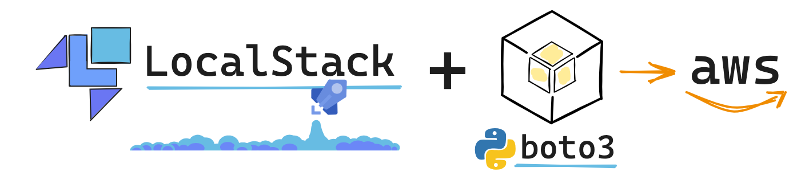

# 🔸 What is AWS s3?

**AWS S3**, or `Simple Storage Service`, is a core service of AWS that serves as a primary storage solution.
While it is commonly known for storing objects, it offers a wide range of functionalities beyond basic storage.
Understanding these features can significantly enhance the utilization of this service.

Some of the `main features` of Amazon **S3** include:

-   🌐 Web accessibility via API or HTTPS, allowing for easy access and integration with web applications.
-   🔄 Object versioning, which enables the creation of copies of objects, providing additional data protection and recovery options.
-   🔒 Policy creation and application at the bucket level, enhancing security by controlling access to resources and defining permissions.
-   📉 Low storage costs and serverless architecture, providing cost-effective and scalable storage solutions with virtually unlimited capacity.

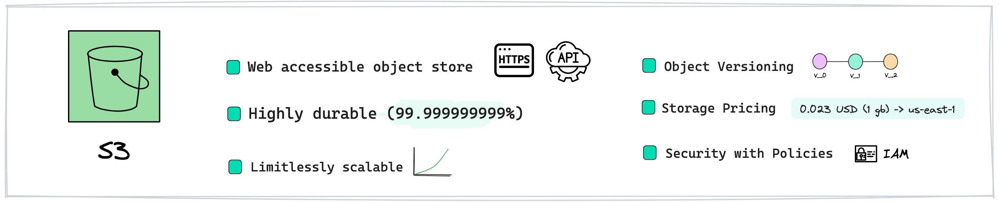

------------------------------------------------------------------------

\# **✨ Exploring 8 Key Features of Amazon S3**

## 📙 Multiple Use Cases for S3

While **S3** is commonly associated with file storage, such as CSV, JSON, or Parquet files, it offers a wide range of other use cases as well.
These include hosting static websites, sharing files, storing data for machine learning models, application configuration, and logging purposes.

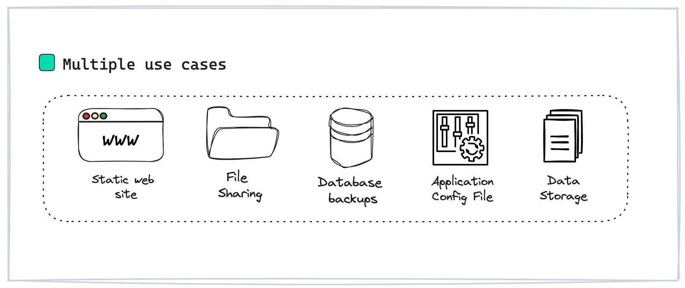

------------------------------------------------------------------------

## 📙 S3 storage type

In the following image, you can see the types of storage that **S3** allows, which depend on the frequency of accessing the object.
If you need to access objects frequently, it's advisable to use the standard storage type.
On the other hand, if access to objects is less frequent, it's recommended to use **S3** 🧊 Glacier services.

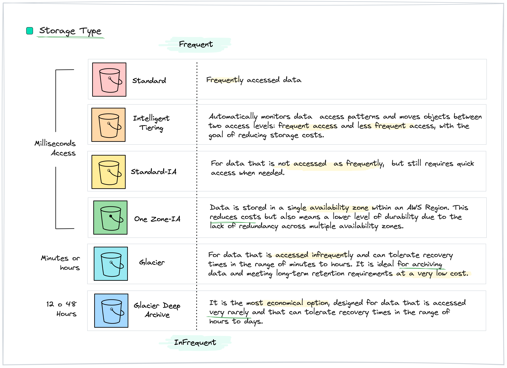

------------------------------------------------------------------------

## 📙 Object tagging

Another important feature of **S3** is the ability to use tags, this tags are useful for classifying objects and managing costs.
They also serve as a strategy for data protection, allowing you to label objects with categories such as confidentiality or sensitive data, and apply policies accordingly.

Additionally, **S3** supports using tags to trigger Lambda functions, enabling you to perform various actions based on these labels.

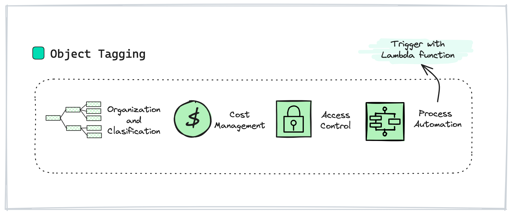

------------------------------------------------------------------------

## 📙 S3 Inventory

When managing an **S3 bucket**, it's common to accumulate a large number of files within the same bucket.
To efficiently organize and manage these files, it's often necessary to generate an inventory.
In **S3**, an inventory is a file that can be scheduled for updates and contains information about the objects stored in the bucket, including their type, size, and other metadata.
This allows for better organization and management of objects within the bucket.

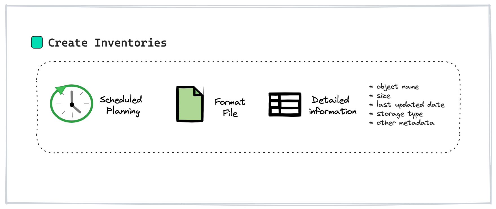

------------------------------------------------------------------------

\#\# 📙 S3 Lifecycle configuration

Comprising a set of rules, the **S3 lifecycle configuration** dictates actions applied by **AWS S3** to a group of objects.
In the following image, you can observe the typical actions that can be configured.

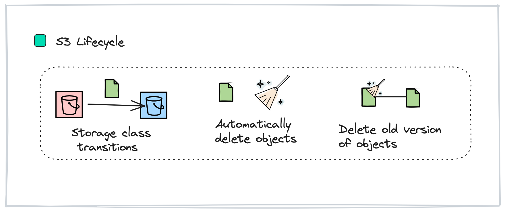

------------------------------------------------------------------------

\#\# 📙 S3 Batch operators

It is a feature provided by **S3** that allows users to perform operations on objects stored in buckets.
With **S3 Batch Operations**, users can automate tasks such as copying, tagging, deleting, and restoring objects.
This feature is particularly useful for organizations managing large amounts of data in **S3** and need to perform these operations at scale efficiently.

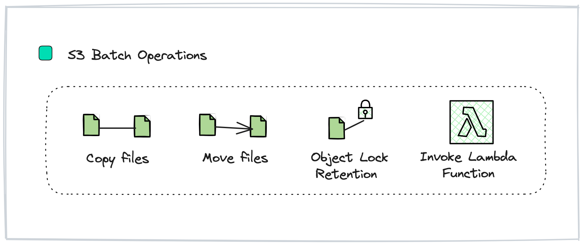

------------------------------------------------------------------------

\#\# 📙 S3 Query Select

**S3 Select** is a feature provided by S3 that enables users to find some data from objects stored in **S3** buckets using simple SQL queries.
With **S3 Select**, users can efficiently query large datasets stored in various formats such as CSV, JSON, and Parquet, without the need to download and process the entire object.
This feature is particularly useful for applications that require selective access to data stored in **S3**, as it minimizes data transfer and processing overhead.

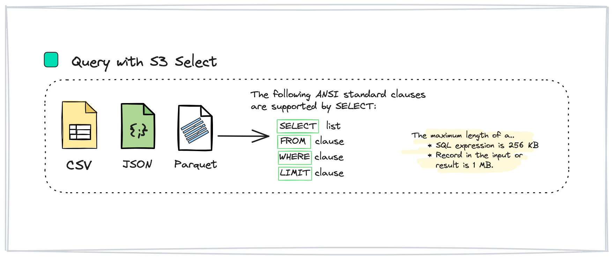

------------------------------------------------------------------------

\#\# 📙 S3 Storage Lens

**S3 Storage Lens** is a feature that offers a centralized dashboard with customizable reports and visualizations, allowing users to monitor key metrics such as storage usage, access patterns, and data transfer costs.

Also it provides detailed metrics, analytics, and recommendations to help organizations optimize their **S3** storage resources, improve data security, and reduce costs.

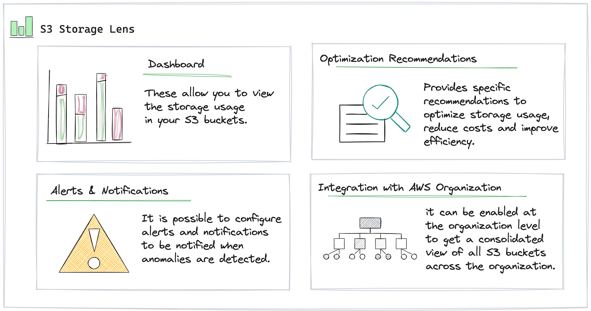

------------------------------------------------------------------------

# 📙 What is boto3?

**`Boto3`** is a 🐍 Python library that allows the integration with AWS services, facilitating various tasks such as creation, management, and configuration of these services.

There are two primary implementations within Boto3: \* **Resource implementation**: provides a higher-level, object-oriented interface, abstracting away low-level details and offering simplified interactions with AWS services.
\* **Client implementation**: offers a lower-level, service-oriented interface, providing more granular control and flexibility for interacting with AWS services directly.

------------------------------------------------------------------------

# 📘 What is localstack?

**Localstack** is a platform that provides a local version of several cloud services, allowing you to simulate a development environment with AWS services.
This allows you to debug and refine your code before deploying it to a production environment.
For this reason, Localstack is a valuable tool for emulating essential AWS services such as object storage and message queues, among others.

Also, **Localstack** serves as an effective tool for learning to implement and deploy services using a Docker container without the need for an AWS account or the use of your credit card.
In this tutorial, we create a Localstack container to implement the main functionalities of **S3** services.

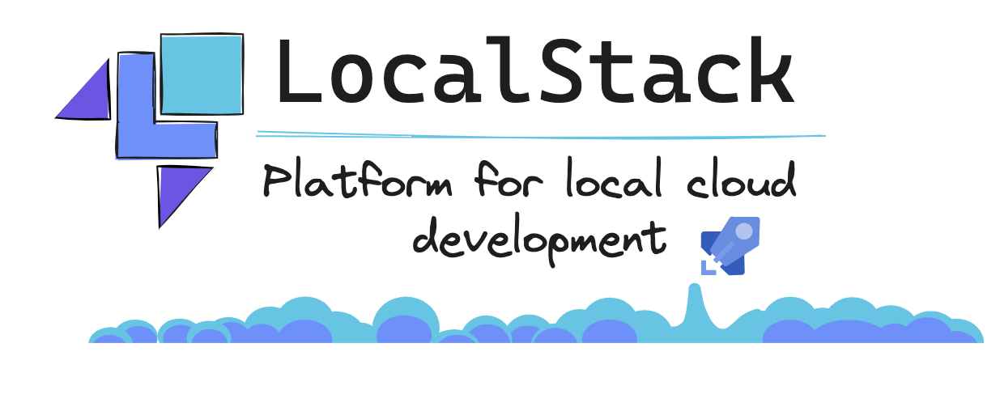

------------------------------------------------------------------------

# 📙 Boto3 & 📘 LocalStudio

As mentioned earlier, LocalStudio provides a means to emulate a local environment for Amazon with some of the most popular services.
This article will guide you through the process of creating a container using the LocalStudio image.
Subsequently, it will demonstrate the utilization of **Boto3** to create an **S3** bucket and implement key functionalities within these services.

By the end of this tutorial, you'll have a clearer understanding of how to seamlessly integrate Boto3 with LocalStudio, allowing you to simulate AWS services locally for development and testing purposes.

## Prerequisites

Before you begin, ensure that you have the following installed:

-   🐳 Docker
-   🐙 Docker Compose

------------------------------------------------------------------------

# 🟣 Build and run the Docker Compose environment

-   

    1.  Clone the repository \> Feel free to check it out and give it a star if you find it helpful! ⭐️



``` {.bash}
git clone https://github.com/r0mymendez/LocalStack-boto3.git
cd LocalStack-boto3
```

-   

    2.  Build an run the docker compose

``` {.bash}
 docker-compose -f docker-compose.yaml up --build
```

    Recreating localstack ... done
    Attaching to localstack
    localstack    | LocalStack supervisor: starting
    localstack    | LocalStack supervisor: localstack process (PID 16) starting
    localstack    | 
    localstack    | LocalStack version: 3.0.3.dev
    localstack    | LocalStack Docker container id: f313c21a96df
    localstack    | LocalStack build date: 2024-01-19
    localstack    | LocalStack build git hash: 553dd7e4

🥳`Now we have in Localtcak running in localhost!`

------------------------------------------------------------------------

### 🚀 Using LocalStack with Boto3: A Step-by-Step Guide

### 🛠️ Install Boto3

`!pip install boto3`

------------------------------------------------------------------------

### 🛠️ Create a session using the localstack endpoint

The following code snippet initializes a client for accessing the S3 service using the LocalStack endpoint.

``` {.python}
import boto3
import json 
import requests
import pandas as pd
from datetime import datetime
import io
import os


s3 = boto3.client(
    service_name='s3',
    aws_access_key_id='test',
    aws_secret_access_key='test',
    endpoint_url='http://localhost:4566',
)
```

------------------------------------------------------------------------

### 🛠️ Create new buckets

Below is the code snippet to create new buckets using the Boto3 library

``` {.python}
# create buckets
bucket_name_news = 'news'
bucket_name_config = 'news-config'

s3.create_bucket(Bucket= bucket_name_new )
s3.create_bucket(Bucket=bucket_name_config)
```

------------------------------------------------------------------------

### 📋 List all buckets

After creating a bucket, you can use the following code to list all the buckets available at your endpoint.

``` {.python}
# List all buckets
response = s3.list_buckets()
pd.json_normalize(response['Buckets'])
```


------------------------------------------------------------------------

### 📤 Upload the JSON file to s3

Once we extract data from the API to gather information about news topics, the following code generates a JSON file and uploads it to the S3 bucket previously created.

``` {.python}
# invoke the config news
url = 'https://ok.surf/api/v1/cors/news-section-names' 
response = requests.get(url)
if response.status_code==200:
    data = response.json()
    # ad json file to s3
    print('data', data)
    # upload the data to s3
    s3.put_object(Bucket=bucket_name_config, Key='news-section/data_config.json', Body=json.dumps(data))
```

    data ['US', 'World', 'Business', 'Technology', 'Entertainment', 'Sports', 'Science', 'Health']

------------------------------------------------------------------------

### 📋 List all objects

Now, let's list all the objects stored in our bucket.
Since we might have stored a JSON file in the previous step, we'll include code to retrieve all objects from the bucket.

``` {.python}
def list_objects(bucket_name):
    response = s3.list_objects(Bucket=bucket_name)
    return pd.json_normalize(response['Contents'])

# list all objects in the bucket
list_objects(bucket_name=bucket_name_config)
```

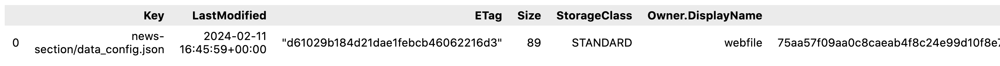

------------------------------------------------------------------------

### 📄 Upload multiple CSV files to s3

In the following code snippet, we will request another method from the API to extract news for each topic.
Subsequently, we will create different folders in the bucket to save CSV files containing the news for each topic.
This code enables you to save multiple files in the same bucket while organizing them into folders based on the topic and the date of the data request.

``` {.python}
# Request the news feed API Method
url = 'https://ok.surf/api/v1/news-feed' 
response = requests.get(url)
if response.status_code==200:
    data = response.json()

# Add the json file to s3
folder_dt =  f'dt={datetime.now().strftime("%Y%m%d")}'

for item in data.keys():
    tmp = pd.json_normalize(data[item])
    tmp['section'] = item   
    tmp['download_date'] = datetime.now()
    tmp['date'] = pd.to_datetime(tmp['download_date']).dt.date
    path = f"s3://{bucket_name_news}/{item}/{folder_dt}/data_{item}_news.csv"

    # upload multiple files to s3
    bytes_io = io.BytesIO()
    tmp.to_csv(bytes_io, index=False)
    bytes_io.seek(0)
    s3.put_object(Bucket=bucket_name_news, Key=path, Body=bytes_io)

# list all objects in the bucket
list_objects(bucket_name=bucket_name_news)
```

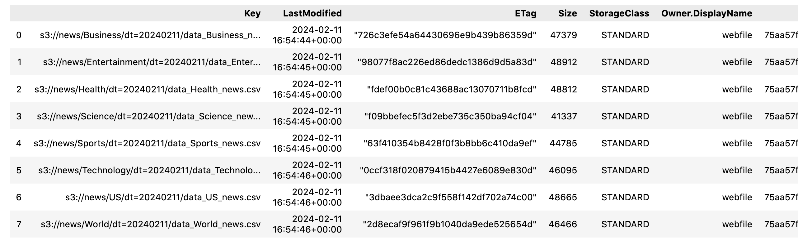

------------------------------------------------------------------------

### 📄 Read csv file from s3

In this section, we aim to read a file containing news about technology topics from S3.
To accomplish this, we first retrieve the name of the file in the bucket.
Then, we read this file and print the contents as a pandas dataframe.

``` {.python}
# Get the technology file
files = list_objects(bucket_name=bucket_name_news)
technology_file = files[files['Key'].str.find('Technology')>=0]['Key'].values[0]
print('file_name',technology_file)
```

    file_name s3://news/Technology/dt=20240211/data_Technology_news.csv

``` {.python}
# get the file from s3 using boto3
obj = s3.get_object(Bucket=bucket_name_news, Key=technology_file)
data_tech = pd.read_csv(obj['Body'])

data_tech
```

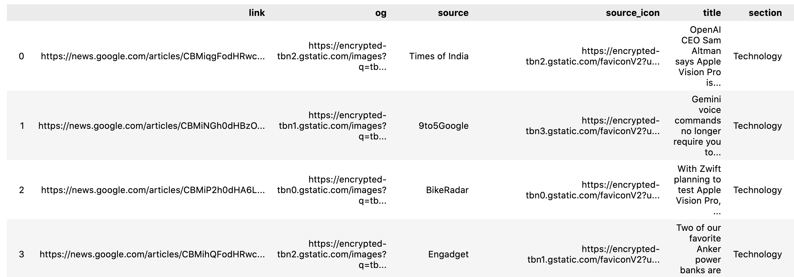

------------------------------------------------------------------------

### 🏷️ Add tags to the bucket

When creating a resource in the cloud, it is considered a best practice to add tags for organizing resources, controlling costs, or applying security policies based on these labels.
The following code demonstrates how to add tags to a bucket using a method from the boto3 library.

``` {.python}
s3.put_bucket_tagging(
    Bucket=bucket_name_news,
    Tagging={
        'TagSet': [
            {
                'Key': 'Environment',
                'Value': 'Test'
            },
            {
                'Key': 'Project',
                'Value': 'Localstack+Boto3'
            }
        ]
    }
)
```

``` {.python}
# get the tagging
pd.json_normalize(s3.get_bucket_tagging(Bucket=bucket_name_news)['TagSet'])
```

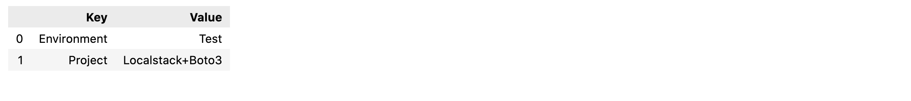

------------------------------------------------------------------------

### 🔄 Versioning in the bucket

Another good practice to apply is enabling versioning for your bucket.
Versioning provides a way to recover and keep different versions of the same object.
In the following code, we will create a file with the inventory of objects in the bucket and save the file twice.

``` {.python}
# allow versioning in the bucket
s3.put_bucket_versioning(
    Bucket=bucket_name_news,
    VersioningConfiguration={
        'Status': 'Enabled'
    }
)
```

``` {.python}
# Add new file to the bucket

# file name
file_name = 'inventory.csv'

# list all objects in the bucket
files = list_objects(bucket_name=bucket_name_news)
bytes_io = io.BytesIO()
files.to_csv(bytes_io, index=False)
bytes_io.seek(0)
# upload the data to s3
s3.put_object(Bucket=bucket_name_news, Key=file_name, Body=bytes_io)
```

``` {.python}
# add again the same file
s3.put_object(Bucket=bucket_name_news, Key=file_name, Body=bytes_io)
```

``` {.python}
# List all the version of the object
versions = s3.list_object_versions(Bucket=bucket_name, Prefix=file_name)

pd.json_normalize(versions['Versions'])
```

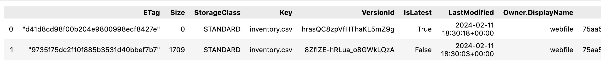

------------------------------------------------------------------------

### 🗑️ Create a static site using s3 bucket

In this section, we need to utilize a different command, which requires prior installation of the `awscli-local` tool specifically designed for use with **LocalStack**.

The `awscli-local` tool facilitates developers in seamlessly engaging with the **LocalStack** instance, because you can automatically redirecting commands to local endpoints instead of real AWS endpoints.

``` {.python}
# install awslocal to use the cli to interact with localstack
!pip3.11 install awscli-local
```

``` {.python}
# the following command creates a static website in s3
!awslocal s3api create-bucket --bucket docs-web
# add the website configuration
!awslocal s3 website s3://docs-web/ --index-document index.html --error-document error.html
# syncronize the static site with the s3 bucket
!awslocal s3 sync static-site s3://docs-web
```

> If you are using localstack, you can access the website using the following
>
> Url: <http://docs-web.s3-website.localhost.localstack.cloud:4566/>

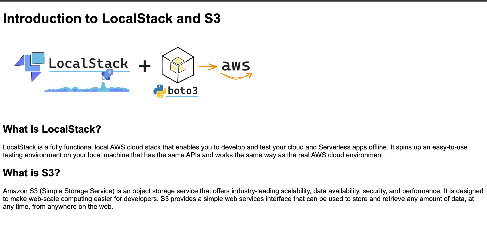

------------------------------------------------------------------------

# 📚 References

If you want to learn...

-   [AWS Boto3](https://boto3.amazonaws.com/v1/documentation/api/latest/guide/quickstart.html#installation)
-   [LocalStack](https://docs.localstack.cloud/overview/)
-   [API:OkSurf News](https://ok.surf/#endpoints)

Other references:

\- Image preview reference: [[Imagen de vectorjuice en Freepik](https://www.freepik.es/vector-gratis/dos-usuarios-que-buscan-big-data-ilustracion-nube_10780409.htm#query=cloud%20computing%20illustration&position=30&from_view=search&track=ais&uuid=b1186de9-f6ea-4fc8-b662-f6655d2176a0)]
