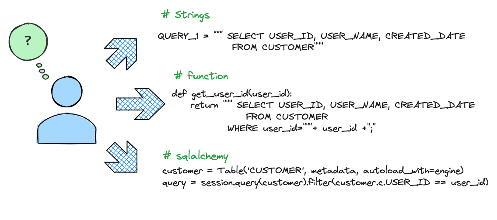
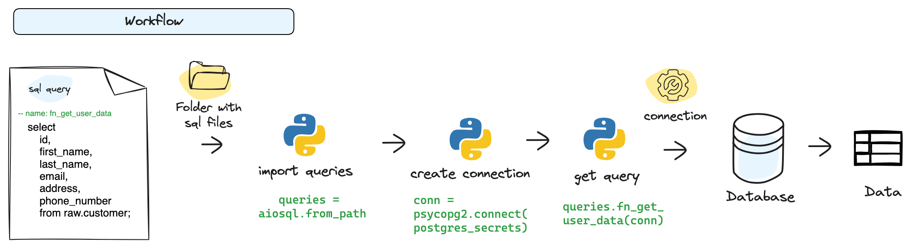
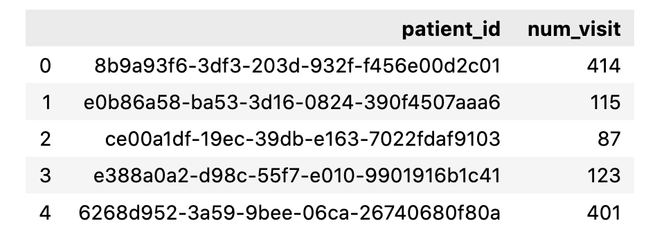
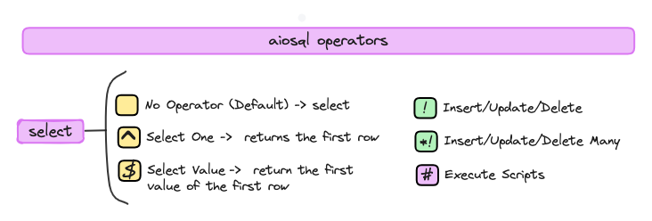
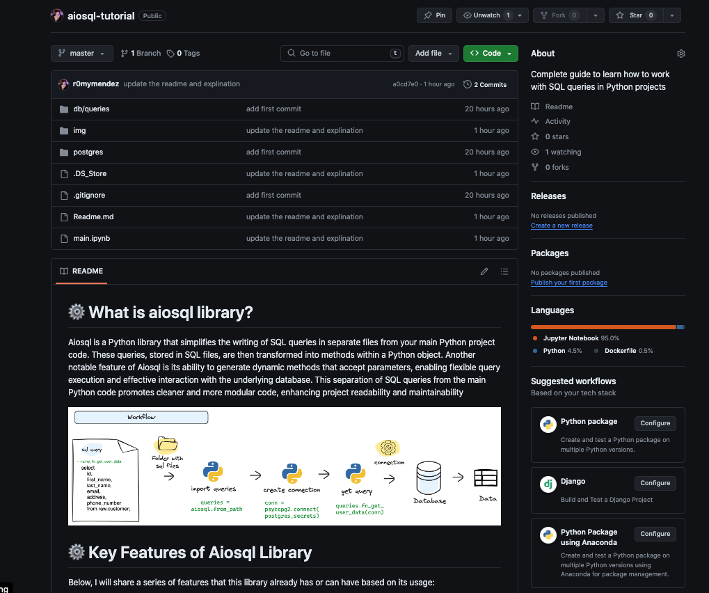

```{r setup, include=FALSE}
knitr::opts_chunk$set(echo = FALSE)
```

{width="40%"}

Many times, when programming in a project involving interaction with a database, we face the **❓question of how to organize our queries and make them reusable**.

For this reason, some 🧑‍💻 developers `create functions` where they concatenate strings to make the queries more dynamic and others prefer to `create variables` where they define these queries.
Although some more sophisticated developers also `use SQLAlchemy` object declaration to define the queries, but this has a learning curve and can 📈complicate the development process, especially when dealing with more complex queries.



One day, I found myself searching for a way to perform this in an `orderly`, `organized`, and `reusable` manner without overly complicating my code, and I stumbled upon an interesting library called **aiosql**.

In the following article, I will review how to use it and explained in its documentation and also I will share some approaches I used to implement it in other contexts.

------------------------------------------------------------------------

# ⚙️ What is aiosql library?

**Aiosql** is a 🐍Python library that simplifies the writing of **SQL queries** in separate files from your main Python project code.
These queries, stored in SQL files, are then transformed into methods within a 🐍Python object.

Another notable feature of **aiosql** is its ability to generate dynamic methods that accept parameters, enabling flexible query execution and effective interaction with the underlying database.

This separation of SQL queries from the main Python code promotes cleaner and more modular code, enhancing project readability and maintainability.

------------------------------------------------------------------------

# ⚙️ How Does aiosql Work?

In the diagram, you can see that all the queries from an SQL file can be imported and used in Python code by invoking them with the name defined in the query header.
Subsequently, you can execute the queries by passing the necessary parameters directly from your Python code, which makes the queries reusable and easier to maintain.



------------------------------------------------------------------------

# ⚙️ Key Features of Aiosql Library

Below, I will share a series of features that this library already has or can have based on its usage: \* Provides **CRUD functionality** (Create: Insert, Read: Select, Update , Delete) for database operations.
\* **Separates Python code** from SQL code, making it easier to locate queries within projects with multiple databases.
\* Each query can be assigned a **descriptive name and docstring**, similar to Python functions, enabling documentation of the query.
\* Facilitates the creation of **a query catalog** within the project, aiding in identification based on entities, databases, or other grouping criteria.
\* Enables easy generation of **dynamic queries** with the ability to pass dynamic values and modify them as needed.


------------------------------------------------------------------------

# ⚙️ Aiosql Tutorial

## 🔧 Prerequisites

-   🐳 Docker
-   🐙 Docker Compose
-   🐍 Install python libraries: `pip install aiosql pandas`

------------------------------------------------------------------------

## 🚀 Quick Start

### 🛠️Create a postgres database

-   1️⃣ - **Clone this [repository: aiosql-tutorial](https://github.com/r0mymendez/aiosql-tutorial/tree/master)** →

``` {.bash}
    git clone https://github.com/r0mymendez/aiosql-tutorial.git
```

-   2️⃣ - **Change directory** to the 'postgres' folder →

``` {.bash}
    cd aiosql-tutorial/postgres
```

-   3️⃣ - **Create postgres database** → Execute in the terminal→

``` {.bash}
    docker-compose -f docker-compose.yml up --build
```

-   4️⃣ - **Check if your container is running** → Execute in the terminal →

``` {.bash}
      docker ps
```

-   5️⃣ - **Load the csv files** → Execute the following command for load the csv file in the container →

``` {.bash}
    cd src 
    python3 etl.py
```

------------------------------------------------------------------------

### 🏥 Hospital Data

To implement aiosql, we will use the datasets from [Synthea](https://synthea.mitre.org/), which simulates a hospital database.
These synthetic data are generated from a simulation considering various variables of a population in Massachusetts.
From these datasets, we will use the tables: `conditions`, `encounters`, and `patients`.

------------------------------------------------------------------------

### 👥 User stories

To make this example more real we are going to make 3 use cases:

-    1️⃣ - As a **data analyst**, I want to be able to retrieve a list of patients whose visit count is above the 90th percentile, so that I can identify the most active patients in the clinic.
    Additionally, I want this percentile to be configurable for easy adjustment in the future.

```{=html}
<!-- -->
```
-    2️⃣ - As a **researcher or data analyst**, I want to access the data of patients who have been diagnosed with the 10 most frequent diagnoses in a period of time, in order to analyze trends and improve the quality of medical care.

```{=html}
<!-- -->
```
-   3️⃣ - As a **marketing analyst**, I want to create a table for patient satisfaction surveys, so that I can gather feedback on the quality of care and take measures to improve it.

------------------------------------------------------------------------

### 🚀 Implementation

Based on the user stories that we are going to create, we will define two files in which we will load the queries and scripts that we need to execute: \* **patients.sql**: where we have all the queries related to recovering patient data.
\* **visits.sql**: where we have all the queries related to visits, such as surveys.

Therefore in our project we are going to have this structure of folders and files

``` {.bash}
- 📁 db
    - 📁 queries
        - 📄 patients.sql
        - 📄 visits.sql
- 📄 main.ipynb
```

------------------------------------------------------------------------

In this way we are isolating the python code from the sql code, in our case we are going to implement this **🐍python code** in a notebook in such a way as to make its explanation easier.

------------------------------------------------------------------------

#### 1️⃣ - Import python libraries

``` {.python}
import aiosql
import psycopg2
import pandas as pd
```

#### 2️⃣ - Import the SQL queries and configure the database driver

> In this project, the SQL queries are located in the **'db/queries'** directory and **'psycopg2'** is the PostgreSQL database adapter.

``` {.python}
sql = aiosql.from_path('src/db/queries', 'psycopg2')
```

#### 3️⃣ - Create the connection to the PostgreSQL database.

``` {.python}
postgres_secrets = {'host': 'localhost','port': 5432, 'user': 'postgres', 'password': 'postgres', 'dbname': 'postgres'}
conn = psycopg2.connect(**postgres_secrets)
conn.autocommit = True
```

------------------------------------------------------------------------

### 👥 User story I: Static Values

> As a **data analyst**, I want to be able to retrieve a `list of patients` whose visit count is `above the 90th percentile`, so that I can identify the most active patients in the clinic.
> Additionally, I want this **percentile to be configurable** for easy adjustment in the future.

------------------------------------------------------------------------

Based on this user story, we will first create one that allows generating a query to retrieve the list of patients with a visit frequency above the 90th percentile.

#### 1️⃣ - In the sql file we have the query for the first user story

The following are the three components that a SQL statement comprises in aiosq:

-   **📗 Name**: This is the descriptive name used to invoke the query from Python code.
    In the following example the name is `"fn_get_patients_adove_90th_percentile"`

-    **📗 Description**: It's a detailed description used to generate a docstring.
    It provides a more comprehensive explanation of the purpose and context of the query.
    In the following example the description is `"get all the patients that have more visits than the 90th percentile of visits..."`

-   **📗 Query**: Here is the SQL query that will be executed in the database.

📄`sql:db/queries/patients.sql`

``` {.sql}
    -- name: fn_get_patients_adove_90th_percentile
    -- get all the patients that have more visits than the 90th percentile of visits. All this data is stored in encounters table.
    WITH patient_visits AS (
        SELECT
            patient,
            COUNT(*) AS visit_count
        FROM
            hospital.encounters
        GROUP BY
            patient
    ),
    percentil_n AS (
        SELECT
            percentile_cont(0.9) WITHIN GROUP (ORDER BY visit_count) AS p_visits
        FROM
            patient_visits
    )
    SELECT 
        pv.patient, 
        pv.visit_count
    FROM 
        patient_visits pv
    CROSS JOIN 
        percentil_n  pn
    WHERE 
        pv.visit_count >= pn.p_visits;
```

#### 2️⃣ - Execute the 'fn_get_patients_above_90th_percentile' SQL function using the database connection 'conn'.

> The function returns a list of tuples representing patients whose visit count is above the 90th percentile.

🐍`Python`

``` {.python}
response = sql.fn_get_patients_above_90th_percentile(conn)
```

#### 3️⃣ - Now we can convert the response object into a pandas DataFrame for easier data manipulation

> The column names ('patient_id' and 'num_visit') are added manually because aiosql only returns the query result as a list of tuples without column names.

``` {.python}
data = pd.DataFrame([item for item in response], columns=['patient_id', 'num_visit'])
# Display the DataFrame.
data
```



------------------------------------------------------------------------

> if we want to see the query, we can use the following code

``` {.python}
print(sql.fn_get_patients_adove_90th_percentile.sql)
```

------------------------------------------------------------------------

### 👥 User story I: Dynamic Values

> As a **data analyst**, I want to be able to retrieve a `list of patients` whose visit count is above the 90th percentile, so that I can identify the most active patients in the clinic.
> Additionally, `I want this percentile to be configurable` for easy adjustment in the future.

------------------------------------------------------------------------

Now, we are going to create another query that allows us to accept different percentile values so that the query can be dynamically modified based on the values passed.
In our case, we are going to provide an example of obtaining the list of patients that exceed the 75th percentile.

> Notice that we now have a dynamic variable called **percentile_value**

📄`sql`

``` {.sql}
-- name: fn_get_patients_above_n_percentile
WITH patient_visits AS (
    ...
),
percentil_n AS (
    SELECT
        percentile_cont(:percentil_value) WITHIN GROUP (ORDER BY visit_count) AS p_visits
    FROM
        patient_visits
)
SELECT ...;
```

#### 1️⃣ - This following code executes a dynamic SQL query that accepts different percentile values as input.

🐍`Python`

``` {.python}
# In this case, we're getting patients above the 75th percentile.
response = sql.fn_get_patients_above_n_percentile(conn, percentil_value=0.75)
data = pd.DataFrame([item for item in response], columns=['patient_id', 'num_visit'])
```

------------------------------------------------------------------------

### 👥 User stories II

> As a **researcher or data analyst**, I want to access the data of patients who have been diagnosed with the 10 most frequent diagnoses in a period of time, in order to analyze trends and improve the quality of medical care.

------------------------------------------------------------------------

To resolve this user story, we will create a query that retrieves patients with the most common conditions within a specified time period.
This query will be dynamic, allowing for future variations in the number of conditions of interest.
It will accept three parameters:

\- **'num_condition'** will allow us to limit the number of conditions we're interested in (e.g., the top 10 most common conditions).

\- **'period_start_date'** and **'period_start_end'** will define the time window for which we want to retrieve data.

📄`sql`

``` {.sql}
-- name: fn_get_patients_top_conditions
-- Get patients with top conditions for a given period of time, the patients are sorted by the number of days they had the condition and the source of the data is the hospital schema.
with top_n_conditions as(
SELECT  code, description, COUNT(*) 
     FROM hospital.CONDITIONS 
     GROUP BY  code,description 
     ORDER BY COUNT(*) DESC 
     LIMIT  :num_condition
),
top_n_condition_patients as (
SELECT 
    p.ID, 
    p.FIRST, 
    p.LAST, 
    p.CITY, 
    p.GENDER, 
    EXTRACT(YEAR FROM AGE(p.BIRTHDATE)) AS age,
    c.start condition_start_date,
    c.stop condition_stop_date,
    EXTRACT(DAY FROM (c.stop - c.start )) AS condition_days, 
    c.encounter,
    c.code,
    c.description
    from hospital.patients p 
    inner join hospital.conditions c  on c.patient = p.id
    inner join top_n_conditions t on t.code=c.code
)
select * 
    from top_n_condition_patients
    where condition_start_date between :period_start_date and :period_start_end;
```

🐍`Python`

``` {.python}
response = sql.fn_get_patients_top_conditions(conn, num_condition_days=10, 
                                        period_start_date='2022-01-01', 
                                        period_start_end='2022-12-31')

column_name=['id', 'first','last','city','gender',
'age','condition_start_date','condition_stop_date','condition_days','encounter','code','description']

data = pd.DataFrame([item for item in response], columns=column_name)
data.head()
```

------------------------------------------------------------------------

### 👥 User story III

As a **marketing analyst**, I want to create a table for patient satisfaction surveys, so that I can gather feedback on the quality of care and take measures to improve it.

------------------------------------------------------------------------

Now we are going to create the table using aiosql, if you look at our code in SQL you will see that a \# symbol is added, these symbols are used by aiosql to identify the different operations that must be performed.

📄`sql`

``` {.sql}
-- name: fn_create_survey_table#
CREATE TABLE HOSPITAL.VISIT_SURVEY(
    ID SERIAL PRIMARY KEY,
    PATIENT_ID VARCHAR(50),
    SURVEY_DATE TIMESTAMP,
    RATING INT,
    COMMENTS TEXT,
    CREATED_AT TIMESTAMP DEFAULT CURRENT_TIMESTAMP
);
```



------------------------------------------------------------------------

#### 1️⃣ - Execute the 'fn_create_survey_table' SQL function to create a new table in the database.

🐍`Python`

``` {.python}
sql.fn_create_survey_table(conn)
```

`'CREATE TABLE'`

#### 2️⃣ - Once the table is created we are going to use the following insert statement to be able to insert a review of a patient

📄`sql`

``` {.sql}
-- name: fn_add_one_visit_survey<!
insert into HOSPITAL.VISIT_SURVEY(PATIENT_ID,SURVEY_DATE,RATING,COMMENTS) 
    values (:patient_id, :survey_date, :rating,:comments) returning ID;
```

------------------------------------------------------------------------

> **⚠️ Disclaimer**: During the coding of this tutorial, I used the insert statement without a return and encountered an error due to its absence.
> (The version of aiosql I am using is 10.1) This 'returning ID' allows us to retrieve the value assigned to the 'id' column within the 'hospital_visit_survey' table when the insert operation is performed.

------------------------------------------------------------------------

🐍`Python`

``` {.python}
# Add a new visit survey record 

sql.fn_add_one_visit_survey(conn, 
                            patient_id='8b9a93f6-3df3-203d-932f-f456e00d2c01', 
                            survey_date='2022-01-01', 
                            rating=5,
                            comments='This is a great hospital!' )
```

#### 3️⃣ - Now we will utilize a new insert statement to load multiple reviews, which are stored in a list of dictionaries (each dictionary in Python corresponds to a review). To accomplish this, we will employ a similar query but we need to modify its name

📄`sql`

``` {.sql}
    -- name: fn_add_many_visit_survey*!
    insert into HOSPITAL.VISIT_SURVEY(PATIENT_ID,SURVEY_DATE,RATING,COMMENTS) 
        values (:patient_id, :survey_date, :rating ,:comments) returning ID;
```

🐍`Python`

``` {.python}
# Add several visit survey records
response_survey = [
    {
        'patient_id': '8b9a93f6-3df3-203d-932f-f456e00d2c01',
        'survey_date': '2022-01-01',
        'rating': 3,
        'comments': 'The service was good. But the waiting time was a bit long.'
    },
    {
        'patient_id': '7c8a93f6-4df3-203d-932f-f456e00d2c02',
        'survey_date': '2022-02-01',
        'rating': 4,
        'comments': 'The staff was very helpful!'
    },
    {
        'patient_id': '6b7a93f6-5ef3-203d-932f-f456e00d2c03',
        'survey_date': '2022-03-01',
        'rating': 3,
        'comments': 'The waiting time was a bit long.'
    }
]


sql.fn_add_many_visit_survey(conn, response_survey)
```

------------------------------------------------------------------------

# 📚 Project query catalog

At the beginning of the tutorial, I mentioned the possibility of creating a catalog of queries for your project.
Although this library doesn't provide this functionality directly, you can see how to do it and access the complete code and data for this tutorial in my GitHub repository.

If you find it useful, you can leave a star ⭐️ and follow me for recieve the notification of new articles, this will help me grow in the tech community and create more content.

[](https://github.com/r0mymendez/aiosql-tutorial)

------------------------------------------------------------------------

## 🔍 Final Conclusions

1.  **Versatility and Utility**: I believe aiosql is a useful library that allows you to implement queries from different projects efficiently.
    It provides a structured way to manage and execute SQL queries separately from your main codebase, enhancing readability and maintainability.

2.  **Flexible Query Handling**: While aiosql enables direct execution of your queries using database connections, in the projects I work on, I primarily use the library to return the SQL code and execute it with classes that I have already set up in Python code.

3.  **Other databases**: The ability to store and manage queries can extend beyond SQL databases.
    For example, this approach can also be applied to NoSQL databases such as Neo4j.
    By organizing and handling queries in a structured manner, you can optimize interactions with various types of databases.

------------------------------------------------------------------------

# 📚 References

If you want to learn...

1.[aiosql official documentation](https://nackjicholson.github.io/aiosql/getting-started.html)

Other references:

\- Image preview reference: [Imagen de [Freepik](https://www.freepik.es/vector-gratis/usuarios-laptops-trabajando-base-datos-almacenamiento-organizacion-datos-acceso-gestion-informacion-concepto-proteccion-big-data-vector-ilustracion-aislada_11668632.htm#fromView=search&page=1&position=23&uuid=259d2c57-89fa-4abc-8455-39c842c1ddd1)]
