```{r setup, include=FALSE}
knitr::opts_chunk$set(echo = FALSE)
```

The solution includes support for `charts` and `diagrams`, continuous integration `(CI/CD)` using a simple workflow in `GitHub Actions`, and automatic deployment using `Terraform`.
Let's get started!

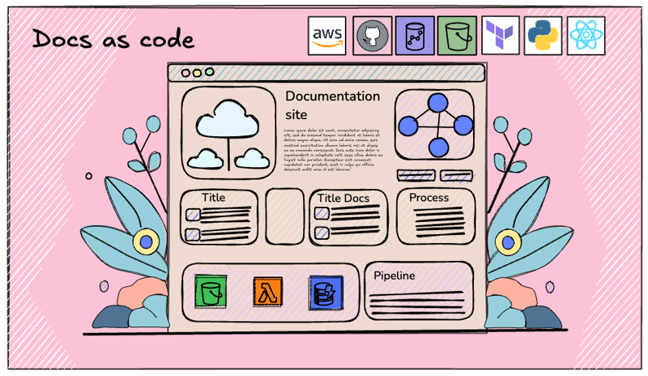

------------------------------------------------------------------------

# What is Documentation as Code?

Documentation and its updates are an important process in many companies that develop software, often carried out using different tools, many of which are paid solutions.\
Therefore, in recent times, the concept of **"doc as code"** has emerged.
This means using the same tools and workflows used in software development to `manage`, `version`, and `deploy` documentation.\
This approach not only allows for better tracking of the documentation but also facilitates its maintenance and ensures alignment with the same best practices used in software development, not just in the code but also in the documentation
.

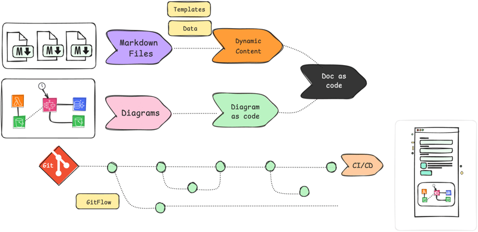

------------------------------------------------------------------------

## Tools for Documentation as Code

For the development of these sites, it is essential to understand some practices and tools that allow us to implement this approach.
Below is a detailed list of the most important aspects to cover in this tutorial.

-   📝 **Markdown**: The most common markup language for writing documentation due to its simplicity and integration with version control platforms and static site generators.
-   🗂️ **Git**: Git allows versioning of documentation just like code. Thanks to Git, every change in the documentation is recorded, enabling teams to track edits, revert changes, and collaborate more efficiently.
-   🔄 **Gitflow**: This methodology provides a structured workflow to manage versions and revisions of documentation, ensuring that changes are approved and tested before reaching production. Gitflow also facilitates collaboration between teams, allowing for safe and organized change management.
-   ☁️ **Cloud Services**: Using services like AWS S3, Netlify, or GitHub Pages, you can deploy documentation at a low cost. These services allow the creation of fast, secure, and easily accessible static sites.
-   🌐 **Static Site Generators**: Tools like Docusaurus, Jekyll, or Hugo convert Markdown documentation into a navigable website, allowing you to create rich and organized documentation without a server.
-   🚀 **Continuous Integration (CI/CD)**: CI/CD pipelines (e.g., GitHub Actions, GitLab CI, or Jenkins) allow you to automatically deploy documentation when a new version is merged or modifications are approved. This ensures the documentation is always up-to-date.

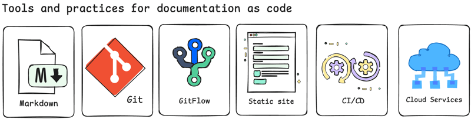

------------------------------------------------------------------------

## Advantages of Docs-as-Code

-   **✅ Consistency and Quality**: By using version control and change reviews, the documentation remains consistent and of high quality.
-   **⚙️ Automation**: CI/CD tools enable automation of documentation deployment, reducing update times and minimizing errors.
-   **🤝 Efficient Collaboration**: With tools like Git, teams can collaborate on creating and maintaining documentation without conflicts.
-   **🔧 Simplified Maintenance**: Maintaining documentation is integrated into the development workflow, making updates easier as the code evolves.

------------------------------------------------------------------------

## 📄 MkDocs  

**MkDocs** is a static site generator written in **🐍Python,** designed specifically for documenting projects.
Its goal is to simplify creating documentation using Markdown files, which are easy to write and read.

With minimal configuration, **MkDocs** converts Markdown files into a navigable and well-structured documentation website, making it ideal for developers and teams who want to keep their documentation up to date.

------------------------------------------------------------------------

## ✏️ MkDocs Material

**MkDocs Material** is an advanced theme for **MkDocs** that follows Google's Material Design guidelines.

### 🚀 Key features include:

-   📱 **Responsive Design**: Automatically adapts to any screen size.\
-   🎨 **Customization**: Easily modify colors, fonts, favicon, and logo to match your project's visual identity.\
-   🔍 **Search Interface**: Advanced search groups results and highlights searched terms, helping users find the information they need.\
-   ⚡ **Lazy Loading**: Implements lazy loading for search results, improving performance and reducing load times.\
-   🔗 **Integrations**: Compatible with Google Analytics, Disqus, and GitHub, facilitating traffic analysis, user feedback, and direct connection to the project repository.

------------------------------------------------------------------------

## ✏️ Mermaid  

Mermaid is a \*\*JavaScript\*\* library for creating diagrams and charts from text.
By integrating with MkDocs Material, Mermaid allows you to generate visualizations such as flowcharts, entity-relationship diagrams, and other charts within the documentation without external tools.

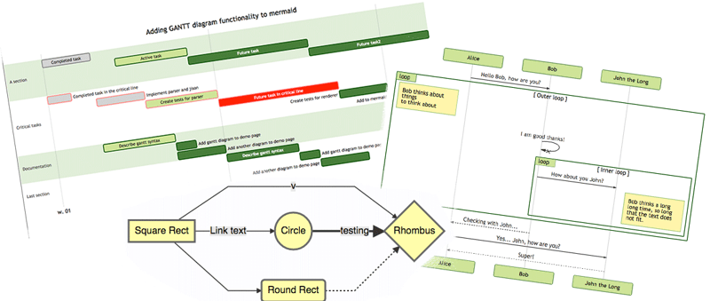

------------------------------------------------------------------------

## 🧩 Dynamic Page: Jinja

**Jinja** is a library that allows embedding variables and data from Python dictionaries into HTML, making web pages dynamic.
This library is commonly used for generating dynamic HTML and sending personalized emails.

------------------------------------------------------------------------

## 🦖 Docusaurus Overview

**Docusaurus** is an open-source project developed by Meta in 2007 that simplifies the creation, deployment, and maintenance of documentation websites in a fast and efficient way.
It allows the use of Markdown and MDX to write content, while its core built on React enables full customization of the styles to fit the specific needs of the project.

Additionally, Docusaurus supports Mermaid through the `@docusaurus/theme-mermaid` plugin, enabling the inclusion of charts and diagrams directly within the documentation.

------------------------------------------------------------------------

# 🎨 Diagram as Code

**Diagram as Code** is an approach that allows you to create diagrams through code, rather than using traditional graphic tools.
Instead of manually building diagrams, you write code in a text file to define the structure, components, and connections of your diagrams.

This code is then translated into graphical images, making it easier to integrate and document in software projects.
It's especially useful for creating and updating architectural and flow diagrams programmatically.

------------------------------------------------------------------------

## 🎨 Diagram as Code: Example of Creating Cloud Diagrams

As previously mentioned, **Diagrams** allows you to generate blueprints using the icons of major cloud technologies.
The representation of these diagrams is done through nodes, and in our example, we'll use all cloud-related nodes and AWS services.

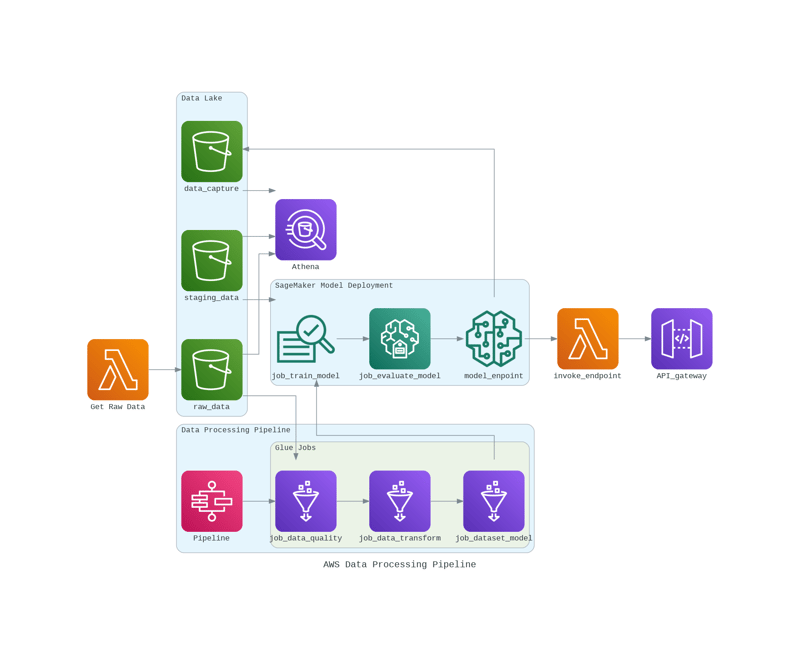

For more details on how I created this, you can read my article about [Diagram as Code](https://dev.to/r0mymendez/doc-as-diagrams-2ci5-temp-slug-2900884?preview=41df4c1f39f0ebe2634f376408ef3ef751cc09bff3c487f9ab7e7b364f729767da9709796b1bff2fc1e2fc925e62087ad52a19c3cd2e0a28d5a4b68d), and the full implementation can be found in this repository:

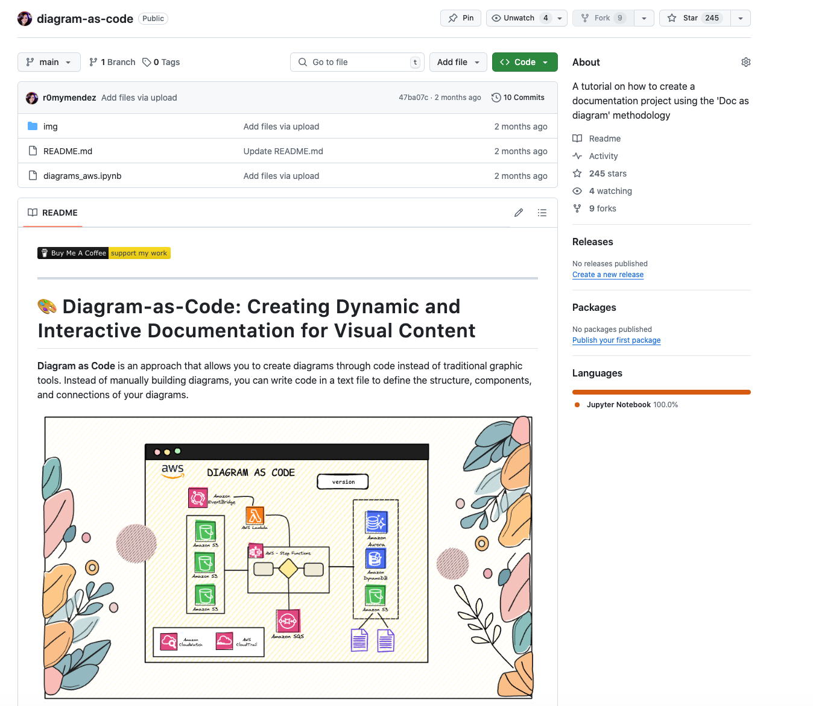

------------------------------------------------------------------------

# 📚 Use Case: Creating a Documentation Site for a Machine Learning Project

In this use case, I will create a `documentation site` for a **machine learning project** involving 🏥 hospital data.
The goal is to build an interactive documentation site using **MkDocs** initially and later migrate it to **Docusaurus**.
The site will include both static and dynamic components to meet specific requirements, such as embedding visual diagrams and updating data dynamically from a SQLite database.

------------------------------------------------------------------------

## 🚀 Key Features of the Documentation Site

1.  **Visual Representations**: I will embed diagrams created with **Diagrams** (`Diagram as Code`) to illustrate the architecture of the machine learning pipeline effectively.
2.  **Dynamic Data Updates**: The documentation will display the version and last update date dynamically, pulling this information from a **SQLite database** to ensure accuracy and relevance.
3.  **Sample of data**: The documentation will include a sample from the Synthea patient table, showcasing synthetic data as an example.

------------------------------------------------------------------------

## 📄 Pages of the Site

For this reason our documentation site will have the following pages:

-   **📄 Home**: The homepage of the documentation.
-   **📄 Tables**:Explanation of the Synthea data tables and their uses.
-   **📄 Architecture**:A detailed overview of the data processing architecture, hosted on AWS.
-   **📄 Glossary**: A glossary of terms used throughout the project

------------------------------------------------------------------------

## MkDocs Implementation

In this section, we'll walk through the steps to set up a documentation project using **MkDocs** from scratch and explain its organized directory structure.

### 🔧 Prerequisites for MkDocs

To get started, you'll need to install the following **🐍Python** libraries:

**Install MkDocs and the Material** `bash   pip install mkdocs mkdocs-material`

**Install additional libraries to enable dynamic content updating** `bash   pip install aiosql pandas sqlite3 jinja2 shutil` ---

### 🔧 Mkdocs: Project Setting Up

**Initialize the Project**\
Start by creating a new MkDocs project.
Run the following commands in your terminal:\
`bash    mkdocs new mkdocs    cd mkdocs` This command creates a basic MkDocs project with a default structure
.

**Explore the Directory Structure**\
Once the MkDocs site is created, you need to add the following files and folders, as they are not included by default.
  Remember, the links to the repository are provided at the end of this post for your reference, and each component will be explained in detail below.

``` {.plaintext}
📁 docs/
  ├── 📁 img/
  ├── `architecture.md`
  ├── `glossary.md`
  ├── `index.md`
  ├── `tables.md`
  ├── 📁 template/
  │   ├── 📁 db/
  │   │   ├── 📁 data/
  │   │   │   ├── hospital.db
  │   │   ├── 📁 queries/
  │   ├── `architecture.md`
  │   ├── `glossary.md`
  │   ├── `index.md`
  │   ├── `tables.md`
  │   └── `update.py`
📁 infraestructure/
📁 github/
  ├── 📁 workflows/
  │   ├── main.yml
📄 mkdocs.yml
```

------------------------------------------------------------------------

### 📂Mkdocs: Component Overview

+------------------------------------------+-------------------+------------------------------------------------------------------------------------------------------------------------------------------------------------------------------------------------------------------------------------------------------------------------------------------------------------------------+
| **Component**                            | **Directory**     | **Description**                                                                                                                                                                                                                                                                                                        |
+==========================================+===================+========================================================================================================================================================================================================================================================================================================================+
| **Database (`db`)**                      | `db`              | Contains the SQLite database (`hospital.db`) and queries (`metadata.sql`, `person.sql`) to manage dynamic data. Learn more about managing SQL queries in Python in my previous article: [Python Projects with SQL](https://dev.to/r0mymendez/python-projects-with-sql-strategies-for-effective-query-management-2n5k). |
+------------------------------------------+-------------------+------------------------------------------------------------------------------------------------------------------------------------------------------------------------------------------------------------------------------------------------------------------------------------------------------------------------+
| 🖋️ **Templates & Pages**                 | `template`        | Markdown templates: `index.md`, `tables.md`, `architecture.md`, `glossary.md`. Supports Mermaid diagrams, embedded images, and database-driven content.                                                                                                                                                                |
+------------------------------------------+-------------------+------------------------------------------------------------------------------------------------------------------------------------------------------------------------------------------------------------------------------------------------------------------------------------------------------------------------+
| 🖼️ **Static Content (`docs`)**           | `docs`            | Final site generated by `update.py`, including images (`img/`) and dynamic content populated from `template`.                                                                                                                                                                                                          |
+------------------------------------------+-------------------+------------------------------------------------------------------------------------------------------------------------------------------------------------------------------------------------------------------------------------------------------------------------------------------------------------------------+
| 🌐 **Infrastructure (`infraestructure`)** | `infraestructure` | Terraform scripts (`main.tf`, `variables.tf`) to deploy an S3 bucket for documentation hosting.                                                                                                                                                                                                                        |
+------------------------------------------+-------------------+------------------------------------------------------------------------------------------------------------------------------------------------------------------------------------------------------------------------------------------------------------------------------------------------------------------------+

------------------------------------------------------------------------

### 📄 Mkdocs

Configuring `mkdocs.yml` Once we have our project structure set up, we will configure it step by step, starting with the `mkdocs.yml file`.
This file defines the structure and settings for your documentation site.
Here's how it should be structured:

**`mkdocs.yml`**

``` {.yaml}
site_name: Hospital Documentation  
nav:
  - Home: index.md
  - Synthea Tables: tables.md
  - AWS Architectur: architecture.md
  - Glossary: glossary.md
markdown_extensions:
  - pymdownx.superfences:
      custom_fences:
        - name: mermaid
          class: mermaid
theme:
  name: material                
```

In this **configuration file**, you can primarily see in the **nav** section the pages that will be accessible from the menu.
Then, we specify the `Mermaid` extension, which will be explained in the next section.
Finally, the **theme** section applies the `Material theme`, enabling styling and components available within this library.

------------------------------------------------------------------------

### ✏️ Mkdocs: Mermaid Extension

As mentioned earlier, **Mermaid** is a **JavaScript** library for creating diagrams and charts from text.
Below, we will see some examples.
In our case, we will use it to generate an Entity Relationship Diagram (ERD) on the **tables** page of the documentation.

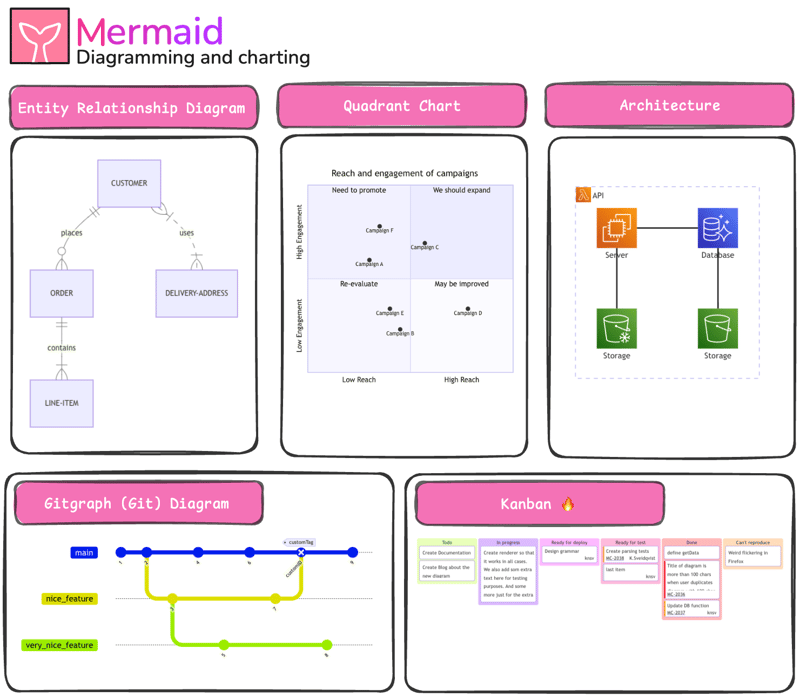

> In the repository, you will be able to see how to construct this code based on the Entity Relationship Diagram (ERD) found in the official Synthea documentation.
> You can also check the example of the tables page in the following link: [tables.md](https://github.com/r0mymendez/doc-as-code-mkdocs/blob/main/docs/template/tables.md?plain=1).

------------------------------------------------------------------------

### ⚙️ Mkdocs: Dynamic Content with Jinja

To enable dynamic content generation for our documentation site, we'll use **Jinja** to process templates and replace placeholders with actual data.
Below is a step-by-step breakdown:

1.  **Set Up a `templates` Folder**\
    Create a folder named `templates` to store all Markdown files for the site.
    These files should include placeholders.
    For instance, in `index.md`, you might have placeholders like `{{database.version_date}}` and `{{database.version}}`.

2.  **Utilize Placeholders**\
    Placeholders are dynamic variables in the Markdown files.
    These variables will be updated automatically using Python dictionaries to inject relevant data.

3.  **Generate Dynamic Content with `update.py`**

    -   Prepare your Markdown templates by identifying the sections where dynamic data is required.\

    -   Use a Python script (`update.py`), available in my repository, to process the templates. The script performs the following tasks:

        -   **Database Connection**: Connects to a SQLite database to fetch the latest values.\
        -   **Template Rendering**: Uses the Jinja library to substitute placeholders with data from the database.\
        -   **File Generation**: Outputs updated Markdown files to the `docs` folder, ready for rendering in MkDocs.

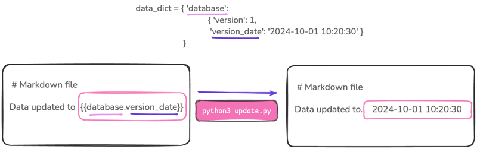

``` {.python}
from jinja2 import Template
def render_template(template_str, data):
    """Render the template with the data."""
    template = Template(template_str)
    return template.render(data)
# Data structure
data_dict = {
    'database': {
        'version': 1,
        'version_date': '2024-01-01'
    }
}
# Render the template
rendered_content = render_template("Data updated to {{database.version_date}}", data_dict)
print(rendered_content) 
```

``` {.bash}
Data updated to  2024-10-01 10:20:30
```

> By following these steps, you can automate the updating process for your documentation site, ensuring the content remains dynamic and relevant without manual edits.

------------------------------------------------------------------------

### Dynamic Update of Data Tables

In the next example, we will update the content in the `tables.md` file to show an example of the **`persons`** table from the database.
To do this, we will create a placeholder `{{table.person}}` within the Markdown file.
The idea is to dynamically fetch the data from the **`persons`** table, and then use the Jinja library along with pandas to convert the query results into a Markdown table format.

Here's an example of how the `tables.md` file looks with the placeholder:

``` {.markdown}
#### Example Person Table
## Person Table
{{table.person}}
```

The process is as follows:

1.  **Query the Database**: The script will query the **`persons`** table in the SQLite database to fetch relevant records.
2.  **Convert to Markdown**: Using **pandas**, the results of the query will be converted into a Markdown table format.
3.  **Replace the Placeholder**: The `{{table.person}}` placeholder in the `tables.md` file will be replaced by the generated Markdown table.

``` {.python}
import sqlite3
import pandas as pd
import aiosql


def get_queries():
    sql = aiosql.from_path('template/db/queries', 'sqlite3')
    return sql

def get_table_person(db_name):
    """Get a DataFrame from the PATIENTS table."""
    query = get_queries().get_example_patients.sql 
    connection = sqlite3.connect(db_name)

    df = pd.read_sql_query(query, connection)
    connection.close()
    return df

def update_tables_file(template_path, output_dir, db_name):
    """Update the tables.md file"""
    df = get_table_person(db_name)
    # Convert the dataframe in markdown format
    data_dict = {
        'table': {
            'person': df.to_markdown(index=False)  
        }
    }


print(get_table_person("hospital.db"))  
```

> This way, the documentation always reflects up-to-date data, displaying dynamic examples based on the actual content from the database.

------------------------------------------------------------------------

### ⚙️ Mkdocs: Final Workflow

1.  **Create Templates**: Develop your pages in the `docs/template` directory.\
2.  **Run `update.py`**: Populate dynamic content and generate the final files in `docs/output`.\
3.  **Preview Locally**: Use `mkdocs serve` to preview the site on localhost.\
4.  **Build for Deployment**: Use `mkdocs build` to generate a static site in the `docs/` folder.\
5.  **Deploy**: Use Terraform to deploy the site to an AWS S3 bucket. Refer to the deployment section of this post for detailed instructions.

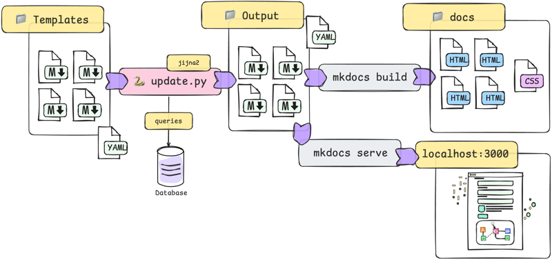

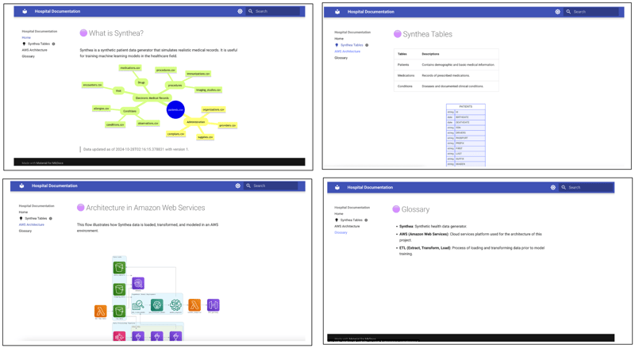

------------------------------------------------------------------------

## 🦖 Docusaurus Implementation

In the following sections, I will provide detailed steps and insights on how to implement a documentation site using **Docusaurus**.
This includes setup, customization, and deployment options.

------------------------------------------------------------------------

### 🚀 Key Features of Docusaurus

-   📶 **Mermaid Support**: Similar to MkDocs, Docusaurus supports Mermaid for embedding diagrams.\
-   ⚛️ **React Components**: Built on React, Docusaurus enables the integration of dynamic components into your documentation.\
-   🔄 **Dynamic Content**: Leverages Python scripts to fetch and update content dynamically from an SQLite database.

------------------------------------------------------------------------

### 🔧 Docusaurus Setup: From Scratch

To get started with Docusaurus, we follow a quick setup process, which is very similar to the steps we used for MkDocs but with different tools.

1.  **Create a New Docusaurus Project:** First, install Node.js and run the following command to create a new Docusaurus site:

    ``` {.bash}
    npx create-docusaurus@latest my-website classic
    ```

2.  **Install Mermaid Package**: To enable Mermaid diagrams, install the required package:

    ``` {.bash}
    npm install @docusaurus/theme-mermaid
    ```

3.  **Run the Development Server**: Once installed, navigate to your project directory and run the development server:

    ``` {.bash}
    cd my-website
    npx docusaurus start
    ```

4.  **Visit the Site**: Your site will be live locally at: `http://localhost:3000`.

------------------------------------------------------------------------

### 🔧 Docusaurus Customization: Configuration

The configuration file `docusaurus.config.js` is where we customize the title, theme, navigation, and enable features like Mermaid for diagram rendering.
Example snippet for enabling Mermaid:

``` {.js}
module.exports = {
  title: 'Hospital Documentation',
  tagline: 'Documentation for Hospital Data ML Project',
  favicon: 'img/favicon.ico',
  url: 'https://your-site-url.com',
  markdown: {
    mermaid: true,  // Enable Mermaid diagrams
  },
  themeConfig: {
    navbar: {
      title: 'Hospital Docs',
      items: [
        { to: 'docs/', label: 'Home', position: 'left' },
        { to: 'docs/tables', label: 'Tables', position: 'left' },
        { to: 'docs/architecture', label: 'Architecture', position: 'left' },
        { to: 'docs/glossary', label: 'Glossary', position: 'left' },
      ],
    },
    footer: {
      style: 'dark',
      links: [
        { label: 'GitHub', href: 'https://github.com/your-repo' },
      ],
    },
  },
};
```

------------------------------------------------------------------------

### 🔧 Docusaurus Customizing the Homepage

To customize the homepage, we modify the `src/components/HomepageFeatures/index.js` file.
Here, you can adjust the **FeatureList** object to update the features displayed on the homepage.

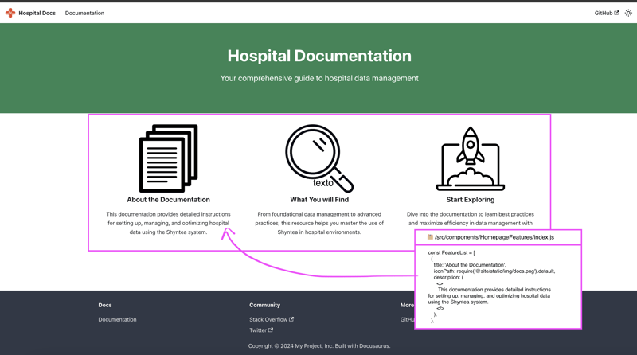

------------------------------------------------------------------------

### 📂 Docusaurus Content Organization and Structure

Just like in **MkDocs**, Docusaurus supports **Markdown files** for content, and we organize the structure as follows: 1.
**Template Folder**: Store your Markdown files in the `docs/template` directory, and create a Python script (similar to `update.py`) to fetch and populate dynamic data into these templates.
2.
**Category File (`__category__.json`)**: To manage the order of documents in the sidebar, create a `__category__.json` file in each folder.
For example:

``` {.bash}
Architecture
  ├── architecture.md
  ├── img
  └── __category__.json
```

**`__category__.json` Example**: `json    {      "label": "Architecture",      "position": 2,      "link": {        "type": "generated-index",        "description": "AWS Data Processing Blueprint"      }    }`

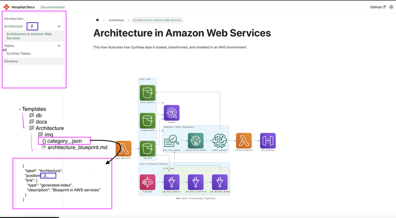

------------------------------------------------------------------------

### ⚙️ Dynamic Data with Jinja

To incorporate dynamic content, such as database tables, we use a **🐍Python** script named `update.py`, which you can find in the repository.

This script fetches data from a **SQLite** database and processes the Markdown files stored in the `templates` folder.
It then updates these files with the fetched data and copies them into the `docs` folder, preparing them for site rendering.

This workflow ensures that the content remains up-to-date and ready for deployment, following a similar approach to what we implemented with MkDocs.

------------------------------------------------------------------------

### ⚙️ Docusaurus: Final Workflow

1.  **Create Templates**: Develop your Markdown files within the `docs/template` directory.
2.  **Run Python Script**: Use the script to dynamically populate data into the templates.
3.  **Preview Locally**: Run `npx docusaurus start` to preview the site.
4.  **Build for Deployment**: Once ready, use `npx docusaurus build` to generate the static site.
5.  **Deploy**: Host the static files on your preferred platform, such as AWS S3.

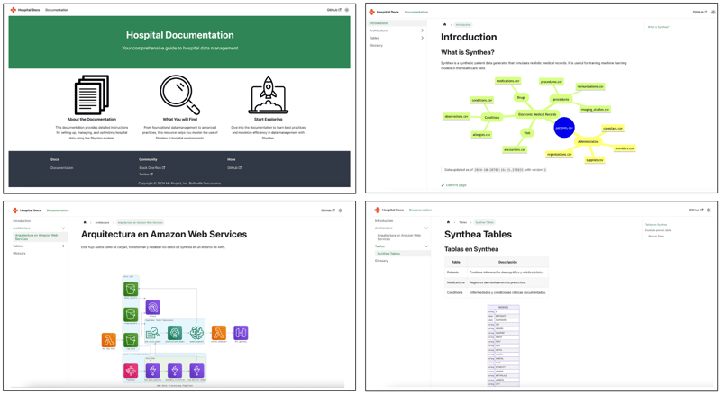

------------------------------------------------------------------------

## 🚀 Deployment

In this section, we will cover the **deployment process** for both **MkDocs** and **Docusaurus** using **AWS S3** for hosting.
While the deployment steps are the same for both tools, the installation processes differ, with **MkDocs** being Python-based and **Docusaurus** being JavaScript-based.

------------------------------------------------------------------------

### Infrastructure Setup with Terraform

To deploy a static documentation site to **AWS S3**, we use Terraform to provision and configure the required resources.
The setup defines the S3 bucket, enables static website hosting, and configures public access with a bucket policy to allow read-only access.
You can find the **`main.tf`** file in the repository.

------------------------------------------------------------------------

### 🚀 Key Components for S3 Deployment

1.  **S3 Bucket Creation**: The resource to create the S3 bucket where the documentation will be hosted.
2.  **Static Website Hosting**: Configuration for static web hosting, setting the `index.html` and `error.html` as the main and error documents.
3.  **Public Access Configuration**: Manages public access to the S3 bucket, ensuring it is configured for read-only access.
4.  **Bucket Policy**: Allows public access to retrieve the documentation content from the S3 bucket.

You can access the complete **Terraform file** and the corresponding configurations for deploying the site in the repository:

**Terraform Configuration File**: \* [mkdocs file](https://github.com/r0mymendez/doc-as-code-mkdocs/tree/main/infraestructure) \* [docusaurus file](https://github.com/r0mymendez/doc-as-code-docusaurus/tree/main/infraestructure)

**GitHub Action Workflow for Automatic Deployment**: A CI/CD pipeline to automate the deployment process is also included in the repository.
\* [mkdocs file](https://github.com/r0mymendez/doc-as-code-mkdocs/blob/main/.github/workflows/main.yml) \* [docusaurus file](https://github.com/r0mymendez/doc-as-code-docusaurus/blob/main/.github/workflows/main.yml)

> **GitHub Actions Configuration** Make sure to configure your AWS credentials in the **GitHub repository secrets** under **Settings** \> **Secrets** \> **Actions**.
> This will allow GitHub Actions to securely access your AWS account and perform actions like uploading files to S3 when you push changes to the `main` branch.

------------------------------------------------------------------------

### Repositories

Below are the links to all the code to deploy your documentation site.
If you find it useful, you can leave a star ⭐️ and follow me to receive notifications of new articles.
This will help me grow in the tech community and create more content.

-   **MkDocs Deployment**: [GitHub Repository for MkDocs](https://github.com/r0mymendez/doc-as-code-mkdocs)

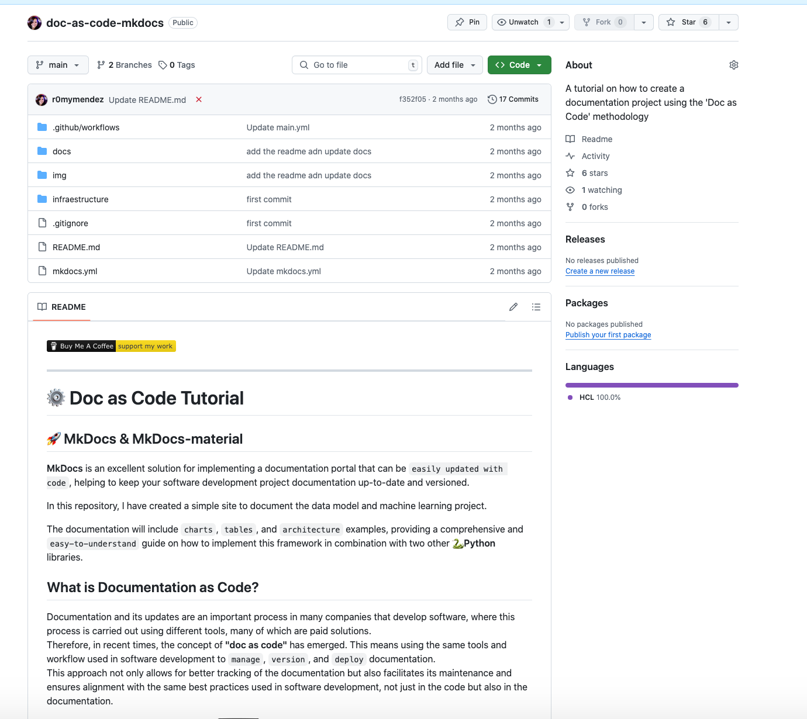

-   **Docusaurus Deployment**: [GitHub Repository for Docusaurus](https://github.com/r0mymendez/doc-as-code-docusaurus)

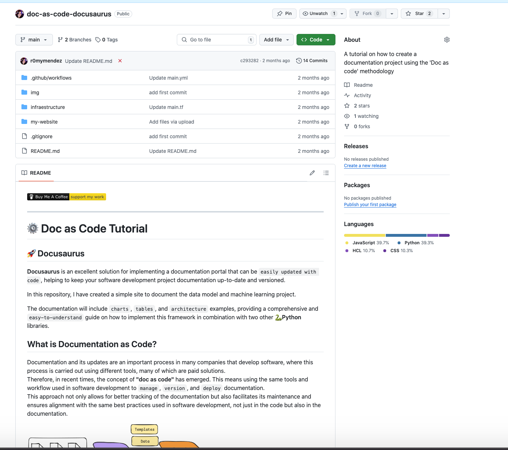

------------------------------------------------------------------------

## 🔍 Final Conclusions: MkDocs vs. Docusaurus

Both solutions are easy to implement, but in the following items, we can explore some differences, and what is the best solution depends on the context, knowledge, and complexity you may need to implement.

-   💻 **Language & Customization**:\
    **MkDocs** is Python-based, with simple YAML configurations and templates, ideal for quick setups. On the other hand, **Docusaurus** is React-based, offering advanced customization and interactive components, making it more suitable for users needing more control over visuals.
-   📑 **Markdown & Rendering**:\
    Both use Markdown, but **Docusaurus** allows for interactive elements, making it better for dynamic content.
-   ⚙️ **Complexity**:\
    **Docusaurus** is better for complex documentation applications, such as those with login systems. **MkDocs** is simpler but **Docusaurus** offers more flexibility for styling and features.
-   👥 **Community**:\
    **Docusaurus** has a strong community with Discord and 74 plugins, while **MkDocs** relies on GitHub discussions for community support.
-   ☁️ **Amazon Deployment**:\
    You can deploy a static site to **S3**, reducing deployment costs, and also use CI/CD for automatic deployment.

------------------------------------------------------------------------

# 📚 References

1.  **Mkdocs**: <https://www.mkdocs.org/>
2.  **Mkdocs-Material**: <https://squidfunk.github.io/mkdocs-material/>
3.  **Diagrams**: <https://diagrams.mingrammer.com/>
4.  **Docusaurus**: <https://docusaurus.io/>
5.  **Jinja**: <https://jinja.palletsprojects.com/en/stable/>
6.  **Git Book - What is doc as code**: <https://www.gitbook.com/blog/what-is-docs-as-code>
7.  **Write the docs**: <https://www.writethedocs.org/guide/docs-as-code/>
