```{r setup, include=FALSE}
knitr::opts_chunk$set(echo = FALSE)
```

In this article, I'm sharing 22 essential tools that I've incorporated into my daily routine as a developer.
These tools cover everything from organization 📅 and documentation 📄 to design 🖌️, productivity 🚀, and programming 💻.
I've organized them into 8 categories so you can easily find the ones that best suit your needs.

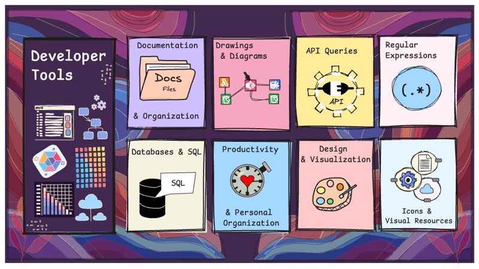

------------------------------------------------------------------------

# 📄 Documentation and Organization

### [Notion](https://www.notion.so/)

Notion is a widely known tool, yet surprisingly, there are still people who haven't tried it.
It's excellent for creating technical documentation 📄, managing publishing calendars, and organizing tasks.
Additionally, it has an active community that shares reusable templates like Kanban boards and 📆 calendars, making it even more user-friendly.\
- **Why use it**: It centralizes all your information in one place and offers the flexibility to customize it according to your specific needs.

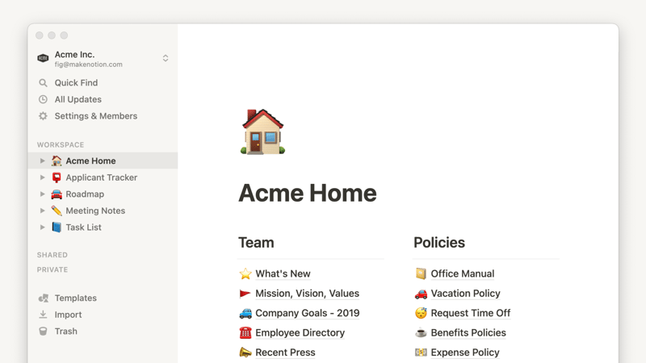 🖼️ Image source: <https://www.notion.com/es-es/help/notion-for-desktop>

------------------------------------------------------------------------

### [Miro](https://miro.com/es/)

Miro is a virtual whiteboard designed for creating mind maps, diagrams, and workflows collaboratively.\
- **Why use it**: It's an ideal tool for team sessions such as brainstorming, design thinking, or agile planning.
Its real-time collaboration feature makes it perfect for dynamic projects involving multiple team members.

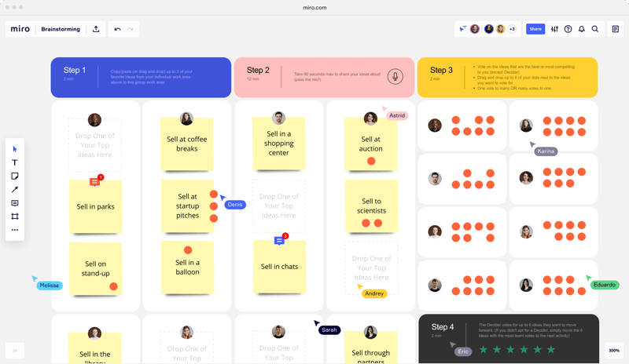 🖼️ Image source: <https://miro.com/es/lluvia-de-ideas/>

------------------------------------------------------------------------

# ✏️ Drawings & Diagrams

### [Excalidraw](https://excalidraw.com/)

Excalidraw is an excellent alternative to tools like draw.io, offering attractive graphics with a minimalist design.
It provides a user-friendly interface and libraries with icons for ☁️cloud services, programming languages, and more, allowing you to create blueprints effortlessly.\
- **Why use it**: Easy to use with a visually appealing style, Excalidraw adds a personal touch to your diagrams, and its libraries make creating detailed blueprints faster and simpler.

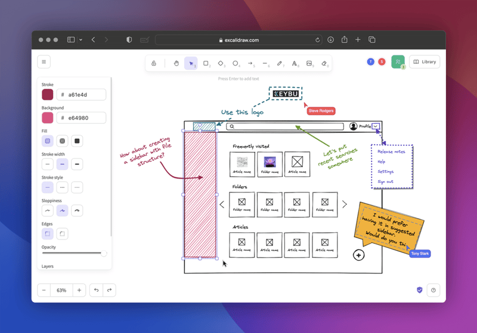 🖼️ Image source: <https://github.com/excalidraw/excalidraw>

------------------------------------------------------------------------

### [Draw.io](https://app.diagrams.net/)

Draw.io is a popular tool for creating UML diagrams, process flows, and more.
It integrates seamlessly with Google Drive, allowing you to work directly within your account or offline.\
- **Why use it**: It offers advanced options for creating detailed diagrams and is easily accessible through Google Drive or as a desktop version.

------------------------------------------------------------------------

### [Wireflow](https://app.wireflow.co/)

Wireflow lets you create flowcharts with illustrative icons, offering modern and easy-to-use graphics that make designing detailed flow diagrams a breeze.\
\> The Wireflow concept is a popular UX and UI design method that combines the best aspects of wireframes and user flows to document user interactions in apps or websites.

-   **Why use it**: Its intuitive and visually appealing design is perfect for presenting workflows to clients or teams, providing a user-friendly interface and stunning visuals.

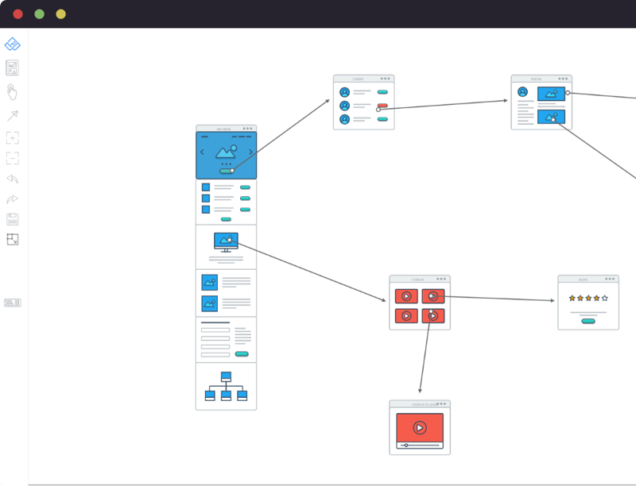

🖼️ Image source: <https://wireflow.co/>

------------------------------------------------------------------------

### [Lorem Ipsum Generator](https://loremipsum.io/es)

Lorem Ipsum Generator creates placeholder text used in graphic design, typography demos, and design drafts.
It allows you to visualize the layout before inserting final content.\
- **Why use it**: It saves time by generating temporary content, a must-have when designing in tools like Figma, and is helpful for quickly filling in text blocks during mockups.

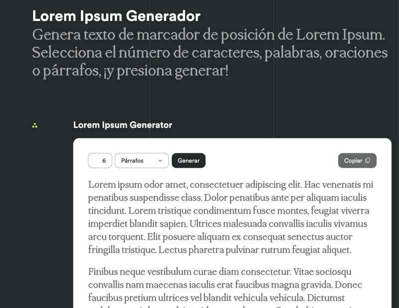 🖼️ Image source: <https://loremipsum.io/es>

------------------------------------------------------------------------

# 🛠 API Queries

### [Postman](https://web.postman.co/)

Postman is one of the most complete and advanced tools for testing and developing APIs.
It offers features such as automated testing, response simulation, and the ability to share test collections among teams, making it ideal for collaborative and complex projects.\
- **Why use it**: Perfect for complex scenarios and team collaboration, Postman allows you to design, test, and monitor APIs efficiently, with powerful features for automation, monitoring, and documentation.

------------------------------------------------------------------------

### [Hoppscotch](https://hoppscotch.io/)

Hoppscotch is a lightweight, online alternative to Postman for quickly testing and querying APIs.
While it doesn't offer all the advanced features of Postman, it excels in simplicity and ease of use, particularly for quick API testing on the go.\
- **Why use it**: Hoppscotch provides a clean and intuitive interface directly in your browser, making it an excellent choice for developers who need a fast, no-frills tool for testing APIs without the need for installation or complex setup.

------------------------------------------------------------------------

# 🔍 Regular Expressions

### [Regex101](https://regex101.com/)

Regex101 simplifies the creation and **testing of regular expressions** across multiple programming languages.
It offers a detailed explanation of each regex component, making it easier to understand how your expressions work.\
- **Why use it**: Save time by validating and tweaking your regular expressions without the need to run them in a development environment.
You can also share your regex tests with others, making it a great tool for collaboration.

------------------------------------------------------------------------

### [Regexr](https://regexr.com/)

Regexr is another option for **learning**, **creating**, and **testing regular expressions** with real-time examples.
It provides helpful syntax highlighting and a community-driven library of regular expressions.\
- **Why use it**: Its interactive and beginner-friendly interface makes it ideal for those starting to learn regular expressions, offering instant feedback and useful regex examples.

------------------------------------------------------------------------

# 🗄️ Languages & Databases & SQL

### [OneCompiler](https://onecompiler.com/postgresql)

OneCompiler allows you to **test code** without the need for installation, offering an easy way to run examples.
It supports over 60 programming languages, including PostgreSQL.\
- **Why use it**: It's perfect for practicing or verifying SQL queries without having to set up a local development environment.

------------------------------------------------------------------------

### [Explain Dalibo](https://explain.dalibo.com/)

Sometimes, it's unclear why certain SQL queries in **postgres** take a long time to execute or consume too many resources.
This tool helps visualize and analyze **SQL execution plans** interactively.\
- **Why use it**: It's useful for optimizing your database performance by providing insights into query execution plans.

Here's a quick example of how to use it:

1.  Suppose you have a query that's taking a long time to execute and you want to analyze it.

``` {.sql}
SELECT 
    e.name AS employee_name,
    d.name AS department_name,
    AVG(s.amount) AS avg_salary
FROM 
    employees e
JOIN  departments d ON e.department_id = d.id
JOIN  salaries s ON e.id = s.employee_id
WHERE 
    d.budget > 1000000
    AND s.amount > (s.amount * 0.10 + LAG(s.amount) OVER (PARTITION BY e.id ORDER BY s.date))
GROUP BY 
    e.name, d.name
ORDER BY 
    avg_salary DESC;
```

You can add the `EXPLAIN` keyword at the beginning of your query:

``` {.sql}
EXPLAIN
   SELECT .../* Here goes the rest of your query */
;
```

This will return an execution plan like the following:

``` {.bash}
Sort  (cost=50233.24..50233.75 rows=204 width=96)
  Sort Key: (avg(s.amount)) DESC
  ->  HashAggregate  (cost=50230.40..50231.40 rows=204 width=96)
        Group Key: e.name, d.name
        ->  WindowAgg  (cost=40230.00..40230.40 rows=50000 width=64)
              ->  Hash Join  (cost=20000.00..30000.00 rows=50000 width=64)
                    Hash Cond: (s.employee_id = e.id)
                    ->  Seq Scan on salaries s  (cost=0.00..8000.00 rows=50000 width=32)
                    ->  Hash  (cost=10000.00..10000.00 rows=10000 width=64)
                          ->  Hash Join  (cost=5000.00..10000.00 rows=10000 width=64)
                                Hash Cond: (e.department_id = d.id)
                                ->  Seq Scan on employees e  (cost=0.00..4000.00 rows=10000 width=32)
                                ->  Hash  (cost=3000.00..3000.00 rows=1000 width=32)
                                      ->  Seq Scan on departments d  (cost=0.00..3000.00 rows=1000 width=32)
                                            Filter: (budget > 1000000)
```

Once you have this output, you can paste it into [Explain Dalibo](https://explain.dalibo.com/), submit it, and the tool will display the execution analysis in a graphical format, making it easier to identify performance issues.

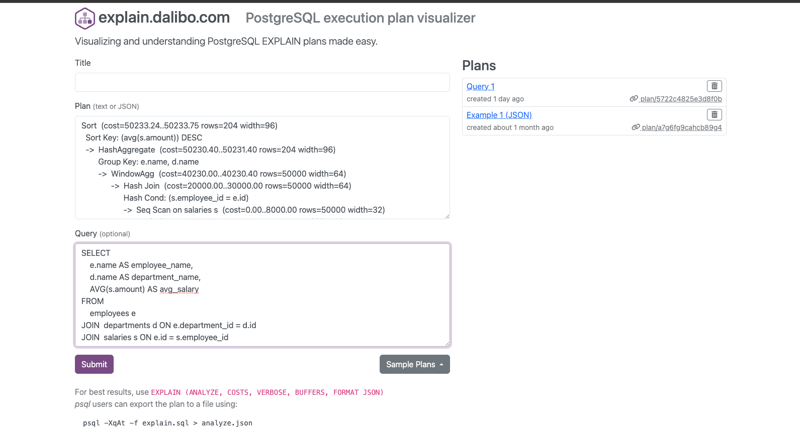

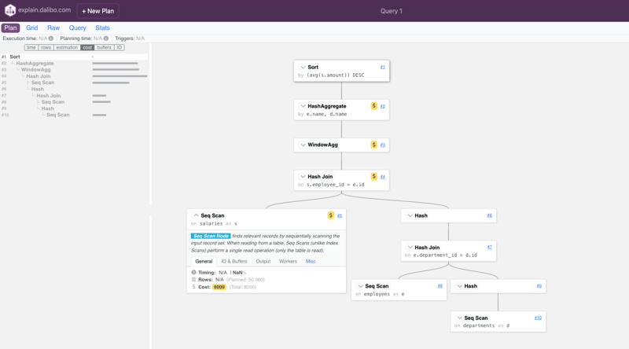

> As with any data shared online, always check retention policies and security measures.
> Be sure not to upload any sensitive or confidential data.

If you're not familiar with the execution plan output, here's a helpful guide to understand it: [Postgres Query Plan Visualization](http://tatiyants.com/postgres-query-plan-visualization/).

------------------------------------------------------------------------

### [SQLiteOnline](https://sqliteonline.com/)

If you want to quickly run **SQL queries examples**, validate or practice exercises from a tutorial, this is a great solution for development.\
- **Why use it**: It offers convenience and speed without the need to install any software.

------------------------------------------------------------------------

# ⏰ Productivity and Personal Organization

Sometimes we focus solely on tools that improve our coding efficiency, but it's equally important to have tools that `help optimize our time`, `enhance our professional presence`, or `simply allow us to unwind`.

### [Pomofocus](https://pomofocus.io/)


If you struggle to concentrate and complete tasks, this tool is a great way to adopt the `Pomodoro technique`.
It encourages focus by working in **⏳ 25-minute intervals** followed by short breaks.
This web-based timer helps schedule these cycles, making it easier to stay productive and focused.

-   **Why use it**: Perfect for boosting productivity and maintaining focus by breaking work into manageable intervals.

------------------------------------------------------------------------

### [MyNoise](https://mynoise.net/)

A customizable generator of relaxing 🎧 sounds with a wide variety of ambient noise options to choose from.\
- **Why use it**: Helps maintain focus and concentration, even in noisy environments.

------------------------------------------------------------------------

### [GitHub Profile Readme Generator](https://rahuldkjain.github.io/gh-profile-readme-generator/)

GitHub has become our professional 📁 portfolio, so having an updated and appealing profile is essential.
This tool helps you generate a personalized README file for your GitHub profile.\
- **Why use it**: Adds a professional and unique touch to your GitHub profile.

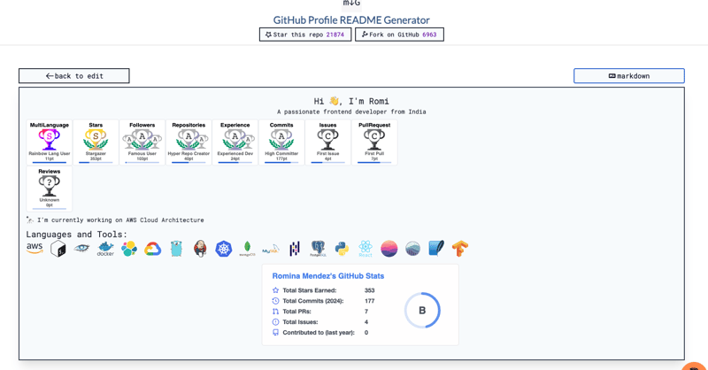

------------------------------------------------------------------------

# ✏️ Design and Visualization

### [Coolors](https://coolors.co/)

Generate color 🎨 palettes for design projects.
It's similar to Adobe Colors, another tool I often use to explore palettes created by the community.\
- **Why use it**: Simplifies the process of selecting harmonious and visually appealing color schemes.

------------------------------------------------------------------------

### [Carbon](https://carbon.now.sh/)

Create beautifully styled screenshots of code snippets.\
- **Why use it**: Ideal for sharing code snippets on social media, documentation, or presentations.

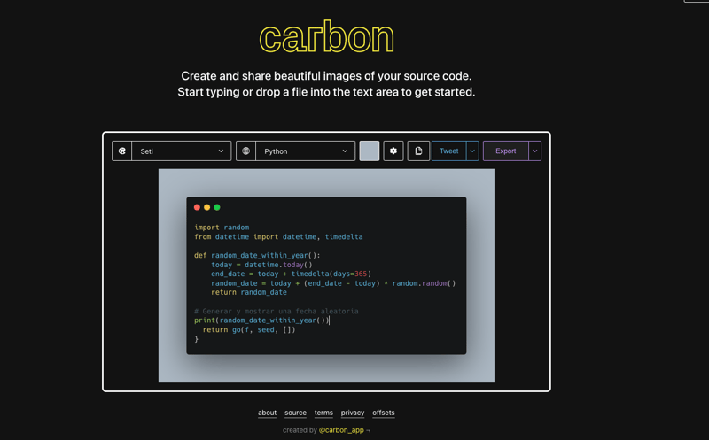

------------------------------------------------------------------------

### [Remove.bg](https://www.remove.bg/es/upload)

This tool automatically removes backgrounds from 🖼️ images, perfect for when you need a clean image for presentations or design work.\
- **Why use it**: Saves time on quick design tasks.

------------------------------------------------------------------------

# 🎨 Icons and Visual Resources

### [SVGRepo](https://www.svgrepo.com/)

If you're looking for icons to use in your diagrams, presentations, or websites, SVGRepo is a fantastic tool.
This site offers hundreds of free SVG icons, many of which can be customized to fit your needs.
- **Why use it**: Provides quick access to high-quality, customizable icons for your web and graphic design projects.

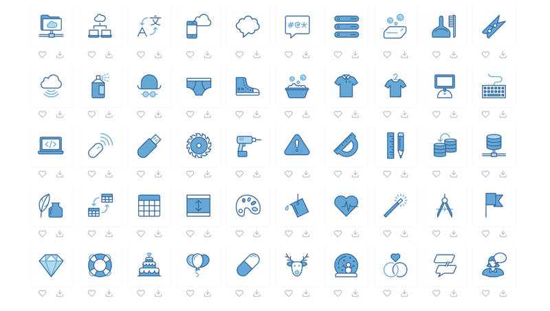

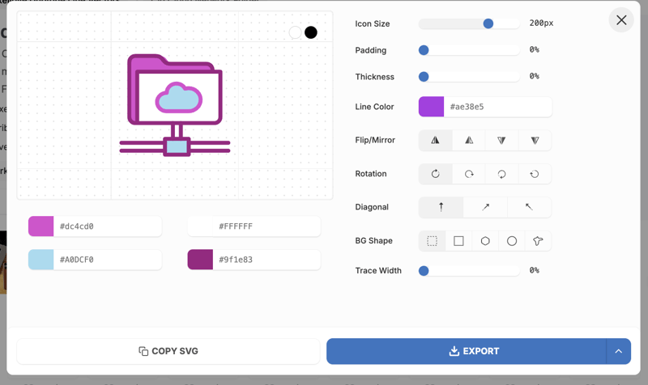

------------------------------------------------------------------------

### [Google Fonts Icons](https://fonts.google.com/icons)

A comprehensive catalog of icons that integrate seamlessly with the Google Fonts ecosystem.
These material design icons are modern, user-friendly, and versatile, created following Google's design guidelines.\
- **Why use it**: Compatibility with Google Fonts and ease of use for web integration.

------------------------------------------------------------------------

### [Feather Icons](https://feathericons.com/)

Another excellent tool featuring minimalist icons that can be customized freely to suit your design needs.\
- **Why use it**: Ideal for creating sleek, modern interfaces with customizable visuals.

------------------------------------------------------------------------

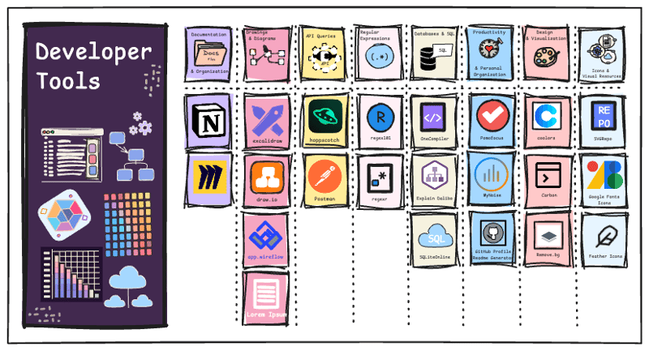

------------------------------------------------------------------------

If you know of other tools, feel free to share them in the 💬comments to foster community collaboration.
