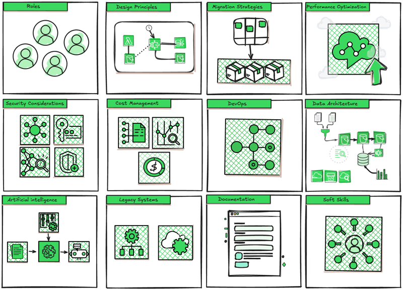

```{r setup, include=FALSE}
knitr::opts_chunk$set(echo = FALSE)
```

# Insights and Highlights

After spending several weeks reading **'Solution architect handbook'**, I have decided to share my own review to highlight why I find this book to be a highly recommended read for any solutions architect or those interested in modern technology.

](img/img-1.jpg){style="display: block;   margin-left: auto;   margin-right: auto;"}

------------------------------------------------------------------------

# Twelve Reasons to Read This Book

Below I want to detail, based on the chapters I read, the 12 reasons why you should consider reading this book:



1.  **👥 Redefining Roles:** The book discusses how AI and machine learning are reshaping roles within solution architecture, emphasizing the necessity for ongoing adaptation to technological trends.

2.  **✏️ Design Principles:** This book dedicates two chapters to explaining key principles for designing resilient and scalable architectures, focusing on their adaptability to future changes.

3.  **☁️ Cloud Migration Strategies:** The text outlines essential techniques and strategies for a successful transition to cloud infrastructures, addressing both the challenges and opportunities.

4.  **🚀 Performance Optimization:** It guides you through managing concurrency, parallelism, and various storage types to enhance system performance.

5.  **🔒 Security Practices:** A particularly strong chapter covers advanced security practices needed to protect valuable information and systems from emerging cyber threats.

6.  **📈 Cost Management:** This section explains how to effectively manage cloud infrastructure costs, ensuring that expenses align with actual resource needs to enhance business profitability.

7.  **⚙️ DevOps Integration:** The book illustrates how integrating DevOps promotes smoother collaboration between development and operations teams and integrates security practices throughout the software lifecycle.

8.  **🗳 Data Architecture:** It examines different data architectures and their practical implementation using AWS blueprints for efficient data management.

9.  **🤖 AI Architecture:** It addresses how modern architectures can support and enhance generative AI technologies, including strategies to optimize machine learning and MLOps.

10. **📦 Legacy System Modernization:** It discusses strategies for modernizing legacy systems to improve performance, scalability, and operational cost efficiency.

11. **📄 Effective Documentation:** A comprehensive chapter discusses the critical role of documentation in a project and how to clearly communicate the architectural vision to all stakeholders involved.

12. **💬 Soft Skills:** The final chapter emphasizes the importance of interpersonal skills, such as effective communication and leadership, which are crucial for managing and executing complex projects successfully.

------------------------------------------------------------------------

# Final Thoughts

This book not only addresses the theory and implementation of solution architecture but also provides effective methods to manage and mitigate issues in various contexts.
It covers topics from implementing modern architectural solutions like **machine learning models**, **MLOps**, and **generative AI** to modernizing **legacy systems** and **data migrations**, offering practical insights on applying these technologies.

Moreover, it stands out as a comprehensive guide that integrates various adaptive solutions that businesses can implement, emphasizing the importance of `strategic roles`, `mentorship`, and the development of `interpersonal skills`.

In summary, I recommend this book as essential reading for those interested in delving deeper into the field of solutions architecture, providing essential tools to face the current challenges of the sector.

------------------------------------------------------------------------

# 📚 References

> 1.  [**Solutions Architect's Handbook - Third Edition**](https://www.oreilly.com/library/view/solutions-architects-handbook/9781835084236/), by Saurabh Shrivastava, Neelanjali Srivastav, Released March 2024, Publisher(s): Packt Publishing, ISBN: 9781835084236
