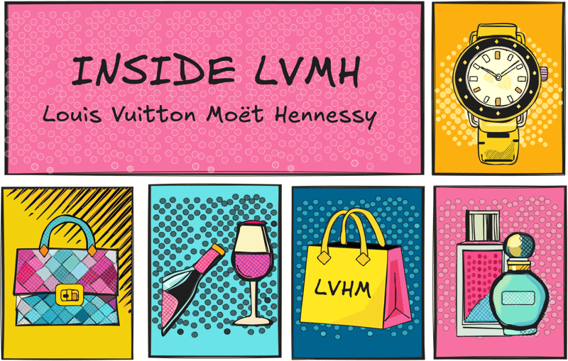
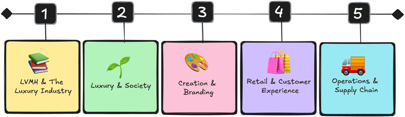

```{r setup, include=FALSE}
knitr::opts_chunk$set(echo = FALSE)
```

# What is LVMH?

LVMH (Louis Vuitton Moët Hennessy) is the global leader in luxury products and services.
Formed in 1987 after the merger of two major names, the fashion house Louis Vuitton and the wines and spirits house Moët Hennessy, this conglomerate has become a symbol of excellence and sophistication.
With more than 75 iconic brands under its umbrella, LVMH spans diverse sectors, including fashion, perfumes, jewelry, wines, hospitality, and art.



**✨ Among the most recognized brands are:** \* 💼 **Fashion and leather goods:** Louis Vuitton, Dior, Fendi, Celine, and Loewe.
\* 💄 **Perfumes and cosmetics:** Guerlain, Fenty Beauty, Acqua di Parma.
\* ⌚ **Watches and jewelry:** Bulgari, Tag Heuer, Tiffany & Co. \* 🍇 **Wines and spirits:** Moët & Chandon, Dom Pérignon, Hennessy.
\* 🏨 **Hotels and cultural experiences:** Cheval Blanc, Bulgari Hotels, Fondation Louis Vuitton.

> The concept of luxury not only offers exceptional products but also creates unique experiences that combine tradition and modernity.
> Its commitment to innovation, sustainability, and cultural heritage has allowed LVMH to maintain its position as a global benchmark.

------------------------------------------------------------------------

# The INSIDE LVMH Certification

The **INSIDE LVMH certification** is a **free and exclusive** educational program offering an immersion into the luxury industry.
Designed in collaboration with renowned institutions such as `HEC Paris`, `Central Saint Martins`, `Università Bocconi`, and `Harvard`, this course explores the `LVMH ecosystem` through four modules.



# Certification Modules

## 📚 1- LVMH & The Luxury Industry

This module provides a comprehensive overview of LVMH's history, its business sectors, and iconic Maisons.
It also analyzes the ongoing evolution of the luxury industry, highlighting key trends such as sustainability, digital transformation, and the growing relevance of the Asian market.

**Topics covered include:** \* 🎯 Current market trends.
\* 🔍 Digital transformation and personalization.

------------------------------------------------------------------------

## 🌱 2- Luxury & Society

This module focuses on LVMH's commitment to environmental and social sustainability.
Strategies for minimizing environmental impact and fostering positive social impact are explored, demonstrating how sustainability is deeply integrated into luxury brands.

**Topics covered include:** \* 🌐 The relationship between luxury and society.
\* 🌳 Environmental policies implemented for over 30 years.
\* 🤝 Positive social impact through inclusion and corporate responsibility.
(Personally, I found this topic fascinating in how they classify and address inclusion within the group's companies.)

------------------------------------------------------------------------

## 🎨 3- Creation & Branding

This module delves into the creative process behind luxury products and the strategic management of brands.
Professors and LVMH talents shared insights on how iconic brands like Bulgari, Dior, and Tiffany & Co. leverage their DNA and heritage to design timeless products and exceptional experiences.
**Topics covered include:** \* 🧬 Brand DNA and codes.
\* 🤝 Strategies for collaborations and creating experiences.
\* 🌟 Practical examples of brand management in Bulgari, Dior, and Tiffany & Co.

------------------------------------------------------------------------

## 🛍️ 4- Retail & Customer Experience

This final module explores the role of retail in the luxury industry and how LVMH Maisons create immersive experiences for customers through omnichannel strategies and personalized relationships.

It also examines how these brands integrate data and innovative technologies, such as blockchain and NFTs, to deliver seamless experiences, ensure product traceability, and enhance excellence.
**Topics covered include:** \* 🔗 Omnichannel strategies and data use.
\* 💡 Integration of advanced technologies like blockchain and machine learning.

------------------------------------------------------------------------

## 🚚 5- Extra Módulo: Operations & Supply Chain

While the original certification consists of four modules, I decided to take this additional fifth module on the supply chain (⚖Supply Chain) in the 💎luxury industry, and I honestly think it was the most impactful.
This module explained in detail what Supply Chain means within luxury brands and how this process varies depending on the types of products offered.
From production and logistics to distribution, the module showed how these brands orchestrate each stage to meet the expectations of the most demanding clients.
**Topics covered include:** \* 🧩 Definition and scope of operations in luxury: A 360° view of key processes, from manufacturing to distribution.
\* 📈 Performance indicators (KPIs): Methods to measure and improve supply chain efficiency, with practical examples and formulas.
\* 🌱 Sustainability in the Supply Chain: How luxury brands integrate sustainable practices at all stages, from sourcing to transportation.

This module allowed me to understand how luxury brands manage complex systems of `production` and `distribution` while maintaining quality standards.
The most interesting part was learning about the differentiation of processes `according to the products`.

Additionally, it addressed product traceability from **material sourcing** to **final delivery**, demonstrating an integral, sustainable, and client-focused approach

------------------------------------------------------------------------

# My Experience and Learnings

Currently, I work on Big Data and Advanced Analytics projects, and this certification allowed me to develop a broader perspective on key aspects that connect technology and innovation in the luxury industry:

### 🧩 Technological strategies and traceability

-   Advanced technologies such as blockchain and predictive analytics models are essential for supply chain traceability.
-   These tools not only strengthen operations but also build consumer trust and optimize logistics processes.

### 🎨 Creative process and innovation

-   Although I work on IT and consultancy projects, I found parallels with the creation of luxury collections: from service personalization to designing scalable architectures.
-   This creative process requires prototypes, iterations, approvals, and regulations, reflecting the importance of continuously documenting and adjusting to align with client needs.
-   Learning from processes in other industries broadens the ability to innovate and personalize solutions in the technological field.

### 👥 Understanding the client (360 client-centric)

-   The importance of metrics and models to measure customer satisfaction is a cornerstone in personalization.
-   This industry stands out for its focus on creating unique experiences, requiring data-driven strategies that segment audiences and predict behaviors.

### 🏛️ Culture and tradition

-   Inspiration from brands like Louis Vuitton, founded in 1854, which balance artisanal practices with technological advances.
-   Technology is a key bridge to integrate into creative, operational, logistical, and post-sale processes, but it must maintain a balance that preserves the identity and personalization of brands while evolving alongside modern market demands.

------------------------------------------------------------------------

### **Personal Reflections**

The **INSIDE LVMH certification** is an opportunity to learn about the luxury industry and understand how brands in this sector operate.

In my case, it allowed me to reflect on the **creative process** and how to identify the tools designers and artists need to bring their ideas to life.
As software developers, we often forget that our solutions are created for end users who, in turn, serve other potential clients seeking **unique experiences**.

This learning reinforces the importance of designing with personalization in mind and maintaining a balance between innovation and brand identity.

------------------------------------------------------------------------

# Take Advantage of the Opportunity

I highly recommend taking the **INSIDE LVMH certification**, which is offered 📆 twice a year.
This platform not only provides this course but also offers a wide range of resources designed by group employees, industry leaders, and academic experts.

Registering for **INSIDE LVMH** is not limited to obtaining the certificate; it also provides regular access to exclusive content.

------------------------------------------------------------------------

# 📚 Referencias

1.  **Inside LVMH** :<https://www.insidelvmh.com>
2.  **LVMH**: <https://www.lvmh.com/en>
